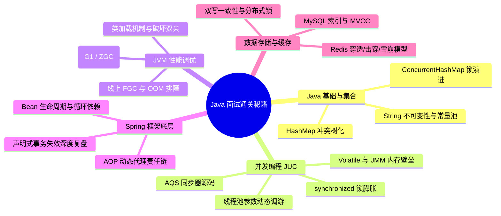
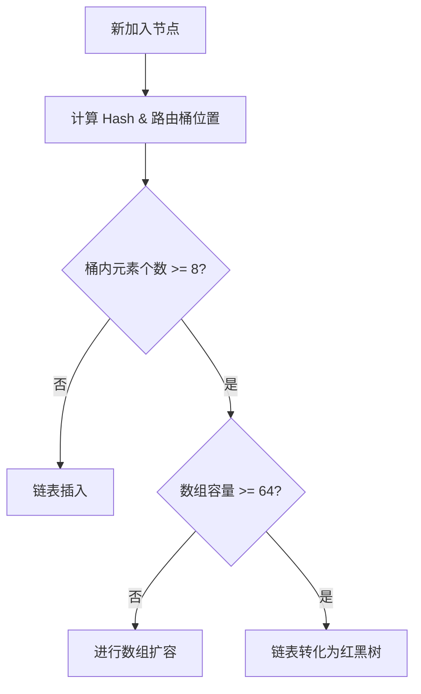
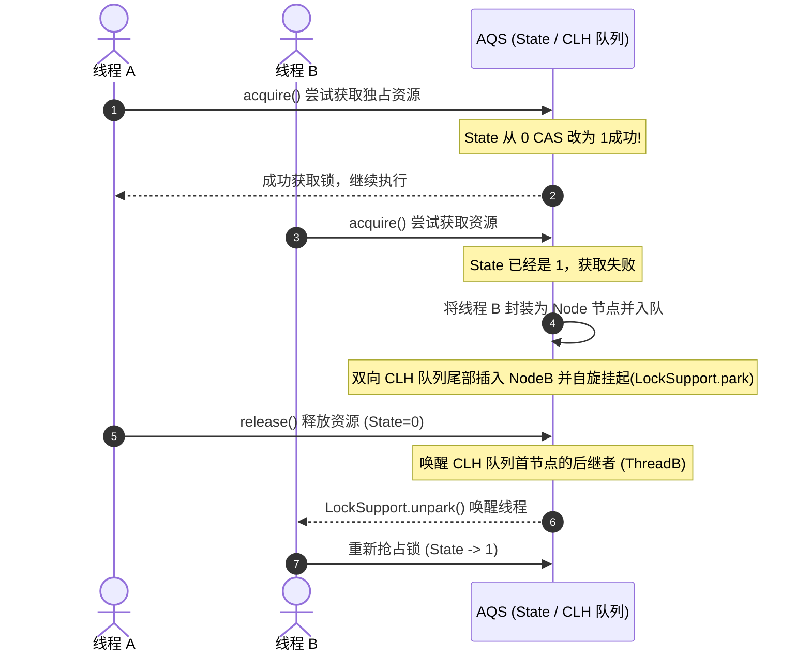
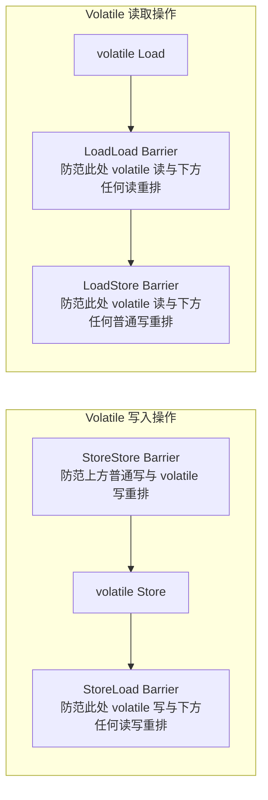
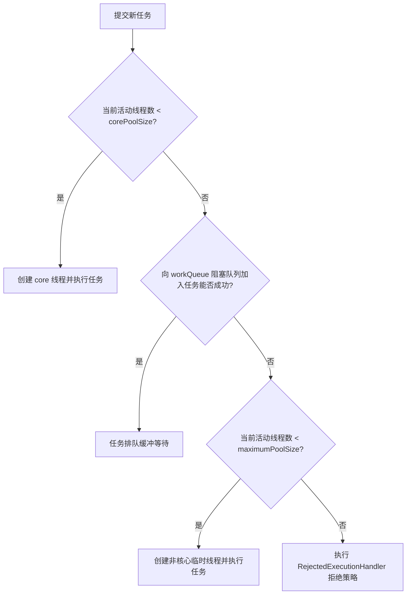
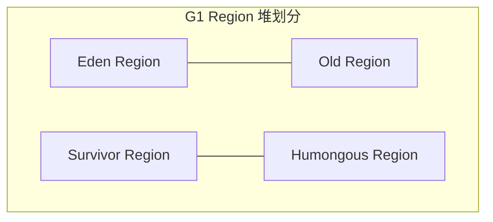
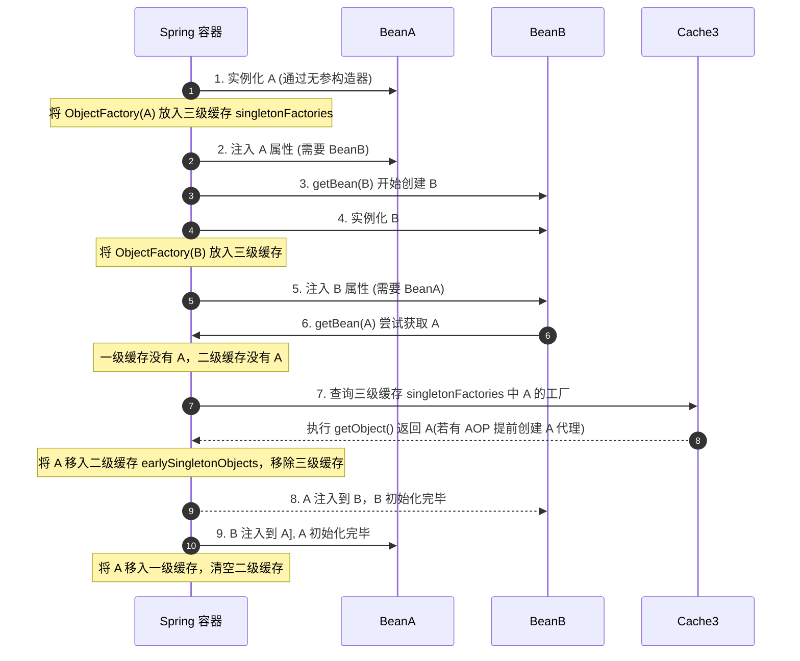
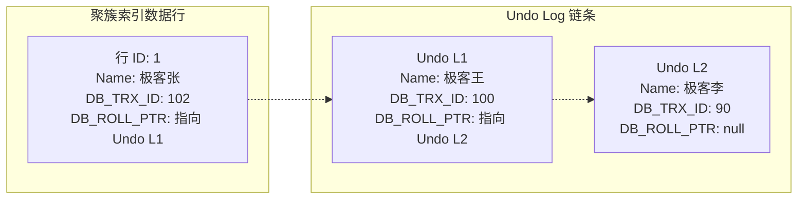
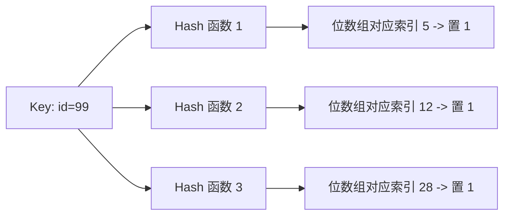

# Java 核心高频面试题与底层原原理

欢迎来到 **Java 核心高频面试题与底层原原理** 专栏。本指南致力于为中高级 Java 开发人员提供一套最硬核、直击底层原理、结合生产实战的 Java 面试剖析。每个知识点都配有详尽的答案、核心源码流程、以及辅助理解的 Mermaid 架构图或数学模型，助您斩获心仪的 Offer！

---

## 🗺️ 核心考点知识脑图



---

## 📂 模块一：Java 基础与集合框架

### Q1：为什么 Java 中的 `String` 设计成不可变（Immutable）的？底层是如何保证的？

#### 1. 核心设计目的

`String` 的不可变性是 Java 安全性、性能与多线程并发安全的重要基础，主要表现在以下三个维度：

- **字符串常量池（String Pool）的最佳化**：

  若字符是可变的，当一个变量修改了其内容，其他指向该地址的变量将被迫同步修改。不可变性使得 JVM 可以通过共享相同的字符串字面量来极大地节省堆内存。

- **线程安全（Thread Safety）**：

  由于 `String` 对象是只读的，在多线程并发环境中无需添加任何显式锁或同步机制，即可实现天然的安全共享。

- **Hash 值的缓存与安全性**：

  `String` 的哈希值常用于 Map 的 Key（例如 `HashMap` 的 Key）。在对象构建时，其哈希值便被缓存计算（通过变量 `hash`），不可变性保证了 Hascode 在其生命周期内恒定不变，提升了查找性能。公式：
  `hash = s[0] * 31^(n-1) + s[1] * 31^(n-2) + ... + s[n-1]`

- **底层安全隔离**：

  网络连接 URL、数据库账号密码、类加载器加载的核心类库名都以 `String` 传递。如果其可变，可能会遭遇黑客在运行时动态篡改，导致致命的安全漏洞。

#### 2. 底层实现原理

在 JDK 8 中，`String` 底层使用 `char[]` 数组存储；在 JDK 9 以后改用 `byte[]` 加上编码标记（Coder）。其通过如下手段实现不可变性：

- **`final` 修饰数组与类**：

  ```java
  public final class String implements java.io.Serializable, Comparable<String>, CharSequence {
      private final char value[]; // JDK 8 底层数组
      private int hash; // 缓存哈希值
  }
  ```

  - 类被 `final` 修饰，保证了其**不能生命子类**，杜绝了子类通过继承劫持并修改类行为的可能。
  - 数组变量 `value` 被 `final` 修饰，表明该引用无法指向其他数组。

- **防范指针外露（Defensive Copying）**：

  单靠 `final` 无法阻止外部通过修改数组中某个元素来改变其内容。为此，`String` 内部所有涉及返回内容的方法（如 `substring`、`concat`），都会利用 `Arrays.copyOf` 构建一个**全新**的 `String` 对象返回，绝不暴露原有底层数组引用。

---

### Q2：深入解构 `HashMap` 的底层扩容机制（以 JDK 1.8 为例）及“树化/退树化”边界？

`HashMap` 采用了经典的**哈希桶 + 单向链表 + 红黑树**结构，其高吞吐的核心来自自适应的动态调整。



#### 1. 关键参数指标

- **默认初始容量（Default Initial Capacity）**：$16$，必须是 $2$ 的幂次方。

- **加载因子（Load Factor）**：$0.75$。此阈值平衡了时间开销与空间回收，过高会导致冲突加剧，过低会频繁触发扩容。

- **树化阈值（Treeify Threshold）**：$8$。

- **退树化阈值（Untreeify Threshold）**：$6$。

- **最小树化容量限制（Min Treeify Capacity）**：$64$。

#### 2. 扩容（`resize`）步骤与原理

当 `HashMap` 中的元素总量达到阈值时（`threshold = capacity * loadFactor`），触发双倍扩容：

- **容量翻倍，仍保持为 $2^n$**：

  这样可借助位运算代替传统模运算来分配索引，定位算式：利用 `(n - 1) & e.hash` 快速路由。

- **高低链表分流（JDK 1.8 优化）**：

  JDK 1.8 舍弃了 JDK 1.7 的头插法（避免了多线程并发扩容导致的环形链表死循环问题），改用尾插法并采用**高低链技术**。
  扩容时，只需通过判断 `(e.hash & oldCap) == 0`：

  - 若为 $0$，则该节点在扩容后的位置依然是 **原索引**（低位链表 `loHead` -> `loTail`）。
  - 若不为 $0$，则位置转变为 **原索引 + oldCap**（高位链表 `hiHead` -> `hiTail`）。

  此设计避免了重分配时再次计算 Hash，节点的分化极其高效。

#### 3. 为什么树化阈值是 8？为什么退树化是 6？

- **泊松分布概率模型**：

  在理想状态下，哈希碰撞在哈希桶中的发生遵循**泊松分布**（Poisson Distribution）：
  `P(k) = (e^(-λ) * λ^k) / k!`
  这里 `λ = 0.5`（默认加载因子下），一个桶中链表长度达到 8 的概率大约是近千万分之一。红黑树节点占用的内存空间是普通链表节点的两倍，为了防止哈希碰撞恶意攻击、且保障非极端场景下极少的空间开销，阈值定为 8。

- **防范振荡转换（Hysteresis）**：

  退树化阈值设为 $6$ 而不是 $7$，是为了在频繁插入和删除、导致长度在 $7$ 与 $8$ 之间不断波动时，避免红黑树和链表频繁地进行相互转换（频繁的重平衡和重建会严重拖慢性能）。

---

### Q3：`ConcurrentHashMap` 核心锁粒度从 JDK 1.7 到 1.8 发生了怎样的革命性演化？

`ConcurrentHashMap` 是企业高并发高可用方案的核心容器。两种版本的并发控制模型差异如下：

| 特征维度 | JDK 1.7 分段锁机制 | JDK 1.8 CAS + synchronized 锁 |
| :--- | :--- | :--- |
| **底层核心结构** | Segment 数组 + HashEntry 数组 | Node 数组 + 链表 / 红黑树 |
| **锁的控制粒度** | **Segment 级别**（默认并发度为 $16$） | **桶首节点（Node）级别**（粒度极细） |
| **核心锁定技术** | 继承 `ReentrantLock` 独占锁 | `synchronized` 锁 + CAS 无锁操作 |
| **内存额外开销** | 每一个 Segment 都需要创建独立锁对象，空间开销大 | 仅在有冲突时锁定桶首节点，无需额外创建大量锁对象 |
| **并发吞吐能力** | 受限于 Segment 数量。相同段内请求必须串行 | 冲突只集中于单哈希槽，其余槽完全独立并发，吞吐呈线性提升 |

#### JDK 1.8 核心原理解析

1. **CAS 无锁入桶**：

   如果向 `ConcurrentHashMap` 写入元素时，对应的哈希桶首节点 `volatile Node<K,V> f` 为 `null`，不进行任何重量级锁定。直接利用无锁 CAS（`compareAndSwapObject`）尝试将新节点作为首节点存入。

2. **synchronized 桶首锁**：

   若该槽位已有首节点，发生哈希碰撞，此时程序转而使用 `synchronized` 锁住**该桶的首节点 `f`**，然后进行链表或红黑树的遍历及覆盖。

3. **分流扩容协助（ForwardingNode）**：

   扩容期间，若线程发现桶节点已被置为 `ForwardingNode` 类型，该线程会主动协助进行数据的复制迁移（多线程协作扩容，`helpTransfer`），迁移完毕后老数组对应槽位指向该占位符。

---

## 📂 模块二：高并发与多线程（JUC）

### Q1：深入剖析 AQS（AbstractQueuedSynchronizer）的底层多线程同步工作模型？

`AbstractQueuedSynchronizer` 是 JUC 并发包的核心基石，驱动了 `ReentrantLock`、`Semaphore`、`CountDownLatch` 等诸多高级同步锁。



#### 1. 核心三大要素

- **`state` 状态标记**：

  AQS 内部维护了一个 `volatile int state` 变量，用来表示同步状态。通过配合 `compareAndSetState`（基于 CPU 的 CAS 指令）来实现无锁状态转换。

  - 在 `ReentrantLock` 中，`state = 0` 代表空闲，`state > 0`（支持重入）代表被持有。

- **CLH 双向 FIFO 阻塞等待队列**：

  基于自旋和双向链表构建的虚拟队列。未抢占到同步状态的线程，会被包装成一个 `Node` （包含等待状态 `waitStatus`、前驱 `prev`、后继 `next`、关联的线程引用 `thread`），并利用 CAS 安全地追加到队尾。

- **线程挂起与唤醒机制**：

  依靠 `LockSupport.park(this)` 将抢锁失败的线程安全挂起，不占用 CPU 资源。释放资源时，持有锁的线程调用 `LockSupport.unpark(s.thread)` 唤醒队列中第一个合法唤醒点（如 `nextNode`，非 `CANCELLED` 的节点）。

#### 2. 公平锁与非公平锁的 AQS 实现差异（以 ReentrantLock 为例）

- **非公平锁（NonfairSync）**：

  在调用 `lock()` 抢占锁的瞬间，当前线程会**无视队列排队**，直接进行一次 `compareAndSetState(0, 1)`。如果恰好前一个持有锁的线程刚刚释放释放、或者 state 清零，非公平线程会强行插队获得锁。

- **公平锁（FairSync）**：

  在尝试获取锁（`tryAcquire`）时，会强制调用 `hasQueuedPredecessors()` 判断 AQS 等待队列中是否有前驱节点在排队。如果有比自己更早到达的线程挂在队列汇总，则必须老实入队挂起，严禁插队行为。

---

### Q2：高并发中 `volatile` 关键字如何保证可见性与防范重排序？底层屏障是什么？

`volatile` 是 JVM 提供的一种轻量级多线程自同步机制，提供了两个根本性保证：**保证共享变量的可见性** 与 **禁止指令重排序（有序性）**，但**不保证原子性**（如 `i++`）。

#### 1. 保证可见性的硬件与 CPU 底层：MESI 缓存一致性协议

- JVM 会在该字段的汇编指令前添加一个 **`lock` 前缀指令**。

- `lock` 前缀指令会发出信号，使该处理器核心上对应的 Cache Line（缓存行）立即写回系统内存。

- 借助 CPU 的 **MESI 缓存一致性协议** 与 **总线嗅探技术（Bus Snooping）**，其他核心检测到该内存地址的值已改变，会将其本地 Cache 中的相应缓存行直接置为**失效（Invalid）**状态，当其他核心再次读取该变量时，被迫从主内存中重新加载。

#### 2. 禁止指令重排序：JMM 内存屏障（Memory Barrier）

编译器和 CPU 为了榨干执行效能，在不破坏单线程语义（As-if-serial）的前提下，会对指令进行优化排序。为了控制这种行为，Java 内存模型（JMM）在 `volatile` 读写操作前后插入了 $4$ 种内存屏障：



- **`StoreStore` 屏障**：在每个 `volatile` 写操作之前插入。确保在 `volatile` 写之前，其前面所有的普通写操作均已向主内存写入。

- **`StoreLoad` 屏障**（开销最大）：在每个 `volatile` 写操作之后、以及后续任何读写操作之前插入。确保 `volatile` 写对其他处理器可见后，才能执行后续操作。

- **`LoadLoad` 屏障**：在每个 `volatile` 读操作之后、后续任何读操作之前插入。确保先前读取的数据被后续指令消费之前，重新加载了最新数据。

- **`LoadStore` 屏障**：在每个 `volatile` 读操作之后、后续任何普通写操作之前插入。确保读操作在写执行前完成。

---

### Q3：`ThreadPoolExecutor` 的核心参数如何协同？线上遇到了 OOM 问题如何排查并优雅监控调优？

#### 1. 核心参数协同与工作流

`ThreadPoolExecutor` 的工作流包含 $3$ 大物理区域（核心线程、阻塞队列、非核心线程）。



- **三大缓冲拒绝机制**：

  若队列满了，且活动线程数达到 `maximumPoolSize`，会触发拒绝策略（默认 `AbortPolicy` 抛出异常；或者是 `CallerRunsPolicy` 哪个线程提交的哪个线程执行，降低产生 OOM 的缓冲压力）。

#### 2. 为什么生产环境推荐“禁止使用 `Executors` 快速创建线程池”？

- **`Executors.newFixedThreadPool()` & `newSingleThreadExecutor()`**：

  底层采用 `LinkedBlockingQueue`，其默认容量为 `Integer.MAX_VALUE`。如果生产环境遭遇突发并发，线程池核心线程全部被占用，海量任务将堆积入无界队列。这直接导致其占满老年代 JVM 内存，最终抛出 **`java.lang.OutOfMemoryError: Java heap space`**。

- **`Executors.newCachedThreadPool()`**：

  创建的线程最大值限制为 `Integer.MAX_VALUE`。这意味着在极端多任务下，为了不被队列阻塞，它会疯狂创建新线程。由于每一线程默认分配 1MB 栈内存，也会导致 **`java.lang.OutOfMemoryError: unable to create new native thread`** 崩溃。

#### 3. 动态配置、监控与调优

为了防止线程池参数硬编码无法自适应线上波动，我们可以结合配置中心（如 Nacos、Apollo）设计**动态化配置线程池**，并暴露接口提供监控：

- **动态修改方法**：`ThreadPoolExecutor` 暴露了 `setCorePoolSize`、`setMaximumPoolSize`、`setKeepAliveTime` 等运行时热变更方法。在检测到流量激增时，可直接调整分配。

- **全方位指标监控**：

  我们可以设计个后台定时轮询（或集成 Prometheus），拉取各项运行指标：

  - `getActiveCount()`：当前正在执行任务的线程数。
  - `getQueue().size()`：当前阻塞队列中堆积的任务数（极高时发出报警！）。
  - `getCompletedTaskCount()`：自初始化以来累计完成的任务数。

- **合理的参数估算公式**：

  - **CPU 密集型（计算、编解码、加解密等）**：

    频繁进行寄存器运算。
    `N_threads = N_CPU + 1`
    额外多出的 1 个线程是为了在发生偶然的 page fault 导致某个线程被操作系统挂起时，替补上去不浪费 CPU 限度。

  - **I/O 密集型（RPC 交互、MySQL 慢查询、文件读写等）**：

    由于大部分时间 CPU 处于等待 I/O 完成 of 空闲状态，线程数应设置得多一些。
    `N_threads = N_CPU * (1 + Wait_Time / Service_Time)`
    在标准互联网微服务中，推荐从 `2 * N_CPU` 开始试运行，并通过压测不断调优核心比。

---

## 📂 模块三：JVM 虚拟机深度原理

### Q1：全面剖析 CMS, G1 以及 ZGC 三代垃圾回收器的并发标记细节、优缺点及适用场景？

JVM 垃圾回收演进的关键在于**降低 Stop-The-World (STW)** 时间，各代回收器的实现与设计哲学如下：

#### 1. CMS (Concurrent Mark Sweep) - 基于标记-清除算法的并发老年代回收器

- **核心标记流程**：
  1. 初始标记（STW）：只标记 GC Roots 能直接关联到的对象。
  2. 并发标记：自 Roots 起深度搜索对象链。与用户线程并发运行，占用 CPU 开销。
  3. 重新标记（STW）：修正并发标记期间因用户程序运行产生改动的标记（采用**增量更新 Incremental Update** 方案，当新引用关系添加时，会被拦截并记录，重新标记时对这些节点单独重扫）。
  4. 并发清除：在线清除垃圾碎屑，不修改活对象指针。

- **致命痛点**：
  - **内存碎屑（Fragmentation）**：由于采用“标记-清除”算法，产生了空间碎片。极端情况下分配大对象失败，会降级为 Serial Old 串行单线程强行整理（STW 十几秒，极其危险）。
  - **浮动垃圾（Floating Garbage）**：并发清除的时候，用户线程又产生的新垃圾由于错过了当前回收周期，只能等待下一次回收（需要调大 `-XX:CMSInitiatingOccupancyFraction` 确保留有空间供并发分配）。

#### 2. G1 (Garbage-First) - 物理化整为零的 Region 化垃圾回收器

- **物理概念与分配模型**：

  不再物理区分“新生代”与“老年代”。将整个堆内存划分为多达 $2048$ 个大小均匀的 **Region**。每个 Region 会动态被标记为 Eden、Survivor、或 Old 空间。还有单独的 Humongous 连续区用于存放超常规大对象。



- **解决并发漏标手段：SATB（Snapshot-At-The-Beginning，原始快照）**：

  当一个活对象被用户线程从其原引用链路“斩断”时，利用 **写屏障（Write Barrier）**，在解除老引用的瞬间，把被删除的原引用对象记录保存在一个单独的 SATB 隔离队列中。并发标记仍以此记录为准将其视为存活进行回收期审查，这虽然多出了一些“浮动垃圾”，但是彻底消除了漏标，效率极高。

- **最大特性**：

  **可预测的停顿（Pause Prediction Model）**。G1 会衡量每个 Region 的回收价值与空间比率，在用户指定的 `-XX:MaxGCPauseMillis` 约束下，优先收集回收收益最大的 Region。

#### 3. ZGC (Z Garbage Collector) - 亚毫秒停顿、染色指针的终极回收器

- **核心颠覆性设计：染色指针（Colored Pointers） & 读屏障（Read Barrier）**：

  以往的回收器通常将垃圾回收状态标在“对象头”中。而 ZGC 创新地开发了**染色指针技术**，直接将回收状态位压缩存写在 **$64$ 位虚拟地址（指针）的高 $4$ 个 Bit 位上**（包含 Marked0, Marked1, Remapped 等）。

- **指针自愈（Self-Healing）**：

  由于标记状态、地址信息写在指针上，在线程通过**读屏障（Read Barrier）**访问堆中任意一个对象时，如果发现该对象的 Colored Pointers 处于非 Remapped 状态（即该对象在 GC 并发整理中已经被拷贝移动了，但是引用还是老的），读屏障会拦截该操作，通过转发表（Forward Table）查找到其新主页位置，不仅自动返回最新对象地址，更会**顺手修改原本的老引用变量**使其一瞬间指向最新地址。由于这一自愈特性，ZGC 的并发移动 and 重新分配阶段完全不影响多线程的高速读写。

- **停顿指标**：

  无论堆内存是几百兆还是几百吉字节，ZGC 的 STW 停顿时间均能控制在 1 毫秒以下（JDK 16 起更是保持在微秒级别），真正做到了并发调优的极致。

---

### Q2：线上高并发应用遭遇 CPU 100% 飙高，或内存泄露（OOM），请详述从工具到指令的极致救火排查流程？

这是经典的生产环境故障排查面试题。这里提供绝对企业级的标准化线上应急处理手册：

#### 故障一：线上 JVM CPU 负载过高（100% 级负载）突发性灾难应急

一个 Java 进程导致 CPU 飙高，必然是某些线程在不断自旋死循环、或频繁触发 FGC 导致大量垃圾回收线程在运行抢占。

```mermaid
graph TD
    Start[CPU 100% 线上报警] --> Top[1. 执行 top -c 获取最高 CPU 进程 PID]
    Top --> FindThread[2. 执行 top -Hp PID 定位高负载线程 TID]
    FindThread --> Hex[3. 执行 printf '%x\n' TID 转换为 16 进制 hex]
    Hex --> Stack[4. 导出堆栈: jstack PID > stack.txt]
    Stack --> Locate[5. grep 检索 hex 寻找核心代码 logic 所在行]
    Locate --> Resolve[6. 根据具体堆栈(如 HashMap 死循环或密集 JNI 调用)解决代码隐患]
```

1. **第一步：锁定高能进程**：

   在 Linux 终端执行 `top` 或者是 `top -c` 指令。迅速捕获消耗 CPU 最高排在最前列的 Java 进程，记下其进程 ID： $P$。

2. **第二步：定位最耗资源的子线程**：

   针对目标 Java 进程 $P$，执行：

   ```bash
   top -Hp P
   ```

   该指令会列出该 $P$ 进程内所有处于运行中的线程，并按 CPU 占用排序率。记下最顶端的那几个耗时巨大的线程 ID（此时为操作系统原生十进制十位、如 $2048$）：$T$。

3. **第三步：基数转换（十进制 $\rightarrow$ 十六进制）**：

   因为 JVM 的 `jstack` 中打印的线程十六进制标记 `nid`（Native Thread ID）使用的是 $16$ 进制数，我们必须将刚才记下的线程 ID $T$ 转化为 $16$ 进制形式（如 $2048 \rightarrow 800$）：

   ```bash
   printf "%x\n" T
   ```

   输出的值如果是 `800`，请在后续排查中注意搜索 `0x800`。

4. **第四步：抓取堆栈分析**：

   执行 `jstack` 输出进程的快照堆栈：

   ```bash
   jstack P > jstack_output.txt
   ```

   接着使用 `grep` 或在编辑器中检索十六进制的线程 ID `0x800`：

   ```bash
   grep -A 30 "0x800" jstack_output.txt
   ```

   此时，可以直接清空尘埃，打印出那段导致死循环、死锁或疯狂 GC 的具体 Java 代码行数（如 `MyBusinessService.java#L86`），问题瞬间迎刃而解！

---

#### 📂 故障二：线上突发 `java.lang.OutOfMemoryError: Java heap space` 内存泄漏崩溃

内存溢出直接导致系统崩溃，排查流程核心在于**拿到 Heap Dump 内存镜像**，定位是谁在吞噬老年代：

1. **第一步：未雨绸缪（核心 JVM 启动安全参数）**：

   对于所有生产环境部署 of Java 应用，**必须**在 JVM 参数中配置如下两项：

   ```bash
   -XX:+HeapDumpOnOutOfMemoryError -XX:HeapDumpPath=/data/logs/heapdump.hprof
   ```

   这能在 JVM 抛出 OOM 崩溃关机的临界瞬间，自动将内存快照写盘 dump 到指定路径。

2. **第二步：手动触发内存快照（备用手段）**：

   若应用尚未崩溃但内存利用持续走高、怀疑有存量泄漏，可在负载低谷执行：

   ```bash
   jmap -dump:format=b,file=/data/logs/manual_heap.hprof P
   ```

   *(重要提醒：jmap -dump 操作会强制 Stop-the-world 暂停当前进程进行内存扫描，线上超大堆应用如 32GB 以上严禁在高峰期执行，会导致数秒到数十秒的彻底卡死！)*。

3. **第三步：极客工具剖析：MAT (Memory Analyzer Tool) 或 JProfiler**：

   将 `heapdump.hprof` 下载到本地电脑上，并用 MAT 打开分析：

   - 查看 **Leak Suspects** 内存嫌疑报告：MAT 会自动分析引用链并显示最有可能发生泄漏的怀疑大集团（大对象或某类实例集占了 $80\%+$ 的内存）。

   - 查看 **Dominator Tree**（支配树）：该树按照保留大小（Retained Heap）对节点排序。
     - **Shallow Heap**：该对象本身占的大小。
     - **Retained Heap**：该对象以及除它之外无其他引用链访问的其属下对象生命树占的总大小（表明如果回收当前对象，能释放的最大内存总量）。

   - 通过支配树溯源，顺着最粗的引用链，通过 **Path To GC Roots** 递归追查。如果发现某个本地静态 Cache 或是没被框架管理的 ThreadLocal 在无限制追加元素，则判定为代码漏洞：
     - 如果是 Redis/数据库等无分页查询导致的大批量拉全表，限制流即可。
     - 如果是没开 `remove` 的 ThreadLocal，增加清理操作。

---

## 📂 模块四：Spring 底层与微服务生态

### Q1：Spring 框架如何解决三级缓存下的循环依赖问题？只有二级缓存行不行？

在 Spring 中，单例 Bean 的创建过程被分解为：**实例化**（分配堆内存，通过构造器反射建空对象）与 **初始化**（依赖注入字段属性填入，调用配置方法）。以此为核心，Spring 提供了优雅的三级缓存。

```mermaid
graph LR
    subgraph 三级缓存体系 (DefaultSingletonBeanRegistry)
        Cache1[一级缓存: singletonObjects<br/>存放完全初始化完毕的单例 Bean]
        Cache2[二级缓存: earlySingletonObjects<br/>存放提前曝光的半成品 Bean]
        Cache3[三级缓存: singletonFactories<br/>存放 Bean 对应的 ObjectFactory 动态代理创建工厂]
    end
```

#### 1. 经典三级缓存设计与核心流程

- **第一级缓存 `singletonObjects`**：

  存放完全属性注入、初始完成、可以直接投入业务使用的单例 Bean。

- **第二级缓存 `earlySingletonObjects`**：

  存放提前暴露的“半成品单例 Bean”（已在堆上反射创建出来，但可能还未完成字段属性 `@Autowired` 的值填入）。

- **第三级缓存 `singletonFactories`**：

  存放包装了该 Bean 构造实例的 **工厂对象 `ObjectFactory<?>`**。

#### 2. 三级缓存的核心运作逻辑



- **第一阶段（A 实例化完毕后）**：

  A 刚反射建立，Spring 通过 `addSingletonFactory` 将其生存控制权以及生成的 A 匿名构造 Lambda（`ObjectFactory`）写入**第三级缓存 `singletonFactories`** 中。

- **第二阶段（A 装配属性由于需要 B，触发 B 实例化加载）**：

  B 创建后在进行依赖注入。它也同样引用 `@Autowired A`，于是发起 `getBean("A")`。

- **第三阶段（B 反向拉取三级缓存中的 A）**：

  在三级缓存的 A 内，B 会调用 `ObjectFactory.getObject()`。在这里，Spring 的 `AbstractAutoProxyCreator` 会介入进行判断：**如果该 Bean A 需要切面代理（如 AOP），则当即生成一个 A 的动态代理（Proxy）对象返回；如果无 AOP，则原封不动将裸 Bean A 返回**。
  最后 B 将其装载，并将 A 从三级缓存挪出并存入**第二级缓存 `earlySingletonObjects`** 锁定其唯一引用。

- **第四阶段（B 成功完成注入，返回给 A 最终大功告成）**：

  B 彻底完成所有生命流程，移入一级缓存。A 获取到合法的 B 后，随之也走完余下各种 PostProcessor 初始，晋升到一级缓存，扫除临时缓存。

#### 3. 为什么只有两级缓存解决不了 AOP 场景下的循环依赖？

这是很多面试者的盲区。**结论：如果只是普通对象的互相引用，二级甚至一级就已经足够；但如果要支持“AOP 动态切面代理生成”的循环依赖，第三级缓存是不可舍去的唯一解。**

- **为什么不能直接在二级缓存中放裸对象，最后做 AOP？**：

  由于 Java 里的 AOP 代理是通过基于代理类包裹（或继承）原对象来实现的，**代理类对象（Proxy）和我们的原始裸对象在内存中是两个独立的物理引用**。如果不提早处理，B 在装载 A 时，由于 A 还未完成最终的 AOP 字节码构建，B 将会装载进一个**原始裸 A 对象**。

- **那为什么不在实例化之后立即无脑为所有 Bean 创建 AOP 代理，放入二级缓存？**：

  这严重打破了 Spring 的生命周期规范设计哲理和职责分离原则！
  在正常情况下，Spring 必须经历原始对象的属性填充 -> Aware 接口拉取 -> 全部生命流程之后，在最后一步通过 `BeanPostProcessor` 实现 AOP 代理。
  **第三级缓存（`ObjectFactory`）本质属于一种“延迟触发提前代理”的懒加载安全机制**：
  只有当且仅当“发生了实质性的循环依赖”（即 B 此时立刻需要拉取提前 of A）时，它才由第三级缓存里的 ObjectFactory 被动触发 AOP 代理生成并移入二级缓存。如果不存在循环依赖，AOP 永远是在最后一步、以最正常的生命周期标准执行代理。

---

## 📂 模块五：数据持久化与缓存高并发（MySQL/Redis）

### Q1：MySQL InnoDB 引擎的 MVCC（多版本并发控制）底层是如何工作的？它是如何防止不可重复读漏洞的？

MVCC 机制使得数据库在读写并发时，做到了**读不加锁、读写互不阻塞**的高并发性能。其最底层依靠 $3$ 大核心机制实现：**隐藏字段**、**Undo Log（回滚日志段）**、以及 **Read View（一致性视图）**。

#### 1. 核心原理结构：Undo Log 版本链

InnoDB 存储引擎中，聚簇索引每个数据行后面实际上都跟随有如下两个关键的隐藏字段：

- **`DB_TRX_ID`**：记录最后一次插入或修改该行记录的**事务 ID**。

- **`DB_ROLL_PTR`**：**回滚指针**。指向当前行写入到 `Undo Log` 对应版本链的历史备份节点。



当新事务执行修改，该记录被拷贝入 Undo Log。当前在线行数据的 `DB_ROLL_PTR` 顺次向下指代，版本链得以构建。

#### 2. 第二大利器：Read View 的可见性算法

当一个事务发起快照读（普通的 `SELECT`）时，系统会生成一个 **Read View** 一致性读视图，相当于给内存事务链截了个屏。主要包含四个核心分界边界：

- `m_ids`：生成该 Read View 时，当前线上所有**活跃未提交**的事务 ID 集合。

- `min_trx_id`：活跃未提交事务集合 `m_ids` 中的最小值。

- `max_trx_id`：系统分配给下一个潜在新事务的 ID（当前最大已分配 ID + 1）。

- `creator_trx_id`：创建该 Read View 的当前事务自身的 ID。

当当前事务拿着 Read View 沿着 Undo Log 版本链自顶向下比对对象的 `trx_id` 时，依据如下**可见性黄金法则是判定可否读取**：

| 比对分支 | `trx_id` 取值区间 | 判定结果与读取原则 |
| :--- | :--- | :--- |
| **规则一** | `trx_id == creator_trx_id` | **可见**。因为这个版本就是当前事务自己修改创建的，可直接读取。 |
| **规则二** | `trx_id < min_trx_id` | **可见**。表明该版本的事务在生成 Read View 前已经提交完毕，安全可见。 |
| **规则三** | `trx_id >= max_trx_id` | **不可见**。表明生成该版本的事务在当前 Read View 生成之后才开启，不可见。 |
| **规则四** | `min_trx_id <= trx_id < max_trx_id` | 判断是否在 `m_ids` 活跃集合中：在则不可见（尚未提交），不在则可见（快照前已提交）。 |

若判定当前 Undo 版本不可见，读线程顺着隐藏的 `DB_ROLL_PTR` 搜寻更早版本，直到找到可见版本为止，达成数据不加锁并发读。

#### 3. 解决“不可重复读”与“读已提交（RC）”、“可重复读（RR）”的隔离对比差异

- **读已提交（Read Committed, RC）**：

  **每次发起普通的 `SELECT` 操作时，都会去生成一个崭新的 Read View。**
  因为每次查询都在重新截屏拉取活跃区列表，如果之前没有提交的事务在你的两次查询期间提交了，第二次查自然就能读取。这无法做到重复度一致，导致“不可重复读”。

- **可重复读（Repeatable Read, RR）**：

  **只在同一个事务内、第一次发起快照读时，生成一个唯一的 Read View**。之后所有同一个事务里的查询动作都复用这个初始试图。
  即使在第两百万次查询，由于使用的是第一张老截图，仍能完好剔除期间任意已经提单的数据变更，从而**完美防范了不可重复读漏洞**！

---

### Q2：高并发下缓存击穿、缓存穿透、缓存雪崩的场景成因以及最牛的工业级规避方案？

这是互联网大厂高并发架构下出镜率 100% 的实操题。

#### 1. 缓存穿透 (Cache Penetration)

- **概念成因**：

  请求查一条**既不在 Redis、也绝不在 MySQL 数据库中**的无端畸形数据（比如恶意黑客发起的 ID = -1 或各种伪造 UUID 的高频查询）。缓存由于没有该 Key 无法拦截，直接全部强行打到 MySQL 建立连接，引发数据库直接宕机。

- **终极大招：布隆过滤器 (Bloom Filter) 原理与应用**：

  布隆过滤器由一个超长**高效的二进制位数组**和 **若干个弱哈希散列函数** 组成。
  当一条数据（如 ID = 99）入库时，用 $k$ 个 hash 函数映射到数组上并将其值置为 $1$。



- **算法断言机制**：
  1. **布隆过滤器判定“该对象不存在”，则该对象一定 100% 数据库中真实的没有。**
  2. **布隆过滤器判定“该对象可能存在”，仅由于极低哈希碰撞有轻微假阳性概率。**

- **规避流程**：

  请求发起后，先经过布隆过滤器，如果过滤器断定不存在，甚至不查缓存，直接打回拦截。如果是合法存在，才放行给 Redis/MySQL。
  也可以在 Redis 内部将这些空 Key 临时写成 `""` 字符串占位、并给予极短过期时间（如 5 秒），从机制上堵塞。

---

#### 2. 缓存击穿 (Cache Breakdown)

- **概念成因**：

  **某个超热点 Key（比如微博热搜、秒杀核心单品）在突发高并发流量的节骨眼，它的过期时间突然到期了。**
  由于该 Key当前属于千万并发点，此时海量读线程在缓存内“扑空”，全部在同一瞬间向 MySQL 发起查询并回写缓存。瞬间的超高峰连接让数据库直接被堵死，全线瘫痪。

- **工业最强方案：Redisson 分布式锁 + 双重检查锁（DCL） / 逻辑过期异步线段**：

  若发生空缺，不直接并发读，只允许通过抢拿**基于 Redisson 机制的分布式锁**来确保只有一个线程有权去读库回写：

```java
public String getProductInfo(String key) {
    // 1. 尝试从缓存直接拿
    String value = redisTemplate.opsForValue().get(key);
    if (value != null) {
        return value; 
    }
    // 2. 缓存没有，由于是高并发，必须严防击穿，加锁
    RLock lock = redissonClient.getLock("lock:" + key);
    try {
        if (lock.tryLock(3, 10, TimeUnit.SECONDS)) { // 抢锁
            try {
                // 3. Double Check !! 再次从缓存查，可能刚才前一个拿到锁的线程已经把数据回写了
                value = redisTemplate.opsForValue().get(key);
                if (value != null) {
                    return value;
                }
                // 4. 读取数据库
                value = mySqlMapper.queryProduct(key);
                // 5. 写入缓存，加上过期时间
                redisTemplate.opsForValue().set(key, value, 30, TimeUnit.MINUTES);
            } finally {
                lock.unlock(); // 优雅释放锁
            }
        }
    } catch (InterruptedException e) {
        Thread.currentThread().interrupt();
    }
    return value;
}
```

---

#### 3. 缓存雪崩 (Cache Avalanche)

- **概念成因**：

  **在极短时间内，有大量的不同 Key 在同一时间集体大面积到期；或者是代表 Redis 极高群集整体发生了物理宕机断网。**
  在瞬时没有了缓存兜底，整体流量一泄百里直接把底座 MySQL 冲跨，酿成 system 级整体雪崩。

- **企业高阶规避方案**：

  - **随机失效抖动阈值**：

    在分配 Redis 过期时间的时候，严禁所有 Key 写固定时间。必须在预置的基础时间后，动态添加一个**随机正割值**（如 30 分钟 + [1..5 分钟极限随机]），使大量热点到期分布平滑：
    `T_expire = T_base + random(1, 300) seconds`

  - **多级缓存隔离**：

    构建 JVM 本地高敏缓存（如 **Caffeine** 或 **Guava Cache**）作为二级缓存。第一层被冲刷，仍有极高速的本地缓存护航限制穿透。

  - **降级与熔断机制**：

    一旦 Redis 宕机检测发生，配合微服务框架的 **Sentinel** 或 **Resilience4j**，直接限制 QPS 降级或者启用空数据熔断快速返回机制，兜住核心不垮台。
