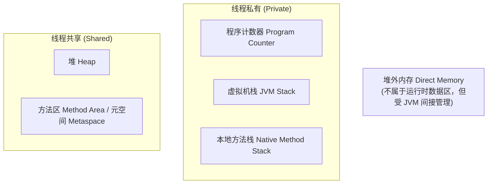
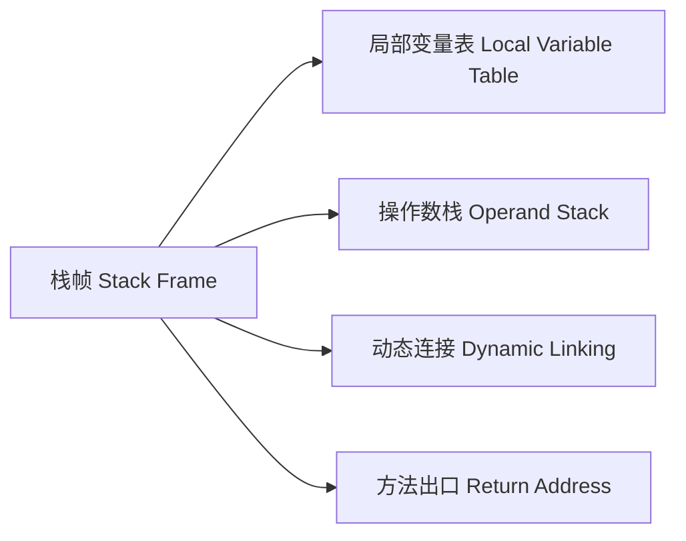
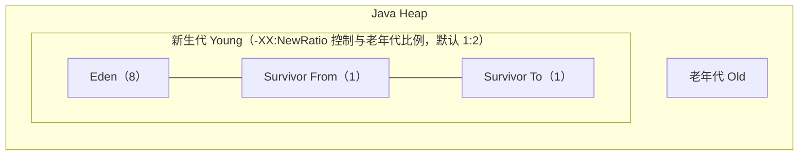
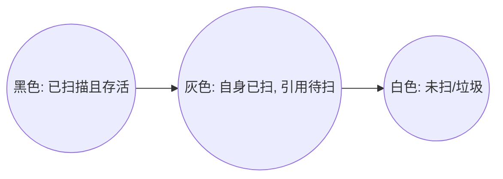
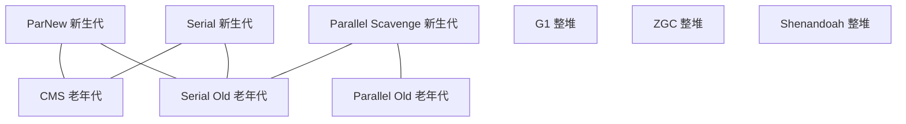
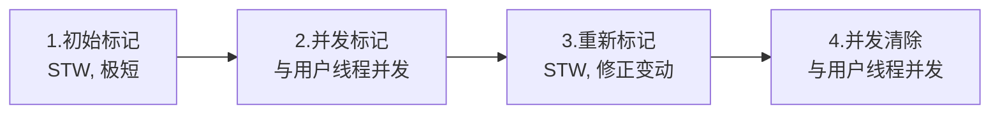
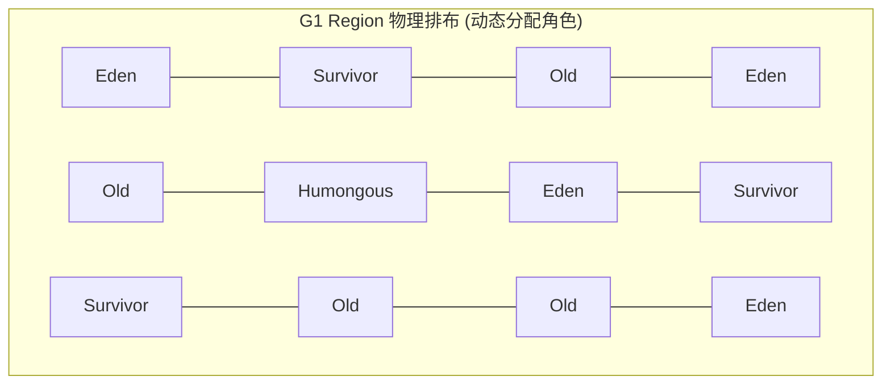

## JVM 内存模型与垃圾回收机制

JVM（Java Virtual Machine）是 Java 程序的运行基石。深入理解 JVM 的运行时数据区划分、虚拟机栈的栈帧交互、堆中对象的内存布局与晋升机制、以及现代垃圾收集器的底层原理，是迈向高级与资深 Java 开发的必经之路。

---

## 一、 JVM 运行时数据区深度剖析

根据 JVM 规范，JVM 在运行 Java 程序时会将其管理的内存划分为若干个不同的运行时数据区域（Runtime Data Area）：



### 1. 程序计数器（Program Counter Register）

程序计数器是一块较小的内存空间，可以看作是当前线程所执行的字节码的**行号指示器**。

- **核心作用**：在多线程环境下，CPU 通过时间片轮转进行线程切换。当线程被唤醒重新获得 CPU 时，程序计数器负责记录并指示该线程应当继续执行的**字节码指令地址**。
- **物理特性**：
  - **线程私有**：每个线程都有自己独立的程序计数器，互不影响。
  - **唯一无 OOM 区域**：这是 JVM 内存规范中**唯一一个没有规定任何 OutOfMemoryError 状况**的区域。若线程正在执行的是 Native 方法，则该计数器值为空（Undefined）。

---

### 2. 虚拟机栈（JVM Stack）与栈帧（Stack Frame）

虚拟机栈是线程私有的，生命周期与线程相同，描述的是 Java 方法执行的内存模型：每个方法被执行时，JVM 都会同步创建一个 **栈帧（Stack Frame）** 用于存储局部变量表、操作数栈、动态连接和方法出口等信息。



#### 🔍 栈帧的内部结构

1. **局部变量表（Local Variable Table, LVT）**：
   - 存放了编译期可知的各种基本数据类型、对象引用（`reference`）和 `returnAddress`。
   - 分配的基本单位是 **槽（Slot）**：`double` 和 `long` 占用 $2$ 个 Slot，其余类型占用 $1$ 个 Slot。非静态方法的第 $0$ 位 Slot 默认存放 `this` 引用。
   - **Slot 复用**：为了节省栈帧空间，当代码执行超出某局部变量的作用域后，其所占用的 Slot 可以被重新分配给后面声明的其他变量使用（这也是某些情况下手动将大对象引用置 `null` 无法真正提前触发回收的原因——只有作用域结束、Slot 被复用/清空后引用才真正失效）。
2. **操作数栈（Operand Stack, OS）**：
   - 作为执行引擎的临时工作区，用于方法执行过程中数据的出栈和入栈操作（如加减乘除、加载与存储变量）。
3. **动态连接（Dynamic Linking, DL）**：
   - 每个栈帧都包含一个指向运行时常量池中该栈帧所属方法的引用，以支持方法调用过程中的 **动态连接**（将符号引用解析为直接引用）。
4. **方法出口（Return Address, RA）**：
   - 保存方法被调用时的现场信息，以便方法正常或异常退出时，程序能返回到调用该方法的位置继续执行。

#### 💡 虚拟机栈字节码计算现场还原

```java
public int calculate() {
    int a = 1;
    int b = 2;
    int c = a + b;
    return c;
}
```

| 指令 | 操作数栈 (OS) 状态变化 | 局部变量表 (LVT) 状态变化 | 说明 |
| :--- | :--- | :--- | :--- |
| `iconst_1` | `[ 1 ]` | `[ this ]` | 将常量 $1$ 压入栈 |
| `istore_1` | `[ ]` | `[ this, a=1 ]` | 弹出栈顶 $1$ 存入 Slot 1 |
| `iconst_2` | `[ 2 ]` | `[ this, a=1 ]` | 将常量 $2$ 压入栈 |
| `istore_2` | `[ ]` | `[ this, a=1, b=2 ]` | 弹出栈顶 $2$ 存入 Slot 2 |
| `iload_1` | `[ 1 ]` | `[ this, a=1, b=2 ]` | 将 Slot 1 的 $1$ 压入栈 |
| `iload_2` | `[ 1, 2 ]` | `[ this, a=1, b=2 ]` | 将 Slot 2 的 $2$ 压入栈 |
| `iadd` | `[ 3 ]` | `[ this, a=1, b=2 ]` | 弹出 $1, 2$ 相加结果 $3$ 压入 |
| `istore_3` | `[ ]` | `[ this, a=1, b=2, c=3 ]` | 弹出 $3$ 存入 Slot 3 |
| `ireturn` | `[ ]` | `[ this, a=1, b=2, c=3 ]` | 返回 $3$，栈帧销毁 |

> **参数调优**：虚拟机栈的大小可以通过 `-Xss` 进行配置（如 `-Xss256k`）。若线程请求的栈深度大于虚拟机所允许的深度，将抛出 `StackOverflowError`；若栈支持动态扩展但在申请内存时空间不足，则抛出 `OutOfMemoryError`。

---

### 3. 本地方法栈（Native Method Stack）

本地方法栈的作用与虚拟机栈非常相似，区别在于虚拟机栈为执行 Java 方法（字节码）服务，而本地方法栈是为虚拟机使用到的 **Native 方法** 服务。HotSpot 虚拟机直接将两者合二为一实现，因此本地方法栈同样会抛出 `StackOverflowError` 与 `OutOfMemoryError`。

---

### 4. Java 堆（Java Heap）与对象内存布局

堆是 JVM 管理的内存中最大的一块，被所有线程共享，在虚拟机启动时创建，唯一目的是 **存放对象实例**。

#### 🔍 堆内存结构总览



- `-Xms` / `-Xmx`：堆初始与最大容量。
- `-Xmn`：新生代容量。
- `-XX:SurvivorRatio`：Eden 与单个 Survivor 区的比例（默认 $8$）。

#### 🔍 对象的创建过程

当虚拟机遇到一条 `new` 指令时，会经历以下步骤：

1. **类加载检查**：检查 `new` 指令的参数是否能在常量池中定位到一个类的符号引用，并检查该符号引用代表的类是否已被加载、解析和初始化。若没有，必须先执行相应的类加载过程。
2. **分配内存**：根据堆内存是否规整，采用两种方式之一：
   - **指针碰撞（Bump the Pointer）**：适用于内存规整（无碎片）的场景，如配合带有 Compact 整理过程的 Serial、Parallel 等收集器。已用内存和空闲内存分居两侧，中间用一个指针作分界点。
   - **空闲列表（Free List）**：适用于内存不规整（有碎片）的场景，如配合基于 Mark-Sweep 的 CMS 收集器。虚拟机维护一张列表记录哪些内存块可用，分配时从中找一块足够大的空间划给对象。
3. **解决并发分配的安全问题**：
   - **CAS + 失败重试**：保证内存分配操作的原子性。
   - **TLAB（Thread Local Allocation Buffer，本地线程分配缓冲）**：每个线程预先在 Eden 区申请一小块私有内存作为分配缓冲，对象优先在自己的 TLAB 上分配，只有 TLAB 用尽需要重新申请时才使用同步锁定，从而避免了绝大多数情况下的线程同步开销。默认开启（`-XX:+UseTLAB`），可通过 `-XX:TLABSize` 调整大小。
4. **初始化零值**：将分配到的内存空间（不含对象头）初始化为零值，这保证了实例字段可以不赋初始值就直接使用。
5. **设置对象头**：初始化 Mark Word、Klass Word（指向类元数据的指针）等信息。
6. **执行 `<init>` 方法**：至此从虚拟机视角看对象已产生，但从 Java 程序视角看，对象创建才刚刚开始——所有字段仍为零值。执行 `<init>` 方法后，对象才会按照程序员的意图完成初始化。

#### 🔍 堆内对象的物理内存排布

```text
+-------------------------------------------------------------+
|                     对象头 (Object Header)                   |
|  - Mark Word (64位下为 8 字节)                                |
|  - Klass Word (类型指针，开启压缩时为 4 字节)                   |
|  - 数组长度 (仅数组对象有，4 字节)                             |
+-------------------------------------------------------------+
|                      实例数据 (Instance Data)                |
|  - 对象的各个成员变量数据                                      |
+-------------------------------------------------------------+
|                      对齐填充 (Padding)                      |
|  - 将对象大小补齐至 8 字节的整数倍                             |
+-------------------------------------------------------------+
```

> **压缩指针（Compressed Oops）**：64 位 JVM 默认开启 `-XX:+UseCompressedOops`，将对象引用与 Klass Word 由 $8$ 字节压缩为 $4$ 字节，以降低指针膨胀带来的内存开销，其可寻址的堆内存上限约为 $32\text{GB}$；超过该阈值后指针压缩将自动失效，指针恢复为 $8$ 字节。

##### Mark Word（标记字）的锁升级位图结构

在 $64$ 位 JVM 中，`Mark Word` 占用 $8$ 字节，会根据对象状态（无锁、偏向锁、轻量级锁、重量级锁、GC 标记）复用空间：

| 锁状态 | 25 bits | 31 bits | 1 bit (偏向标志) | 2 bits (锁标志位) |
| :--- | :--- | :--- | :--- | :--- |
| **无锁** | 未使用 | 对象的 Identity HashCode | 0 | 01 |
| **偏向锁** | 线程 ID (Thread ID) | Epoch (偏向时间戳) | 1 | 01 |
| **轻量级锁** | 指向栈中锁记录的指针 | 指向栈中锁记录的指针 | 0 | 00 |
| **重量级锁** | 指向互斥量的指针 | 指向互斥量的指针 | 0 | 10 |
| **GC 标记** | 空 (未使用) | 空 | 0 | 11 |

#### 🔍 对象访问定位方式

Java 程序通过栈上的 `reference` 数据来操作堆上的具体对象，主流虚拟机主要有两种访问方式：

1. **句柄访问**：堆中划出一块内存作为句柄池，`reference` 中存储对象的句柄地址，句柄中再包含实例数据与类型数据各自的具体地址。**优点**：对象被移动（如 GC 整理）时只需改变句柄中的实例数据指针，`reference` 本身无需修改。
2. **直接指针访问（HotSpot 默认采用）**：`reference` 中存储的直接就是对象地址。**优点**：省去了一次指针定位的时间开销，由于对象访问在 Java 中是极为频繁的操作，HotSpot 因此选用此方式，代价是对象移动时需要同步更新所有指向它的 `reference`。

#### 🚀 对象晋升老年代的四大硬核规则

新生代与老年代默认比例为 $1:2$（新生代内部 Eden : S0 : S1 默认为 $8:1:1$），对象晋升老年代遵循如下规则：

1. **长期存活晋升（Age Threshold）**：
   - 对象在 Eden 区出生并经过第一次 Minor GC 后若存活，移入 Survivor 区且年龄设为 $1$。此后每熬过一次 Minor GC，年龄增加 $1$ 岁。当年龄达到阈值（默认 $15$，由 `-XX:MaxTenuringThreshold` 控制）时，晋升老年代。
2. **动态年龄判定（Dynamic Age Determination）**：
   - 若 Survivor 空间中相同年龄所有对象大小的总和大于 Survivor 空间的一半（$50\%$），则年龄大于或等于该年龄的对象可直接进入老年代，无需等到 `MaxTenuringThreshold` 要求的年龄。
3. **大对象直接进入老年代**：
   - 通过 `-XX:PretenureSizeThreshold` 设置阈值，大于该值的对象创建时直接绕过新生代，在老年代分配，以避免大对象在 Eden 与两个 Survivor 之间来回复制（注：该参数只对 Serial 和 ParNew 收集器有效）。
4. **空间分配担保机制（Handle Promotion Guarantee）**：
   - Minor GC 前，JVM 检查老年代最大可用连续空间是否大于新生代所有对象总空间：
     - 若大于，Minor GC 安全。
     - 若小于，查看 `-XX:+HandlePromotionFailure` 是否允许担保失败。若允许，检查老年代最大连续空间是否大于历次晋升对象的平均大小，大于则尝试 Minor GC；小于或不允许担保失败，则直接触发一次 **Full GC**。

---

### 5. 方法区（Method Area）与元空间（Metaspace）

方法区是 JVM 规范定义的逻辑区域，用于存储已加载的类信息、常量、静态变量、即时编译器编译后的代码缓存等。永久代（PermGen）和元空间（Metaspace）是 HotSpot 在不同历史阶段对方法区的具体 **物理实现**。

#### 🔍 运行时常量池的内容

运行时常量池用于存放编译期生成的各种**字面量（Literal）**（如文本字符串、被声明为 `final` 的常量值）和**符号引用（Symbolic References）**（如类和接口的全限定名、字段的名称和描述符、方法的名称和描述符）。区别于 Class 文件常量池的最大特点是具备**动态性**——运行期间也可以将新的常量放入池中，最典型的例子就是 `String.intern()`。

#### 🚀 字符串常量池与运行时常量池的演变史

永久代和元空间最关键的区别在于：永久代使用的是 **JVM 堆内存**，而元空间使用的是 **本地物理内存（Native Memory）**。

| JDK 版本 | 运行时常量池位置 | 字符串常量池 (String Table) 位置 | 物理载体与限制 |
| :--- | :--- | :--- | :--- |
| **JDK 6 及以前** | 方法区（内含字符串常量池） | 永久代内部 | **永久代 (PermGen)**，受限于 `-XX:MaxPermSize`，易发 OOM |
| **JDK 7** | 方法区内 | **移至 Java 堆 (Java Heap)** | 永久代 + Java 堆，将高频分配的字符串剥离，利用堆 GC 回收 |
| **JDK 8 及以后** | **移至 元空间 (Metaspace)** | **保留在 Java 堆 (Java Heap)** | **本地内存 (Native Memory)**，不受 JVM 内存限制，仅受系统物理内存限制 |

- **永久代被彻底废除的原因**：
  1. 简化 GC 逻辑，类元数据生命周期与类加载器强绑定，释放更方便。
  2. 规避动态生成类（如 Spring CGLIB、JSP）导致的方法区 OOM。

#### 💡 CDS（Class Data Sharing）

JDK 10 引入的 **AppCDS（Application Class Data Sharing）** 可以将类的元数据信息序列化到一个共享归档文件中，多个 JVM 进程启动时通过内存映射（`mmap`）共享同一份元数据，减少类加载解析的时间与内存占用，是容器化时代（如 K8s 中大量短生命周期 Pod 启动）加速 JVM 启动速度的重要手段。

---

### 6. 堆外内存（Direct Memory）

堆外内存不属于 JVM 运行时数据区，而是通过 JNI 直接在本地物理内存中分配的空间。

- **分配机制**：通过 `ByteBuffer.allocateDirect(int)` 或 `sun.misc.Unsafe` 分配，底层通过 `DirectByteBuffer` 的构造函数向系统申请分配直接内存。
- **零拷贝（Zero-Copy）**：传统 Java I/O 需先将数据从内核空间拷贝到 JVM 堆中再由应用读取；堆外内存避免了 Java 堆与系统内核缓冲区之间的来回复制，极大提高了网络与磁盘 I/O 性能（如 Netty、NIO 广泛使用）。
- **垃圾回收**：堆外内存不受 JVM GC 直接管理，通过 `Cleaner`（虚引用）机制，在 `DirectByteBuffer` 对象被 GC 回收时触发其底层的 `Deallocator` 任务，调用 `unsafe.freeMemory()` 释放本地物理内存。
- **调优参数**：`-XX:MaxDirectMemorySize` 限制堆外内存的最大容量，超出限制将抛出 `OutOfMemoryError: Direct buffer memory`。

---

### 7. 四种引用类型与应用场景

JDK 1.2 之后，Java 将引用扩充为四种强度依次减弱的类型，这也是 `WeakHashMap`、`ThreadLocal`、缓存框架、`DirectByteBuffer` 回收（`Cleaner`）等机制的理论基石。

| 引用类型 | 对应类 | GC 回收时机 | 典型应用场景 |
| :--- | :--- | :--- | :--- |
| **强引用** | `Object obj = new Object()` | 只要强引用存在，永远不会被回收，即使 OOM 也不会 | 日常对象引用 |
| **软引用** | `SoftReference<T>` | 系统**即将发生 OOM 之前**会被强制回收 | 内存敏感的缓存（如图片缓存） |
| **弱引用** | `WeakReference<T>` | 只要发生 GC（无论内存是否够用）就会被回收 | `ThreadLocalMap` 的 Key、`WeakHashMap` |
| **虚引用** | `PhantomReference<T>` | 任何时候都可能被回收，无法通过它获取对象实例，必须配合 `ReferenceQueue` | 跟踪对象被 GC 回收的活动，管理堆外内存释放（`Cleaner`） |

> **追问**：为什么 `ThreadLocal` 的 Key 要设计成弱引用？—— 为了在外部强引用消失后，即使 `Entry` 仍被 `Thread` 通过 `ThreadLocalMap` 强引用着，其 Key 也能被 GC 正常回收，从而有机会被 `expungeStaleEntry` 探测并清理对应的 Value，缓解内存泄漏风险（但 Value 本身仍是强引用，实践中仍需手动调用 `remove()` 才能彻底避免泄漏）。

---

## 二、 垃圾回收基础理论

### 1. 垃圾判定标准

- **引用计数法**：给对象添加引用计数器，每有一处引用计数器加 $1$，引用失效减 $1$。**缺点**：无法解决对象间循环引用问题，已被现代主流虚拟机弃用。
- **可达性分析算法（JVM 采用）**：从一系列被称为 **`GC Roots`** 的根对象开始向下搜索，若一个对象到 `GC Roots` 没有任何引用链相连，则证明此对象不可用。

**哪些对象可以作为 GC Roots？**

1. 虚拟机栈（栈帧中的局部变量表）中引用的对象。
2. 方法区中类静态属性引用的对象。
3. 方法区中常量引用的对象（如字符串常量池里的引用）。
4. 本地方法栈中 JNI（Native 方法）引用的对象。
5. JVM 内部的引用，如基本数据类型对应的 `Class` 对象，常驻异常对象（`NullPointerException` 等），系统类加载器。

### 2. 分代收集理论

现代商用虚拟机大多遵循 **分代收集理论（Generational Collection Theory）**，其建立在三个经验假说之上：

1. **弱分代假说**：绝大多数对象都是朝生夕灭的。
2. **强分代假说**：熬过越多次垃圾收集过程的对象就越难以消亡。
3. **跨代引用假说**：跨代引用相对于同代引用来说仅占极少数。

基于以上假说，堆被划分为不同区域分而治之。但假说 3 引出一个新问题：**Minor GC 时如何避免扫描整个老年代来判断是否存在跨代引用，从而保证不漏标？**

#### 💡 卡表（Card Table）与记忆集（Remembered Set）

- **记忆集（RSet）**：一种记录从非收集区域指向收集区域的指针集合的抽象数据结构，用于避免把整个堆加入扫描范围。
- **卡表（Card Table）**：记忆集的一种具体的、粗粒度实现。HotSpot 默认将老年代按 $512$ 字节划分为一个个 **卡页（Card Page）**，每个卡页对应卡表中的一个字节标记。当有其他分代对象引用了该卡页内的对象时，将该字节标记为 $1$（Dirty），否则为 $0$。
- **写屏障（Write Barrier）**：JVM 在赋值语句前后插入类似 AOP 切面的操作来动态维护卡表状态。Minor GC 时只需扫描卡表中标记为 Dirty 的卡页，无需扫描整个老年代，代价是每次引用字段赋值都会产生额外开销。

### 3. 三种基础垃圾回收算法

| 算法 | 原理 | 优点 | 缺点 |
| :--- | :--- | :--- | :--- |
| **标记-清除（Mark-Sweep）** | 先标记所有需回收的对象，标记完成后统一回收 | 实现简单，不需要移动对象 | 产生大量不连续的**内存碎片**；标记与清除效率都不高 |
| **标记-复制（Mark-Copy）** | 将可用内存分为大小相等的两块，每次只用一块，用完后将存活对象复制到另一块，清理已用空间 | 实现简单、运行高效，不产生内存碎片 | 可用内存缩小为原来一半；存活对象多时复制成本高（新生代 Eden:S0:S1=8:1:1 即为权衡结果） |
| **标记-整理（Mark-Compact）** | 标记过程同标记-清除，随后让存活对象向内存一端移动，再清理边界外的内存 | 不产生内存碎片，空间利用率高 | 需要移动并更新引用地址，STW 停顿时间较长 |

> 老年代对象存活率高，缺乏额外空间做分配担保，大多采用**标记-清除**或**标记-清除/整理混合策略**（如 CMS 平时标记清除，碎片过多时定期做一次 Full GC 整理）。

### 4. 三色标记算法（Three-Color Marking）

并发标记阶段（用户线程与 GC 线程并发运行），收集器通常使用三色标记法对对象染色：



并发标记期间，若用户线程修改了对象引用关系，可能出现 **漏标**（存活对象被误判为垃圾），需同时满足两个条件：

1. 赋值器插入了一条或多条从黑色对象到白色对象的新引用；
2. 赋值器删除了全部从灰色对象到该白色对象的直接或间接引用。

与漏标相对，还存在**多标问题**：本已死亡的对象被误标为存活，这类对象被称为**浮动垃圾**，不影响正确性，只是要等到下一轮 GC 才被清理。

#### 💡 解决方案

- **原始快照（SATB, Snapshot At The Beginning）**：G1 采用，破坏条件 $2$。灰色对象要断开对白色对象的引用时，通过写屏障记录下这个即将断开的引用，并发标记结束后以这些记录对象为根重新扫描一次。
- **增量更新（Incremental Update）**：CMS 采用，破坏条件 $1$。黑色对象插入指向白色对象的新引用时，通过写屏障记录这个新引用，并发标记结束后以这些黑色对象为根重新扫描一次。

---

## 三、 经典与现代垃圾收集器全景

### 0. 收集器发展脉络与搭配关系



> JDK 14 中 CMS 已被彻底移除（`JEP 363`），Serial + CMS 组合早已不推荐使用，此处仅作历史脉络说明。

| 收集器 | 作用分代 | 收集算法 | 线程模式 | 设计目标 |
| :--- | :--- | :--- | :--- | :--- |
| Serial | 新生代 | 标记-复制 | 单线程 | 简单高效（客户端模式） |
| ParNew | 新生代 | 标记-复制 | 多线程并行 | 配合 CMS 使用 |
| Parallel Scavenge | 新生代 | 标记-复制 | 多线程并行 | 高吞吐量 |
| Serial Old | 老年代 | 标记-整理 | 单线程 | Parallel Scavenge 的备用方案 |
| Parallel Old | 老年代 | 标记-整理 | 多线程并行 | 与 Parallel Scavenge 搭配，高吞吐 |
| CMS | 老年代 | 标记-清除 | 多线程并发 | 最短回收停顿时间（已移除） |
| G1 | 整堆（分 Region） | 局部标记-复制 | 多线程并发 | 停顿时间可预测 |
| ZGC / Shenandoah | 整堆 | 并发标记-整理 | 多线程并发 | 超低延迟（毫秒级 STW） |

### 1. Serial / Serial Old：单线程收集器

历史最悠久的收集器，进行垃圾收集时必须暂停其他所有工作线程（`Stop The World`）。因没有线程交互开销，在**单核 CPU 或堆内存较小的客户端场景**下反而简单高效，是 Client 模式下的默认新生代收集器。

### 2. ParNew：Serial 的多线程版本

本质是 Serial 的多线程并行版本，工作原理与 Serial 完全一致。是运行在 Server 模式下的虚拟机首选的新生代收集器之一，重要原因是除 Serial 外，只有它能与 **CMS** 配合工作。

### 3. Parallel Scavenge / Parallel Old：吞吐量优先

以尽可能高的吞吐量（**Throughput = 用户代码运行时间 / (用户代码运行时间 + GC 时间)**）为目标：

- `-XX:MaxGCPauseMillis`：控制最大垃圾收集停顿时间。
- `-XX:GCTimeRatio`：直接设置吞吐量大小。
- `-XX:+UseAdaptiveSizePolicy`：开启 **GC 自适应调节策略**，虚拟机根据运行情况动态调整新生代大小、Eden/Survivor 比例、晋升年龄等，无需人工干预。

### 4. CMS（Concurrent Mark Sweep）：以低延迟为目标

CMS 是 HotSpot 上第一款真正意义上的**并发收集器**，首次实现垃圾收集线程与用户线程基本同时工作。基于**标记-清除**算法，全过程分 $4$ 步：



1. **初始标记（Initial Mark）**：STW，仅标记 GC Roots 直接关联的对象，速度很快。
2. **并发标记（Concurrent Mark）**：从直接关联对象开始遍历整个对象图，与用户线程并发，耗时最长但不阻塞用户线程。
3. **重新标记（Remark）**：STW，采用**增量更新**修正并发标记期间因用户线程运行而变动的标记记录，停顿时间比初始标记稍长，但远小于并发标记。
4. **并发清除（Concurrent Sweep）**：清理已标记的可回收对象，与用户线程并发。

**三大缺点**：

1. **CPU 资源敏感**：并发阶段占用部分线程资源，导致吞吐量降低（默认并发线程数为 `(CPU数量+3)/4`）。
2. **无法处理浮动垃圾**：并发清理阶段用户线程仍在产生新垃圾，只能留到下次 GC 清理，严重时会触发"并发失败"（Concurrent Mode Failure），退化为使用 Serial Old 进行一次 Full GC。
3. **基于标记-清除，产生大量空间碎片**：碎片过多时即使老年代仍有较大剩余空间，也可能因无法找到连续空间分配大对象而提前触发 Full GC，可用 `-XX:+UseCMSCompactAtFullCollection` 缓解。

> **现状**：CMS 在 JDK 9 中标记为**过时（Deprecated）**，JDK 14 中被彻底**移除**，其历史使命已由 G1 全面接棒。

### 5. G1 (Garbage-First) 收集器

G1 彻底放弃了物理上的连续分代，将堆划分为多个大小相同的独立区域（**Region**，$1\text{MB}$ 到 $32\text{MB}$，须为 $2$ 的幂）。



- **Humongous Region**：专门存储大对象（超过单个 Region 大小 $50\%$ 的对象）。
- **可预测停顿**：G1 在后台跟踪各 Region 的回收价值，每次根据 `-XX:MaxGCPauseMillis` 限制，优先回收性价比最高的 Region。

#### 🔍 G1 的两种 GC 模式

1. **Young GC（年轻代收集）**：Eden 区用尽时触发，采用**标记-复制**算法将存活对象复制到 Survivor 或直接晋升老年代 Region，全程 STW，但因只处理年轻代 Region，停顿时间可控。
2. **并发标记周期（Concurrent Marking Cycle）**：老年代占用堆比例达到阈值（`-XX:InitiatingHeapOccupancyPercent`，默认 $45\%$）时触发，采用 SATB 标记全堆存活对象，为混合回收提供依据。流程：初始标记（借用 Young GC 的 STW）→ 根区域扫描 → 并发标记 → 最终标记（STW）→ 筛选回收（STW，统计各 Region 回收价值）。
3. **Mixed GC（混合回收）**：并发标记周期结束后触发，回收**全部新生代 Region + 部分性价比最高的老年代 Region**（数量由 `-XX:MaxGCPauseMillis` 决定），依然是标记-复制算法，存活对象被复制到空闲 Region，因此 G1 整体上不会产生内存碎片。

#### 🔍 G1 中的记忆集实现

由于 G1 的 Region 之间可以相互引用（不仅是新生代到老年代），G1 为**每个 Region** 都维护了一份独立的 RSet，记录粒度比传统卡表更精细，这也是 G1 内存占用（额外占堆容量 $10\%\text{-}20\%$ 左右）相对较高的原因之一。

### 6. ZGC (Z Garbage Collector) 收集器

ZGC 是一款在 JDK 15 正式转正的低延迟垃圾收集器，致力于将 **STW 停顿控制在 10 ms（甚至 1 ms）以内**，且停顿时间不随堆大小增长而增加。

- **染色指针（Colored Pointers）**：ZGC 仅使用 64 位指针中的 42 位寻址（最大支持 16 TB 堆），高 4 位存储 GC 元数据（Marked0, Marked1, Remapped, Finalizable），实现了指针本身携带 GC 标记信息。
- **多重映射（Multi-Mapping）**：ZGC 在虚拟内存层面将同一段物理内存同时映射到多个不同的虚拟地址空间（视图），借助染色指针的高位标志，操作系统层面的地址转换可以直接映射到对应的物理内存视图，避免了传统方案中额外的转发表查询开销。
- **读屏障与自愈（Read Barrier & Self-Healing）**：用户线程读取一个已被移动但未更新指针的对象时，读屏障会拦截该操作，根据转发表（Forwarding Table）更新引用为新地址，实现自愈，从而支持 **并发整理（Concurrent Compact）**。

#### 🔍 ZGC 的三大并发阶段

1. **并发标记（Concurrent Mark）**：遍历对象图做可达性分析，标记信息记录在指针的染色位中，而非对象头。
2. **并发预备重分配（Concurrent Prepare for Relocate）**：统计各 Region（ZPage）的回收价值，组成重分配集（Relocation Set）。
3. **并发重分配（Concurrent Relocate）**：将重分配集中的存活对象复制到新 Region，并为每个被移动的旧对象维护转发表。若用户线程并发访问了旧地址，将触发读屏障完成转发并"自愈"，之后再次访问将直接命中已修正的引用。

### 7. Shenandoah 简介

由 RedHat 主导开发，设计目标与 ZGC 相似（低延迟），核心区别在于并发整理阶段的实现：Shenandoah 使用 **Brooks 转发指针**（在对象头前插入一个转发指针字段）配合**读写屏障**实现并发整理，而非染色指针。两者设计目标与效果基本一致，均能做到停顿时间与堆大小无关。

### 8. 收集器选型总结

| 场景 | 推荐收集器 | JVM 参数 |
| :--- | :--- | :--- |
| 单核/小内存/客户端应用 | Serial + Serial Old | `-XX:+UseSerialGC` |
| 追求高吞吐（批处理、计算型任务） | Parallel Scavenge + Parallel Old | `-XX:+UseParallelGC` |
| 中等堆（几 GB 至十几 GB），停顿可控 | G1（JDK 9+ 默认） | `-XX:+UseG1GC` |
| 超大堆（几十 GB 至 TB 级），极致低延迟 | ZGC / Shenandoah | `-XX:+UseZGC` / `-XX:+UseShenandoahGC` |

---

## 四、 高频面试题与追问

### 1. 为什么 ZGC 的停顿时间能控制在 10ms 以内？

**答**：ZGC 的几乎所有阶段（并发标记、并发准备、并发转移/重定位）都与用户线程并发执行，STW 阶段极其短暂，只用于初始标记、再标记等必要的极少数初始化操作。这些阶段耗时只与 GC Roots 的数量有关，与堆的大小、存活对象数量完全无关。

### 2. 什么是 Minor GC、Major GC、Full GC？

- **Minor GC (Young GC)**：目标只是新生代（Eden, S0, S1）的垃圾收集，触发频率高，速度快。
- **Major GC (Old GC)**：目标只是老年代的垃圾收集，目前只有 CMS 收集器有单独收集老年代的行为。
- **Mixed GC**：目标是收集整个新生代以及部分老年代，目前只有 G1 会有这种行为。
- **Full GC**：收集整个 Java 堆和方法区的垃圾，最为沉重，会导致长时间 STW，应尽量避免。

### 3. 对象一定分配在堆上吗？

不一定。随着 JIT 编译期发展，若经过 **逃逸分析（Escape Analysis）** 发现对象不会逃逸出方法之外，可能被优化为：

1. **栈上分配**：直接在虚拟机栈中分配。
2. **标量替换（Scalar Replacement）**：由于对象实际上不需要连续内存，可将其成员变量拆分为基本类型存放到栈帧的局部变量表中（默认开启 `-XX:+EliminateAllocations`）。
3. **同步消除（Lock Elimination）**：若对象不会被其他线程访问，可去掉对其的同步锁（`-XX:+EliminateLocks`）。

> **追问**：为什么现在很多场景下"栈上分配"效果并不明显？—— 逃逸分析本身开销较大，且只能做保守判断（必须 100% 确定不逃逸才能优化），复杂调用链下命中率并不高。HotSpot 实际上并没有真正实现完整的栈上分配，其优化收益主要体现在**标量替换**与**同步消除**上。

### 4. CMS 为什么会被 G1 取代，最终在 JDK 14 中移除？

**答**：CMS 基于标记-清除算法，存在内存碎片、浮动垃圾、并发失败退化为 Full GC、CPU 敏感等固有缺陷，且只能收集老年代，需要与新生代收集器（ParNew）拼凑使用，维护成本高。G1 通过 Region 化内存布局，将标记-复制算法引入老年代回收，从根本上避免了内存碎片问题，同时支持"可预测停顿模型"，功能和性能全面反超，因此 JDK 9 起默认收集器改为 G1，CMS 也在 JDK 14（`JEP 363`）中被正式移除。

### 5. Minor GC 会不会扫描老年代？为什么？

**答**：得益于卡表与记忆集机制，Minor GC 不需要扫描整个老年代来判断是否存在跨代引用。写屏障会在老年代对象的引用字段被赋值时动态维护卡表状态，Minor GC 只需扫描卡表中被标记为 Dirty 的少量卡页并等效视为 GC Roots 的一部分，大幅降低了扫描成本。

### 6. 常见的 OOM 场景有哪些？如何排查？

| OOM 类型 | 触发场景 | 排查思路 |
| :--- | :--- | :--- |
| `Java heap space` | 堆中对象持续增长无法回收（内存泄漏）或 `-Xmx` 过小 | `-XX:+HeapDumpOnOutOfMemoryError` 导出堆快照，借助 MAT / JProfiler 分析支配树，定位大对象与 GC Roots 引用链 |
| `GC overhead limit exceeded` | 超过 $98\%$ 的时间用于 GC 但只回收不到 $2\%$ 的空间 | 与堆 OOM 思路一致，往往是内存泄漏的前兆 |
| `StackOverflowError` | 递归过深或栈帧过大 | 检查递归终止条件，或调大 `-Xss` |
| `Metaspace` | 动态生成类过多（如 CGLIB 代理、频繁热部署）且未被卸载 | 观察 `-XX:MaxMetaspaceSize` 增长趋势，检查自定义 ClassLoader 是否泄漏 |
| `Direct buffer memory` | 堆外内存申请超过 `-XX:MaxDirectMemorySize` | 检查 `DirectByteBuffer` 是否及时释放，或 Full GC 频率过低导致 Cleaner 未及时触发 |
| `unable to create new native thread` | 线程数超过操作系统限制 | 检查线程池配置是否导致线程无限创建，可调低 `-Xss` 以容纳更多线程 |

### 7. 强引用、软引用、弱引用、虚引用的核心区别与应用场景？

见正文「四种引用类型与应用场景」一节，核心结论：强引用永不回收；软引用 OOM 前回收（适合缓存）；弱引用见 GC 就回收（适合 `ThreadLocal`/`WeakHashMap` 的 Key）；虚引用无法取得对象实例，仅用于跟踪对象回收活动（如堆外内存释放）。
