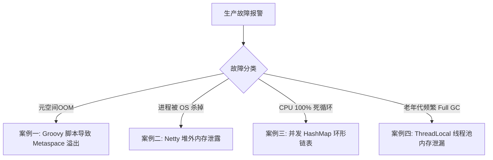
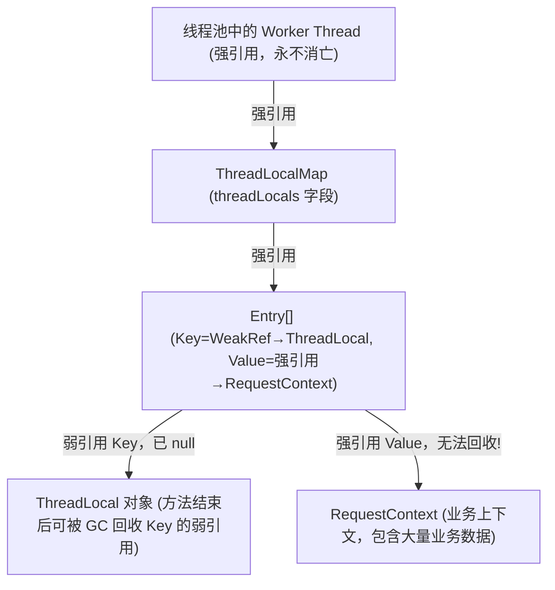

## JVM 经典生产故障排障案例复盘

在大规模高并发的生产环境中，JVM 相关的线上故障往往是最难定位、影响最广的一类问题。本篇对四大经典生产故障进行深度复盘，还原**故障现象 → 排查路径 → 根因分析 → 解决方案**的完整闭环，以供参考与举一反三。



---

## 案例一：Groovy 脚本未缓存导致 Metaspace OOM

### 🚨 故障现象

某规则引擎服务在上线运行约 3 天后，服务突然崩溃并抛出如下异常，同时 K8s Pod 自动重启：

```text
java.lang.OutOfMemoryError: Metaspace
    at java.lang.ClassLoader.defineClass1(Native Method)
    at java.lang.ClassLoader.defineClass(ClassLoader.java:756)
    ...
```

JVM 堆内存指标显示完全正常，堆占用率仅 40%，但元空间持续飙升直至 OOM。

---

### 🔍 排查路径

#### 第 1 步：观察元空间与类加载情况

```bash
# 每 1 秒打印一次 GC 统计，重点看 M (Metaspace)
jstat -gcutil {PID} 1000

# 输出示例（MC=Metaspace Capacity, MU=Metaspace Used）
S0     S1     E      O      M      CCS    YGC    YGCT    FGC    FGCT     GCT
 0.00  85.22  36.48  21.05  99.98  98.70    102    4.521     12    3.812    8.333
```

发现 M（元空间使用率）已接近 100%，且每次 GC 后几乎无法释放。

#### 第 2 步：统计类加载器数量

```bash
# 使用 jmap 查看类加载器和已加载类的数量
jmap -clstats {PID} | grep -i groovy | wc -l
```

输出结果显示，Groovy 相关的类加载器高达 **数万个**。

#### 第 3 步：使用 Arthas 深入诊断类加载器

```bash
# 连接至目标进程
java -jar arthas-boot.jar {PID}

# 查看所有类加载器的层级结构与加载的类数量
classloader -t

# 按加载类数量排序，找出异常的加载器
classloader -l | sort -k5 -rn | head -20
```

输出片段：

```text
+-GroovyClassLoader@7d4793a8,classes:1,parent:sun.misc.Launcher$AppClassLoader@18b4aac2
  +-GroovyClassLoader$InnerLoader@5fa5c313,classes:1,parent:GroovyClassLoader@7d4793a8
+-GroovyClassLoader@3b764bce,classes:1,parent:sun.misc.Launcher$AppClassLoader@18b4aac2
  +-GroovyClassLoader$InnerLoader@6d3af739,classes:1,parent:GroovyClassLoader@3b764bce
...（共发现 23847 个 GroovyClassLoader 实例）
```

---

### 💥 案例一：根因分析

业务代码在每次规则执行时，都通过如下方式动态编译并执行 Groovy 脚本：

```java
// ❌ 错误做法：每次请求都 new 一个 GroovyShell 并重新编译脚本
public Object evalScript(String scriptText) {
    GroovyShell shell = new GroovyShell(); // 每次都新建，每次都产生新 ClassLoader
    Script script = shell.parse(scriptText); // 每次重新编译，每次都生成新 Class
    return script.run();
}
```

每次调用 `shell.parse()` 时，Groovy 都会创建一个新的 `GroovyClassLoader`，并在其中编译生成一个全新的匿名 `Class` 对象（如 `Script_xxxxx`）。

由于这些 `GroovyClassLoader` 实例被 `GroovyShell` 短暂持有后随即变为堆中的垃圾，理论上可以被 GC 回收，但 **Class 对象与 ClassLoader 的卸载有严格条件**：只有在 ClassLoader 本身不再被引用，且该 ClassLoader 所加载的所有 Class 也不再被引用时，整个 ClassLoader 才会连带 Class 元数据一起被 GC 卸载。

在高并发请求下，每秒产生数百个新的 ClassLoader，GC 来不及全部回收，元空间便被 Class 元数据迅速挤满，最终崩溃。

---

### ✅ 案例一：解决方案

**核心策略**：以脚本文本内容的 `MD5` 值为 Key，**缓存编译后的 `Class` 对象**，同一脚本只编译一次，后续直接从缓存中取用。

```java
// ✅ 正确做法：对编译后的 Class 对象建立静态缓存
private static final ConcurrentHashMap<String, Class> SCRIPT_CACHE = new ConcurrentHashMap<>();
private static final GroovyClassLoader CLASS_LOADER = new GroovyClassLoader(); // 全局复用同一个 ClassLoader

public Object evalScript(String scriptText) throws Exception {
    // 计算脚本内容的 MD5 作为缓存 Key
    String cacheKey = DigestUtils.md5Hex(scriptText);
    
    // 从缓存中获取已编译的 Class，不存在时才编译
    Class scriptClass = SCRIPT_CACHE.computeIfAbsent(cacheKey, k -> {
        return CLASS_LOADER.parseClass(scriptText);
    });
    
    // 实例化 Script 并运行
    Script script = (Script) scriptClass.getDeclaredConstructor().newInstance();
    return script.run();
}
```

> [!TIP]
> 生产环境中，建议对缓存设置容量上限（如使用 `Caffeine` 的 `maximumSize`）并结合 `softValues()` 软引用，防止缓存本身将元空间撑满。

---

## 案例二：Netty DirectByteBuffer 泄露引发操作系统 OOM Killer

### 🚨 案例二：故障现象

某高性能网关服务在运行 12 小时后，K8s 监控显示 Pod 的 **物理内存（RSS）持续上涨**，且完全不受 JVM `-Xmx` 控制，最终超出容器内存限制被操作系统的 **OOM Killer** 强制 `SIGKILL`。

查看 `/var/log/syslog` 或 `dmesg` 可以发现关键记录：

```text
Out of memory: Kill process 12345 (java) score 900 or sacrifice child
Killed process 12345 (java), total-vm:24578092kB, anon-rss:15728640kB
```

此时，JVM 内部的堆内存、元空间指标一切正常，且没有任何 Java 层面的 OOM 异常日志。

---

### 🔍 案例二：排查路径

#### 第 1 步：开启 Native Memory Tracking（NMT）

> [!IMPORTANT]
> **此步骤需要在服务启动时预先配置**，无法对正在运行的进程动态开启。建议将此参数纳入生产标配模板。

```bash
# 在 JVM 启动参数中添加
-XX:NativeMemoryTracking=detail
```

#### 第 2 步：使用 jcmd 查看本机内存基线与增量

```bash
# 打印当前所有本机内存分配详情（汇总）
jcmd {PID} VM.native_memory summary

# 输出示例（重点观察 Internal / Other 区域的内存增长）
Native Memory Tracking:
Total: reserved=5632MB, committed=3456MB

-         Java Heap (reserved=4096MB, committed=4096MB)
-             Class (reserved=256MB, committed=98MB)
-            Thread (reserved=512MB, committed=64MB)
-              Code (reserved=256MB, committed=48MB)
-           GC (reserved=128MB, committed=64MB)
-          Internal (reserved=128MB, committed=128MB)  <-- Direct Memory 通常归于此区域
-             Other (reserved=2048MB, committed=1280MB) <-- 异常! 其他本机内存不断增长

```

**第 3 步：使用 `-D` 参数辅助限制直接内存上限并验证**

```bash
# 添加 JVM 直接内存上限（可帮助更快地复现和验证问题）
-XX:MaxDirectMemorySize=1g
```

重启后很快抛出：

```text
java.lang.OutOfMemoryError: Direct buffer memory
```

---

### 💥 案例二：根因分析

代码中的自定义入站处理器继承自 `ChannelInboundHandlerAdapter`，在接收消息时未正确释放 `ByteBuf`：

```java
// ❌ 错误做法：忘记 release ByteBuf，导致引用计数不归零，直接内存无法释放
public class MyHandler extends ChannelInboundHandlerAdapter {
    @Override
    public void channelRead(ChannelHandlerContext ctx, Object msg) {
        ByteBuf buf = (ByteBuf) msg;
        byte[] bytes = new byte[buf.readableBytes()];
        buf.readBytes(bytes);
        // 处理完业务逻辑，直接 return，忘记调用 buf.release()！
        // Netty 的 Direct ByteBuf 底层持有一块 native 物理内存
        // 引用计数不归零，native 内存将永远无法释放！
    }
}
```

Netty 使用**引用计数（Reference Counting）**来管理 `ByteBuf` 的生命周期（通过 `retain()` 加 1，`release()` 减 1，当归零时底层调用 `unsafe.freeMemory()` 释放直接内存）。一旦遗漏 `release()`，引用计数将永远不会归零，直接内存将持续泄漏，直至耗尽系统物理内存。

---

### ✅ 案例二：解决方案

**方案一（推荐）：改用 `SimpleChannelInboundHandler`**

`SimpleChannelInboundHandler` 会在 `channelRead` 逻辑执行结束后，**自动调用 `ReferenceCountUtil.release(msg)`** 释放 `ByteBuf`：

```java
// ✅ 正确做法：继承 SimpleChannelInboundHandler，自动释放 ByteBuf
public class MyHandler extends SimpleChannelInboundHandler<ByteBuf> {
    @Override
    protected void channelRead0(ChannelHandlerContext ctx, ByteBuf buf) {
        byte[] bytes = new byte[buf.readableBytes()];
        buf.readBytes(bytes);
        // 方法执行结束后，Netty 自动调用 buf.release()，引用计数归零，native 内存释放
    }
}
```

**方案二：在 `finally` 块中显式释放**

```java
// ✅ 正确做法：在 finally 块中手动调用 release，确保任何情况下均会释放
public class MyHandler extends ChannelInboundHandlerAdapter {
    @Override
    public void channelRead(ChannelHandlerContext ctx, Object msg) {
        ByteBuf buf = (ByteBuf) msg;
        try {
            byte[] bytes = new byte[buf.readableBytes()];
            buf.readBytes(bytes);
            // 业务处理逻辑
        } finally {
            ReferenceCountUtil.release(buf); // 确保引用计数归零
        }
    }
}
```

---

## 案例三：并发 HashMap 产生环形链表引发 CPU 100% 死循环

### 🚨 案例三：故障现象

某服务配置中心在高峰期出现 CPU 所有核心全部飙升至 100%，应用完全无法对外提供服务，重启后恢复，但高峰期仍会周期性复现。

---

### 🔍 案例三：排查路径

#### 第 1 步：定位 CPU 飙高线程

```bash
# 找出最占 CPU 的 Java 进程
top
# 记录 PID，例如 PID=22345

# 找出该进程中 CPU 最高的线程 TID
top -Hp 22345
# 发现多个线程 TID（例如 22367, 22368）CPU 均在 99%
```

#### 第 2 步：线程 ID 十六进制转换

```bash
printf "%x\n" 22367   # 输出: 573f
printf "%x\n" 22368   # 输出: 5740
```

#### 第 3 步：导出线程栈并定位死循环

```bash
jstack 22345 | grep -A 30 "573f"
```

输出：

```text
"pool-1-thread-3" #31 prio=5 os_prio=0 tid=0x... nid=0x573f runnable [0x...]
   java.lang.Thread.State: RUNNABLE
        at java.util.HashMap.get(HashMap.java:556)    # ⬅ 死循环入口
        at java.util.HashMap.getNode(HashMap.java:571)
        at com.example.ConfigCacheService.getConfig(ConfigCacheService.java:89)
        at com.example.ConfigService.refresh(ConfigService.java:42)
```

多个线程全部阻塞在 `HashMap.get()`，且线程状态为 `RUNNABLE`（非阻塞），说明线程在 `HashMap` 内部的 `next` 节点遍历中**陷入了死循环**。

---

### 💥 案例三：根因分析

代码使用了非线程安全的 `HashMap` 作为共享的配置缓存：

```java
// ❌ 错误做法：多线程读写共享的非线程安全 HashMap
private static final Map<String, String> CONFIG_CACHE = new HashMap<>();

public void refresh() {
    // 多个线程可能并发调用此 put 操作
    CONFIG_CACHE.put(newKey, newValue);
}

public String getConfig(String key) {
    // 可能在 put 扩容时与 get 并发，触发环形链表
    return CONFIG_CACHE.get(key);
}
```

在 **JDK 7 的 HashMap 扩容机制**中，`transfer()` 方法使用的是**头插法**将节点转移到新桶。在多线程并发 `put` 触发扩容时，由于头插法的顺序特性，节点 A 和节点 B 可能互相指向对方（A.next → B，同时 B.next → A），从而形成**环形链表**。后续任何 `get()` 操作在遍历链表时就会陷入无限循环，造成 CPU 100%。

> [!NOTE]
> JDK 8 将 `HashMap` 的扩容改为**尾插法**，解决了环形链表问题。但并发 `put` 仍可能导致数据覆盖丢失、`size` 计数不准确等问题，**依然不能在多线程场景下使用 `HashMap`**。

---

### ✅ 案例三：解决方案

在任何多线程并发读写的场景下，**必须**将 `HashMap` 替换为 `ConcurrentHashMap`：

```java
// ✅ 正确做法：使用 ConcurrentHashMap 保证并发安全
private static final Map<String, String> CONFIG_CACHE = new ConcurrentHashMap<>();
```

`ConcurrentHashMap` 在 JDK 8 中采用 **CAS + `synchronized` 桶锁**的细粒度并发控制，既保证了线程安全，又将锁的粒度从整个 Map 降低到单个桶（链表头节点），在高并发读写场景下性能远超 `Hashtable`（全表 `synchronized`）。

---

## 案例四：线程池 + ThreadLocal 内存泄漏引发老年代 Full GC

### 🚨 案例四：故障现象

某交易系统的老年代内存在服务运行期间**持续缓慢上涨**，每次 Full GC 后回收效果极差（回收前后老年代内存相差不足 5%），最终导致频繁的 Full GC 风暴，系统长时间 STW，接口 TP999 高达 10 秒，最终抛出 `java.lang.OutOfMemoryError: Java heap space`。

---

### 🔍 案例四：排查路径

#### 第 1 步：确认老年代增长趋势

```bash
jstat -gcutil {PID} 5000 20
```

输出显示，`O`（老年代）列每 5 秒持续增加约 0.5%，且在多次 Full GC 后依然不降，说明存在**大量强引用对象无法被 GC 回收**。

#### 第 2 步：导出堆快照并用 MAT 分析

```bash
jmap -dump:format=b,file=/tmp/heapdump.hprof {PID}
```

使用 MAT 打开后，查看 **Dominator Tree**（按 Retained Heap 倒序），发现大量 `ThreadLocalMap$Entry` 对象占据了数 GB 的内存。

#### 第 3 步：在 MAT 中深入分析 Entry 结构

对某个 `ThreadLocalMap$Entry` 进行 **Path to GC Roots** 分析（排除所有软/弱/虚引用），发现其强引用链路为：

```text
Thread (Thread Pool Worker Thread, RUNNABLE)
  └─ ThreadLocal.ThreadLocalMap (threadLocals 字段)
       └─ ThreadLocalMap$Entry[]
            └─ Entry (Key=null, Value=RequestContext@xxx)
                 └─ RequestContext
                      └─ UserDTO, OrderDTO, ... (庞大的业务上下文对象)
```

**Key 为 `null`**！这是 `WeakReference` 的 Key 已被 GC 回收的标志，但 **Value 仍然存活**，并持有庞大的业务对象树。

---

### 💥 案例四：根因分析



`ThreadLocalMap` 中的 `Entry` 是一个弱引用（`WeakReference<ThreadLocal>`）持有 Key，以便在 `ThreadLocal` 对象失去外部引用时，Key 可以被 GC 回收为 `null`。然而，**Value 始终是强引用**。

在**线程池**场景下，Worker 线程不会消亡（不像普通线程用完即销毁），`ThreadLocalMap` 会随着线程永久存在。当业务代码使用 `ThreadLocal.set()` 存入了数据，但请求结束后**未调用 `ThreadLocal.remove()`** 时：

1. Key（`ThreadLocal` 对象）的弱引用随着外部引用消失而被 GC 回收，变为 `null`。
2. Value（`RequestContext`）的强引用依然存活在 `ThreadLocalMap` 中，**永远不会被 GC 回收**。
3. 随着请求不断进来，越来越多的 `Entry(null, Value)` 在线程的 `ThreadLocalMap` 中累积，形成内存泄漏。

---

### ✅ 案例四：解决方案

**核心原则**：在线程池场景下，对 `ThreadLocal` 的使用必须严格遵循"**用完即清**"原则，在 `finally` 块中显式调用 `remove()`。

```java
// ✅ 正确做法：使用 try-finally 确保 ThreadLocal 在请求结束后必定被清理
public class RequestInterceptor implements HandlerInterceptor {
    private static final ThreadLocal<RequestContext> CONTEXT = new ThreadLocal<>();

    @Override
    public boolean preHandle(HttpServletRequest req, HttpServletResponse resp, Object handler) {
        // 请求开始时设置上下文
        CONTEXT.set(new RequestContext(req));
        return true;
    }

    @Override
    public void afterCompletion(HttpServletRequest req, HttpServletResponse resp,
                                Object handler, Exception ex) {
        // ⬇ 关键：请求结束时必须 remove，防止内存泄漏！
        CONTEXT.remove();
    }
}
```

> [!CAUTION]
> 在使用 Spring、RxJava、CompletableFuture 等异步框架时，业务逻辑可能在不同的线程上执行，导致"设置 ThreadLocal"的线程与"执行结束"的线程不同，此时即使调用了 `remove()` 也可能清除的是错误线程的 ThreadLocal。
>
> **在异步场景下，请使用 `TransmittableThreadLocal（TTL）`** 来确保 ThreadLocal 值在父子线程之间的安全传递与清理。
