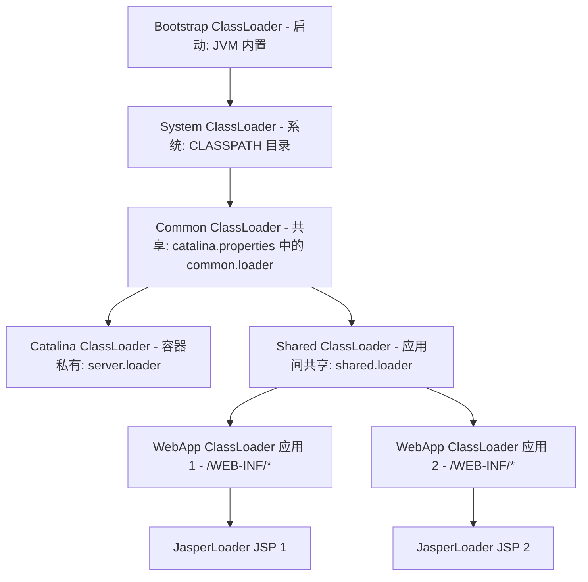

## Tomcat & OSGi 类加载器隔离与打破双亲委派实战

在标准的 JVM 中，双亲委派机制（Parents Delegation Model）确保了平台安全性和类单例的一致性。然而，在 **多应用共享 Web 容器（如 Tomcat）**、**插件化微服务系统（如 OSGi、各中间件的动态热部署插件）** 等深水区工业场景中，树状委派机制直接沦成了“绊脚石”。要解决应用间的类隔离与插件热插拔，必须反其道而行之：**打破双亲委派**。

---

## 一、 Tomcat 容器中的类隔离拓扑设计

Tomcat 作为一个 Web 容器，在单进程中可以并发跑数个 Web 应用程序（War 包）。它必须满足四个严苛的隔离要求：
1. **应用隔离**：WebApp A 与 WebApp B 如果都包含了各自版本的同一个类（如不同版本的 Spring 或是本地基础 `User` 类），两者不仅互不干扰，且应该能在各自作用域内正确加载；
2. **容器与应用隔离**：Tomcat 本自依赖的包（如 `catalina.jar`）不能被 Web 应用程序非法访问，防止 Web 应用恶意破环容器环境；
3. **安全共享**：不同应用如果希望共享某些核心底座包（如 JDK 核心 API、Servlet 规范 API），应当只需加载一次；
4. **JSP 独立热部署**：每个 JSP 文件被修改后，容器应当能做到只重加载该 JSP 页面转换出的 Class 文件，而不需要重启整个应用或 JVM。

### 1. Tomcat 八级类加载器树状拓扑



### 2. 打破双亲委派的攻伐逻辑：`WebAppClassLoader`

#### A. 标准双亲委派的底层逻辑（`ClassLoader.loadClass`）

```java
// JDK ClassLoader 标准实现
protected Class<?> loadClass(String name, boolean resolve) throws ClassNotFoundException {
    synchronized (getClassLoadingLock(name)) {
        // 第一步：检查类是否已经加载
        Class<?> c = findLoadedClass(name);
        if (c == null) {
            try {
                if (parent != null) {
                    c = parent.loadClass(name, false); // 委派给父类
                } else {
                    c = findBootstrapClassOrNull(name); // 委派给启动类加载器
                }
            } catch (ClassNotFoundException e) {
                // 父类加载器无法加载
            }
            if (c == null) {
                c = findClass(name); // 自己尝试加载
            }
        }
        if (resolve) resolveClass(c);
        return c;
    }
}
```

#### B. Tomcat `WebappClassLoaderBase.loadClass` 的打破逆鳞

为了让应用自身的类库（`/WEB-INF/classes` & `/WEB-INF/lib`）优先于公共共享库被加载，Tomcat 彻底颠覆了此逻辑。其底层过滤与加载五步曲如下：

```java
@Override
public Class<?> loadClass(String name, boolean resolve) throws ClassNotFoundException {
    synchronized (getClassLoadingLock(name)) {
        Class<?> clazz = null;

        // 1. 检查 WebApp 本地缓存
        clazz = findLoadedClass0(name);
        if (clazz != null) return clazz;

        // 2. 检查 JVM 系统缓存（ClassLoader 内置）
        clazz = findLoadedClass(name);
        if (clazz != null) return clazz;

        // 3. 【极重要】安全红线过滤：阻止 Web 应用程序覆盖系统安全类 (如 java.*, javax.servlet.*)
        // 这一步虽然打破了委派，但对于 JVM 自带的核心 API、Servlet API，依然强行通过系统类加载器委派
        try {
            clazz = jvmClassLoader.loadClass(name);
            if (clazz != null) return clazz; // 确保 String, Object 等全安全性
        } catch (ClassNotFoundException e) {
            // 忽略，说明是非核心 JDK 类
        }

        // 4. 【攻破核心】：判定是否开启了 delegate 属性（默认为 false）
        boolean delegateLoad = delegate || filter(name, true);
        
        // 4.1 如果开启了 delegate，走标准双亲委派模型
        if (delegateLoad) {
            try {
                clazz = Class.forName(name, false, parent);
                if (clazz != null) return clazz;
            } catch (ClassNotFoundException e) { /* 忽略 */ }
        }

        // 4.2 如果未开启 delegate（默认状态），WebApp 破坏委派：优先从本地 Web 应用程序包（/WEB-INF/*）加载
        try {
            clazz = findClass(name); // 本地加载器的底层实现，去搜 classes/ 和 lib/ 
            if (clazz != null) return clazz;
        } catch (ClassNotFoundException e) { /* 忽略 */ }

        // 4.3 若本地找不到，再委派给父类加载器（Shared ClassLoader -> Common ClassLoader -> System）
        if (!delegateLoad) {
            try {
                clazz = Class.forName(name, false, parent);
                if (clazz != null) return clazz;
            } catch (ClassNotFoundException e) { /* 忽略 */ }
        }

        throw new ClassNotFoundException(name);
    }
}
```

---

## 二、 OSGi (Open Services Gateway initiative) 网状类加载器实现插件化隔离

如果说 Tomcat 只是简单的“子加载器优先于父加载器”的半破坏路线，那么 OSGi（微模块化系统的工业标准）则是将双亲委派机制彻底粉碎，重构成了 **“网状（Mesh）类加载关系型拓扑”**。

### 1. OSGi 模块化核心特征

在 OSGi 中，每个插件被称为一个 **Bundle**。每一个 Bundle 都有其专属的独立类加载器实例。当一个 Bundle 试图装载一个类时，其检索逻辑不再是机械地向上委派，而是通过其描述文件（`MANIFEST.MF`）中的导出（`Export`）与导入（`Import`）进行精准的网状跳转：


### 2. OSGi 网状检索九步算法流

1. **缓存检测**：检查 Bundle 自身本地缓存。
2. **安全及系统基础库委派**：如果是 `java.*` 等核心包，强制委派给父类加载器（JVM 启动类加载器）。
3. **导入拦截 (Import-Package)**：如果该类所在的包包含在当前 Bundle 的 `Import-Package` 声明中，则将该请求**物理打转至对应导出该包的 Bundle 的类加载器**。
4. **依赖整包委托 (Require-Bundle)**：如果当前 Bundle 声明了 `Require-Bundle`（依赖了某个具体的 Bundle），则委派给对应 Bundle 的类加载器。
5. **本地检索 (Bundle-ClassPath)**：去当前 Bundle 内部的 JAR 或 classes 目录寻找并加载。
6. **动态导入拦截 (DynamicImport-Package)**：如果上述都未命中且配置了动态导入，则查找外部导出。
7. **Fragment 模块代答**：委派给与其绑定的 Fragment 模块加载器协作。
8. **父委派机制退避 (Fallback)**：如果上面全部落空且在 `MANIFEST.MF` 中定义了 `org.osgi.framework.bootdelegation` 回退机制，则委派给父加载器。
9. **抛出 ClassNotFoundException**，拒绝服务。

此网状加载极其严密地控制了不同 Bundle 之间的 API 暴露范围，即便多个插件自带不兼容版本的依赖，也能通过隔离机制在同一个 JVM 中安全和谐并存。

---

## 三、 实战：构建具备热插拔能力的插件类加载器

我们将亲手设计一个最小化、具备 **“类隔离、插件热替换（Hot Swap）与主动卸载”** 的自定义类加载器底座。

### 1. 隔离与打破委派的插件加载器设计

由于 `java.lang.ClassLoader` 中 `loadClass` 是一个 `protected` 方法，要想彻底打破委派，我们必须在自定义的 `PluginClassLoader` 中重写 `loadClass`，跳过调用 `super.loadClass`（或在此之前抢先加载本地资源）。

```java
import java.io.ByteArrayOutputStream;
import java.io.File;
import java.io.FileInputStream;
import java.io.IOException;

public class PluginClassLoader extends ClassLoader {
    private final File pluginDir;

    public PluginClassLoader(File pluginDir, ClassLoader parent) {
        super(parent);
        this.pluginDir = pluginDir;
    }

    @Override
    public Class<?> loadClass(String name, boolean resolve) throws ClassNotFoundException {
        synchronized (getClassLoadingLock(name)) {
            // 1. 如果是 JVM 核心基础类库，依然必须委派给引导类加载器加载，防止破坏安全红线
            if (name.startsWith("java.") || name.startsWith("javax.")) {
                return super.loadClass(name, resolve);
            }

            // 2. 检查本地类已被加载的内存缓存
            Class<?> clazz = findLoadedClass(name);
            if (clazz != null) {
                return clazz;
            }

            // 3. 打破双亲委派：先尝试在本地插件目录（如 plugin/v1/ ）中物理装载该类！
            try {
                clazz = findClass(name);
                if (clazz != null) {
                    if (resolve) resolveClass(clazz);
                    return clazz;
                }
            } catch (ClassNotFoundException e) {
                // 本地没有，只得向下落入 fallback 委托给系统默认加载器
            }

            // 4. Fallback：交给父加载器
            return super.loadClass(name, resolve);
        }
    }

    @Override
    protected Class<?> findClass(String name) throws ClassNotFoundException {
        // 将包名转化为文件物理路径
        String path = name.replace('.', File.separatorChar) + ".class";
        File classFile = new File(pluginDir, path);
        if (!classFile.exists()) {
            throw new ClassNotFoundException(name);
        }

        try (FileInputStream fis = new FileInputStream(classFile);
             ByteArrayOutputStream baos = new ByteArrayOutputStream()) {
            byte[] buffer = new byte[4096];
            int length;
            while ((length = fis.read(buffer)) != -1) {
                baos.write(buffer, 0, length);
            }
            byte[] bytes = baos.toByteArray();
            return defineClass(name, bytes, 0, bytes.length); // 转化为 JVM 堆底 Class 对象
        } catch (IOException e) {
            throw new ClassNotFoundException("加载插件类字节失败: " + name, e);
        }
    }
}
```

---

### 2. 类回收与热插拔卸载的核心奥义

在 Java 虚拟机规范中，要想将已加载的类彻底从物理方法区卸载并回收其内存（以便加载新版本），必须满足以下三个极其严苛的要求：
1. **没有任何该类产生的实例（Instance）在堆中存活**；
2. **没有任何引用该类的 `java.lang.Class` 实例的地方**；
3. **加载该类的 `PluginClassLoader` 实例在堆中没有被任何强引用标志持有**（这意味着整个类加载器已经属于无引用垃圾状态，将被整体一次性判定清理）。

#### ⚠️ 致命漏洞警告

即使你将 `PluginClassLoader` 抛弃置为 `null`，如果插件中启动了某个守护线程（Thread）、在全局对象（如 Spring 上下文或全局 `List`）中注册了监听器（Listener），或者 `ThreadLocal` 依然挂有其对象，那么 **该类加载器就永远无法被 JVM 回收，进而由于多次加载插件累积导致方法区/元空间（Metaspace）撑爆，触发线上 Full GC 甚至 OOM: Metaspace**。

#### 插件热更容器装卸驱动实现

```java
public class PluginManager {
    private File pluginDir;
    private PluginClassLoader currentLoader;
    private Object currentPluginInstance;

    public PluginManager(File pluginDir) {
        this.pluginDir = pluginDir;
    }

    /**
     * 加载/热重载核心逻辑
     */
    public synchronized void reload(String mainClassName) throws Exception {
        // 1. 物理卸载前置动作：通知旧插件停用并切断强引用（若存在）
        if (currentPluginInstance != null) {
            System.out.println("【插件更替】 销毁旧插件：释放持有的所有网络句柄及线程池资源...");
            if (currentPluginInstance instanceof AutoCloseable) {
                ((AutoCloseable) currentPluginInstance).close(); // 主动作废
            }
            currentPluginInstance = null; // 切断堆引用
        }

        // 2. 强力丢弃旧加载器：只要让其引用归零，GC 就能在此彻底清扫旧类的元空间
        currentLoader = null;
        System.gc(); // 指示触发 Full GC 辅助清理方法区（生产环境中避免过于高频手动触发）

        // 3. 构建新的 ClassLoader 实例，读取可能发生变化的新 Class 物理文件
        currentLoader = new PluginClassLoader(pluginDir, PluginManager.class.getClassLoader());

        // 4. 重加载并生成新版实例
        Class<?> clazz = currentLoader.loadClass(mainClassName);
        currentPluginInstance = clazz.getDeclaredConstructor().newInstance();
        System.out.println("【插件更替】 加载成功！全新插件实例已上线，加载器实例为：" + currentLoader);
    }
}
```

通过这套逻辑，我们便能避开 JVM 的默认限制，在不停机的情况下完美保障每个插件具有清澈隔离的运行空间，并在重载更新时杜绝任何隐性内存泄漏，保障系统底座长时间极速、健壮的运行。
