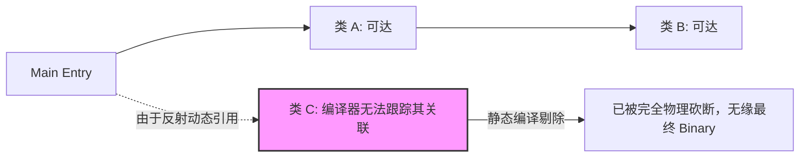
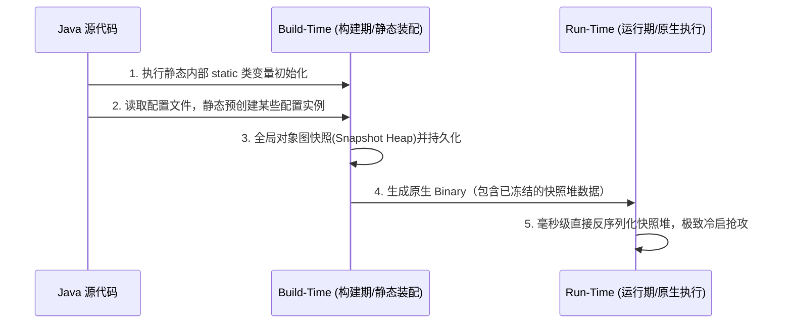

## JVM 演进：GraalVM AOT（提前编译）与云原生静态编译

在云原生（Cloud Native）与无服务器架构（Serverless）风起云涌的今天，Java 饱受诟病的“重、慢、缓”缺点被无限放大：
1. **冷启动极慢**：需要经过加载、验证、解释执行等重重步骤方可接单发力；
2. **内存开销高昂**：即便是一个精简的 Web 服务，空载也需要数百兆内存；
3. **“热身”周期长**：依赖 JIT（即时编译器）动态收集热点代码并在运行中编译为底层本自机器码。

为了彻底击碎这一桎梏，**GraalVM AOT（Ahead-of-Time，提前编译）静态编译技术**应运而生。它直接拔除了 JVM 运行期解释器与即时编译底座，将 Java 代码在**编译期**一步到位彻底淬炼为与底层 OS/CPU 强对齐的“单体原生可执行二进制文件”（Native Image）。

---

## 一、 JIT 与 AOT 架构视角的降维打击

```mermaid
graph TD
    subgraph 传统 JIT (Just-In-Time) 模式
        CodeJIT[Java 源代码] --> Jar[编译为字节码 .class / .jar]
        Jar --> JVM[启动守护 JVM]
        JVM --> Interpreter[解释执行]
        Interpreter --> Profiling[收集热动能元数据]
        Profiling --> JITC[C1 / C2 编译器]
        JITC --> NativeJIT[转化为本地 OS 机器码 - 边运行边编译]
    end

    subgraph 现代 AOT (Ahead-Of-Time) 模式
        CodeAOT[Java 源代码] --> ByteCode[编译为字节码]
        ByteCode --> GraalVM[GraalVM 静态分析器]
        GraalVM -->|物理淬炼 & 裁剪无用类| NativeImage[OS 裸二进制可执行文件]
        NativeImage --> OS[直接在 OS 极速拉起 - 运行无需 JVM/元空间]
    end
```

### JIT 与 AOT 深度多维对比

| 考核指标 | 传统 JIT 模式 | 现代 GraalVM AOT 静态编译模式 |
| :--- | :--- | :--- |
| **启动时延 (Startup)** | 缓慢（数秒至数十秒，伴随着大量类加载与初始化） | **毫秒级极速拉起 (10ms-50ms 即可开单就绪)** |
| **内存空载消耗 (RSS)** | 高昂（通常需要 150MB+ 用于运行时元空间与 JIT 数据） | **极低 (仅需 15MB-30MB 左右)** |
| **编译期时间 (Build)** | 极快（由于仅编译成中间状态字节码） | 极慢（需要全路径静态可达性分析，耗费高 CPU 与内存） |
| **巅峰吞吐量 (Peak)** | 理论上最高（JIT 能在运行时动态通过 PGO 执行偏置优化） | 理论上略逊于 JIT（可通过集成 PGO 机制达到持平） |
| **运行依赖容器** | 必须安装配套 JRE/JDK 虚拟环境 | **零依赖，纯 OS 本地二进制，完美适配极致轻量 Docker** |

---

## 二、 GraalVM 静态分析的“封闭性假设”

GraalVM Native Image 能够将体积裁剪至最小并极速冷启的核心基石是：**封闭性假设（Closed-World Assumption）**。

### 1. 封闭性假设的核心定义

在 Native Image 的编译期（Build-time），编译器必须能够**静态地观测、跟踪并推导到程序在运行期（Run-time）可能执行的所有代码路径**。
只要在整个静态调用图（Call Graph）中完全不可达的类、方法和字段，都会被当成“垃圾”从最终的二进制中剔除。



### 2. 反射、动态代理与 SPI 的“毁灭性死结”

由于封闭性假设的存在，以下 Java 最引以为傲的“动态特性”，在 AOT 静态编译时默认会全部失效：
* **反射 (Reflection)**：通过 `Class.forName("xxx").newInstance()` 动态装载的类，编译器根本不知道该在包里存留哪个。
* **动态代理 (Dynamic Proxy)**：如 JDK 动态代理在运行期凭空动态生成的代理类。
* **JNI 外部链接**：运行期动态打入 C/C++ 物理库的操作。
* **资源文件读取**：`class.getResourceAsStream()` 如果没有在编译期声明，底层文件文件将绝无可能保留。

#### 💡 绝妙救赎办法

由于反射等功能已融入 Java 各大框架灵魂中，GraalVM 提供了一套 **元数据配置（JSON 配置）** 机制。编译时将不可达、但运行期要动态装载的要素手动写入配置文件中，强行通知 AOT 分析器在编译期为这些动态要素“网开一面”：

```json
// reflect-config.json 示意
[
  {
    "name": "com.example.entity.User",
    "allDeclaredConstructors": true,
    "allDeclaredFields": true,
    "allDeclaredMethods": true
  }
]
```

同样，在 Spring Boot 3+ 已经全面并入了 **Spring Native** 支持，其通过内质的 **AOT 引擎（编译期后置处理器）** 自动扫描 `@Configuration`、`@Autowired` 等，将其翻译为确定性的、AOT 友好的 Java 源代码，免去了开发者手动配制上万行 JSON 文件的痛苦。

---

## 三、 AOT 运行机制差异：初始化时空分裂

在传统 JVM 运行期中，一切都在发生。然而在 AOT 构建中，整个时空被截然分为了：**构建期（Build-Time）** 与 **运行期（Run-Time）**。



### 1. 静态初始化器（`static {}`）的时空中断

默认情况下，GraalVM 在**构建期**就会执行绝大部分类的静态初始化动作。
* **构建期初始化的好处**：计算被提前做完、类信息被固化，生成“初始堆垃圾快照（Snapshot Heap）”，运行期拉起时直接读取该快照，不需要再次占用 CPU 重建。
* **构建期初始化的致命杀手**：
  * 如果在静态块中预先创建了 Socket 线程连接物理数据库，或者获取了当前环境的 IP（如 `static String IP = getLocalIP()`），那么**这个在编译期生成的 IP 物理字符串，将伴随 Binary 文件像化石一样永远冻结在里面**！运行期在别的主机拉起时，读取的永远还是编译主机的旧快照信息！

### 2. 精控初始化时空指令

通过 GraalVM 参数或 Spring 原生配置，强行指定具体类的初始化时节点：
* **`--initialize-at-build-time=<class-names>`**：指定此部分类及其静态属性在构建时就计算固化（默认核心基础类）。
* **`--initialize-at-run-time=<class-names>`**：强行命令该部分的静态初始化代码必须延迟到运行期拉开序幕之时，重新动态初始化（如可能带有环境变量、涉及主机 IP、硬物理连接的类）。

---

## 四、 云原生 AOT 实战：Spring Boot 可执行原生二进制构建

我们将从零构建一个基于 **Spring Boot 3.x（内置 Spring Native AOT 引擎）** 的静态编译原生可执行文件。

### 1. Maven AOT 构建核心插件包配置

在项目的 `pom.xml` 中引入 GraalVM 编译官方套件底座：

```xml
<project>
    <!-- 引入 Spring Boot 3.x Starter 父依赖 -->
    <parent>
        <groupId>org.springframework.boot</groupId>
        <artifactId>spring-boot-starter-parent</artifactId>
        <version>3.2.0</version>
        <relativePath/> 
    </parent>

    <dependencies>
        <dependency>
            <groupId>org.springframework.boot</groupId>
            <artifactId>spring-boot-starter-web</artifactId>
        </dependency>
    </dependencies>

    <build>
        <plugins>
            <!-- 骨干编排：GraalVM 官方原生编译插件 -->
            <plugin>
                <groupId>org.graalvm.buildtools</groupId>
                <artifactId>native-maven-plugin</artifactId>
                <configuration>
                    <!-- 原生可执行文件名称 -->
                    <imageName>cloud-native-app</imageName>
                    <buildArgs>
                        <!-- 传递给 AOT 编译器的精控参数 -->
                        <buildArg>--no-fallback</buildArg> <!-- 严禁回退：若 AOT 失败，不降级为传统 JRE 运行，报编译错误 -->
                        <buildArg>--verbose</buildArg>
                    </buildArgs>
                </configuration>
                <executions>
                    <execution>
                        <id>build-native</id>
                        <goals>
                            <goal>compile-no-fork</goal>
                        </goals>
                        <phase>package</phase>
                    </execution>
                </executions>
            </plugin>
        </plugins>
    </build>
</project>
```

---

### 2. 避免 Java 动态加载陷阱：手工元数据注册实战

如果我们在代码中使用了自定义的动态第三方序列化库（或动态解析了某特殊类），AOT 静态分析会忽略它。此时我们需要在 `src/main/resources/META-INF/native-image/` 中建立元数据配置文件（或使用 Spring Boot 自带的 `@RegisterReflectionForBinding` 回调注解）：

```java
package com.example.demo;

import org.springframework.aot.hint.RuntimeHints;
import org.springframework.aot.hint.RuntimeHintsRegistrar;
import org.springframework.context.annotation.ImportRuntimeHints;
import org.springframework.web.bind.annotation.GetMapping;
import org.springframework.web.bind.annotation.RestController;

/**
 * 声明式 AOT 反射拦截见证器
 */
class PluginAotHints implements RuntimeHintsRegistrar {
    @Override
    public void registerHints(RuntimeHints hints, ClassLoader classLoader) {
        // 精准指派：在静态编译 AOT 生成器工作时，强行保留对该类的反射能力及全修属性
        hints.reflection().registerType(DynamicPayload.class, memberCategory -> {
            memberCategory.getDeclaredConstructors();
            memberCategory.getDeclaredMethods();
        });
    }
}

class DynamicPayload {
    private String traceId;
    public String getTraceId() { return traceId; }
}

@RestController
@ImportRuntimeHints(PluginAotHints.class) // 并网注册
public class CloudController {

    @GetMapping("/api/run")
    public String runAot() throws Exception {
        // 该类未在任何地方显式强引用调用，纯靠反射加载
        Class<?> clazz = Class.forName("com.example.demo.DynamicPayload");
        Object instance = clazz.getConstructor().newInstance();
        return "【云原生 AOT】 反射成功实例化: " + instance.getClass().getSimpleName();
    }
}
```

---

### 3. AOT 原生构建与验证

确保本地操作系统中已安装并配置好 GraalVM 对应 JDK（及 C++ 面向主机的编译器，如 Windows 上的 MSVC 或是 Linux 上的 GCC），随后执行标准 Maven 命令：

```bash
# 执行 Spring Boot Maven 静态原生打包
mvn -Pnative package
```

编译通过后，在目标 `target/` 目录下即可生成不依赖任何 JVM、在 OS 上直接能够双击运行的裸二进制执行包 `cloud-native-app`。其启动和空载内存将展现出颠覆常理级别的极速与纯净：
* **启动耗时**：`Started CloudController in 0.042 seconds (JVM running for 0.048)` ➜ 仅需 **40毫秒**！
* **物理内存空载消耗**：通过 `top` 或任务管理器查看，RSS 驻留内存仅为 **22 MB**！

这正是云原生技术进阶到极高境界的杀手锏。理解、掌握 GraalVM 这一时空边界极度割裂的 AOT 静态编译器，将是现代高级 Java 微服务架构师走向云原生微服务之巅的必修基石。
