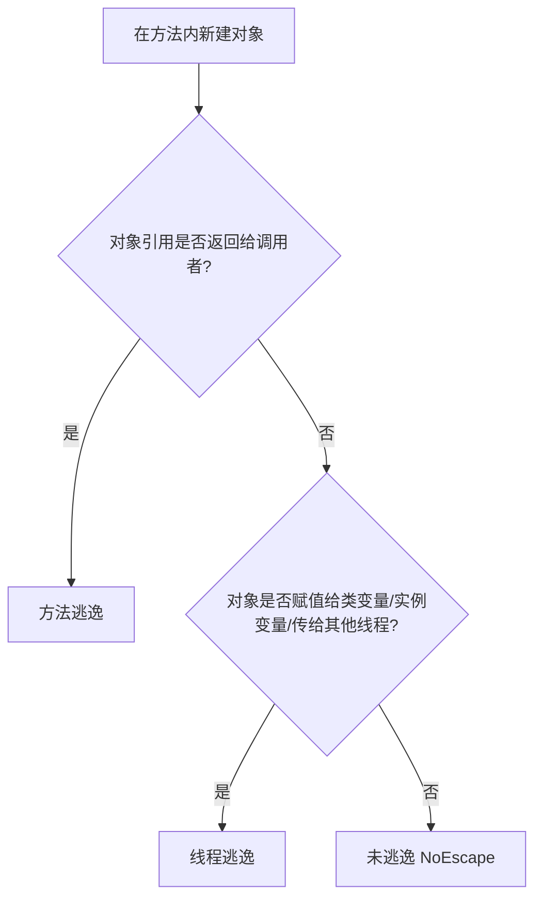

# JVM 逃逸分析技术与 JIT 底层优化

在 Java 程序的运行过程中，大部分对象都是在堆（Heap）上分配的，这也意味着它们需要通过垃圾收集器（GC）进行回收。然而，频繁的堆内存分配与垃圾回收是导致 Java 程序运行吞吐量下降、产生停顿（Stop-the-World）的重要原因。

为了进一步优化高频、瞬态对象的分配，JVM 引入了 **逃逸分析（Escape Analysis）** 这一高级编译器优化技术。通过分析对象的生存期是否局限于某个特定范围，JIT 编译器可以在运行时实施一系列高能的底层优化。

---

## 一、 什么是逃逸分析？

逃逸分析是 Java 即时编译器（JIT）在 **编译期** 进行的一种数据流分析。它的核心目的在于：**分析一个新创建的对象，其引用是否会逃逸到当前方法或当前线程之外。**

### 1. 逃逸的两个维度

根据对象引用的波及范围，逃逸通常可以分为以下两种类型：

* **方法逃逸（Method Escape）**：一个对象在方法内部被创建后，其引用被返回给调用者，或者被赋值给其他方法可访问的外部变量。这意味着该对象可能在方法外部被读取或修改。
* **线程逃逸（Thread Escape）**：一个对象被赋值给可以被其他线程访问的实例变量或类变量（例如静态变量），或者直接作为参数传递给其他线程的执行任务。这使得其他线程可以并发地读写该对象。



### 2. 逃逸状态的三个级别

HotSpot 虚拟机的 C2 即时编译器（或 Graal 编译器）会将对象的逃逸状态标记为以下三个级别：

1. **`GlobalEscape`（全局逃逸）**：对象逃逸出了当前方法和当前线程。例如：作为方法返回值返回、赋值给全局静态变量、或者赋值给已经逃逸的对象的字段。
2. **`ArgEscape`（参数逃逸）**：对象没有逃逸到堆中，但作为参数传递给了其他方法，在方法调用期间是可达的，但在方法返回后不会继续存活。
3. **`NoEscape`（无逃逸）**：对象完全局限在当前方法内部，没有任何引用能够指向它，外部方法和线程都无法感知其存在。

---

## 二、 逃逸分析触发的三大核心优化

当 JIT 编译器通过逃逸分析判定一个对象的逃逸状态为 `NoEscape`（或者在某些情况下为 `ArgEscape`）时，它会实施以下三项关键的运行时优化。

### 1. 栈上分配（Stack Allocation）的真相

在许多技术文章中，都会提到“如果对象未逃逸，JVM 会直接在栈（Stack）上分配对象，随着方法调用结束栈帧销毁，对象立即消亡，无需 GC”。

> [!WARNING]
> **这实际上是一个流传极广的误区！**
> 
> 在目前的 HotSpot 虚拟机实现中，**并没有真正实现物理意义上的对象栈上分配。**
> 原因是 Java 对象的物理内存排布非常依赖堆的连续空间管理，且对象的标头（Object Header）等信息使得直接在栈帧上分配一个完整对象会极大地增加 JVM 栈帧管理的复杂性（影响栈的内存对齐和寻址）。
> 
> JVM 实际上是通过 **“标量替换（Scalar Replacement）”** 这一技术，达到了与栈上分配完全相同的效果。

---

### 2. 标量替换（Scalar Replacement）

这是 HotSpot 实现“栈上分配”的真实底座。

* **标量（Scalar）**：指无法再被进一步分解的最小数据单元。在 Java 中，所有的原始数据类型（如 `int`, `long`, `double`, `boolean` 等）以及引用类型的地址（Reference）本身都是标量。
* **聚合量（Aggregate）**：指可以被进一步分解的数据单元。Java 中的对象就是典型的聚合量，因为它可以包含多个成员变量。

**优化原理**：
如果一个对象被判定为 `NoEscape`，JIT 编译器在编译该方法时，会拆解这个对象，将其成员变量“降级”为一个个独立的局部变量（即标量）。
这些标量直接在当前方法栈帧的**局部变量表**中分配，而不需要在堆中创建真正的对象。

#### 💡 代码演变示例

假设我们有如下代码：

```java
public class EscapeDemo {
    static class Point {
        int x;
        int y;
        public Point(int x, int y) {
            this.x = x;
            this.y = y;
        }
    }

    public int calculate() {
        Point point = new Point(1, 2); // point 对象未逃逸出此方法
        return point.x + point.y;
    }
}
```

在 JIT 编译 `calculate` 方法时，经过逃逸分析判定 `point` 为 `NoEscape`，JIT 编译器会对其进行**标量替换**，消除 `Point` 对象的创建：

```java
// 经过标量替换优化后的等价逻辑
public int calculate() {
    int x = 1; // 拆解出的标量，直接分配在栈的局部变量表
    int y = 2; // 拆解出的标量，直接分配在栈的局部变量表
    return x + y;
}
```

通过这种转化，堆中不再产生 `Point` 对象，也免去了任何垃圾回收的开销，极大地榨干了 CPU 寄存器和栈的读写性能。

---

### 3. 锁消除（Lock Elimination）

并发编程中，为了保证多线程安全，我们经常会使用同步锁。但有时候，同步锁可能被加在了完全不可能发生线程竞争的局部变量上。

**优化原理**：
如果一个锁对象经过逃逸分析，被判定为 `NoEscape`（即该对象只可能被创建它的当前线程访问，不可能逃逸到其他线程），那么在该对象上的所有同步加锁、解锁操作都是完全多余的。JIT 编译器在编译该段代码时，会直接**把所有的同步锁代码（`monitorenter` / `monitorexit`）剔除掉。**

#### 💡 典型案例：`StringBuffer` 锁消除

```java
public String concat(String s1, String s2) {
    // StringBuffer 是线程安全的，内部方法被 synchronized 修饰
    StringBuffer sb = new StringBuffer(); 
    sb.append(s1);
    sb.append(s2);
    return sb.toString();
}
```

在上面的方法中：
1. `sb` 实例是一个局部变量，其生命周期完全局限在 `concat` 方法内部。
2. 没有任何引用泄露到外部，因此其他线程绝不可能并发访问 `sb`。
3. `StringBuffer.append` 内部的 `synchronized` 锁在运行时是无意义的抢占。

JIT 编译器检测到该状态后，会将 `append` 方法中的同步块消除，编译成纯粹的无锁方法，从而省去了线程获取和释放偏向锁/轻量级锁的硬件级开销。

---

## 三、 逃逸分析的局限性与无法优化的场景

虽然逃逸分析非常强大，但它不是万能的，在以下几种场景下，逃逸分析将**失效或无法触发优化**：

1. **大对象限制**：如果局部对象占用的内存空间太大，超出了一定阈值，即使未逃逸，JVM 也不会实施标量替换，而是依然将其置于堆中分配，防止栈空间发生溢出（`StackOverflowError`）。
2. **方法内部分支过于复杂**：如果方法内部存在过多的控制流分支，或者包含极其庞大的循环，编译器在进行逃逸数据流计算时可能会因为超出计算深度阈值而放弃分析。
3. **逃逸分析本身的开销**：逃逸分析需要在运行时进行耗时的数据流分析。如果经过分析发现几乎没有对象可以被优化，那么逃逸分析本身就成为了一种性能负担。因此，JIT 只有在方法被判定为“热点方法”并触发 OSR（On-Stack Replacement）或标准 C2 编译时，才会对其进行逃逸分析。

---

## 四、 逃逸分析的相关 JVM 参数与实战诊断

在生产环境中，通常逃逸分析是默认开启的。我们可以通过调整 JVM 配置参数来开启、关闭或诊断这项技术。

### 1. 核心 JVM 控制参数

| 参数项 | 默认值 | 作用描述 |
| :--- | :--- | :--- |
| `-XX:+DoEscapeAnalysis` | `true` | 启用逃逸分析（`-XX:-DoEscapeAnalysis` 表示关闭） |
| `-XX:+EliminateAllocations` | `true` | 开启标量替换优化（依赖逃逸分析） |
| `-XX:+EliminateLocks` | `true` | 开启锁消除优化（依赖逃逸分析） |
| `-XX:+PrintEscapeAnalysis` | `false` | 打印逃逸分析的分析结果（非 product 版本或诊断版本可用） |

### 2. 性能对比验证实验

你可以编写一个简单的基准测试，在循环中创建大量的未逃逸局部对象。通过配置不同的参数运行：

```bash
# 场景 A：关闭逃逸分析（堆内存占用飙升，GC 频繁）
java -XX:-DoEscapeAnalysis -Xms256m -Xmx256m -XX:+PrintGCDetails EscapeTest

# 场景 B：开启逃逸分析（几乎不产生 GC，吞吐量提升数倍）
java -XX:+DoEscapeAnalysis -Xms256m -Xmx256m -XX:+PrintGCDetails EscapeTest
```

通过观察 GC 日志，可以明显发现，关闭逃逸分析时系统会频繁触发 Young GC，而开启逃逸分析后，由于标量替换在栈帧上分配变量，堆中无任何新对象产生，内存平稳如镜，性能提升极其显著。
