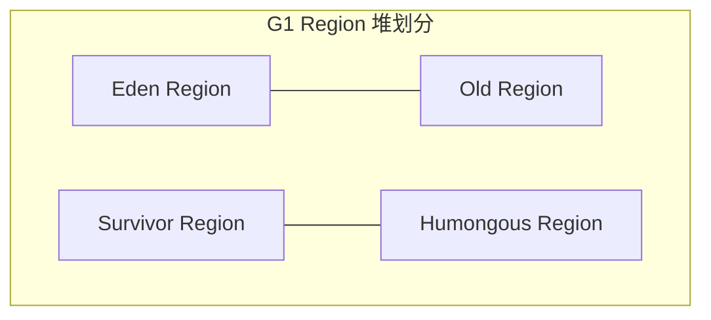

# JVM 虚拟机核心面试真题

本专栏致力于为中高级 Java 开发人员提供最硬核、直击底层原理、结合生产实战的 JVM 虚拟机面试真题剖析。每个知识点都配有详尽的答案、核心源码流程、以及辅助理解的 3D 内存划分或故障排查工作流。

---

## 📂 模块三：JVM 虚拟机深度原理

### Q1：全面剖析 CMS, G1 以及 ZGC 三代垃圾回收器的并发标记细节、优缺点及适用场景？

JVM 垃圾回收演进的关键在于**降低 Stop-The-World (STW)** 时间，各代回收器的实现与设计哲学如下：

#### 1. CMS (Concurrent Mark Sweep) - 基于标记-清除算法的并发老年代回收器

- **核心标记流程**：
  1. 初始标记（STW）：只标记 GC Roots 能直接关联到的对象。
  2. 并发标记：自 Roots 起深度搜索对象链。与用户线程并发运行，占用 CPU 开销。
  3. 重新标记（STW）：修正并发标记期间因用户程序运行产生改动的标记（采用**增量更新 Incremental Update** 方案，当新引用关系添加时，会被拦截并记录，重新标记时对这些节点单独重扫）。
  4. 并发清除：在线清除垃圾碎屑，不修改活对象指针。

- **致命痛点**：
  - **内存碎屑（Fragmentation）**：由于采用“标记-清除”算法，产生了空间碎片。极端情况下分配大对象失败，会降级为 Serial Old 串行单线程强行整理（STW 十几秒，极其危险）。
  - **浮动垃圾（Floating Garbage）**：并发清除的时候，用户线程又产生的新垃圾由于错过了当前回收周期，只能等待下一次回收（需要调大 `-XX:CMSInitiatingOccupancyFraction` 确保留有空间供并发分配）。

#### 2. G1 (Garbage-First) - 物理化整为零的 Region 化垃圾回收器

- **物理概念与分配模型**：

  不再物理区分“新生代”与“老年代”。将整个堆内存划分为多达 $2048$ 个大小均匀的 **Region**。每个 Region 会动态被标记为 Eden、Survivor、或 Old 空间。还有单独的 Humongous 连续区用于存放超常规大对象。



- **解决并发漏标手段：SATB（Snapshot-At-The-Beginning，原始快照）**：

  当一个活对象被用户线程从其原引用链路“斩断”时，利用 **写屏障（Write Barrier）**，在解除老引用的瞬间，把被删除的原引用对象记录保存在一个单独的 SATB 隔离队列中。并发标记仍以此记录为准将其视为存活进行回收期审查，这虽然多出了一些“浮动垃圾”，但是彻底消除了漏标，效率极高。

- **最大特性**：

  **可预测的停顿（Pause Prediction Model）**。G1 会衡量每个 Region 的回收价值与空间比率，在用户指定的 `-XX:MaxGCPauseMillis` 约束下，优先收集回收收益最大的 Region。

#### 3. ZGC (Z Garbage Collector) - 亚毫秒停顿、染色指针的终极回收器

- **核心颠覆性设计：染色指针（Colored Pointers） & 读屏障（Read Barrier）**：

  以往的回收器通常将垃圾回收状态标在“对象头”中。而 ZGC 创新地开发了**染色指针技术**，直接将回收状态位压缩存写在 **$64$ 位虚拟地址（指针）的高 $4$ 个 Bit 位上**（包含 Marked0, Marked1, Remapped 等）。

- **指针自愈（Self-Healing）**：

  由于标记状态、地址信息写在指针上，在线程通过**读屏障（Read Barrier）**访问堆中任意一个对象时，如果发现该对象的 Colored Pointers 处于非 Remapped 状态（即该对象在 GC 并发整理中已经被拷贝移动了，但是引用还是老的），读屏障会拦截该操作，通过转发表（Forward Table）查找到其新主页位置，不仅自动返回最新对象地址，更会**顺手修改原本的老引用变量**使其一瞬间指向最新地址。由于这一自愈特性，ZGC 的并发移动 与 重新分配阶段完全不影响多线程的高速读写。

- **停顿指标**：

  无论堆内存是几百兆还是几百吉字节，ZGC 的 STW 停顿时间均能控制在 1 毫秒以下（JDK 16 起更是保持在微秒级别），真正做到了并发调优的极致。

---

### Q2：线上高并发应用遭遇 CPU 100% 飙高，或内存泄露（OOM），请详述从工具到指令的极致救火排查流程？

这是经典的生产环境故障排查面试题。这里提供绝对企业级的标准化线上应急处理手册：

#### 故障一：线上 JVM CPU 负载过高（100% 级负载）突发性灾难应急

一个 Java 进程导致 CPU 飙高，必然是某些线程在不断自旋死循环、或频繁触发 FGC 导致大量垃圾回收线程在运行抢占。

```mermaid
graph TD
    Start[CPU 100% 线上报警] --> Top[1. 执行 top -c 获取最高 CPU 进程 PID]
    Top --> FindThread[2. 执行 top -Hp PID 定位高负载线程 TID]
    FindThread --> Hex[3. 执行 printf '%x\n' TID 转换为 16 进制 hex]
    Hex --> Stack[4. 导出堆栈: jstack PID > stack.txt]
    Stack --> Locate[5. grep 检索 hex 寻找核心代码 logic 所在行]
    Locate --> Resolve[6. 根据具体堆栈(如 HashMap 死循环或密集 JNI 调用)解决代码隐患]
```

1. **第一步：锁定高能进程**：

   在 Linux 终端执行 `top` 或者是 `top -c` 指令。迅速捕获消耗 CPU 最高排在最前列的 Java 进程，记下其进程 ID： $PID$。

2. **第二步：定位最耗资源的子线程**：

   针对目标 Java 进程 $PID$，执行：

   ```bash
   top -Hp PID
   ```

   该指令会列出该 $PID$ 进程内所有处于运行中的线程，并按 CPU 占用排序率。记下最顶端的那几个耗时巨大的线程 ID（此时为操作系统原生十进制、如 $2048$）：$TID$。

3. **第三步：基数转换（十进制 $\rightarrow$ 十六进制）**：

   因为 JVM 的 `jstack` 中打印的线程十六进制标记 `nid`（Native Thread ID）使用的是 $16$ 进制数，我们必须将刚才记下的线程 ID $TID$ 转化为 $16$ 进制形式（如 $2048 \rightarrow 800$）：

   ```bash
   printf "%x\n" TID
   ```

   输出的值如果是 `800`，请在后续排查中注意搜索 `0x800`。

4. **第四步：抓取堆栈分析**：

   执行 `jstack` 输出进程的快照堆栈：

   ```bash
   jstack PID > jstack_output.txt
   ```

   接着使用 `grep` 或在编辑器中检索十六进制的线程 ID `0x800`：

   ```bash
   grep -A 30 "0x800" jstack_output.txt
   ```

   此时，可以直接清空尘埃，打印出那段导致死循环、死锁或疯狂 GC 的具体 Java 代码行数（如 `MyBusinessService.java#L86`），问题瞬间迎刃而解！

---

#### 📂 故障二：线上突发 `java.lang.OutOfMemoryError: Java heap space` 内存泄漏崩溃

内存溢出直接导致系统崩溃，排查流程核心在于**拿到 Heap Dump 内存镜像**，定位是谁在吞噬老年代：

1. **第一步：未雨绸缪（核心 JVM 启动安全参数）**：

   对于所有生产环境部署的 Java 应用，**必须**在 JVM 参数中配置如下两项：

   ```bash
   -XX:+HeapDumpOnOutOfMemoryError -XX:HeapDumpPath=/data/logs/heapdump.hprof
   ```

   这能在 JVM 抛出 OOM 崩溃关机的临界瞬间，自动将内存快照写盘 dump 到指定路径。

2. **第二步：手动触发内存快照（备用手段）**：

   若应用尚未崩溃但内存利用持续走高、怀疑有存量泄漏，可在负载低谷执行：

   ```bash
   jmap -dump:format=b,file=/data/logs/manual_heap.hprof PID
   ```

   *(重要提醒：jmap -dump 操作会强制 Stop-the-world 暂停当前进程进行内存扫描，线上超大堆应用如 32GB 以上严禁在高峰期执行，会导致数秒到数十秒的彻底卡死！)*。

3. **第三步：极客工具剖析：MAT (Memory Analyzer Tool) 或 JProfiler**：

   将 `heapdump.hprof` 下载到本地电脑上，并用 MAT 打开分析：

   - 查看 **Leak Suspects** 内存嫌疑报告：MAT 会自动分析引用链并显示最有可能发生泄漏的怀疑大集团（大对象或某类实例集占了 $80\%+$ 的内存）。

   - 查看 **Dominator Tree**（支配树）：该树按照保留大小（Retained Heap）对节点排序。
     - **Shallow Heap**：该对象本身占的大小。
     - **Retained Heap**：该对象以及除它之外无其他引用链访问的其属下对象生命树占的总大小（表明如果回收当前对象，能释放的最大内存总量）。

   - 通过支配树溯源，顺着最粗的引用链，通过 **Path To GC Roots** 递归追查。如果发现某个本地静态 Cache 或是没被框架管理的 ThreadLocal 在无限制追加元素，则判定为代码漏洞：
     - 如果是 Redis/数据库等无分页查询导致的大批量拉全表，限制流即可。
     - 如果是没开 `remove` 的 ThreadLocal，增加清理操作。
