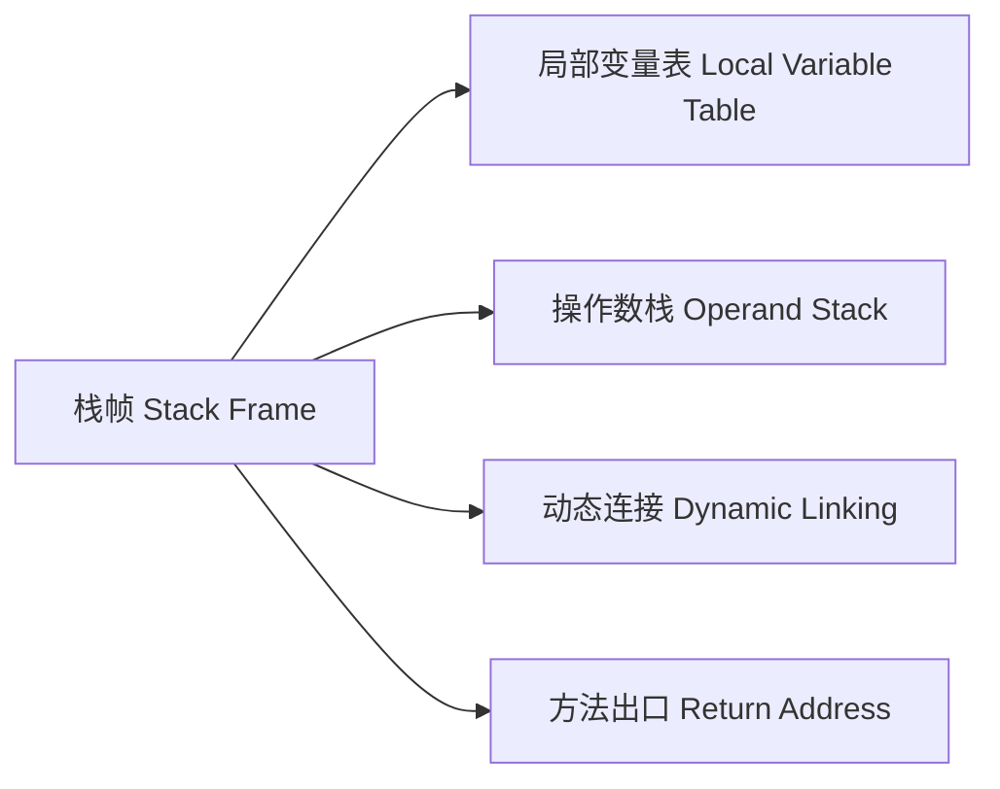
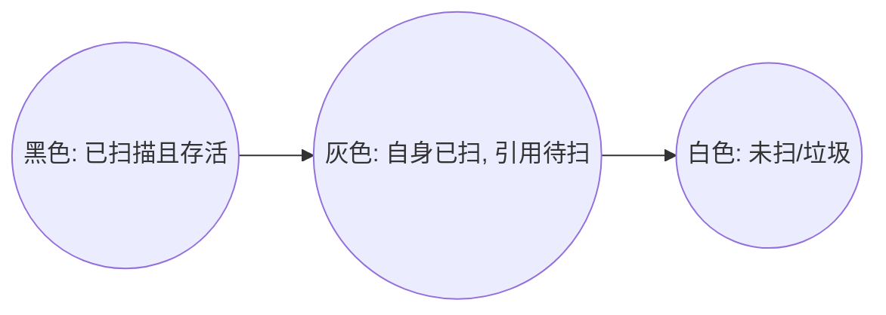

# JVM 内存模型与垃圾回收机制

JVM（Java Virtual Machine）是 Java 程序的运行基石。深入理解 JVM 的运行时数据区划分、虚拟机栈的栈帧交互、堆中对象的内存布局与晋升机制、以及现代垃圾收集器的底层原理，是迈向高级与资深 Java 开发的必经之路。

---

## 一、 JVM 运行时数据区深度剖析

根据 JVM 规范，JVM 在运行 Java 程序时会将其管理的内存划分为若干个不同的运行时数据区域（Runtime Data Area）：

```mermaid
graph TD
    subgraph 线程私有 (Private)
        A[程序计数器 Program Counter]
        B[虚拟机栈 JVM Stack]
        C[本地方法栈 Native Method Stack]
    end
    subgraph 线程共享 (Shared)
        D[堆 Heap]
        E[方法区 Method Area / 元空间 Metaspace]
    end
```

### 1. 程序计数器（Program Counter Register）

程序计数器是一块较小的内存空间，它可以看作是当前线程所执行的字节码的**行号指示器**。

* **核心作用**：在多线程环境下，CPU 通过时间片轮转进行线程切换。当线程被唤醒重新获得 CPU 时，程序计数器负责记录并指示该线程应当继续执行的**字节码指令地址**。
* **物理特性**：
  * **线程私有**：每个线程都有自己独立的程序计数器，互不影响。
  * **唯一无 OOM 区域**：这是 JVM 内存规范中**唯一一个没有规定任何 OutOfMemoryError 状况**的区域。

---

### 2. 虚拟机栈（JVM Stack）与栈帧（Stack Frame）

虚拟机栈是线程私有的，它的生命周期与线程相同。它描述的是 Java 方法执行的内存模型：每个方法被执行的时候，JVM 都会同步创建一个 **栈帧（Stack Frame）** 用于存储局部变量表、操作数栈、动态连接和方法出口等信息。



#### 🔍 栈帧的内部结构

1. **局部变量表（Local Variable Table, LVT）**：
   * 存放了编译期可知的各种基本数据类型、对象引用（reference）和 returnAddress。
   * 其分配的基本单位是**槽（Slot）**。其中 `double` 和 `long` 占用 2 个 Slot，其余类型占用 1 个 Slot。非静态方法的第 0 位 Slot 默认存放的是 `this` 引用。
2. **操作数栈（Operand Stack, OS）**：
   * 作为执行引擎的临时工作区，用于在方法执行过程中进行数据的出栈和入栈操作（如加减乘除、加载与存储变量）。
3. **动态连接（Dynamic Linking, DL）**：
   * 每个栈帧都包含一个指向运行时常量池中该栈帧所属方法的引用，以便支持方法调用过程中的**动态连接**（将符号引用解析为直接引用）。
4. **方法出口（Return Address, RA）**：
   * 保存方法被调用时的现场信息，以便方法正常或异常退出时，程序能够返回到调用该方法的位置继续执行。

#### 💡 虚拟机栈字节码计算现场还原

以下面简单的 Java 方法为例，剖析局部变量表与操作数栈是如何交互工作的：

```java
public int calculate() {
    int a = 1;
    int b = 2;
    int c = a + b;
    return c;
}
```

JIT 编译器编译出的字节码指令及栈帧内数据交互流程如下：

```text
指令              操作数栈 (OS) 状态变化         局部变量表 (LVT) 状态变化
-----------------------------------------------------------------------------
iconst_1          [ 1 ]                         [ this ] (Slot 0 占位)
istore_1          [ ]                           [ this, a=1 ] (Slot 1)
iconst_2          [ 2 ]                         [ this, a=1 ]
istore_2          [ ]                           [ this, a=1, b=2 ] (Slot 2)
iload_1           [ 1 ]                         [ this, a=1, b=2 ]
iload_2           [ 1, 2 ]                      [ this, a=1, b=2 ]
iadd              [ 3 ] (弹出 1 和 2，相加压入)  [ this, a=1, b=2 ]
istore_3          [ ]                           [ this, a=1, b=2, c=3 ] (Slot 3)
iload_3           [ 3 ]                         [ this, a=1, b=2, c=3 ]
ireturn           [ ] (方法返回 3，栈帧销毁)     [ this, a=1, b=2, c=3 ]
```

> **参数调优**：虚拟机栈的大小可以通过 `-Xss` 进行配置（如 `-Xss256k`、`-Xss1m`）。如果线程请求的栈深度大于虚拟机所允许的深度，将抛出 `StackOverflowError`；如果栈支持动态扩展但在尝试申请内存时空间不足，则抛出 `OutOfMemoryError`。

---

### 3. Java 堆（Java Heap）与对象内存布局

堆是 JVM 管理的内存中最大的一块，被所有线程共享，在虚拟机启动时创建。此内存区域的唯一目的就是**存放对象实例**。

#### 🔍 堆内对象的物理内存排布

在 HotSpot 虚拟机中，对象在堆内存中的存储布局可以划分为 3 个部分：

```
+-------------------------------------------------------------+
|                     对象头 (Object Header)                   |
|  - Mark Word (64位下为8字节)                                  |
|  - Klass Word (类型指针，开启压缩时为4字节)                     |
|  - 数组长度 (仅数组对象有，4字节)                              |
+-------------------------------------------------------------+
|                      实例数据 (Instance Data)                |
|  - 对象的各个成员变量数据                                      |
+-------------------------------------------------------------+
|                      对齐填充 (Padding)                      |
|  - 将对象大小补齐至 8 字节的整数倍                             |
+-------------------------------------------------------------+
```

##### 1. Mark Word（标记字）的锁升级位图结构

在 64 位 JVM 中，`Mark Word` 占用 8 字节，它会根据对象的状态（无锁、偏向锁、轻量级锁、重量级锁、GC标记）复用空间，其结构如下：

| 锁状态 | 25 bits | 31 bits | 1 bit (偏向标志) | 2 bits (锁标志) |
| :--- | :--- | :--- | :--- | :--- |
| **无锁** | 未使用 | 对象的 Identity HashCode | 0 | 01 |
| **偏向锁** | 线程 ID (Thread ID) | Epoch (偏向时间戳) | 1 | 01 |
| **轻量级锁** | 指向栈帧中锁记录（Lock Record）的指针 | 指向栈中指针 | 00 (00 表示轻量锁) |
| **重量级锁** | 指向互斥量（Monitor）的指针 | 指向 Monitor 指针 | 10 (10 表示重量锁) |
| **GC 标记** | 空 (未使用) | 空 | 11 (11 表示已标记待收) |

#### 🚀 对象晋升老年代的四大硬核规则

虽然新生代与老年代的默认比例为 `1:2`（新生代内部 Eden : S0 : S1 默认为 `8:1:1`），但对象在新生代存活后是如何进入老年代的？JVM 制定了如下规则：

1. **长期存活晋升（Age Threshold）**：
   * 对象在 Eden 区出生并经过第一次 Minor GC 后若存活，移入 Survivor 区且年龄设为 1。此后每熬过一次 Minor GC，年龄就增加 1 岁。当年龄增加到阈值（默认 `15`，由 `-XX:MaxTenuringThreshold` 控制）时，晋升老年代。
2. **动态年龄判定（Dynamic Age Determination）**：
   * **核心规则**：如果在 Survivor 空间中，相同年龄所有对象大小的总和大于 Survivor 空间的一半（50%），那么年龄大于或等于该年龄的对象就可以直接进入老年代，无需等到 `MaxTenuringThreshold` 中要求的年龄。
3. **大对象直接进入老年代**：
   * 为了避免大对象在 Eden 区和两个 Survivor 区之间来回发生高频的物理复制，可以通过 `-XX:PretenureSizeThreshold` 参数设置阈值，大于该值的对象在创建时直接绕过新生代，在老年代分配（注：该参数只对 Serial 和 ParNew 收集器有效）。
4. **空间分配担保机制（Handle Promotion Guarantee）**：
   * 在发生 Minor GC 之前，JVM 会检查老年代最大可用的连续空间是否大于新生代所有对象总空间：
     * 若大于，则 Minor GC 安全。
     * 若小于，JVM 查看 `-XX:+HandlePromotionFailure` 设置是否允许担保失败。若允许，会检查老年代最大连续空间是否大于历次晋升到老年代对象的平均大小。如果大于，尝试 Minor GC；如果小于或不允许担保失败，则直接改为触发一次 **Full GC**。

---

### 4. 方法区（Method Area）与元空间（Metaspace）

* **方法区与元空间的关系**：方法区是 JVM 规范中定义的逻辑区域，用于存储已被虚拟机加载的类信息、常量、静态变量、即时编译器编译后的代码缓存等。而永久代（PermGen）和元空间（Metaspace）是 HotSpot 虚拟机在不同历史阶段对方法区的具体**物理实现**。

#### 🚀 字符串常量池与运行时常量池的演变史

永久代和元空间最关键的区别在于：永久代使用的是 **JVM 堆内存**，而元空间使用的是 **本地物理内存（Native Memory）**。伴随这一演进，常量池的物理布局也发生了重大改变：

| JDK 版本 | 运行时常量池 (Runtime Constant Pool) 位置 | 字符串常量池 (String Table) 位置 | 物理载体与限制 |
| :--- | :--- | :--- | :--- |
| **JDK 6 及以前** | 方法区（内含字符串常量池） | 永久代内部 | **永久代 (PermGen)**，受限于 `-XX:MaxPermSize`，易发 OOM |
| **JDK 7** | 方法区内 | **移至 Java 堆 (Java Heap)** | 永久代 + Java 堆，将高频分配的字符串剥离，利用堆 GC 回收 |
| **JDK 8 及以后** | **移至 元空间 (Metaspace)** | **保留在 Java 堆 (Java Heap)** | **本地内存 (Native Memory)**，不受 JVM 内存限制，仅受系统物理内存限制 |

* **永久代被彻底废除的原因**：
  1. 简化 GC 逻辑，类元数据生命周期与类加载器强绑定，释放更方便。
  2. 规避动态生成类（如 Spring CGLIB、JSP）导致的方法区 OOM。

---

### 5. 堆外内存（Direct Memory）

堆外内存不属于 JVM 运行时数据区，而是通过 JNI 直接在本地物理内存中分配的空间。

* **分配机制**：通过 `ByteBuffer.allocateDirect(int)` 或 `sun.misc.Unsafe` 分配。在底层通过 `DirectByteBuffer` 的构造函数向系统申请分配直接内存。
* **零拷贝（Zero-Copy）**：
  * 在进行网络 I/O 时，Java 传统方式需要先将数据从内核空间拷贝到 JVM 堆中，再由应用读取。
  * 堆外内存避免了在 Java 堆和系统内核缓冲区之间来回复制数据，实现了**零拷贝（Zero-Copy）**，极大地提高了网络与磁盘 I/O 性能（如 Netty、NIO 框架的广泛应用）。
* **垃圾回收**：
  * 堆外内存不受 JVM GC 的直接管理。它是通过 `Cleaner`（虚引用）机制，在 `DirectByteBuffer` 对象被 JVM GC 回收时，触发其底层的 `Deallocator` 任务，调用 `unsafe.freeMemory()` 来释放本地物理内存。

---

## 二、 垃圾回收算法与三色标记

### 1. 垃圾判定标准

* **引用计数法**：给对象添加一个引用计数器，每当有一个地方引用它，计数器加 1；引用失效时减 1。**缺点**：无法解决对象之间相互循环引用的问题，已被现代主流虚拟机弃用。
* **可达性分析算法（JVM 采用）**：从一系列被称为 **`GC Roots`** 的根对象开始向下搜索，如果一个对象到 `GC Roots` 没有任何引用链相连，则证明此对象是不可用的。

**哪些对象可以作为 GC Roots？**

1. 虚拟机栈（栈帧中的局部变量表）中引用的对象。
2. 方法区中类静态属性引用的对象。
3. 方法区中常量引用的对象（如字符串常量池里的引用）。
4. 本地方法栈中 JNI（Native 方法）引用的对象。
5. JVM 内部的引用，如基本数据类型对应的 Class 对象，常驻异常对象（NullPointerException 等），系统类加载器。

### 2. 三色标记算法（Three-Color Marking）

并发标记阶段（用户线程和 GC 线程并发运行），收集器通常使用三色标记法对对象进行染色：



在并发标记期间，如果用户线程修改了对象的引用关系，可能出现**漏标**（本存活的对象被当成垃圾回收）问题。这必须同时满足两个条件：
1. 赋值器插入了一条或多条从黑色对象到白色对象的新引用。
2. 赋值器删除了全部从灰色对象到该白色对象的直接或间接引用。

#### 💡 解决方案

* **原始快照（SATB, Snapshot At The Beginning）**：G1 采用。破坏条件 2。当灰色对象要断开对白色对象的引用时，通过写屏障将这个要断开的引用记录下来。并发标记结束后，以这些记录中的对象为根重新扫描一次。
* **增量更新（Incremental Update）**：CMS 采用。破坏条件 1。当黑色对象插入指向白色对象的新引用时，通过写屏障将这个新引用记录下来。并发标记结束后，以这些黑色对象为根重新扫描一次。

---

## 三、 现代垃圾收集器：G1 与 ZGC

### 1. G1 (Garbage-First) 收集器

G1 彻底放弃了物理上的连续分代，将堆划分为多个大小相同的独立区域（**Region**，1MB~32MB）。

```mermaid
graph TD
    subgraph G1 Region 物理排布 (动态分配角色)
        R1[Eden] --- R2[Survivor] --- R3[Old] --- R4[Eden]
        R5[Old] --- R6[Humongous] --- R7[Eden] --- R8[Survivor]
        R9[Survivor] --- R10[Old] --- R11[Old] --- R12[Eden]
    end
```

* **Humongous Region**：专门用来存储大对象（超过单个 Region 大小 50% 的对象）。
* **可预测停顿**：G1 在后台跟踪各个 Region 的回收价值，每次根据 `-XX:MaxGCPauseMillis` 限制，优先回收性价比最高的 Region。

### 2. ZGC (Z Garbage Collector) 收集器

ZGC 是一款在 JDK 15 正式转正的低延迟垃圾收集器，致力于将 **STW 停顿控制在 10ms（甚至 1ms）以内**，且停顿时间不随堆大小增长而增加。

* **染色指针（Colored Pointers）**：ZGC 仅使用 64 位指针中的 42 位来寻址，高 4 位用于存储 GC 元数据（Marked0, Marked1, Remapped, Finalizable），实现了指针本身携带 GC 标记信息。
* **读屏障与自愈（Read Barrier & Self-Healing）**：当用户线程读取一个已被垃圾收集器移动但未更新指针的对象时，读屏障会拦截该操作，根据转发表（Forwarding Table）更新该引用为新地址，实现自愈，从而支持了**并发整理（Concurrent Compact）**。

---

## 四、 高频面试题与追问

### 1. 为什么 ZGC 的停顿时间能控制在 10ms 以内？

**答**：ZGC 的几乎所有阶段（并发标记、并发准备、并发转移/重定位）都是与用户线程并发执行的。它的 STW 阶段极其短暂，只用于初始标记、再标记等必要的极少数初始化操作。这些阶段耗时只与 GC Roots 的数量有关，而与堆的大小、存活对象的数量完全无关。

### 2. 什么是 Minor GC、Major GC、Full GC？

**答**：
* **Minor GC / Young GC**：只收集新生代（Eden 和 Survivor）的垃圾回收。
* **Major GC / Old GC**：只收集老年代的垃圾回收（目前只有 CMS 收集器有单独收集老年代的行为）。
* **Full GC**：收集整个 Java 堆和方法区（元空间）的垃圾回收。会导致长时间的 STW，应当尽量通过参数调优和内存分配规避。

### 3. 触发 Full GC 的常见原因有哪些？

**答**：
1. **老年代空间不足**：晋升到老年代的对象或大对象大于老年代剩余可用空间。
2. **元空间（Metaspace）空间不足**：动态生成了大量的类，引发元空间扩展达到阈值。
3. **晋升担保失败**：Minor GC 之前，老年代可用连续空间小于新生代对象总大小，且平均晋升大小也大于老年代空间。
4. **并发模式失败（Concurrent Mode Failure）**：在 CMS 垃圾回收期间，用户线程运行产生的垃圾速度快于回收速度，导致老年代满，触发 Full GC。
5. **显式调用 `System.gc()`**：代码中手动调用了该方法。建议使用 `-XX:+DisableExplicitGC` 禁用。
