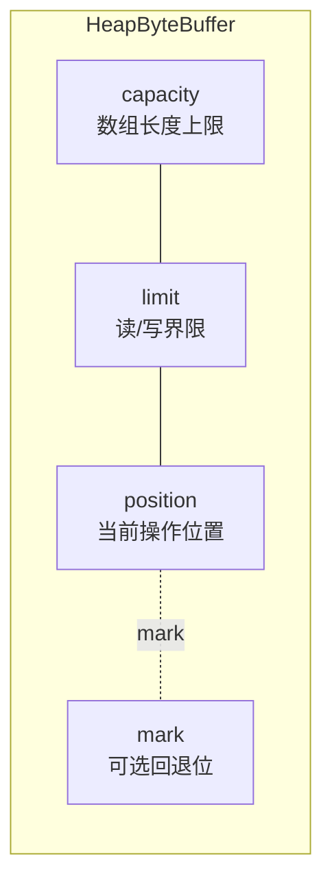
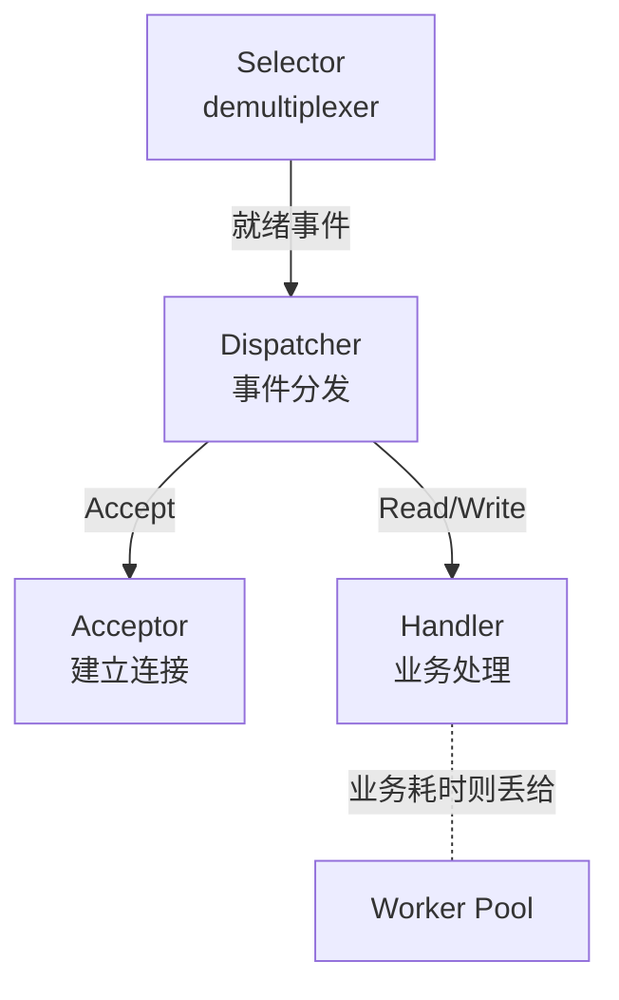

---
title: JDK NIO 核心三件套:Channel、Buffer 与 Selector
hide_title: true
sidebar_label: JDK NIO 核心原理
---

## JDK NIO 核心三件套:Channel、Buffer 与 Selector

在进入 [Netty 高性能网络编程底座](1-netty-io.md) 之前,必须先打通它的语言底座——JDK NIO(`java.nio` 包)。NIO 在 JDK 1.4 引入,把 Java 的网络与文件 IO 模型从“流式阻塞”升级为“**面向缓冲区 + 通道路复用**”模型,这是 Netty、Mina、gRPC-Java 等高性能网络库的共同基础。

---

## 一、 BIO 的痛点与 NIO 的设计动机

### 1. 经典 BIO 模式:一连接一线程

```java
ServerSocket server = new ServerSocket(8080);
while (true) {
    Socket client = server.accept();    // 阻塞
    new Thread(() -> {
        BufferedReader br = new BufferedReader(
            new InputStreamReader(client.getInputStream()));
        String line;
        while ((line = br.readLine()) != null) { /* 阻塞 */ }
    }).start();
}
```

痛点:

- 万连接万线程,内存与上下文切换成本爆炸。
- 线程大部分时间在 `read()` 阻塞,完全浪费 CPU。
- 单线程无法同时监听多个连接的“有数据可读”这一事件。

### 2. NIO 的三大改革

- **面向 Buffer**:`Buffer` 替代流,数据被搬进可读可写的缓冲区,可重复回放。
- **通道双向**:`Channel` 可以同时读和写,且支持非阻塞模式。
- **多路复用器**:`Selector` 让一线程同时监听成千上万的 `Channel` 事件,这正是 [Netty 快速起步](3-netty-quickstart.md) 的基石。

---

## 二、 Buffer:可读写可控的内存视图

### 1. 四大核心指针

`Buffer` 通过三个内部指针(`position`、`limit`、`capacity`)管理一块连续的内存区域,并支持 `mark`(可选的标记位)作回退点。



| 指针 | 含义 | 写模式 | 读模式 |
| :--- | :--- | :--- | :--- |
| `capacity` | 缓冲区最大容量 | 固定 | 固定 |
| `limit` | 可操作界限 | = capacity | = 数据末尾 |
| `position` | 当前操作位置 | 起点 0,逐 +1 | 起点 0,逐 +1 |

### 2. 读写切换:`flip()` 与 `clear()`

```java
ByteBuffer buf = ByteBuffer.allocate(1024);
buf.put(bytes);     // 写入:position 0 → N
buf.flip();         // 切换到读:limit=N、position=0
while (buf.hasRemaining()) byte b = buf.get();
buf.clear();        // 复位到写模式:position=0、limit=capacity
```

`flip()` 的核心是 `limit=position; position=0` —— 把写过的数据段切换成可读段。`clear()` 不真正擦除数据,只把指针复位,准备下一轮写入。

### 3. HeapBuffer 与 DirectBuffer 的本质差异

| 维度 | `HeapByteBuffer` | `DirectByteBuffer` |
| :--- | :--- | :--- |
| 内存位置 | JVM 堆内 | 堆外(直接内存) |
| 分配 | `ByteBuffer.allocate(n)` | `ByteBuffer.allocateDirect(n)` |
| 分配速度 | 快 | 慢(走 `Unsafe.allocateMemory` + 注册 Cleaner) |
| IO 性能 | IO 时需中转拷贝到直接内存 | 零拷贝直送内核,IO 延迟低 |
| GC | 受 GC 管理 | 由 `Cleaner`+`PhantomReference` 显式释放 |

> 关键陷阱:SocketChannel 写 `HeapBuffer` 时,JDK 内部仍会**临时分配一块堆外内存**做中转,然后 `memcpy` 一次,这本质就是非零拷贝。追求性能的中间件一律用 `DirectBuffer`,Netty 的 ByteBuf 体系即建立了完整的池化堆外内存池。详见 [Netty 零拷贝与 ByteBuf 内存管理](2-netty-zero-copy-buf.md)。

### 4. 视图 Buffer 与类型转换

```java
ByteBuffer bb = ByteBuffer.allocate(8);
bb.putInt(42).putInt(7);
bb.flip();
IntBuffer ib = bb.asIntBuffer();      // 共享同一段内存,按 int 解析
```

`asIntBuffer`、`asLongBuffer`、`asCharBuffer` 等视图不复制数据,仅改变“以什么基本类型”读这一段字节。

---

## 三、 Channel:双向数据管道

### 1. 核心实现类

- 文件:`FileChannel`(不支持非阻塞,仍需传统文件 IO 抽象)。
- TCP:`SocketChannel`、`ServerSocketChannel`,支持非阻塞。
- UDP:`DatagramChannel`。
- 异步:AIO 提供的 `AsynchronousSocketChannel` 等,基于回调(但 Linux epoll 实现 AIO 复杂,Netty 未采用)。

### 2. 非阻塞模式与写半包

```java
ServerSocketChannel ssc = ServerSocketChannel.open();
ssc.configureBlocking(false);                  // 关键:进入非阻塞
ssc.bind(new InetSocketAddress(8080));

SocketChannel sc = ssc.accept();               // 非阻塞,无连接返回 null
if (sc != null) {
    sc.configureBlocking(false);
    ByteBuffer buf = ByteBuffer.allocate(1024);
    int n = sc.read(buf);                      // 非阻塞,可返回 0
    int w = sc.write(buf);                     // 非阻塞,可只写部分字节
    while (buf.hasRemaining()) sc.write(buf);  // 必须循环写,处理半包
}
```

要点:

- 非阻塞 `read/write` 不阻塞,返回值可能为 `0`(无数据)或小于请求长度(部分读写),需自管理“半包”状态。
- 这正是 Netty 用 `ChannelPipeline` + 编解码器帮我们封装掉的复杂度。

---

## 四、 Selector:多路复用核心

### 1. 四种就绪事件

```java
ByteBuffer buf = ByteBuffer.allocate(1024);
int ready = selector.select(100);   // 阻塞至多 100ms
Set<SelectionKey> keys = selector.selectedKeys();
for (SelectionKey k : keys) {
    if (k.isAcceptable())      { /* ServerSocket 可 accept */ }
    if (k.isReadable())        { /* Socket 有数据可读 */ }
    if (k.isWritable())        { /* Socket 可写,通常因 send buffer 满 */ }
    if (k.isConnectable())     { /* client 连接完成 */ }
}
```

| 事件常量 | 触发时机 | 典型用途 |
| :--- | :--- | :--- |
| `OP_ACCEPT` | 完成三次握手的新连接 | 服务端 accept |
| `OP_READ` | 内核 recv buffer 有数据 | 读客户报文 |
| `OP_WRITE` | 内核 send buffer 可写 | 大报文发送窗口 |
| `OP_CONNECT` | 客户端连接 ready | 客户端建立连接 |

### 2. 单线程单 Selector 服务多 Channel 的事件循环

```java
Selector selector = Selector.open();

ServerSocketChannel ssc = ServerSocketChannel.open();
ssc.configureBlocking(false);
ssc.register(selector, SelectionKey.OP_ACCEPT);

while (true) {
    selector.select();
    Iterator<SelectionKey> it = selector.selectedKeys().iterator();
    while (it.hasNext()) {
        SelectionKey k = it.next();
        it.remove();                            // 必须手动移除,否则下次仍触发
        if (k.isAcceptable()) {
            SocketChannel sc = ssc.accept();
            sc.configureBlocking(false);
            sc.register(selector, SelectionKey.OP_READ);
        }
        if (k.isReadable()) {
            SocketChannel sc = (SocketChannel) k.channel();
            int n = sc.read(buf);
            if (n == -1) { k.cancel(); sc.close(); }      // 对端关闭
            else        { /* 解码处理 */ }
        }
    }
}
```

> **两个高频陷阱**
>
> 1. 没调 `it.remove()`:无论是否处理,下次 `select()` 都会把同一事件再做出来,造成空跑。
> 2. 在处理 OP_READ 时直接阻塞调用业务逻辑:线程被卡住,所有其它 Channel 都被饿死。

### 3. `selectNow / select(timeout) / select()`

| API | 行为 |
| :--- | :--- |
| `select()` | 阻塞至少一个事件到达 |
| `select(long ms)` | 至多阻塞 ms 毫秒 |
| `selectNow()` | 非阻塞,立即返回就绪数 |

唤醒机制:

- `selector.wakeup()`:其他线程发起,让阻塞 `select` 立即返回。
- wakeup 通过向管道写一个字节 / 自管道技巧实现(Linux 上是 `eventfd` 或 `pipe`)。

---

## 五、 Reactor 模式:NIO 的事件驱动抽象

Reactor 模式由 Doug Schmidt 在 POSA2 提出,把 NIO 的“select → dispatch”循环抽象为三类角色:



- **Reactor(主线程)**:跑事件循环,跑 `select()` 与分发,绝对不阻塞。
- **Acceptor**:专门处理 `OP_ACCEPT`,创建连接并注册到 reactor。
- **Handler**:处理 IO 读/写以及简单的协议解码。
- **Worker Pool**:把复杂业务丢给线程池,避免阻塞 reactor。

这是 Netty **主从 Reactor 模型**的雏形,完整的 BossGroup + WorkerGroup + 业务线程池三层结构详见 [Netty 高性能网络编程底座](1-netty-io.md)。

---

## 六、 JDK NIO 的两大坑与 Netty 的救赎

### 1. epoll 空轮询 Bug

JDK NIO 在 Linux 下若客户端异常断开或 socket 状态特异,`select()` 在无事件时本应阻塞,却返回 0,导致 CPU 飙到 100%。Netty 通过 `selectCnt` 计数与重建 Selector 规避,详见 [Netty 高性能网络编程底座](1-netty-io.md) 第二节。

### 2. 堆外内存泄漏

`DirectByteBuffer` 由 `Cleaner`(基于 `PhantomReference`)+ `Deallocator` 在 GC 时回收,但 GC 时机不可控。一旦分配速率高于 GC 频率,直接内存涨满,抛 `OutOfMemoryError: Direct buffer memory`。Netty 用 `PoolArena` + 引用计数(`ByteBuf.release()`)解决,详见 [Netty 零拷贝与 ByteBuf 内存管理](2-netty-zero-copy-buf.md)。

---

## 七、 一段够用的“Mini Nio Server”

下面是兼顾 epoll Bug 与半包的最简生产模板(约 60 行),是阅读 Netty 源码的“母版”:

```java
public class MiniNioServer {
    public static void main(String[] args) throws IOException {
        Selector selector = Selector.open();
        ServerSocketChannel ssc = ServerSocketChannel.open();
        ssc.configureBlocking(false);
        ssc.bind(new InetSocketAddress(8080));
        ssc.register(selector, SelectionKey.OP_ACCEPT);

        while (true) {
            int n = selector.select(1000);
            if (n == 0) continue;
            Iterator<SelectionKey> it = selector.selectedKeys().iterator();
            while (it.hasNext()) {
                SelectionKey k = it.next(); it.remove();
                try {
                    if (k.isAcceptable()) {
                        SocketChannel sc = ssc.accept();
                        sc.configureBlocking(false);
                        sc.register(selector, SelectionKey.OP_READ,
                                   ByteBuffer.allocate(1024));
                    } else if (k.isReadable()) {
                        SocketChannel sc = (SocketChannel) k.channel();
                        ByteBuffer buf = (ByteBuffer) k.attachment();
                        int r = sc.read(buf);
                        if (r == -1) { k.cancel(); sc.close(); continue; }
                        if (r > 0) {
                            buf.flip();
                            sc.write(buf);              // echo
                            buf.clear();
                        }
                    }
                } catch (IOException e) {
                    k.cancel(); k.channel().close();    // 客户端异常自动解注册
                }
            }
        }
    }
}
```

阅读此实现后再切到 Netty,会发现 Netty 把“按事件分发”抽象成 `ChannelPipeline`,把“buffer + 半包状态”抽象成 `ByteBuf` + 编解码器,把“worker 线程”抽象成 `EventLoop`,可大幅降低学习 Netty 的入门曲线。

---

## 八、 小结

JDK NIO 是 Netty 的“前置概念集”,它的核心是三大角色:

- `Buffer` 提供可读写内存视图与 `flip/clear` 状态机。
- `Channel` 是双向非阻塞通道,实际生产几乎只用 `SocketChannel`/`ServerSocketChannel`。
- `Selector` 是多路复用核心,把单线程扩展到万级连接。

掌握 NIO 后,推荐衔接阅读:

- [Netty 高性能网络编程底座](1-netty-io.md):Netty 如何把 NIO 封装成 Reactor。
- [Netty 零拷贝与 ByteBuf 内存管理](2-netty-zero-copy-buf.md):Netty 内存池的 Jemalloc 思想。
- [JVM 虚拟机内核](../jvm/0-memory-gc.md):堆外内存与 GC 时机对 DirectBuffer 的影响。
