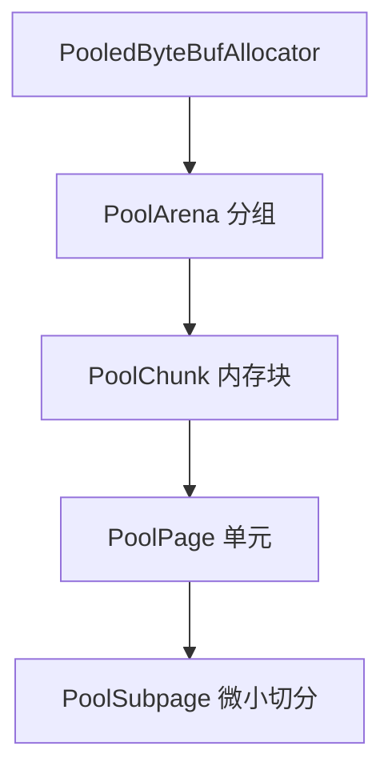
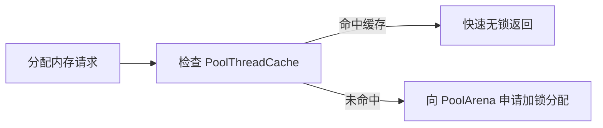

## PooledByteBufAllocator 内存池设计剖析

在高并发网络通信中，频繁分配与销毁 `ByteBuf` 会导致极高的 GC 压力和内存碎片。Netty 参考高效内存分配算法 jemalloc，设计了一套极高效的内存池管理机制 `PooledByteBufAllocator`。

---

## 一、 内存池数据结构层级

Netty 的内存池组织架构采用树状的分级管理模型：



### 1. PoolArena 组件

为了减少多线程高并发下的锁竞争，Netty 创建了多个 `PoolArena` 线程组（通常数量等于 CPU 核心数的 2 倍），线程通过 Hash 或轮询映射至专属的 Arena。

### 2. PoolChunk 组件

内存分配的基石单元，默认尺寸为 16MB。PoolChunk 内部利用伙伴分配算法或位图结构高效管理连续的内存空间。

### 3. PoolPage 与 PoolSubpage 组件

- **PoolPage**：Chunk 被切分为 2048 个 8KB 的 Page 节点。
- **PoolSubpage**：当请求分配小于 8KB 的微小内存（如 16B、32B、512B）时，Page 会被进一步切分为固定规格的 Subpage。

---

## 二、 线程本地缓存 PoolThreadCache

为了进一步追求无锁化性能，Netty 为每个线程绑定了一个 `PoolThreadCache` 缓存对象。



分配与回收小块内存时，优先进入线程本地缓存，完全省去线程竞争开销。

---

## 三、 堆外内存分配与 Unsafe 内存释放

Netty 支持堆内（Heap）与堆外（Direct）内存池。使用堆外内存可跳过 JVM 堆到 Native 内存的数据复制开销。

```java
// 使用 PooledByteBufAllocator 分配堆外内存
ByteBuf buffer = PooledByteBufAllocator.DEFAULT.directBuffer(1024);
```

### 1. Unsafe 与 Direct Memory 手动回收

对于堆外内存的释放，Netty 利用 `sun.misc.Unsafe` 或者 `Cleaner` 实现即时手动回收，避免等待 JVM 触发 Full GC 去清理 `DirectByteBuffer`。
