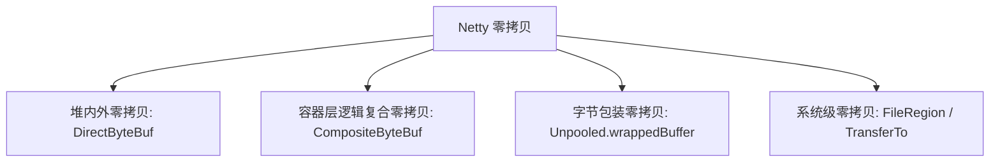

## Netty 零拷贝与 ByteBuf 内存管理机制深度解析

在构建超高吞吐的网络引擎中，频繁的堆内存到堆外内存拷贝以及垃圾回收引起的 Stop-The-World (STW) 是系统性能最大的阻碍。Netty 能够支撑微秒级高吞吐，其底座正是极致优雅的 **ByteBuf 内存池设计** 与 **多维度的零拷贝（Zero-Copy）技术**。

---

## 一、 Netty 多维度“零拷贝”机制

在操作系统层面，零拷贝通常指避免数据在“用户态”与“内核态”之间，或者“网卡”与“内存”之间进行无意义的数据拷贝（如使用 `mmap`、`sendfile` 等系统调用）。

在 Java 应用层面，Netty 的“零拷贝”则是将该概念进行了更广义的延伸，涵盖了**堆内外内存零拷贝、逻辑复合容器零拷贝和字节包装零拷贝**三大维度。



### 1. 堆外直接内存零拷贝（DirectByteBuf）

- **传统 Java NIO**：向网卡发送堆内数据时，JVM 必须先把堆内 `byte[]` 拷贝到操作系统的堆外直接内存（Direct Memory）缓冲区中，再由内核发起 DMA 发送。因为 JVM 垃圾回收会移动堆对象地址，若直接将堆地址传给 OS，可能因 GC 发生而导致传输损坏数据。
- **Netty 直接内存**：Netty 推荐使用 `DirectByteBuf`，直接利用 JDK 底层 `Unsafe` 或 JNI 在 OS 内存中开辟空间。写入直接内存的数据可以直接通过物理总线借助 DMA 发送到网卡驱动，**完全省去了 JVM 堆内到堆外缓冲区的那次拷贝**，同时也极大地减轻了 JVM GC 的压力。

### 2. 逻辑复合零拷贝（CompositeByteBuf）

- **业务痛点**：网络协议传输时，通常包含“协议头（Header）”和“协议体（Body）”。如果需要拼接它们发送，传统的做法是声明一个大数组，将 Header 和 Body 的字节流依次 `System.arraycopy` 拷贝进去。
- **Netty 方案**：使用 `CompositeByteBuf`。它是一个虚拟的逻辑缓冲区，内部持有一个 `ByteBuf` 数组。当拼接数据时，它仅仅在数组中**追加了原有 Header 和 Body 的地址引用**。客户端在对其进行读取时，`CompositeByteBuf` 在内部进行逻辑地址计算并以统一的视图暴露，在物理上未发生任何内存搬移与拷贝。

### 3. 字节包装零拷贝（Unpooled.wrappedBuffer）

- **机制**：如果已存在现成的 `byte[]` 数组或标准的 NIO `ByteBuffer`，通过 `Unpooled.wrappedBuffer(bytes)` 方法，可以迅速将其包装成一个 Netty 的 `ByteBuf` 容器。底层直接引用传入的数组地址，不做任何复制动作。

### 4. 物理文件级零拷贝（FileRegion）

- **机制**：当进行静态大文件发送时（如静态资源服务器），Netty 使用了 `DefaultFileRegion`，其底层调用了 Java NIO `FileChannel.transferTo()`。在 Linux 环境下，直接映射为 **`sendfile`** 系统调用，使得文件数据直接在内核空间（磁盘缓存区 -> 网络发送缓冲区）流转，完全不经过 JVM 用户态内存，达到极致的物理发送效率。

---

## 二、 ByteBuf 的设计美学与指针机制

JDK 原生的 `java.nio.ByteBuffer` 采用单一的 `position` 和 `limit` 指针，导致在读写模式切换时必须调用 `flip()` 方法，极其反人类且容易出错。

### 1. 读写双指针设计

Netty 的 `ByteBuf` 在设计上彻底摒弃了这一痛点，引入了独立的 **`readerIndex`** 和 **`writerIndex`**：

```text
+-------------------+------------------+------------------+
| discardable bytes |  readable bytes  |  writable bytes  |
|                   |     (CONTENT)    |                  |
+-------------------+------------------+------------------+
|                   |                  |                  |
0      <=      readerIndex   <=   writerIndex    <=    capacity
```

- **初始化状态**：`readerIndex` 和 `writerIndex` 均为 `0`。
- **写入操作**：调用 `writeXxx()` 方法，`writerIndex` 向右移动，数据写入 `readable` 区域。
- **读取操作**：调用 `readXxx()` 方法，`readerIndex` 向右移动。`0` 到 `readerIndex` 之间被标记为废弃区域（可随时通过 `discardReadBytes()` 废弃并移动数据以复用空间）。
- **无感模式切换**：读和写完全解耦，用户随时可以并发进行读写，无需调用任何模式切换 API。

### 2. 动态扩容机制

当写入的数据包大于当前 `ByteBuf` 剩余的可写容量时，Netty 会自动触发扩容：
1. **寻找扩容阈值**：设定扩容增量，在满足“大于目标容量”的前提下，以 $64$ 字节为起点，按双倍（$2^n$）的形式进行递增，直至找到满足要求的最小 2 的幂次方容量值（例如 256、512、1024）。
2. **最大容量限制**：扩容不能突破创建时设定的最大容量 `maxCapacity`，若突破则抛出 `IndexOutOfBoundsException`。

---

## 三、 基于 Jemalloc 思想的 Pooled 内存池设计

由于频繁向 OS 申请和销毁堆外直接内存（通过 `DirectByteBuffer` 的 C++ 源码调用 `malloc`）是一项开销极其巨大的操作，且容易引发内存碎片。因此，Netty 引入了基于著名的 **Jemalloc** 思想的内存池分配器：**`PooledByteBufAllocator`**。

### 1. 内存池核心组织架构

Netty 将内存池划分为四级层级结构，分工协作分配内存：

```text
+-------------------------------------------------------+
|                       PoolArena                       |  (线程竞争区: 分为 Direct Arena 和 Heap Arena)
|  +-------------------+         +-------------------+  |
|  |     PoolChunk     |  ...    |     PoolChunk     |  |  (分配 16MB 的大块内存，基于伙伴算法管理)
|  | +---------------+ |         | +---------------+ |  |
|  | |  PoolSubpage  | |         | |  PoolSubpage  | |  |  (分配 <= 28KB 的小微内存，基于位图管理)
|  | +---------------+ |         | +---------------+ |  |
|  +-------------------+         +-------------------+  |
+-------------------------------------------------------+
```

- **`PoolArena`**：内存分配的核心竞争区域。为了减轻多线程高并发下的锁竞争，Netty 默认会创建多个 Arena（默认数量等于 `CPU 核心数 * 2`）。线程在分配内存时，会通过轮询（Round-Robin）绑定到一只 Arena 上。
- **`PoolChunk`**：向操作系统申请的大块内存，默认大小为 **16MB**。它的核心职责是分配和管理大于 28KB 的内存段。它在底层采用**伙伴算法（Buddy Algorithm）**构建了一颗平衡二叉树，从而能够快速定位、拆分和合并不同大小的内存页（Page）。
- **`PoolSubpage`**：当分配的内存小于 28KB 时（微型和小型内存），如果直接分配一个 8KB 的 Page 会造成严重的内存浪费。此时，Netty 会将一个 Page 进一步拆分为等大小的子页（Subpage），并在底层使用 **位图（Bitmap）** 算法，通过 64 位的 Long 型字段快速标记子页的占用状态。

### 2. 内存寻找与分配三层链路

当线程尝试申请一块大小为 `X` 的 ByteBuf 时，其寻找过程由近及远，层层递进：

1. **第一层：`PoolThreadCache`（线程本地缓存，无锁）**：
   每个工作线程都绑定了一个 `PoolThreadCache`。当申请内存时，首先到本地缓存的 L1（Tiny）、L2（Small）或 L3（Normal）缓存队列中寻找。由于每个线程独占自己的本地缓存，此阶段**完全无锁，速度极快**。
2. **第二层：`PoolArena` 中的现有 Chunk（带锁）**：
   若本地缓存未命中，线程会进入绑定的 `PoolArena` 中。Arena 内部维护了 6 个不同内存使用率的双向 Chunk 链表（`qInit`、`q000`、`q025`、`q050`、`q075`、`q100`）。Arena 会根据内存使用率，优先从负载最合理的 Chunk 链表中寻找空闲空间进行切分分配。
3. **第三层：新建 `PoolChunk`（带锁，向 OS 申请）**：
   若所有的 Chunk 都无法满足分配要求，Arena 会向操作系统发起系统调用，申请一块全新的 16MB 的 `PoolChunk` 挂载到链表上，并在其内部切分出空间返回给线程。

---

## 四、 引用计数与内存泄漏检测机制

### 1. 引用计数器（ReferenceCounted）

由于内存池分配的内存不受 JVM GC 的直接控制，Netty 必须手动控制内存的释放。
- 所有的 `ByteBuf` 都实现了 `ReferenceCounted` 接口。
- **初始化**：ByteBuf 刚被创建时，其引用计数（RefCnt）默认为 `1`。
- **传递**：每次被传递或保留时，需手动调用 `retain()`，计数加 `1`。
- **释放**：当业务使用完毕后，必须手动调用 `release()`，计数减 `1`。
- 当计数回落为 `0` 时，底层对应的直接内存会被**安全归还回内存池**。

### 2. 内存泄漏检测器（ResourceLeakDetector）

为了防止开发者在使用完 ByteBuf 后忘记调用 `release()` 导致系统级的内存泄露（OOM），Netty 内置了基于 **虚引用（PhantomReference）** 与 **引用队列（ReferenceQueue）** 的泄漏检测机制：

- **基本原理**：当 ByteBuf 实例被创建时，若开启了检测，检测器会为其包装一个虚引用，并将当前方法的调用栈轨迹（StackTrace）记录在内。当 ByteBuf 被 JVM GC 回收时，虚引用会被自动加入到注册好的引用队列中。检测器会定期轮询该队列，如果发现某个被回收的虚引用在销毁前其 RefCnt 不为 `0`，说明代码未调用 `release()` 就丢失了引用，随即会在后台日志中打印出该 ByteBuf 对象的**泄露轨迹警告**。

- **四种检测级别**：

```properties
# 在 JVM 启动参数中配置检测级别
-Dio.netty.leakDetection.level=ADVANCED
```

| 检测级别 | 检测比例 | 性能损耗 | 适用场景 |
| :--- | :--- | :--- | :--- |
| **`DISABLED`** | 0%（关闭） | 无 | 追求极致性能的超稳定生产环境。 |
| **`SIMPLE`** | 约 1%（采样） | 极低 | 默认级别，保障生产环境安全。 |
| **`ADVANCED`** | 约 1%（采样） | 中等 | 打印详细的调用栈轨迹，推荐在**测试/预发环境**使用。 |
| **`PARANOID`** | 100%（全量） | 极高 | 全量监测，仅限本地排查极隐蔽内存泄露时开启。 |

---

## 五、 面试精选 Q&A

### Q1：Netty 中分配堆外直接内存（Direct Memory）为什么容易导致堆内 OOM？

- **原因**：JDK 的堆外直接内存是通过 `DirectByteBuffer` 的构造器向 OS 申请的。这些对象本身（很小的壳）存放在 JVM 堆内，而实际的大段内存数据在堆外。
- **隐患**：堆外的直接内存只会在堆内的 `DirectByteBuffer` 对象被 GC 回收（触发其 `Cleaner` 机制）时，或者显式调用 `System.gc()` 时才会被释放。如果堆内内存很充裕，JVM 长时间不触发 GC，即使堆外直接内存已经写满，JVM 也不会主动发起垃圾回收，最终导致堆外直接溢出（报出 `java.lang.OutOfMemoryError: Direct buffer memory`）。
- **防范**：合理配置 `-XX:MaxDirectMemorySize` 参数，并严格在代码中使用 Netty 的 `ReferenceCounted.release()` 机制进行内存手动归还。

### Q2：在使用 Netty 的 ChannelHandler 责任链时，谁负责释放 ByteBuf？

- **规则**：**“谁消费，谁释放”**。
- **机制**：
  - 如果你在 Handler 中对 ByteBuf 进行了消费（没有继续通过 `ctx.fireChannelRead()` 向下传递），你必须负责调用 `ReferenceCounted.release()` 释放它。
  - 如果你将其向下传递了，则释放职责顺延给下一个 Handler。
  - **安全防范**：如果不确定是否被完全释放，建议让 Handler 继承自 `SimpleChannelInboundHandler`，它在底层执行完毕后会自动在 `finally` 块中调用 `ReferenceCountedUtil.release(msg)`，确保内存百分之百不泄露。
