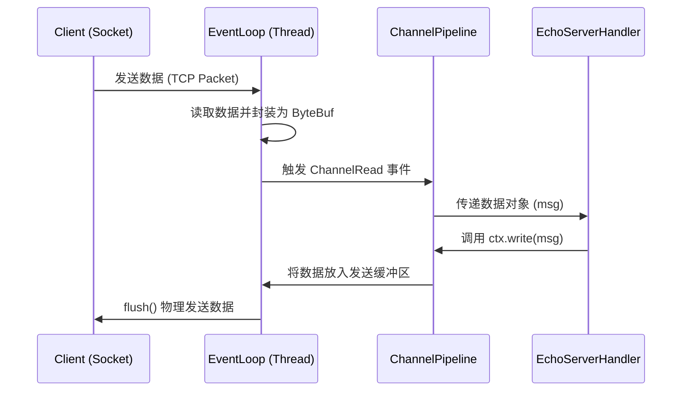

---
title: Netty 快速起步：从 Hello World 走进高性能网络编程
hide_title: true
sidebar_label: Netty 快速入门
---

## Netty 快速起步：从 Hello World 走进高性能网络编程

Netty 是一个异步事件驱动的网络应用框架，用于快速开发可维护的高性能协议服务器和客户端。对于初学者来说，理解 Netty 的最佳方式是亲手实现一个基础的 Echo（回显）服务器。

---

## 一、 核心组件初深：Netty 都在做什么？

在编写代码之前，我们需要理清 Netty 体系中的几个核心“演员”：

1. **`Bootstrap`**：引导配置类。客户端使用 `Bootstrap`，服务端使用 `ServerBootstrap`。
2. **`EventLoopGroup`**：线程池。负责处理 I/O 操作和事件任务。
3. **`Channel`**：通道。代表一个活动的网络连接。
4. **`ChannelHandler`**：处理器。这是我们编写业务逻辑的地方，负责处理入站和出站数据。
5. **`ChannelPipeline`**：责任链。管理 `ChannelHandler` 的执行顺序。

---

## 二、 动手实践：构建第一个 Echo 服务器

我们将创建一个简单的服务端，它会将客户端发送的消息原样回传。

### 1. 服务端处理器实现

我们需要继承 `ChannelInboundHandlerAdapter` 并重写核心方法。

```java
import io.netty.buffer.ByteBuf;
import io.netty.channel.ChannelHandlerContext;
import io.netty.channel.ChannelInboundHandlerAdapter;
import io.netty.util.CharsetUtil;

/**
 * 业务处理器：负责接收并回发数据
 */
public class EchoServerHandler extends ChannelInboundHandlerAdapter {

    @Override
    public void channelRead(ChannelHandlerContext ctx, Object msg) {
        ByteBuf in = (ByteBuf) msg;
        System.out.println("服务端收到消息: " + in.toString(CharsetUtil.UTF_8));
        // 将消息写回给发送者，而不关闭连接
        ctx.write(msg);
    }

    @Override
    public void channelReadComplete(ChannelHandlerContext ctx) {
        // 将暂存在 OutboundBuffer 中的数据冲刷到网卡并发送
        ctx.flush();
    }

    @Override
    public void exceptionCaught(ChannelHandlerContext ctx, Throwable cause) {
        // 捕捉异常并关闭通道
        cause.printStackTrace();
        ctx.close();
    }
}
```

### 2. 服务端引导程序

```java
import io.netty.bootstrap.ServerBootstrap;
import io.netty.channel.ChannelFuture;
import io.netty.channel.ChannelInitializer;
import io.netty.channel.EventLoopGroup;
import io.netty.channel.nio.NioEventLoopGroup;
import io.netty.channel.socket.SocketChannel;
import io.netty.channel.socket.nio.NioServerSocketChannel;

import java.net.InetSocketAddress;

public class EchoServer {
    private final int port;

    public EchoServer(int port) {
        this.port = port;
    }

    public void start() throws Exception {
        // 1. 创建 EventLoopGroup（线程池）
        EventLoopGroup group = new NioEventLoopGroup();
        try {
            // 2. 创建引导配置
            ServerBootstrap b = new ServerBootstrap();
            b.group(group)
                .channel(NioServerSocketChannel.class) // 指定 NIO 传输
                .localAddress(new InetSocketAddress(port))
                .childHandler(new ChannelInitializer<SocketChannel>() {
                    @Override
                    protected void initChannel(SocketChannel ch) {
                        // 3. 将业务处理器加入 Pipeline
                        ch.pipeline().addLast(new EchoServerHandler());
                    }
                });

            // 4. 绑定并开始接收连接
            ChannelFuture f = b.bind().sync();
            System.out.println("服务器启动，监听端口: " + port);
            
            // 5. 阻塞等待服务器 Channel 关闭
            f.channel().closeFuture().sync();
        } finally {
            // 6. 优雅关闭线程池
            group.shutdownGracefully().sync();
        }
    }

    public static void main(String[] args) throws Exception {
        new EchoServer(8080).start();
    }
}
```

---

## 三、 组件交互流程图

为了更直观地理解上述代码的执行逻辑，我们来看一下数据在 Netty 内部的流转过程：



---

## 四、 后续进阶建议

在掌握了基础的连接与读写后，您可能会遇到以下问题，这些也是我们后续文档将深度探讨的话题：

- **粘包与拆包**：为什么我发了两个消息，服务端却收到一个大的？
- **编解码器 (Codec)**：每次都手动操作 `ByteBuf` 太痛苦了，有没有自动转成 Model 对象的方法？
- **心跳机制**：如何检测死掉的连接？
- **HTTP / WebSocket**：如何把 Netty 做成实时消息服务？
- **RPC**：如何用 Netty 搭一个简易分布式调用链？

### 实战案例入口

- [Netty 高性能协议编解码实战](4-netty-codec-practice.md)
- [Netty 心跳保活与断线重连实战](5-netty-heartbeat.md)
- [Netty 实战：HTTP 服务与 WebSocket 长连接](6-netty-http-websocket.md)
- [Netty 实战：构建一个简易 RPC 框架](7-netty-rpc-practice.md)
- [Netty 核心原理与 I/O 模型深度拆解](1-netty-io.md)
