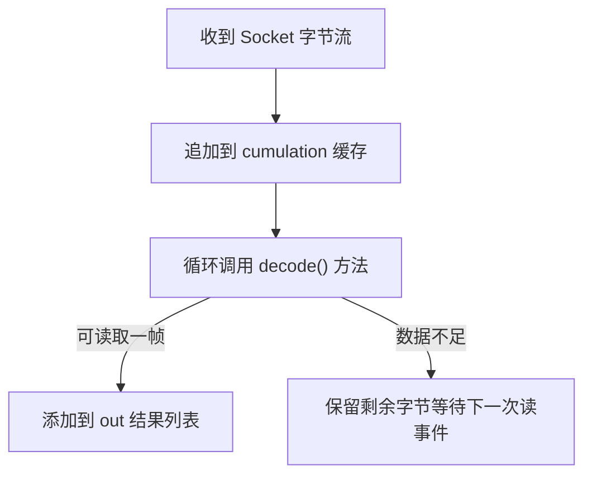

## Netty 高性能协议编解码：解决粘包拆包与实战私有协议

在基于 TCP 的网络开发中，**“粘包/拆包”**（Sticky and Split Packages）是每一个开发者必须跨越的第一道坎。TCP 是一种“流”协议，它不保证发送方发送的每个数据包会被接收方以同样的边界接收。

---

## 一、 直击痛点：粘包与拆包

### 1. 为什么会发生粘包拆包？

- **粘包**：发送端发送的若干包数据到接收端接收时粘成一团。通常是因为 TCP 缓冲区合并发送或接收导致。
- **拆包**：发送的一个大数据包被拆分成多个小包发送，接收端一次只能接收到部分数据。

### 2. 解决方案模型

为了划定数据的边界，业界通常有四种主流策略：

1. **定长协议**：每个报文长度固定（如 1024 字节）。
2. **特殊分隔符**：在包尾添加特殊符号（如 `\n` 或 `$_$`）。
3. **长度域（Length Field）**：在报文头部增加一个字段，标明 Body 的长度。**（Netty 最推荐，最灵活）**
4. **应用层特定的结束符**：如 HTTP 协议。

---

## 二、 Netty 的开箱即用解码器

Netty 已经为我们封装好了应对这些问题的工具类：

| 解码器类 | 作用 |
| :--- | :--- |
| `FixedLengthFrameDecoder` | **定长解码器**。按固定字节截断报文。 |
| `DelimiterBasedFrameDecoder` | **分隔符解码器**。根据自定义的分隔符切分报文。 |
| `LineBasedFrameDecoder` | **换行符解码器**。专门处理以 `\n` 或 `\r\n` 结尾的文本行。 |
| `LengthFieldBasedFrameDecoder` | **长度域解码器**。通过报文头的长度字段动态切分，解决复杂协议的核心工具。 |

---

## 三、 LengthFieldBasedFrameDecoder 5 大参数深度剖析

`LengthFieldBasedFrameDecoder` 是 Netty 中最强大也最难掌握的解码器。它的构造函数包含 5 个关键参数：

```java
public LengthFieldBasedFrameDecoder(
    int maxFrameLength,
    int lengthFieldOffset,
    int lengthFieldLength,
    int lengthAdjustment,
    int initialBytesToStrip
)
```

| 参数名 | 含义 |
| :--- | :--- |
| `maxFrameLength` | 发送的数据帧最大长度，超过此值抛出 `TooLongFrameException` |
| `lengthFieldOffset` | 长度域在报文头中的字节偏移量 |
| `lengthFieldLength` | 长度域字段本身占用的字节数（如 2B / 4B / 8B） |
| `lengthAdjustment` | 长度调节补偿值（如果长度字段包含/不包含 Header 长度时使用） |
| `initialBytesToStrip` | 解码后跳过（剥离）的字节数（若业务 Handler 不需要 Header，可剥离） |

### 典型场景参数推演

#### 场景 A：标准 Header (4B 长度) + Body

- 结构：`| Length(4B) | Body |`
- 参数配置：
  - `lengthFieldOffset` = 0
  - `lengthFieldLength` = 4
  - `lengthAdjustment` = 0
  - `initialBytesToStrip` = 4（跳过 4B 长度头，直接将 Body 传递给后续 Handler）

#### 场景 B：带魔数的 Header，且长度值等于 Header + Body 总长度

- 结构：`| Magic(2B) | Length(4B) | HeaderOther(2B) | Body |`
- 假设 `Length` 的数值代表整个数据包的总字节数（2 + 4 + 2 + Body）。
- 参数配置：
  - `lengthFieldOffset` = 2
  - `lengthFieldLength` = 4
  - `lengthAdjustment` = -6（因为 `Length` 值把前面的 6 字节也算进去了，需减去 6 才能算准 Body 结尾）
  - `initialBytesToStrip` = 0（保留完整 Header 传给下游）

---

## 四、 ByteToMessageDecoder 累加器机制与半包处理

所有入站解码器大都继承自 `ByteToMessageDecoder`。理解其内部机制对避免半包 Bug 至关重要。

### 1. Cumulator 累加缓冲区

`ByteToMessageDecoder` 内部维护了一个 `ByteBuf cumulation` 缓冲区：



### 2. 手写解码器时的安全校验

如果在 `ByteToMessageDecoder` 中手写解码逻辑，**必须校验 readableBytes**：

```java
public class MyByteDecoder extends ByteToMessageDecoder {

    @Override
    protected void decode(ChannelHandlerContext ctx, ByteBuf in, List<Object> out) {
        // 1. 先检查头部字节是否足够（如头部 4 字节）
        if (in.readableBytes() < 4) {
            return; // 数据不足一帧头部，直接返回等待后续字节
        }

        in.markReaderIndex();
        int length = in.readInt();

        // 2. 再检查 Body 是否完整
        if (in.readableBytes() < length) {
            in.resetReaderIndex(); // 恢复读指针，等待完整 Body
            return;
        }

        byte[] body = new byte[length];
        in.readBytes(body);
        out.add(new String(body, StandardCharsets.UTF_8));
    }
}
```

---

## 五、 MessageToMessageCodec 双向编解码实战

在一个自定义协议中，编码器（Outbound）和解码器（Inbound）通常成对出现。使用 `MessageToMessageCodec` 可以将双向逻辑收拢在单个类中。

```java
import io.netty.buffer.ByteBuf;
import io.netty.channel.ChannelHandlerContext;
import io.netty.handler.codec.MessageToMessageCodec;
import java.nio.charset.StandardCharsets;
import java.util.List;

public class MyProtocolCodec extends MessageToMessageCodec<ByteBuf, String> {

    @Override
    protected void encode(ChannelHandlerContext ctx, String msg, List<Object> out) {
        ByteBuf buf = ctx.alloc().buffer();
        byte[] body = msg.getBytes(StandardCharsets.UTF_8);
        buf.writeInt(body.length);
        buf.writeBytes(body);
        out.add(buf);
    }

    @Override
    protected void decode(ChannelHandlerContext ctx, ByteBuf msg, List<Object> out) {
        if (msg.readableBytes() < 4) {
            return;
        }
        msg.markReaderIndex();
        int length = msg.readInt();
        if (msg.readableBytes() < length) {
            msg.resetReaderIndex();
            return;
        }
        byte[] bytes = new byte[length];
        msg.readBytes(bytes);
        out.add(new String(bytes, StandardCharsets.UTF_8));
    }
}
```

---

## 六、 非法数据包防御与断路器机制

在公网环境或跨系统通信中，可能会收到格式错乱或恶意攻击的畸形数据包。

```java
if (magic != EXPECTED_MAGIC) {
    // 发现非法魔数，立即关闭通道，防范内存爆破攻击
    ctx.close();
    return;
}
```

通过设置 `maxFrameLength` 与魔数校验，能在最早阶段阻断非法报文对 JVM 内存的消耗。

---

## 七、 总结

1. **绝对不要在 Handler 中直接处理未解包的裸 ByteBuf**。
2. **优先掌握 `LengthFieldBasedFrameDecoder` 的 5 大参数**，可应对 99% 的私有协议。
3. **理解 `ByteToMessageDecoder` 内部的 `cumulation` 机制**，手写解码时务必注意 `markReaderIndex()` 与 `resetReaderIndex()`。
4. **结合 `MessageToMessageCodec` 做协议收拢**，保持 Pipeline 结构清晰干净。

更多实战项目参考：[Netty 构建简易 RPC 框架](7-netty-rpc-practice.md)。
