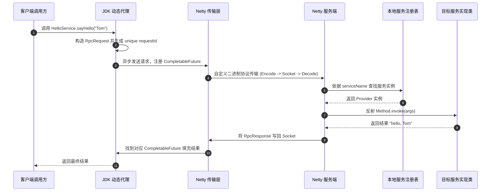

## Netty 实战：构建高性能 RPC 框架

RPC（Remote Procedure Call）是分布式微服务架构的核心基座。通过手写一个功能完备的 RPC 框架，能将 Netty 的“编解码、线程模型、自定义协议、连接复用、动态代理与异步响应匹配”等核心知识点完整串联。

---

## 一、 RPC 整体架构设计

一个生产级 RPC 框架的基本数据流转过程如下：



---

## 二、 自定义二进制通信协议

使用原生 Java 序列化不仅效率低，而且容易引发安全漏洞。推荐设计自定义私有二进制协议：

```text
+---------------------------------------------------------------+
| 魔数 (4B) | 消息类型 (1B) | 序列化算法 (1B) | 状态码 (1B) | 占位 (1B) |
+---------------------------------------------------------------+
|                    请求 ID (8B / Long)                         |
+---------------------------------------------------------------+
|                    数据长度 (4B)                               |
+---------------------------------------------------------------+
|                    消息体 Body (N Bytes)                       |
+---------------------------------------------------------------+
```

### 1. 消息模型定义

```java
public class RpcRequest {
    private String requestId;
    private String interfaceName;
    private String methodName;
    private Class<?>[] parameterTypes;
    private Object[] parameters;

    // getter / setter
}

public class RpcResponse {
    private String requestId;
    private Integer code;
    private String errorMessage;
    private Object data;

    // getter / setter
}
```

---

## 三、 基于 LengthFieldBasedFrameDecoder 的编解码器

为了解决 TCP 粘包与拆包问题，并处理二进制协议，我们实现专属的编解码 Handler。

### 1. 协议编码器 (RpcEncoder)

```java
import io.netty.buffer.ByteBuf;
import io.netty.channel.ChannelHandlerContext;
import io.netty.handler.codec.MessageToByteEncoder;

public class RpcEncoder extends MessageToByteEncoder<RpcRequest> {
    private static final int MAGIC_NUMBER = 0x12345678;

    @Override
    protected void encode(ChannelHandlerContext ctx, RpcRequest msg, ByteBuf out) throws Exception {
        // 1. 写入魔数 (4B)
        out.writeInt(MAGIC_NUMBER);
        // 2. 写入消息类型与序列化算法 (1B + 1B)
        out.writeByte((byte) 1); 
        out.writeByte((byte) 1); 
        // 3. 写入占位符/状态 (2B)
        out.writeShort(0);
        // 4. 写入请求 ID (假设用哈希转换为 8B Long)
        out.writeLong(Long.parseLong(msg.getRequestId()));

        // 5. 序列化消息体 (此处以 JSON 序列化为例)
        byte[] bodyBytes = JsonSerializer.serialize(msg);
        // 6. 写入消息长度 (4B)
        out.writeInt(bodyBytes.length);
        // 7. 写入消息体
        out.writeBytes(bodyBytes);
    }
}
```

### 2. 协议解码器 (RpcDecoder)

继承 `LengthFieldBasedFrameDecoder` 自动按协议头中的长度切割 ByteBuf：

```java
import io.netty.buffer.ByteBuf;
import io.netty.channel.ChannelHandlerContext;
import io.netty.handler.codec.LengthFieldBasedFrameDecoder;

public class RpcDecoder extends LengthFieldBasedFrameDecoder {
    private static final int MAGIC_NUMBER = 0x12345678;

    public RpcDecoder() {
        // maxFrameLength: 8MB
        // lengthFieldOffset: 16 (4B 魔数 + 1B 类型 + 1B 算法 + 2B 占位 + 8B requestId)
        // lengthFieldLength: 4B
        super(8 * 1024 * 1024, 16, 4, 0, 0);
    }

    @Override
    protected Object decode(ChannelHandlerContext ctx, ByteBuf in) throws Exception {
        ByteBuf frame = (ByteBuf) super.decode(ctx, in);
        if (frame == null) {
            return null;
        }

        try {
            int magic = frame.readInt();
            if (magic != MAGIC_NUMBER) {
                throw new IllegalArgumentException("Unknown magic number: " + magic);
            }
            byte messageType = frame.readByte();
            byte serializerType = frame.readByte();
            frame.readShort(); // skip padding
            long requestId = frame.readLong();

            int dataLength = frame.readInt();
            byte[] body = new byte[dataLength];
            frame.readBytes(body);

            return JsonSerializer.deserialize(body, RpcResponse.class);
        } finally {
            frame.release();
        }
    }
}
```

---

## 四、 客户端动态代理与 Future 异步映射

RPC 客户端的关键难题是：**TCP 通信是异步全双工的，如何让上游同步/异步代码拿到服务端的响应？**

核心思路：使用 `ConcurrentHashMap<String, CompletableFuture<RpcResponse>>` 在发送前绑定 `requestId`，在收到响应时通过回调唤醒 `CompletableFuture`。

### 1. 客户端 Handler 与响应解偶

```java
public class RpcClientHandler extends SimpleChannelInboundHandler<RpcResponse> {
    private final Map<String, CompletableFuture<RpcResponse>> pendingRequests = new ConcurrentHashMap<>();

    public CompletableFuture<RpcResponse> sendRequest(Channel channel, RpcRequest request) {
        CompletableFuture<RpcResponse> future = new CompletableFuture<>();
        pendingRequests.put(request.getRequestId(), future);

        channel.writeAndFlush(request).addListener(f -> {
            if (!f.isSuccess()) {
                pendingRequests.remove(request.getRequestId());
                future.completeExceptionally(f.cause());
            }
        });
        return future;
    }

    @Override
    protected void channelRead0(ChannelHandlerContext ctx, RpcResponse response) {
        CompletableFuture<RpcResponse> future = pendingRequests.remove(response.getRequestId());
        if (future != null) {
            if (response.getCode() == 200) {
                future.complete(response);
            } else {
                future.completeExceptionally(new RuntimeException(response.getErrorMessage()));
            }
        }
    }
}
```

### 2. JDK 动态代理工厂

```java
public class RpcProxyFactory {
    @SuppressWarnings("unchecked")
    public static <T> T createProxy(Class<T> interfaceClass, RpcClient client) {
        return (T) Proxy.newProxyInstance(
            interfaceClass.getClassLoader(),
            new Class<?>[]{interfaceClass},
            (proxy, method, args) -> {
                RpcRequest request = new RpcRequest();
                request.setRequestId(String.valueOf(System.nanoTime()));
                request.setInterfaceName(interfaceClass.getName());
                request.setMethodName(method.getName());
                request.setParameterTypes(method.getParameterTypes());
                request.setParameters(args);

                CompletableFuture<RpcResponse> future = client.send(request);
                // 同步等待结果，并设置 5 秒超时保护
                RpcResponse response = future.get(5, TimeUnit.SECONDS);
                return response.getData();
            }
        );
    }
}
```

---

## 五、 服务端本地服务注册表与动态调用

服务端收到 `RpcRequest` 后，需根据接口名称在本地注册集中匹配目标 Provider 实例，并反射执行具体方法。

### 1. 本地服务注册表

```java
public class ServiceRegistry {
    private final Map<String, Object> serviceMap = new ConcurrentHashMap<>();

    public void register(String interfaceName, Object serviceInstance) {
        serviceMap.put(interfaceName, serviceInstance);
    }

    public Object getService(String interfaceName) {
        return serviceMap.get(interfaceName);
    }
}
```

### 2. 服务端请求处理 Handler

```java
public class RpcServerHandler extends SimpleChannelInboundHandler<RpcRequest> {
    private final ServiceRegistry serviceRegistry;

    public RpcServerHandler(ServiceRegistry serviceRegistry) {
        this.serviceRegistry = serviceRegistry;
    }

    @Override
    protected void channelRead0(ChannelHandlerContext ctx, RpcRequest request) {
        RpcResponse response = new RpcResponse();
        response.setRequestId(request.getRequestId());

        try {
            Object serviceBean = serviceRegistry.getService(request.getInterfaceName());
            if (serviceBean == null) {
                throw new IllegalArgumentException("Service not found: " + request.getInterfaceName());
            }

            // 反射调用目标方法
            Method method = serviceBean.getClass().getMethod(request.getMethodName(), request.getParameterTypes());
            Object result = method.invoke(serviceBean, request.getParameters());

            response.setCode(200);
            response.setData(result);
        } catch (Exception e) {
            response.setCode(500);
            response.setErrorMessage(e.getCause() != null ? e.getCause().getMessage() : e.getMessage());
        }

        ctx.writeAndFlush(response);
    }
}
```

---

## 六、 客户端与服务端引导主程序

把上述各个组件串联为一个完整的 RPC 服务。

### 1. 服务端主启动类

```java
public class RpcServerBootstrap {
    public static void main(String[] args) throws Exception {
        ServiceRegistry registry = new ServiceRegistry();
        // 注册接口实现类
        registry.register(HelloService.class.getName(), new HelloServiceImpl());

        EventLoopGroup boss = new NioEventLoopGroup(1);
        EventLoopGroup worker = new NioEventLoopGroup();

        try {
            ServerBootstrap b = new ServerBootstrap();
            b.group(boss, worker)
                .channel(NioServerSocketChannel.class)
                .childHandler(new ChannelInitializer<SocketChannel>() {
                    @Override
                    protected void initChannel(SocketChannel ch) {
                        ch.pipeline().addLast(new RpcDecoder());
                        ch.pipeline().addLast(new RpcEncoder());
                        ch.pipeline().addLast(new RpcServerHandler(registry));
                    }
                });

            ChannelFuture f = b.bind(8888).sync();
            System.out.println("RPC 服务端启动成功，监听端口 8888");
            f.channel().closeFuture().sync();
        } finally {
            boss.shutdownGracefully();
            worker.shutdownGracefully();
        }
    }
}
```

---

## 七、 总结

通过手写完整的 RPC 框架，我们深入理解了以下技术要点：

1. **协议设计**：魔数与包头防粘包/拆包。
2. **异步转换**：`CompletableFuture` + `Map<requestId, Future>` 是无锁异步转同步的核心模式。
3. **反射解耦**：动态代理与服务注册表结合实现无侵入远程调用。
