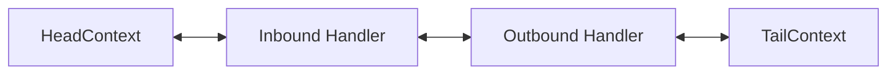
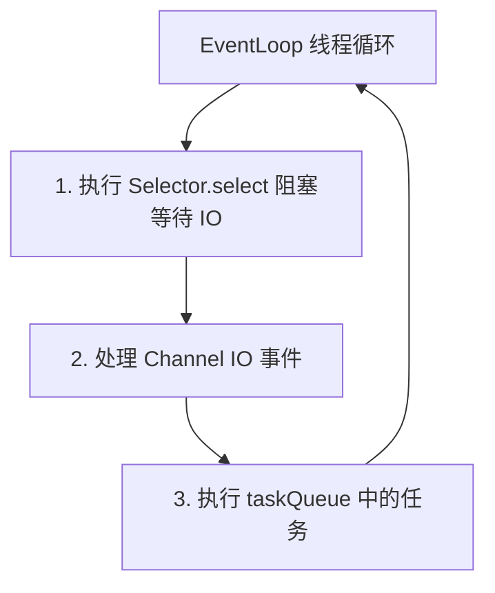

## ChannelPipeline 与 EventLoop 事件驱动源码机制

Netty 高性能的核心来源于两大部分：一是负责管理业务逻辑处理器的责任链 `ChannelPipeline`，二是负责驱动网络 IO 与任务执行的事件循环引擎 `EventLoop`。

---

## 一、 ChannelPipeline 双向链表架构

每个 `Channel` 在创建时都会同步初始化一个 `ChannelPipeline`。Pipeline 内部维护了一个由 `ChannelHandlerContext` 节点构成的双向双端链表。



### 1. HeadContext 与 TailContext 的职责

- **HeadContext**：既是 Inbound Handler 也是 Outbound Handler。作为入站事件的入口，也是出站事件写回 Socket 通道时的最终出口。
- **TailContext**：位于链表末尾，主要用于收尾处理（如接收并丢弃未被处理的入站消息，防止内存泄漏）。

---

## 二、 Inbound 与 Outbound 事件传播机制

Netty 中的事件分为**入站事件（Inbound）**与**出站事件（Outbound）**。

### 1. 入站事件传播

入站事件由底层网络触发（如读取到数据、连接建立），由链表头部 `HeadContext` 开始向后传播给匹配的 Inbound Handler。

```java
// 必须在 Handler 内部显式调用以继续传播入站事件
ctx.fireChannelRead(msg);
```

### 2. 出站事件传播

出站事件由应用层主动发起（如发送数据或关闭连接），从当前 Handler 或链表尾部开始向前寻找匹配的 Outbound Handler。

```java
// 从当前 Handler 开始向前寻找 Outbound Handler
ctx.write(msg);

// 从整个 Pipeline 尾部向头端寻找 Outbound Handler
ctx.channel().write(msg);
```

> [!IMPORTANT]
> `ctx.write()` 与 `ctx.channel().write()` 的传播起点不同。若在 Handler 内部调用 `ctx.channel().write()`，会从 Tail 节点重新扫描整个 Pipeline。

---

## 三、 EventLoop 串行无锁化原理

Netty 实现了“单线程绑定单通道”的无锁化设计，避免了多线程竞态条件与上下文切换开销。



### 1. inEventLoop 校验与任务调度

当外部线程尝试执行 Channel 操作时，Netty 会检查当前线程是否为 EventLoop 线程。若不是，则将操作封装为 Task 存入 `taskQueue` 中异步串行执行。

```java
if (eventLoop.inEventLoop()) {
    // 当前处于 EventLoop 线程，直接同步执行
    doWrite();
} else {
    // 当前属于外部线程，提交至队列由 EventLoop 异步执行
    eventLoop.execute(() -> doWrite());
}
```

---

## 四、 优雅停机流程

生产环境中关闭 Netty 服务时，必须保证暂存的任务被完整处理，且连接平滑释放。

```java
Future<?> bossFuture = bossGroup.shutdownGracefully();
Future<?> workerFuture = workerGroup.shutdownGracefully();
```

优雅停机阶段包括静默期（Quiet Period）与超时上限（Timeout）。静默期内若无新任务提交，EventLoop 才会安全退出并释放资源。
