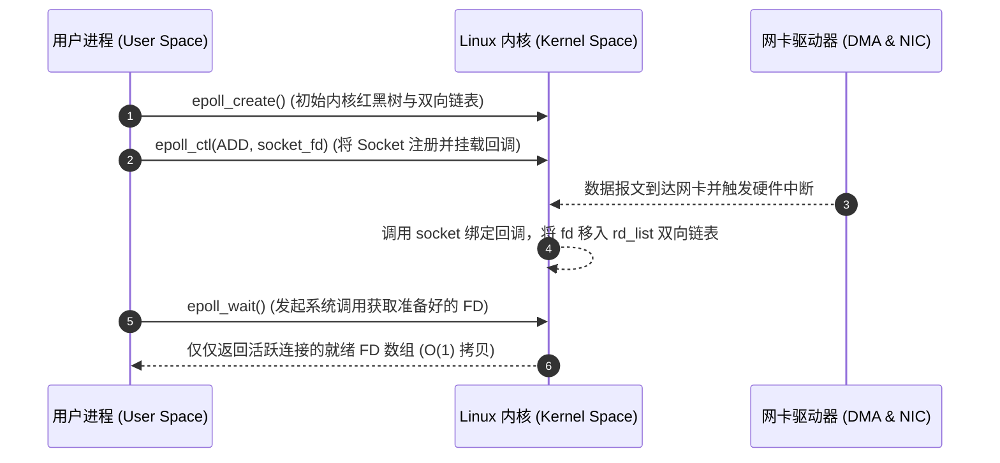
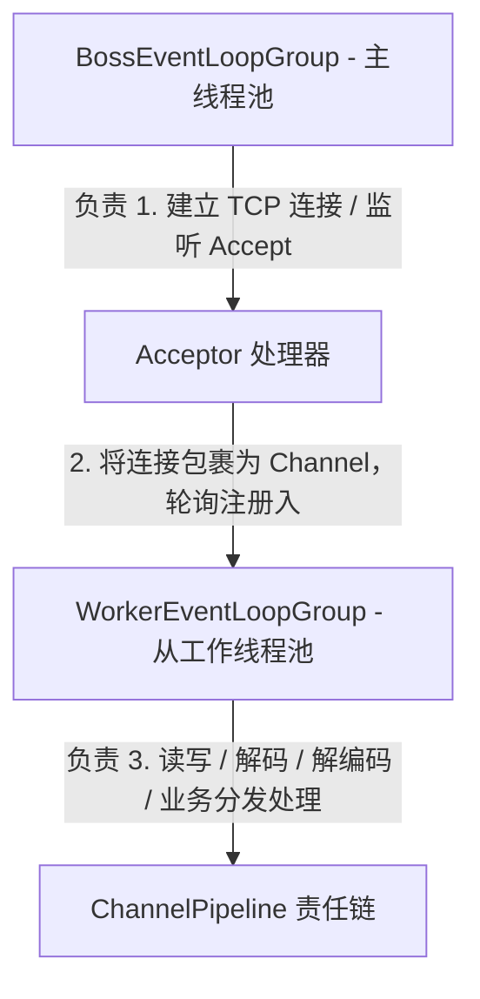

# 高性能 Java I/O 与 Netty 核心原理

作为构建高性能、高吞吐量分布式微服务（如 Dubbo、Spring Cloud Gateway、Nacos 心跳协议）的核心底座，基于事件驱动的网络通信引擎 Netty 在高并发领域占据了绝对主导地位。本篇将从 Linux 底层 I/O 模型的演进、核心 Reactor 模型剖析以及 Netty 底层的设计精髓和调优实践展开深度拆解。

---

## 一、 从 Linux 极境看 I/O 模型演进

在 Linux 操作系统中，一切皆文件。网络连接在内核中被抽象为文件描述符（FD, File Descriptor）。当网络 I/O 发生时，数据传输一般分为两个阶段：

1. **数据准备阶段**：数据从网络硬件（NIC 网卡）通过 DMA 拷贝到内核缓冲区（Kernel Space）。
2. **数据拷贝阶段**：数据从内核缓冲区拷贝到用户进程内存空间（User Space）。

随着高并发场景的升级，I/O 多路复用模型成为了业界绝对的基石。

### 1. BIO、NIO、AIO 模型辨析

以下是 BIO、NIO、AIO 模型的对比。由于本站编译采用了 MDX 规范，这里使用标准表格表示：

| I/O 模型 | 第一阶段（数据准备） | 第二阶段（数据拷贝） | 适用场景 |
| :--- | :--- | :--- | :--- |
| **BIO (Blocking I/O)** | 阻塞（挂起线程） | 阻塞 | 低并发、连接数少且长连接 |
| **BIO (Non-blocking I/O)** | 不阻塞（通过轮询状态返回） | 阻塞 | 中高并发、弹性的连接调度 |
| **I/O Multiplexing** | 阻塞在 select/poll/epoll 挂起 | 阻塞 | 超高并发（Netty 的核心底座） |
| **AIO (Asynchronous I/O)** | 不阻塞（由内核异步准备） | 不阻塞（内核拷贝完成后回调） | 高吞吐、操作系统支持深度相关的场景 |

### 2. Linux 内核驱动：select、poll 与 epoll 深度对比

I/O 多路复用中，`select`、`poll` 和 `epoll` 是 Linux 内核提供的不同多路复用系统调用。其中 `epoll` 是 Linux 下构建高并发网络核心技术的绝对天花板：

- **`select`**：传入 FD 数组，硬编码硬限制最大 FD 个数为 $1024$（可以通过重新编译内核打破，但意义不大）。每次调用时需要将 FD 集合从用户态拷贝到内核态，且在内核采用 $O(N)$ 的全量线性轮询方式检查可读写事件。
- **`poll`**：基于链表存储，打破了 $1024$ 个 FD 的上限，但是在 FD 拷贝以及 $O(N)$ 轮询机制上与 `select` 别无二致，随着并发量上升连接数变多，性能急剧退化。
- **`epoll`**：彻底解决无用轮询，通过以下三大支柱实现极致高能：
  - **红黑树（RBR, Red Black Tree）**：在内核中维护一颗红黑树，通过 `epoll_ctl` 实现 FD 的高效增删改，时空复杂度保持在 $O(\log N)$，避免了每次系统调用全量拷贝 FD 集合的巨额开销。
  - **双向就绪链表（rdllist）**：只将当前产生了 I/O 读写事件的活动连接 FD 放入就绪链表中。
  - **回调机制（Callback）**：FD 注册到红黑树后，为其绑定一个设备驱动回调函数。当网卡收到数据产生中断时，CPU 自动触发回调，将活动关联的 FD 自动追加到就绪队列，直接省去 $O(N)$ 的主动轮询遍历，调用 `epoll_wait` 在 $O(1)$ 复杂度下直接获取就绪 FD 信息。



---

## 二、 JDK NIO 的 epoll 空轮询 CPU 100% Bug 成因与 Netty 的优雅规避

虽然 JDK 提供了 `java.nio.channels.Selector` API 以便在底层直接调用操作系统的多路复用 API，但是在 Linux 环境下遭遇 JDK 精典的 **epoll 空轮询 Bug** 时会导致服务器某核 CPU 迅速飙高至 100%。

### 1. Bug 的成因机制

在 Linux 底层，当某个客户端 Socket 连接异常中断或发生了文件状态标志的特异改变时，内核可能会在没有就绪 I/O 事件准备好的情况下，通过 `epoll_wait` 系统调用返回就绪码 $0$。

JDK NIO 原生的通道 Selector 内部，其 `select()` 调用理应在没有就绪事件时陷入无限挂起，然而由于底层未能够优雅拦截这一非法的 OS 返回码，导致控制流发生穿透，让 Selector 无法退出阻塞，直接返回 $0$。主自旋循环以为有事件可供接收，反复不停地自旋调用 `select()`，陷入没有任何动作却死循环的 **Epoll 空轮询状态**。

### 2. Netty 的规避解决方案

Netty 的 `NioEventLoop` 内部通过重构自旋重连计数机制优雅拦截了这一著名的 JVM 缺陷：

- **空轮询阀值检测**：Netty 在 `NioEventLoop` 双向死循环中，维护了一个名为 `selectCnt` 的轮询计数器。
- **重构机制**：每次调用 `selector.select()` 结束后，若没有任何通道就绪且返回值刚好为 $0$，自旋轮询计数自增一。
- **触发机制（默认 512 次）**：当 `selectCnt` 在没有取得任何有效包的情况下突破了阈值（默认设置 `SELECTOR_AUTO_REBUILD_THRESHOLD = 512`），Netty 判定底层已经触发了空轮询 Bug。
- **重建逻辑**：Netty 将创建一只全新的 Selector 实例，将原本旧 Selector 注册的全部 SelectionKey 和对应的 Socket 通道进行逐个剥离并重新附着注册到这只新的 Selector 实例上。随后安全释放有缺陷的旧 Selector，完成运行时静默无缝切换，规避空轮询危害。

---

## 三、 Netty 底层架构核心：主从 Reactor 线程模型与内存零拷贝

### 1. 极致主从 Reactor 模型的设计实现

Netty 是对高能 Reactor 通信设计模式的最佳落地。在单机极速吞吐设计中，它推荐使用主从双线程池模型：



- **BossGroup**：仅包含一个或少数几个 `EventLoop`（底子是单工作线程），专职进行服务端口的 `bind` 与 TCP 三路握手的 `ACCEPT`。捕获客户端请求并包装为底层 SocketChannel 实例后，利用哈希或轮询策略直接投递到从工作线程池。
- **WorkerGroup**：包含多个 `EventLoop`（数量默认为跟运行环境 CPU 核心物理数 $\times 2$ 相同）。全力负责 SocketChannel 的内核与应用层数据读写（如 `read`、`write`）、数据的加解密转换、以及向业务逻辑层发送调用链。每个 EventLoop 都捆绑它自己所属的单线程以及底层 Selector，使客户端数据处理能够保持单线程极速运行，彻底消除上下文锁切换损耗。

### 2. 多重维度的内存零拷贝 (Zero-Copy)

网络传输中，频繁的堆内存到堆外内核内存拷贝是阻碍高并发的罪魁祸首。Netty 的零拷贝方案融合于框架设计中：

- **Direct Memory（堆外直接内存分配）**：通过底层工具（如 `Unsafe`）或 JNI 直接从 OS 中申请虚地址外内存内存 `DirectByteBuf`。Socket 传输能够直接绕过 JVM 常规堆到直接内存的反射缓冲区拷贝，网络报文数据直接借助内核物理总线完成底层发送，显著减轻 JVM GC 回收直接堆内存的压力。
- **CompositeByteBuf（复合缓冲区零拷贝）**：由协议拼接数据（如 Header 报头 + Body 报文体）常见的设计是分配新内存。但在 Netty 中，我们能够使用 `CompositeByteBuf` 将这多个 `ByteBuf` 块合并成逻辑上唯一的缓冲区结构，底层其实仍然持有独立散落的各个物理 ByteBuf 的地址引用，彻底规避了大段数组合并搬移时的内存拷贝工作。
- **Unpooled.wrappedBuffer**：该包装 API 能够将已持有的 Java 原生 `byte` 数组或者其他内存结构直接裹上 Netty 面具进行收发，不创建任何副本空间。

---

## 四、 Netty 实战高并发调优宝典

为确保 Netty 能够在超大规模吞吐的生产级平稳输出，以下数项调优参数不可或缺：

```java
// 初始化 ServerBootstrap 连接服务器示例 
ServerBootstrap bootstrap = new ServerBootstrap();
bootstrap.group(bossGroup, workerGroup)
    .channel(NioServerSocketChannel.class)
    // 1. TCP 半连接与全连接总容量调优
    .option(ChannelOption.SO_BACKLOG, 1024)
    // 2. 长连接保活机制（开启心跳主动探测）
    .childOption(ChannelOption.SO_KEEPALIVE, true)
    // 3. 关闭 Nagle 算法，消除 40ms 数据包攒包包迟延，实现极速响应
    .childOption(ChannelOption.TCP_NODELAY, true)
    // 4. 配置读写高低水位线：避免应用层发包溢出和缓存暴涨导致的 OOM
    .childOption(ChannelOption.WRITE_BUFFER_WATER_MARK, new WriteBufferWaterMark(32*1024, 64*1024))
    .childHandler(new ChannelInitializer<SocketChannel>() {
        @Override
        protected void initChannel(SocketChannel ch) {
            ch.pipeline().addLast(new MyBusinessHandler());
        }
    });
```

- **`SO_BACKLOG`**：定义 TCP 建立三次握手排队队列中能够承受的最大连接挂起请求数量。Linux 底层受限于内核控制参数 `/proc/sys/net/core/somaxconn`。在高并发场景中，将其扩充到 $1024$ 或更高，能够显著防止连接洪峰阶段客户端报出 `Connection refused` 致命中断。
- **`WRITE_BUFFER_WATER_MARK`**：设置高低水位线参数。如果下游处理缓慢而发送方仍在拼命发包，会导致 Netty 通道上的 Outbound 写入队列极具膨胀最后导致物理内存 OOM。通过设置合理的高低水位（如低 32KB，高 64KB），可以在发包容量达到高水位时通过 `channel.isWritable() == false` 的返回状态通知应用层进行流量减缓，待回落到低水位后重新放开。
