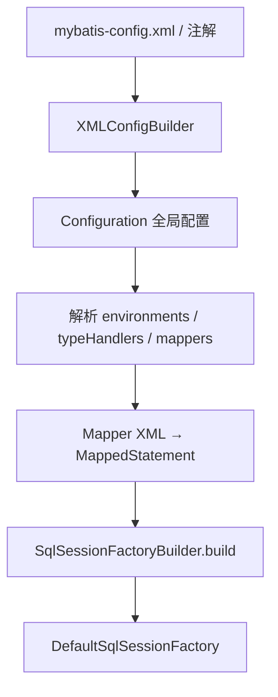
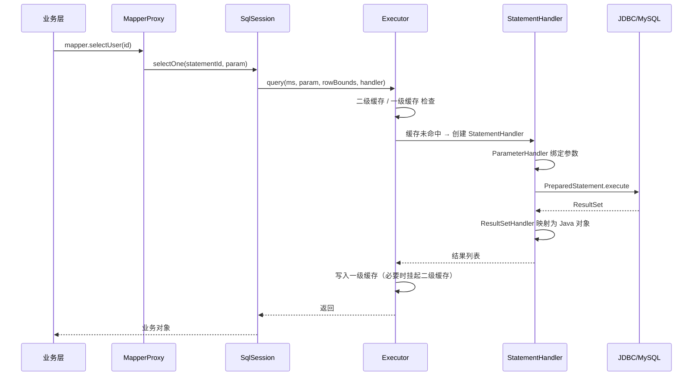

## MyBatis 核心组件与 SQL 执行全流程

MyBatis 的本质是一个 **半自动 ORM** 框架：用配置或注解把 Java 方法与 SQL 绑定，把结果集映射成对象。理解从 `SqlSessionFactory` 初始化到 `ResultSet` 映射的全过程，是做插件扩展、二级缓存调优和 SQL 排障的前提。

本篇聚焦**执行内核**。连接池与生产规约见 [MyBatis 持久层原理与 HikariCP](0-mybatis-hikaricp.md)；插件与缓存见 [插件原理与二级缓存](2-mybatis-cache-plugin.md)。

---

## 一、核心组件体系

| 组件 | 职责 | 是否线程安全 |
| :--- | :--- | :--- |
| `SqlSessionFactoryBuilder` | 读 XML/配置流，一次性构建 `SqlSessionFactory` 后可丢弃 | 构建期短命 |
| `SqlSessionFactory` | 生产 `SqlSession` 的单例工厂 | 是 |
| `SqlSession` | 一次数据库会话的门面 | **否**，请求结束必须关闭 |
| `Executor` | 调度缓存、事务与 `StatementHandler` | 与 Session 绑定 |
| `StatementHandler` | JDBC `Statement` 预编译与执行 | 单次语句级 |
| `ParameterHandler` | Java 入参 → JDBC 占位符 | 单次语句级 |
| `ResultSetHandler` | `ResultSet` → Java 对象 | 单次语句级 |
| `TypeHandler` | Java 类型 ↔ JDBC 类型互转 | 全局注册，可复用 |
| `MappedStatement` | 一条 SQL 的完整元数据（id、SQL 源、结果映射等） | 启动后只读 |

配置解析完成后，所有 Mapper 方法对应的 SQL 元数据都落在全局 `Configuration` 的 `mappedStatements` 中，Key 为全限定方法名（如 `com.app.UserMapper.selectById`）。

---

## 二、启动：从 XML 到 Configuration



关键产物：

1. **`Configuration`**：全局单例配置中枢，持有 `MappedStatement`、拦截器链、`TypeHandlerRegistry`、`ObjectFactory` 等。
2. **`MappedStatement`**：一条 SQL 的“说明书”，包含 `SqlSource`（动态 SQL 解析结果）、`resultMaps`、`cache`、`flushCache`、`useCache` 等开关。
3. **`SqlSource`**：静态 SQL 是 `StaticSqlSource`；含 `${}` / `<if>` 等动态节点时，会先建成 `DynamicSqlSource`，执行期再解析成 `BoundSql`。

Spring 集成时，通常由 `SqlSessionFactoryBean` 完成上述构建，并通过 `MapperScannerConfigurer` / `@MapperScan` 把接口注册成 Bean。

---

## 三、SQL 执行生命周期全景

从调用 Mapper 接口方法到拿到结果，典型链路如下：



### 1. Executor 的三种形态

| 类型 | 特点 | 适用场景 |
| :--- | :--- | :--- |
| `SimpleExecutor` | 每次执行新建 `Statement` | 默认、通用 |
| `ReuseExecutor` | 同 SQL 复用 `Statement` | 同一 Session 内重复语句 |
| `BatchExecutor` | `addBatch` / `executeBatch` | 批量写，需注意返回值与缓存 |

开启二级缓存时，外层还会再包一层 **`CachingExecutor`**，先查 Namespace 级缓存，未命中再委托给真正的 Executor。

### 2. BoundSql 与参数绑定

执行前，`SqlSource.getBoundSql(parameterObject)` 产出：

- **`sql`**：可交给 JDBC 的最终 SQL 文本（`?` 占位）。
- **`parameterMappings`**：参数名、`TypeHandler`、`jdbcType` 的有序列表。
- **`parameterObject`**：原始入参（Map / POJO / 基本类型包装）。

`ParameterHandler` 按 `parameterMappings` 顺序调用对应 `TypeHandler.setParameter`，完成 `PreparedStatement` 绑定。

### 3. 结果映射 ResultMap

`ResultSetHandler`（默认 `DefaultResultSetHandler`）负责：

1. 按列标签 / 列序读取 `ResultSet`。
2. 用 `ObjectFactory` 创建目标对象。
3. 处理嵌套 `association` / `collection`（联表一次映射 vs 嵌套 Select）。
4. 自动映射（`autoMappingBehavior`）与显式 `resultMap` 的优先级协调。

嵌套 Select 的 `collection select=` 容易触发 **N+1**，生产应优先 `JOIN + resultMap` 一次映射。详见 [HikariCP 篇中的开发规约](0-mybatis-hikaricp.md)。

---

## 四、Mapper 接口如何“无中生有”

Mapper 没有实现类，运行时依赖 **JDK 动态代理**。

### 1. 注册阶段

`MapperRegistry.addMapper(UserMapper.class)`：

- 校验接口合法性。
- 为接口创建 `MapperProxyFactory`。
- 解析接口方法上的注解 SQL（若存在），注册为 `MappedStatement`。

### 2. 获取阶段

`sqlSession.getMapper(UserMapper.class)` → `MapperProxyFactory.newInstance(sqlSession)` → `Proxy.newProxyInstance(..., MapperProxy)`。

### 3. 调用阶段

`MapperProxy.invoke`：

1. 忽略 `Object` 方法（`toString` / `hashCode` 等）。
2. 将方法解析为 `MapperMethod`（缓存起来，避免重复反射）。
3. `MapperMethod.execute(sqlSession, args)` 按返回类型分发：
   - `INSERT/UPDATE/DELETE` → `sqlSession.insert/update/delete`
   - 单对象 → `selectOne`
   - `List` → `selectList`
   - `void` + `ResultHandler` → 流式消费
   - `@MapKey` → `selectMap`

方法名到 `MappedStatement` id 的约定：

```text
statementId = 接口全限定名 + "." + 方法名
例：com.app.mapper.UserMapper.selectById
```

---

## 五、动态 SQL 与 SqlNode 树

`<if>`、`<where>`、`<foreach>`、`<choose>` 等在解析期编译成 `SqlNode` 树。执行时：

1. 用 OGNL 计算表达式（如 `user != null and user.name != null`）。
2. 拼接最终 SQL 片段与参数映射。
3. 输出 `BoundSql`。

注意：

- **`#{}`**：预编译占位，防 SQL 注入，走 `TypeHandler`。
- **`${}`**：字符串直接替换，用于动态表名/列名时必须严格校验白名单，禁止拼接用户输入。

```xml
<select id="search" resultType="User">
  SELECT * FROM user
  <where>
    <if test="name != null and name != ''">
      AND name = #{name}
    </if>
    <if test="status != null">
      AND status = #{status}
    </if>
  </where>
</select>
```

---

## 六、与 Spring 集成时的关键差异

| 点 | 原生 MyBatis | Spring + MyBatis |
| :--- | :--- | :--- |
| Session 生命周期 | 手写 `open/close` | `SqlSessionTemplate` 线程安全门面，每方法绑定/解绑 |
| 事务 | `sqlSession.commit/rollback` | 与 Spring `PlatformTransactionManager` 同步 |
| Mapper 注入 | `getMapper` | `@Autowired UserMapper`（工厂 Bean） |
| 异常 | `PersistenceException` | 常转换为 Spring `DataAccessException` |

`SqlSessionTemplate` 内部通过 `SqlSessionUtils` 从当前事务获取（或新建）`SqlSession`，保证同一事务内一级缓存与连接一致。

---

## 七、排障检查清单

1. **`BindingException: Invalid bound statement`**：`statementId` 与 XML `namespace` + `id` 不一致，或 Mapper XML 未加载。
2. **参数绑定失败**：多参数未加 `@Param`，导致 OGNL 找不到属性。
3. **结果为 null / 字段全空**：列名与属性名映射失败（未开驼峰、`resultMap` 写错）。
4. **动态 SQL 恒真/恒假**：OGNL 对基本类型包装、空字符串判断不熟。
5. **批量写未生效**：`BatchExecutor` 未 `flushStatements`，或 Spring 事务未提交。

---

## 八、总结

- **纵向链路**：`MapperProxy` → `SqlSession` → `Executor` → `StatementHandler` → JDBC。
- **横向扩展**：`Interceptor` 责任链可在上述节点织入（见 [插件篇](2-mybatis-cache-plugin.md)）。
- **元数据中心**：一切 SQL 行为最终都归结为 `Configuration` 上的 `MappedStatement`。

掌握这条链路后，阅读 MyBatis-Plus 分页插件、多租户拦截器或自定义 `TypeHandler` 会顺畅很多。
