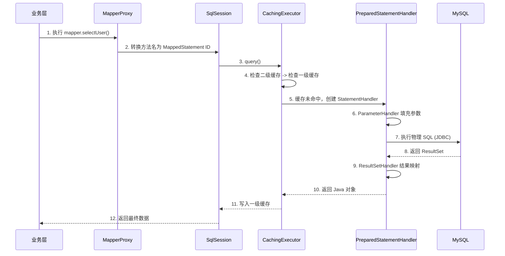

## MyBatis 核心组件与 SQL 执行全流程

MyBatis 的本质是一个 **ORM（对象关系映射）** 框架。它通过配置文件或注解，将 Java 接口及其方法与 SQL 语句绑定。理解其从 `SqlSessionFactory` 初始化到 `ResultSet` 映射的全过程，是进行 MyBatis 深度调优的前提。

---

## 一、 MyBatis 核心组件体系

MyBatis 的运行依赖于几个核心组件的协同工作：

1.  **`SqlSessionFactoryBuilder`**：通过读取 XML 配置流，一次性构建出 `SqlSessionFactory` 后即可销毁。
2.  **`SqlSessionFactory`**：单例工厂，负责生产 `SqlSession`。
3.  **`SqlSession`**：核心抽象接口，代表与数据库的一次会话。注意：它不是线程安全的，必须在请求结束后关闭。
4.  **`Executor`**：真正的 SQL 执行器。负责维护一级、二级缓存，并调度 `StatementHandler`。
5.  **`StatementHandler`**：负责操作 JDBC 的 `Statement` 预编译和 SQL 执行。
6.  **`TypeHandler`**：负责 Java 类型与 JDBC 类型之间的相互转换。

---

## 二、 SQL 执行生命周期全景图

从调用 Mapper 接口方法到获取结果，MyBatis 经历了以下核心链路：

---

## 三、 Mapper 接口的“无中生有”：JDK 动态代理

为什么 Mapper 接口没有实现类却能运行？

1.  **启动阶段**：MyBatis 通过 `MapperRegistry` 扫描接口，并为每个接口注册一个 `MapperProxyFactory`。
2.  **获取阶段**：调用 `sqlSession.getMapper(UserMapper.class)` 时，实际上是由 `MapperProxyFactory` 利用 JDK 动态代理创建了一个 `MapperProxy` 实例。
3.  **调用阶段**：当执行接口方法时，会被代理对象的 `invoke` 方法拦截。它会根据方法的全限定名（如 `com.app.UserMapper.selectById`）去匹配全局配置中的 `MappedStatement`，进而触发 SQL 执行逻辑。

---

## 四、 总结

MyBatis 的设计极其凝练：
- **纵向链路**：`SqlSession` -> `Executor` -> `StatementHandler` -> `JDBC`。
- **横向扩展**：通过 `Interceptor` 责任链在上述组件之间织入插件。

这种“小而美”的架构使得它在保证高性能的同时，拥有了极强的社区扩展性（如 MyBatis-Plus 的各种增强）。
