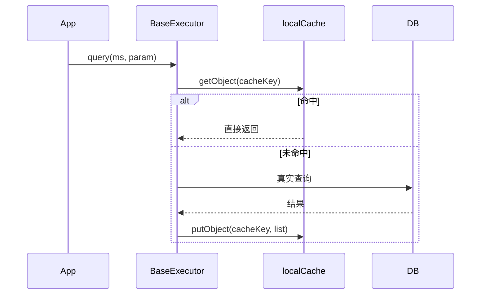
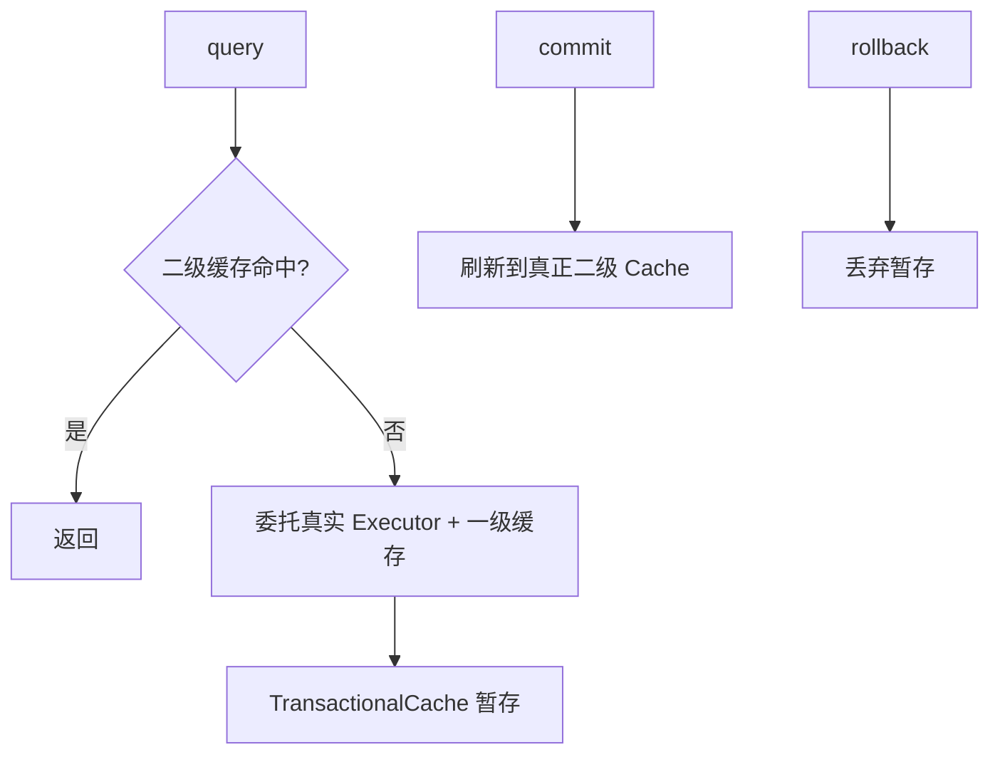

## MyBatis 插件原理与二级缓存深度剖析

MyBatis 的扩展性主要体现在 **插件（Interceptor）**，性能优化则依赖 **一级 / 二级缓存**。本篇从源码结构讲清拦截点、代理包裹顺序、缓存读写时机与生产避坑。

相关阅读：[SQL 执行全流程](1-mybatis-core-flow.md)、[HikariCP 与生产规约](0-mybatis-hikaricp.md)、[Spring Cache](../spring/boot/16-spring-cache.md)。

---

## 一、插件机制：责任链 + JDK 动态代理

### 1. 可拦截的四个接口

MyBatis 只允许拦截下列接口上的方法（`@Intercepts` + `@Signature` 声明）：

| 目标接口 | 常见拦截方法 | 典型用途 |
| :--- | :--- | :--- |
| `Executor` | `update` / `query` / `commit` / `rollback` | 二级缓存外围、审计、分表路由 |
| `StatementHandler` | `prepare` / `parameterize` / `query` / `update` | **分页、多租户改 SQL、慢 SQL 监控** |
| `ParameterHandler` | `setParameters` | 参数加密、统一填充 |
| `ResultSetHandler` | `handleResultSets` | 结果脱敏、自定义类型装配 |

选错拦截点是插件无效的第一原因：改 SQL 文本通常拦 `StatementHandler.prepare`；改结果拦 `ResultSetHandler`。

### 2. 加载与层层包裹


核心逻辑（语义）：

```java
// InterceptorChain.pluginAll
public Object pluginAll(Object target) {
    for (Interceptor interceptor : interceptors) {
        target = interceptor.plugin(target); // 通常 Plugin.wrap(target, this)
    }
    return target;
}
```

`Plugin.wrap` 会：

1. 读取 `@Intercepts` 上的方法签名集合。
2. 若 `target` 实现了被声明的接口，则 `Proxy.newProxyInstance` 生成代理。
3. 调用命中方法时进入 `Interceptor.intercept(Invocation)`；否则直接反射调用原方法。

**调用顺序**：先注册的拦截器在责任链**更外层**（更先进入 `intercept`，也更后 `proceed` 回来）。需要“最后改 SQL”时要注意注册顺序。

### 3. 最小可运行插件骨架

```java
@Intercepts({
    @Signature(
        type = StatementHandler.class,
        method = "prepare",
        args = { Connection.class, Integer.class }
    )
})
public class SqlMonitorInterceptor implements Interceptor {

    @Override
    public Object intercept(Invocation invocation) throws Throwable {
        StatementHandler handler = (StatementHandler) invocation.getTarget();
        BoundSql boundSql = handler.getBoundSql();
        long start = System.nanoTime();
        try {
            return invocation.proceed();
        } finally {
            long costMs = (System.nanoTime() - start) / 1_000_000;
            if (costMs > 200) {
                // 生产中接入日志/metrics，注意脱敏
                System.out.println("slow sql cost=" + costMs + "ms sql=" + boundSql.getSql());
            }
        }
    }

    @Override
    public Object plugin(Object target) {
        return Plugin.wrap(target, this);
    }
}
```

从代理对象上取内部字段时，常用 `SystemMetaObject.forObject(target)` 做反射路径访问（如 `delegate.boundSql.sql`）。注意目标可能已被多层代理包裹，必要时循环拆 `Plugin` 拿到真实 `StatementHandler`。

### 4. 多租户 / 改写 SQL 的正确姿势

1. 拦截 `StatementHandler.prepare`。
2. 取出 `BoundSql.sql`，用 JSqlParser 等解析器**结构化改写**（避免纯字符串拼 `AND tenant_id=`）。
3. 将改写后的 SQL 写回 `BoundSql`，并补齐 `ParameterMapping` / 参数值。
4. 租户 ID 从 `ThreadLocal` / SecurityContext 读取，禁止信任客户端入参。

加密字段更适合拦 `ParameterHandler.setParameters` 与 `ResultSetHandler`（写加密、读解密），与改 SQL 插件拆开，单一职责。

---

## 二、一级缓存（Local Cache）

### 1. 作用域与存储

- **作用域**：默认 `SESSION`（整个 `SqlSession` 生命周期）。
- **存储位置**：`BaseExecutor.localCache`（`PerpetualCache`，本质 `HashMap`）。
- **缓存 Key**：`CacheKey` 由 `statementId + rowBounds + SQL + 参数 + environmentId` 等组成。



### 2. 失效时机

以下任一发生，一级缓存相关数据会被清理或不可信：

| 事件 | 行为 |
| :--- | :--- |
| 任意 `update/insert/delete` | 清空当前 Session 一级缓存 |
| `sqlSession.clearCache()` | 显式清空 |
| `sqlSession.close()` | Session 销毁 |
| 配置 `localCacheScope=STATEMENT` | 每条语句结束即清，近似关闭一级缓存 |

### 3. 脏读风险

多线程共享同一 `SqlSession`（错误用法）或长 Session 跨请求复用，会读到过期数据。Spring 下通常每方法一个 Session，一级缓存仅在**同一事务 / 同一方法内**复用查询有意义。

---

## 三、二级缓存（Second Level Cache）

### 1. 作用域与开启条件

- **作用域**：`MappedStatement` 所属 **Namespace**（通常一个 Mapper 接口）。
- **开启步骤**：
  1. 全局 `settings.cacheEnabled=true`（默认 true）。
  2. Mapper XML 声明 `<cache />` 或 `<cache-ref namespace="..."/>`。
  3. 对应语句 `useCache=true`（查询默认 true，写操作会 `flushCache`）。
  4. 结果对象建议实现 `Serializable`（`PerpetualCache` 存引用；一旦序列化存储或跨 JVM 则必须可序列化）。

### 2. CachingExecutor 与事务性缓存



关键点：

- 查询命中二级缓存前，会先走 `CachingExecutor`。
- **事务未提交前**，写入落在 `TransactionalCache`，避免脏数据被其他 Session 读到。
- **`commit` 后**才真正 `put` 进 Namespace 的 `Cache` 实现；`rollback` 则丢弃。

### 3. 默认缓存实现

`<cache />` 默认：

- 实现类：`PerpetualCache`（内存 Map）+ `LruCache` 装饰（淘汰）。
- 可配置：`eviction`（LRU/FIFO/SOFT/WEAK）、`flushInterval`、`size`、`readOnly`、`blocking`。

`readOnly=true` 时直接返回缓存引用（高性能，但调用方改对象会污染缓存）；`false` 时通过序列化返回拷贝。

### 4. 跨 Mapper 关联与 flush 风暴

- 多表业务若只在一个 Namespace 开二级缓存，关联数据更新在另一 Mapper 时**不会自动失效** → 脏读。
- 缓解：`<cache-ref>` 共享缓存、更新时显式 `flushCache=true`、或**直接不用本地二级缓存**改用 Redis 统一失效。

---

## 四、生产级缓存策略建议

| 场景 | 建议 |
| :--- | :--- |
| 单机、字典/配置类只读数据 | 可开二级缓存，设合理 `flushInterval` |
| 多实例部署 | **禁用** MyBatis 本地二级缓存，改 Redis / Spring Cache |
| 强一致读写 | 依赖 DB + 事务，不在 ORM 层做长生命周期缓存 |
| 热点业务对象 | 优先 Spring Cache / 本地 Caffeine + 明确 key 与 TTL |
| 分页大结果 | 不要缓存整表 List；缓存单实体或短 key 聚合 |

Redis 集成方式：实现 `org.apache.ibatis.cache.Cache`，在 `<cache type="com.app.RedisCache"/>` 指定。务必实现：

- 可序列化 value
- 按 Namespace 划分 key 前缀
- `clear()` 时只清本 Namespace（避免 `KEYS *`）
- 与 DB 写操作的失效策略（Cache-Aside）

---

## 五、插件 + 缓存组合时的注意点

1. **拦截 `Executor.query` 时**：你处于 `CachingExecutor` 内外取决于插件注册与包装顺序，测缓存命中率时要确认拦到的层级。
2. **改 SQL 的插件**：会改变 `CacheKey` 中的 SQL 部分，租户条件不同应落到不同缓存键，避免串租户。
3. **批量 Executor**：缓存行为与 simple 模式不同，批量写后记得理解 flush 时机。

---

## 六、总结

- **插件**：四接口 + `@Intercepts` + `Plugin.wrap` 责任链；改 SQL 优先 `StatementHandler`，改参数/结果用 PH/RH。
- **一级缓存**：Session 级，写操作即失效；Spring 短 Session 下收益有限但同方法重复查有效。
- **二级缓存**：Namespace 级 + 事务性提交可见；分布式场景宁可用 Redis / Spring Cache，也不要迷信本地二级缓存。

下一站可将插件与 [HikariCP 连接池调优](0-mybatis-hikaricp.md) 结合，做完整的持久层观测（慢 SQL、连接占用、缓存命中率）。
