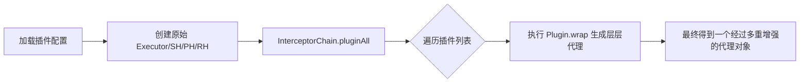

## MyBatis 插件原理与二级缓存深度剖析

MyBatis 的扩展性主要体现在 **插件（Interceptor）** 机制，而其性能优化则离不开 **一级/二级缓存**。本篇将从源码级别深入探讨这两大核心特性。

---

## 一、 插件机制：基于责任链与动态代理

MyBatis 允许我们在 SQL 执行生命周期的特定点进行拦截。其底层实现是 **JDK 动态代理 + 责任链模式**。

### 1. 插件拦截的对象
MyBatis 明确规定，只能拦截以下 4 个接口的方法：
- **`Executor`**：拦截执行器的底层逻辑（包含缓存、事务处理）。
- **`StatementHandler`**：拦截 SQL 的预编译与执行（最常用，用于分页、脱敏）。
- **`ParameterHandler`**：拦截参数设置。
- **`ResultSetHandler`**：拦截结果映射（用于自定义转换逻辑）。

### 2. 插件的加载与包裹流程

**核心源码提示**：`pluginAll` 方法会不断调用 `Interceptor.plugin(target)`，层层包裹。当执行方法时，请求会从最外层的代理对象依次传递到最内层。

---

## 二、 MyBatis 缓存体系深度剖析

MyBatis 设计了二级缓存模型来减少数据库查询压力。

### 1. 一级缓存 (Local Cache)
- **作用域**：`SqlSession` 级别。
- **失效时机**：`SqlSession.close()`、显式调用 `clearCache()`、或者执行了 **任何增删改 (INSERT/UPDATE/DELETE)** 操作。
- **注意**：在分布式或多 Session 环境下，一级缓存可能会读到脏数据。

### 2. 二级缓存 (Second Level Cache)
- **作用域**：`Namespace`（通常对应一个 Mapper 文件）级别。
- **开启方式**：需在 Mapper XML 中配置 `<cache />` 标签，且实体类必须实现 `Serializable`。
- **工作模型**：
  - 查询先走二级缓存，未命中再走一级缓存。
  - **重要细节**：二级缓存中的数据只有在 `SqlSession` **提交（commit）** 之后，才会真正从 `TransactionalCache` 刷新到永久二级缓存中。

$$
\text{命中率} = \frac{\text{Cache Hits}}{\text{Total Requests}}
$$

### 3. 三方缓存集成
由于 MyBatis 原生二级缓存不支持分布式（无法共享内存），生产环境通常使用 **Redis** 代替原生缓存。通过实现 `org.apache.ibatis.cache.Cache` 接口，可以轻松将存储引擎切换到 Redis 环境。

---

## 三、 总结

- **插件**：MyBatis 通过 AOP 机制给予了开发者在 SQL 执行全生命周期任意“插桩”的能力。
- **缓存**：设计上遵循了“读写分离”和“事务性缓存”的原则，但也提醒我们在高并发一致性场景下需谨慎使用。
