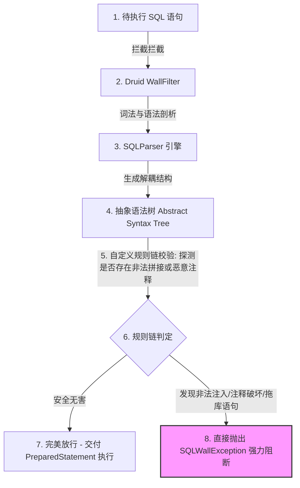
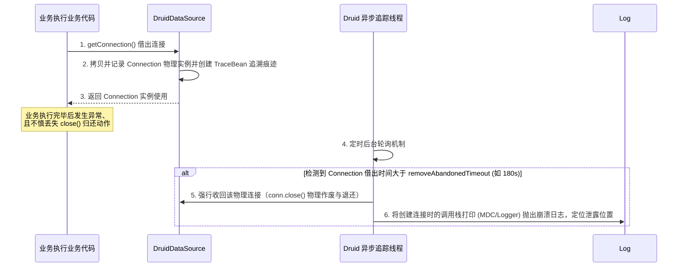

## Druid 连接池内核机制精剖与 HikariCP 对比调优

在多线程高并发的大型 Java 系统中，**数据库连接池（Connection Pool）** 作为数据源的最核心底座，决定了系统对高并发流量的最终承载上限。
目前，国内最主流的两个顶级连接池是 **HikariCP（Spring Boot 2+ 默认内置，以极致吞吐和快著称）** 与 **Alibaba Druid（以无懈可击的强大监控、防 SQL 注入及丰富的高阶扩展著称）**。

本篇将从源码深度出发，剖析 Druid 连接池的防 SQL 注入、连接泄露精确追踪、保活机制等内核，并给出两大连接池的生产级对比调优策略。

---

## 一、 Druid 核心武器：基于 AST（抽象语法树）的防 SQL 注入底层

Druid 相比于其他连接池能有效应对恶意的黑客 SQL 注入，核心就在于其集成了阿里巴巴强大的关系型数据库解析器（**Parser**）。
它通过内置的 **SQL 注入拦截过滤器（`WallFilter`）**，在 SQL 发送给数据库驱动之前，先通过物理 AST 进行深层静态扫描。



### 1. AST 语法树解析拦截机制

例如，黑客经常通过拼接恶意短句试图拖库或欺骗 SQL 引擎：

```sql
SELECT * FROM users WHERE username = 'admin' OR '1' = '1'
```

传统的数据库驱动很难防御这种合法但违背业务逻辑的语句。
而在 Druid 中：
1. **词法分析（Lexer）** 将此 SQL 拆分为 `SELECT`, `*`, `FROM`, `users`, `WHERE`, `username`, `=`, `'admin'`, `OR`, `'1'`, `=`, `'1'` 等 Token 记号。
2. **语法分析（AST Parser）** 构建起整棵抽象语法树，清晰识别出此 `WHERE` 条件中包含了一个 **BinaryOpExpr（二元操作算术表达式）且该表达式的结果恒为 `TRUE`**。
3. **WallFilter 规则处理器** 发现这个恒成立的算子属于致命的拖库特征，立刻阻断、绝不将此 SQL 提交给底层的物理 Socket 链接执行，从而做到 100% 的底层安全防御。

---

## 二、 生产级痛点：数据库连接泄露的精确追踪与自愈

在大型分布式系统中，由于个别开发者在编写 JDBC 或 MyBatis 逻辑时未在 `finally` 中关闭 Connection、或者第三方框架框架存在 Bug，会导致 Connection 无法被拔除、无法归还连接池，这就是致命的 **连接泄露（Connection Leak）**。
当泄露累积到最大连接数之后，整站系统会被全部挂出，报出无法获取连接的红线崩溃。



### 1. 如何启用连接泄露精确追踪

在 Spring Boot 的数据源配置中激活以下参数：

```yaml
spring:
  datasource:
    druid:
      # 1. 开启连接泄露回收机制
      remove-abandoned: true
      # 2. 连接借出最长保留时限：超过 180 秒未关闭，判定为链接泄漏并强制物理收回
      remove-abandoned-timeout: 180
      # 3. 强力报警：将由于泄漏被强制收回的连接创建时的【调用链栈 Trace】打印到日志中，极其利于排查犯错代码
      log-abandoned: true
```

* **底层代价（注意）**：开启 `log-abandoned: true` 会在每次借出连接时，通过 `Thread.currentThread().getStackTrace()` 强行捕获并实例化一份当前调用栈对象。**这涉及到极高的 JVM 元空间分配及 CPU 时间损耗**，吞吐会有小幅倒退。因此，**仅在排查泄露的测试阶段、或由于泄漏导致大面积瘫痪的生产紧急自愈阶段启用，排查完毕后应立刻关闭。**

---

## 三、 Druid 稳健的弹性保活机制（KeepAlive）

当系统处于深夜等业务极度低谷期时，数据库会主动剔除并斩断在操作系统底层长期空置或休眠的 TCP 超时连接（如 MySQL 的 `wait_timeout` 超时）。
如果连接池对此一无所知，在次日清晨秒杀流量涌入时，连接池拿出一个失效、废弃的死物理 Socket 交给业务执行方法，会瞬间引发大面积业务报错雪崩。

Druid 用非常完备且优雅的 **三个定时测试检测机制** 保障连接完全活泼可靠：

```yaml
spring:
  datasource:
    druid:
      # 1. 每次从连接池【借出】连接时，是否进行活跃度检测（不推荐生产高并发开启，太慢）
      test-on-borrow: false
      # 2. 每次【归还】连接时，是否进行活跃度检测（不推荐开启，影响归还效率）
      test-on-return: false
      # 3. 【极度推荐，性能无损】空闲检测机制：如果空闲时间大于该值，异步测试连接
      test-while-idle: true
      time-between-eviction-runs-millis: 60000 # 每隔一分钟在后台执行测试扫描
      # 4. Druid 特有的连接保活：发现空闲连接就异步发送数据库心跳 SQL 语句检查
      keep-alive: true
      validation-query: SELECT 1
```

* **活性守护原理**：当 `test-while-idle` 和 `keep-alive` 共同启用时，Druid 会在后台每隔 `time-between-eviction-runs-millis`（一分钟）启动一个异步清理线程（`DestroyConnectionThread`），它不会阻塞主业务，而是温和地在后台向所有的空闲连接执行一次极简的底层心跳 SQL校验（如 `SELECT 1`）。若通过，则安全保活，并在 OS 层面保持心跳连接。若不通过或连接断开，立马将此废连接踢下线并创建新连接顶上，确保业务拿到的绝对是 100% 健康的真连接。

---

## 四、 两大顶级连接池深度、细节全参数对比调优

在 2026 年的高并发架构实践中，我们如何根据大厂业务指标、环境对两大连接池进行参数对标与精确调优？

### 1. 两大池化方案差异对比表

| 考察指标 | HikariCP 连接池 | Alibaba Druid 连接池 |
| :--- | :--- | :--- |
| **性能吞吐量** | **极致（全行业最高，依靠定制 `FastList`、无锁池化、多核减负）** | 极佳（略逊于 HikariCP，因为内置拦截过滤器链条长） |
| **监控监控面板** | 基础且薄弱 | **无懈可击（自带极度强大的 Web 仪表盘监控界面、可监控 SQL 慢日志、SQL 执行频次、连接泄漏指标）** |
| **安全 WallFilter** | 无 | **内置极强的 SQL 词法抽象分析、拦截黑客恶意注入** |
| **防泄露检测** | 支持（通过 LeakDetectionThread 警告并记录，但不强制抢先回收） | **超级强化（支持 removeAbandoned 优雅强力回收死连接并上报栈追踪）** |
| **代码体积与侵入性** | 极轻（仅 100 多 KB，无任何外部强制依赖） | 较重（包含大量内置监控、Web 拦截映射） |

### 2. 生产级调优黄金参数配置

为了保障线上持久化极速稳定、不产生抖动宕机，我们在大厂微服务实践中通常将以下调优模板作为规范：

#### A. HikariCP 大厂大流量生产环境配置模板

```yaml
spring:
  datasource:
    type: com.zaxxer.hikari.HikariDataSource
    hikari:
      # 统一固化最小与最大：避免数据库空负载期高频创建和销毁物理连接产生的 TCP 三次握手延迟及 CPU 波动
      minimum-idle: 20
      maximum-pool-size: 20
      # 连接借出最大超时：一般设置为 3 秒，若超时立刻熔断返回，防止拖慢整链微服务
      connection-timeout: 3000
      # 一个连接在池中空闲的最长时限：超过则强制销毁并重新初始化
      idle-timeout: 300000
      # 一个连接在池中的最大存活生命：强烈指定在 30 分钟以内（必须低于 MySQL 本身 wait_timeout，防止由于远端主动掐断而不知情）
      max-lifetime: 1800000
      # 心跳测试 SQL
      connection-test-query: SELECT 1
```

#### B. Alibaba Druid 高安全性多指标生产环境配置模板

```yaml
spring:
  datasource:
    type: com.alibaba.druid.pool.DruidDataSource
    druid:
      # 初始化、最小、最大固定设置
      initial-size: 20
      min-idle: 20
      max-active: 20
      # 连接获取最大等待 3000 毫秒
      max-wait: 3000
      # 物理拦截链过滤器：stat (监控指标展示), wall (黑客 SQL 防注入拦截防护)
      filters: stat,wall
      # 异步空闲健康活性检测
      test-while-idle: true
      keep-alive: true
      time-between-eviction-runs-millis: 60000
      min-evictable-idle-time-millis: 300000
      validation-query: SELECT 1
      # 开启本地监控面板与慢 SQL 慢日志诊断拦截
      filter:
        stat:
          db-type: mysql
          log-slow-sql: true
          slow-sql-millis: 1000 # 慢 SQL 阈值 1 秒，自动收集
```

大厂分布式高负载选用原则：
* **核心业务（核心订单下单、扣减库存、账单核算等追求毫秒级抗压与高频 CAS 的极高能 QPS 微服务）**：战略性优选 **HikariCP**，它用最透彻的心智设计，保障了最底层的零杂质、最轻量极速状态，多核 CPU 抢夺吞吐无解。
* **中台系统、跨国大系统、需对外公开 API 系统以及对复杂 SQL 调试、监控报表具有极高指标诉求的外部网点/数据中台**：毫无疑问选用 **Alibaba Druid**，它用固若金汤的 AST 防御及清晰直观的可视化日志统计，帮助运维和开发直击慢 SQL SQL 与泄漏元凶。
