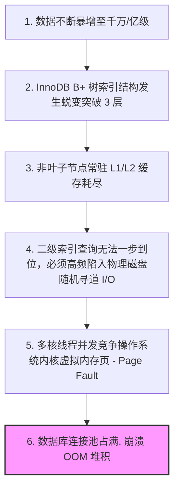
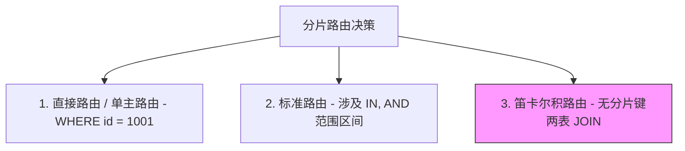

## ShardingSphere 分库分表与读写分离内核机制精剖

在互联网高并发、海量数据的场景下，单表数据量一旦突破 **千万级（如 InnoDB 的 B+ 树层级突破 3 层、面临局部 I/O 的大幅磁盘寻道抖动）** 或是单库数据库容量面临物理极限，传统的单机 SQL 调优、创建大覆盖度二级索引将彻底失效。
要从物理上根治这一桎梏，微服务架构体系必须引入 **分布式分库分表（Sharding）与数据库读写分离（Read-Write Splitting）**。

目前，在这个领域国内最具统治力的云原生底座是 Apache 的顶级开源项目 **ShardingSphere（包括 ShardingSphere-JDBC 与 ShardingSphere-Proxy）**。

本篇将深入底层，拆解 ShardingSphere 将一条逻辑 SQL 改写并完美路由、执行并归并至多个数据库节点的 **“内核五部曲核心流”**。

---

## 一、 为什么单表千万级后写入与读取会暴停

我们首先要从底层的 **B+ 树存储和 OS 虚拟页调度** 弄清楚分库分表的“物理宿命论”：



* **数据分裂方案**：
  * **垂直分库**：根据业务维度将表分散（如将 `t_user` 放用户库，`t_order` 放订单库）。解决的是**多核 CPU 与数据库物理连接池的竞争问题**。
  * **水平分片**：将一张订单表按某种哈希算法（如订单 ID 取模）打散，物理存储至若干个表（`t_order_0` 到 `t_order_15`）。解决的是**单表数据量过大导致索引退化和 I/O 争枪瓶颈**。

---

## 二、 ShardingSphere 内核：逻辑 SQL 转换的“五部曲”

ShardingSphere 最主要做的事是：**对业务系统完全无感透明**。开发人员写的是标准逻辑 SQL：

```sql
SELECT * FROM t_order WHERE order_id = 1001;
```

而 ShardingSphere 需要在底层将其编译、改写成能在 MySQL 物理分库、分表中精准执行的物理 SQL 语句。这就依托了极其硬核的 **逻辑 SQL 转换五步算法**：


### 【第一部曲】：SQL 解析（SQL Parsing）

它是将一串在 Java 堆中乱序存储的“SQL 物理字符串”转换为结构化的、可计算的 **AST（抽象语法树）** 对象结构。
* **双引擎保驾护航**：ShardingSphere 提供了 **ANTLR（自研全功能型编译器）** 与底层缓存高频命中机制。它能够将解析好的 SQL 语法树元信息放入物理环形 LruCache 缓存中，在后续高频重复请求请求时免去反复二次翻译的额外损耗，保障极致微秒级性能。

---

### 【第二部曲】：路由决策（SQL Routing）

这一步的核心是：**根据你配置的分片键（Sharding Key）和分片算法，计算这条 SQL 应该发往哪个物理数据库（DS）的哪张物理表上执行**。

根据 `WHERE` 条件中包含的分片键约束，路由分为三种：



1. **直接路由（Direct Route）** / 单主路由：
   * **SQL 示意**：`SELECT * FROM t_order WHERE order_id = 9`。
   * **路由判定**：直接计算出当前哈希定位，精确定向发往单个物理库 `ds_1.t_order_1`。耗能开销最少，性能最佳。
2. **标准路由（Standard Route）**：
   * **SQL 示意**：`SELECT * FROM t_order WHERE order_id IN (1, 2, 3)`。
   * **路由判定**：计算出包含多个范围，将其解析后路由派发至特定的多个物理库和表上。
3. **笛卡尔积路由（Cartesian Route - 生产灾难！）**：
   * **SQL 示意**：`SELECT * FROM t_order o JOIN t_order_item i ON o.id = i.order_id`，但**没有在 `WHERE` 条件中指定任何 order_id 分片约束**。
   * **路由判定**：ShardingSphere 被迫对物理库中所有的 `t_order` 表和所有的 `t_order_item` 表执行组合式全索引广播 JOIN，导致物理 SQL 数量发生 $16 \times 16 = 256$ 次裂变攻击，彻底拉脱数据库连接池！
   * * **自愈绝招**：如果必须要用多表 JOIN 且涉及分片，**强烈指定绑定表规则（Binding Table）**（让两个关联表的切片拓扑算法一致并锁定，迫使同分片的 SQL 在单个节点内直接就地 JOIN）。

---

### 【第三部曲】：SQL 改写（SQL Rewriting）

我们将逻辑表（如 `t_order`）物理实例化。
* **物理转化**：将逻辑表改写定位为物理表（如 `t_order` ➜ `t_order_2`）。
* **分页补位限制（极重要，面试常青树）**：
  * **致命场景**：如果执行逻辑分页 `SELECT * FROM t_order ORDER BY price DESC LIMIT 10, 10`（在多个物理分库中查第 2 页数据）。
  * **改写的无奈逻辑**：为了保障获取到绝对精准的降序订单，ShardingSphere 无法在本地猜测，只能在所有分片上强行改写为 `LIMIT 0, 20` 拦截所有前两页元素，然后在 Step 5 内存中无损二次归并，再舍弃前 10 条而只给业务 10 条！
  * **性能瓶颈**：如果查询的是深度分页 `LIMIT 1000000, 10`。改写在物理库上会瞬间执行 `LIMIT 0, 1000010`，导致百兆数据在千百个网络 Socket 间爆发性互传并撑爆 JVM 老年代，发生 Full GC。
  * **生产推荐解决方案**：严禁进行极限深度分页，改用“滚动游标式主键翻页（即以 `id > lastMaxId` 替换 LIMIT 偏移量）”。

---

### 【第四部曲】：SQL 执行（SQL Execution）

将 SQL 提交给数据库驱动真正执行：
* **多线程执行连接控制器（Connection Mode）**：
  * **内存限制模式 (MEMORY_STRICTLY)**：大流量下优先将查询分块全部并网，使用极多个独立数据库物理 Connection 线程池去并发吞吐，换取极致并行的最快处理时延，不占内存。
  * **连接限制模式 (CONNECTION_STRICTLY)**：如果超出系统拥有的物理数据库连接上限配置，则限制并行度，将同一个分表的数据拿到一条 Connection 线程中，利用内存分页归并。
  * ShardingSphere 会在运行时通过 **执行引擎自适应策略**，依据用户的物理连接池资源现状，自动平滑调整线程控制，维持全速和不泄露的最佳运行平衡。

---

### 【第五部曲】：结果合并（Result Merging）

对各分库分表传回的杂多数据集，无缝洗涤拼装成单一逻辑数据集并交还业务：
1. **流式合并（Streaming Merging - 性能最优）**：主要是多路归并排序（Merge-Sort），通过多指针自上流读取比较，**完全不占用 JVM 超额内存**。
2. **内存合并（Memory Merging）**：主要是针对于多跨网 `GROUP BY` 或 `COUNT(DISTINCT)` 重复查询。物理表的数据必须被全额强拉入 JVM 内存中去进行二次清洗与哈希排重汇总，占用内存。

---

## 三、 企业级读写分离：数据一致性与延迟延迟自愈原理一锅端

很多大厂采用“一主多从（Master-Slaves）”的架构去降低主事务库的主写压力。但在写完（如创建订单）后，由于主从同步底层 binlog 网络传输的物理距离差，会有 **主从同步毫秒延迟**：

```mermaid
sequenceDiagram
    participant App as Spring 业务代码
    participant SS as ShardingSphere-JDBC
    participant Master as Master 物理库 (主写)
    participant Slave as Slave 物理库 (只读)

    App->>SS: 1. INSERT 创建订单 (绑定 Master)
    SS->>Master: 2. 物理写入 Master
    Note over Master, Slave: 3. MySQL 异步传输 binlog 日志 (延迟 100毫秒)
    App->>SS: 4. 读写分离规则：SELECT 查看刚刚创建的订单 (绑定 Slave)
    SS->>Slave: 5. 急速转发给 Slave 读取
    Slave-->>SS: 6. 返回空记录! (由于 100ms 同步延迟还未产生该订单)
    SS-->>App: 7. 业务层报出【订单失踪恐慌 OOM 报错!】
    style Slave fill:#f9f,stroke:#333
```

### 🏆 终极救自愈核心解决方案

#### 方案一：基于强制主库路由（Hint 机制 / Master-Route-Marker）

ShardingSphere 提供了极致可控的 **Hint 机制**。在业务中如果发生“写后立显读”等时延极度不敏感的场景时，强行插入 Hint 标，勒令下一条操作完全越过读写分离，**强制在 Master 主库上就地路由**，断绝延迟隐患！

```java
import org.apache.shardingsphere.infra.hint.HintManager;

public class OrderService {

    public void createAndQueryOrder() {
        // 1. 物理写入：自动走 Master
        orderMapper.insert(new Order(1001L, "IPHONE 17", 9999.0));

        // 2. 关键自愈点：利用 HintManager 将下一个紧接着的查询强行在 Master 上就地读取
        try (HintManager hintManager = HintManager.getInstance()) {
            // 声明写后立读：此线程内的下一次查询必定强制路由到主库
            hintManager.setWriteRouteOnly();
            
            // 3. 读取刚刚创建的订单：百分百在主库同步就绪，完美解决 100ms 延迟空单 BUG！
            Order order = orderMapper.selectById(1001L);
            System.out.println("【自愈读取】 强制主库读取成功: " + order.getProductName());
        }
        // HintManager 属于 AutoCloseable，退出其 try 块后 ThreadLocal 自动释放还原，完美避坑后续无辜查询！
    }
}
```

通过这一 Hint 机制与绑定的强制主路由方案，既大大减轻了只读从节点的压力分流，又完美自愈了分布式环境下的物理延迟硬伤，是大型微服务分布式架构中兼顾吞吐与精确度到极致的圣手设计。
