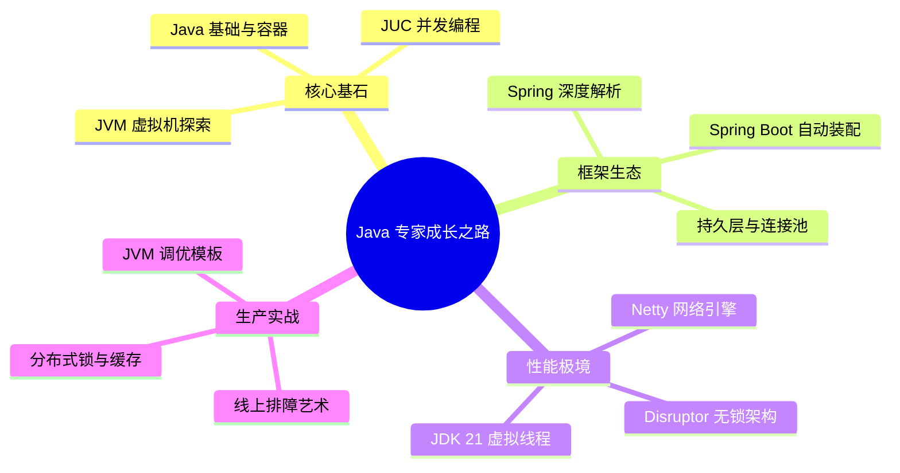

# Java 核心技术知识体系

欢迎来到 Java 深度探索之旅。本体系旨在为追求极致性能、渴望洞察底层原理的工程师提供一套**系统化、源码级**的知识图谱。

---

## 🗺️ 工程师进阶路线图

---

## 🚀 第一阶段：核心基石与底层原理 (Core Foundation)

深入解析 Java 语言最引以为傲的并发模型与内存机制。

### 1.1 Java 基础与容器 (Basic & Collections)
- [Java 基础与集合核心面试真题](basic/interview-basic.md)：深入底层剖析 String 不可变性、HashMap 与 ConcurrentHashMap 扩容演进机制。

### 1.2 JUC 高并发深度实践 (Concurrency)
- [AQS 机制与显式锁实现](concurrent/aqs-locks.md)：深入 AQS `state` 变量与双向 CLH 队列，对比公平与非公平锁。
- [HashMap 与 ConcurrentHashMap 源码](concurrent/hashmap-concurrenthashmap.md)：从 JDK 7 到 8 的演进，透析桶锁与 CAS。
- [ThreadLocal 与 CAS 核心解析](concurrent/threadlocal-cas.md)：图解内存泄漏成因及 `LongAdder` 分段热点优化。
- [线程池 ThreadPoolExecutor 全解](concurrent/threadpool.md)：掌握 `ctl` 位运算与动态调优思路。

### 1.3 JVM 虚拟机内核 (Virtual Machine)
- [内存模型与垃圾回收 (GC)](jvm/memory-gc.md)：从三色标记到 ZGC 染色指针、读屏障技术。
- [类加载体系与字节码强化](jvm/classloader-bytecode.md)：解构双亲委派模型及 Java Agent 动态插桩原理。
- [JIT 进阶之逃逸分析](jvm/escape-analysis.md)：解密标量替换与锁消除。

---

## 🏗️ 第二阶段：企业级框架深度剖析 (Framework Ecosystem)

不仅仅是使用，更要掌握 Spring 宇宙的运动规律。

### 2.1 Spring 核心全景
- [IoC 容器与 Bean 生命周期](spring/bean-lifecycle.md)：从实例化到销毁的 4 阶段全流程。
- [AOP 动态代理与链式调用](spring/ioc-aop.md)：解密为什么只有三级缓存能解决 AOP 循环依赖。
- [BeanDefinition 与容器初始化](spring/beandefinition-internals.md)：探索 Spring 如何感知开发者定义的 Bean。
- [Context Refresh 刷新流程](spring/spring-context-refresh.md)：深度拆解 Spring 容器启动的 12 个核心步骤。
- [声明式事务机制与失效场景](spring/transaction.md)：还原物理连接与 `ThreadLocal` 状态丢失。

### 2.2 Spring MVC 请求处理模型
- [Spring MVC 工作流设计](spring/springmvc-principles.md)：理解 DispatcherServlet 与 HandlerMapping 的协作。
- [Spring MVC 高级强化特性](spring/springmvc-advanced.md)：拦截器、过滤器与参数解析器深度定制。

### 2.3 Spring Boot 与微服务底座
- [Spring Boot 启动原理与自动装配](spring/springboot-core.md)：解构 `@EnableAutoConfiguration` 与 `spring.factories`。
- [Spring Boot 核心内部机制](spring/springboot-internals.md)：Environment 环境抽象与监听器模式。
- [Spring Boot FatJar 运行机制](spring/springboot-fatjar.md)：解密如何通过 `JarLauncher` 加载嵌套 Jar。
- [Spring Boot 高级扩展与调优](spring/springboot-advanced.md)：自定义 Starter 与 Endpoint 监控。
- [Spring 生态演进与 Spring Cloud 结合](spring/springboot-springcloud.md)：从 Boot 到分布式微服务架构。

### 2.4 持久层与连接池 (Persistence)
- [MyBatis 持久层原理与 HikariCP 连接池](persistence/mybatis-hikaricp.md)：HikariCP 无锁化 `LocalBag` 容器与 MyBatis 插件责任链。

---

## ⚡ 第三阶段：高性能计算与通信 (Performance)

在微秒级竞争中，探索 Linux 底层与硬件缓存的极限。

- [Netty 高性能网络编程底座](network/netty-io.md)：Epoll 空轮询 Bug 规避与堆外内存零拷贝。
- [JDK 21 虚拟线程详解](concurrent/virtual-threads.md)：解密运行在用户态的轻量协程模型。
- [Disruptor 无锁环形队列](concurrent/disruptor.md)：LMAX 架构下的预分配与零 GC 机制。
- [CPU Cache Line 伪共享调优](concurrent/cache-line-sharing.md)：使用 `@Contended` 消除 MESI 协议竞争。

---

## 🛠️ 第四阶段：生产级实战与面试复盘 (Workshop)

- [性能诊断与在线排障艺术](jvm/tuning-tools.md)：Arthas 实战与 MAT 内存泄露追踪。
- [线上故障深度复盘记录](jvm/prod-troubleshooting-cases.md)：四大经典 OOM 与 CPU 100% 根因分析。
- [JVM 启动参数黄金配置模板](jvm/prod-practice.md)：在生产环境配置 G1/ZGC。
- **核心面试真题与底层原理专题**：
  - [Java 基础与集合面试真题](basic/interview-basic.md)
  - [JUC 并发编程面试真题](concurrent/interview-concurrent.md)
  - [JVM 虚拟机面试真题](jvm/interview-jvm.md)
  - [Spring 框架生态面试真题](spring/interview-spring.md)
  - [MySQL 关系型数据库面试真题](../database/mysql/interview-mysql.md)
  - [Redis 高性能缓存面试真题](../cache/redis/interview-redis.md)

---

## 🔗 分布式联动推荐
- **分布式锁实现**：关联学习 [分布式 ZooKeeper 锁](../distributed/system/lock-zookeeper.md)。
- **分布式缓存**：关联学习 [Redis 高并发场景](../cache/redis/scenarios.md)。
