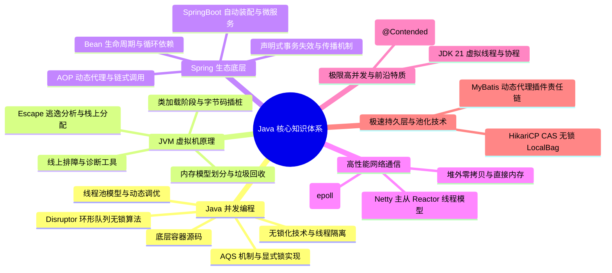

# Java 核心技术知识体系大纲

欢迎来到 Java 核心技术知识体系仓库。本大纲旨在为具有中高级 Java 开发背景、致力于向资深/专家级架构师迈进的开发者，提供一套结构清晰、底层原理扎实、实战性强的深度知识学习路线图。

---

## 🗺️ 架构全局视图

---

## 📂 体系目录指南

### 1. Java 并发编程 (Concurrency)

多线程与并发是 Java 高性能应用的基石。本板块深入 JUC 源码，剖析 AQS、并发容器、无锁机制以及线程池调优。

- **[aqs-locks.md](concurrent/aqs-locks.md)**：深入 `AbstractQueuedSynchronizer` 状态变量 `state` 与双向 CLH 队列，解析独占/共享模式及 ReentrantLock 公平与非公平锁实现差异；还原 JVM 内部 `synchronized` 偏向锁、轻量级锁至重量级锁的锁升级过程与 JDK 15+ 偏向锁废弃背景。
- **[hashmap-concurrenthashmap.md](concurrent/hashmap-concurrenthashmap.md)**：对比 JDK 7 与 JDK 8 中 HashMap 结构的重大演化与 8 树化阈值退树化逻辑；复现 JDK 7 头插法下的扩容死循环；透析 `ConcurrentHashMap` 从 Segment 分段锁到 CAS + synchronized 桶锁的锁粒度演化。
- **[threadlocal-cas.md](concurrent/threadlocal-cas.md)**：图解 Thread 内部 ThreadLocalMap 的强弱引用依赖链路，探讨内存泄漏的根本原因与 `remove()` 机制；拆解 CAS 硬件级 `lock cmpxchg` 原子性，对比 `LongAdder` 的分段分散热点提升并发吞吐量。
- **[threadpool.md](concurrent/threadpool.md)**：理解 ThreadPoolExecutor 七大参数和工作流，明晰有界/无界及不储元素阻塞队列机制；剖析 `ctl` 高 3 位运行状态与低 29 位线程数的位运算；分享动态可监控/调优线程池思路及 OOM 异常丢失预防。

### 2. JVM 虚拟机原理 (Virtual Machine)

精通 JVM 调优与底层指令是资深工程师和中级开发的分水岭。本板块从类加载、内存结构、GC 算法以及诊断工具进行深度拆解。

- **[classloader-bytecode.md](jvm/classloader-bytecode.md)**：解析类加载从验证、准备到初始化的完整的 7 个生命周期；解构双清委派模型机制、SPI 及 Tomcat 的打破实践；掌握 CGLIB 与 JDK 代理的选择机制，解构 Java Agent (premain / agentmain) 动态字节码拦截插桩原理。
- **[memory-gc.md](jvm/memory-gc.md)**：辨析堆外零拷贝 Direct Memory 与基于本地内存的 Metaspace 优缺点；深度解构并发标记下的三色标记漏标细节，对比 G1 的 SATB 原始快照与 CMS 的增量更新解决方案；剖析 ZGC 染色指针、读屏障与自 healed。
- **[tuning-tools.md](jvm/tuning-tools.md)**：实战演练线上 CPU 飙高 100% 极速排查，使用 MAT 分析 `Shallow/Retained Heap`、Dominator Tree 追踪 GC Roots；熟练运用 Arthas `dashboard`、`thread -b` 查死锁、`jad` 反编译、`watch`/`trace` 链路时延诊断。
- **[prod-practice.md](jvm/prod-practice.md)**：提供生产级 JVM 启动参数黄金配置模板（JDK 8/17/21）；拆解 JDK 9+ 统一日志框架 `-Xlog` 与 G1/ZGC 日志行；剖析由“可数循环”引发的线上安全点（Safepoint）时延异常排查。
- **[prod-troubleshooting-cases.md](jvm/prod-troubleshooting-cases.md)**：四大经典生产故障深度复盘：Groovy 脚本未缓存导致 Metaspace OOM、Netty `DirectByteBuffer` 未释放引发 OS OOM Killer、并发 `HashMap` 环形链表造成 CPU 100% 死循环、线程池 `ThreadLocal` 未 `remove()` 引发老年代 Full GC 风暴。每个案例完整还原排查命令、根因分析与解决方案。

- **[interview.md](interview.md)**：Java 核心高频面试题与底层原理解析。精选 Java 基础与集合框架、高并发与多线程（AQS/volatile/线程池）、JVM 虚拟机深度原理、Spring 底层与微服务生态、数据持久化与缓存高并发（MySQL/Redis）的核心八股题库与大厂实战排障方案。

### 3. Spring 原理与微服务生态 (Spring Ecosystem)

Spring 是企业级开发的事实标准。本板块直面 Spring IoC, AOP 源码、事务、自动装配及微服务高可用方案。

- **[ioc-aop.md](spring/ioc-aop.md)**：贯通 Spring Bean 的实例化、填充、Aware 监听、BeanPostProcessor 环绕及销毁 4 阶段；精讲 Spring 三级缓存 singletonFactories 设计，揭秘为什么只有两级缓存无法统一 AOP 代理的循环依赖；解析 ReflectiveMethodInvocation 递归责任链切面调用。
- **[transaction.md](spring/transaction.md)**：探讨 `@Transactional` 底层 AOP 代理判定，详述物理连接 Savepoint 的 `NESTED` 嵌套与 `REQUIRES_NEW` 物理独立执行差异；总结自身的 Self-invocation 绕过、Checked Exception 默认不回滚、多线程 ThreadLocal 状态丢失等 12 种失效场景。
- **[springboot-springcloud.md](spring/springboot-springcloud.md)**：详解 `@EnableAutoConfiguration` 及 2.7 之后 `imports` 文件候选包扫描；精讲 Nacos 临时实例心跳与持久实例探测机制、Distro AP 异步流与 Raft 强一致 CP 选择；拆解 Sentinel 滑动窗口监控与令牌桶/漏桶限流、慢调用降级行为。

### 4. 高性能 I/O 与 Netty 高级通信 (High-Performance Network)

在高并发微服务系统（如 Dubbo、Spring Cloud Gateway、Nacos 心跳协议）底层，高性能网络 I/O 驱动是系统的命脉。

- **[netty-io.md](network/netty-io.md)**：精讲 Linux `select`/`poll`/`epoll` 三代多路复用模型核心对比、JDK NIO 的 Epoll 空轮询 CPU 100% Bug 成因与 Netty 通过自旋重构重建 Selector 的规避机制；深度剖析一主多从与多主多从双线程 Reactor 拓扑模型，以及 Direct ByteBuf 堆外内存、CompositeByteBuf 组成的内存多维度零拷贝极致调优。

### 5. 极速持久化与连接池极限设计 (Database Persistence & Pooled Connections)

在复杂业务流与超大规模数据承载中，JVM 连接池往往是首当其冲的吞吐死穴。本板块直击企业级持久层底层。

- **[collection-orm.md](infrastructure/collection-orm.md)**：解密极致连接池霸主 HikariCP 利用无锁化 CAS 分配机制、本地孤隔离化缓存 `ThreadLocal` 的 `LocalBag` 容器与 `FastList` 逆序移去对性能的极限榨压；全流程源码解控 MyBatis 底层 JDK 动态反射代理工作流与 `Executor`、`StatementHandler` 等四级生命周期拦截插件责任链织入；深度复盘 MyBatis 生产级 SQL 隐式转换失效、全表扫、逻辑分页 OOM、以及级联 collection 特异子查询引发的 N+1 陷阱防御与架构规避。

### 6. 现代 JDK 巅峰革命与性能极境 (Modern JDK & Frontier High-Concurrency)

JVM 的底层技术正在经历前所未有的科技迭代，掌握最新的高级调优和现代化协程机制，是从资深开发跃进至顶级架构师的核心护城河。

- **[escape-analysis.md](jvm/escape-analysis.md)**：**JDK 逃逸分析技术与 JIT 底层优化**。解密 Java 代码 JIT 编译器的瞬态优化手段，深剖在**逃逸分析 (Escape Analysis)** 中，若对象未逃逸当前方法，编译器如何通过**标量替换**与**锁消除**对对象结构与同步逻辑实施解构和剔除，以消除堆分配和锁竞争。
- **[virtual-threads.md](concurrent/virtual-threads.md)**：**JDK 21+ 虚拟线程与协程深度解构**。解密 Project Loom 带来的高并发巨变，介绍运行在用户态的轻量协程模型，剖析 Carrier 线程分发逻辑、非阻塞 I/O 在底层的 Poller 协作挂起机制，以及解决“线程固定 (Pinning)”的核心秘笈。
- **[cache-line-sharing.md](concurrent/cache-line-sharing.md)**：**缓存行伪共享与 @Contended 优化**。从 CPU 多级硬件缓存行（Cache Line）级揭秘多核心计算时的“伪共享（False Sharing）”并发阻力，解构缓存一致性 MESI 协议成因，并详解现代 JDK 最优解 `@Contended` 的原理与实战参数。

### 7. 环形队列与极致无锁黑科技 (Disruptor Lock-Free Architecture)

在微秒级极端交易和大型消息中转站中，线程阻塞就是性能的深渊。JUC 的 BlockingQueue 在极境下难承其重，高阶架构必须引入无锁高能。

- **[disruptor.md](concurrent/disruptor.md)**：**LMAX Disruptor 的极致环形无锁架构**。深入分析 Disruptor 的核心 `RingBuffer` 预分配与零 GC 机制，剖析单/多生产者 Sequence 序号递增的无锁设计，对比 `WaitStrategy` 等待策略的延迟与 CPU 消耗。
- **分布式协同 ZooKeeper Curator 与 Redis 跨界融合**：
  - 结合 ZooKeeper 的 Znode 探活，剖析 Java 专属第三方客户端 **Apache Curator** 所封装的 `InterProcessMutex` 分布式重入锁、`RetryPolicy` 一系列重试策略，以及其使用的异步 Watcher 事件监听，深度联动学习 [docs/distributed/system/lock-zookeeper.md](docs/distributed/system/lock-zookeeper.md)。
  - 对抗缓存异常压力，引导在 Redis 场景下引入本地二级缓存（Caffeine）以缓解击穿，掌握高并发客户端 **Redisson** 与 JVM 内 AQS 自旋效果相同的工作原理以及 **Watchdog（看门狗自动延期）** 底层机制，深度联动学习 [docs/cache/redis/scenarios.md](docs/cache/redis/scenarios.md)、[docs/cache/redis/consistency-eviction.md](docs/cache/redis/consistency-eviction.md) 与 [docs/cache/redis/highavailability.md](docs/cache/redis/highavailability.md)。
  - 了解 Seata 分布式事务在 Java 里的核心运作：透析 Seata 的 **AT 模式（利用 SQL 解析生成 Undo Log 建立两阶段提交方案）**、**TCC 模式（基于接口的幂等/悬挂处理与空回滚实现）** 与强一致 **XA 模式**在微服务间的一致性协同，深度联动学习 [docs/distributed/system/transactions.md](docs/distributed/system/transactions.md)。
