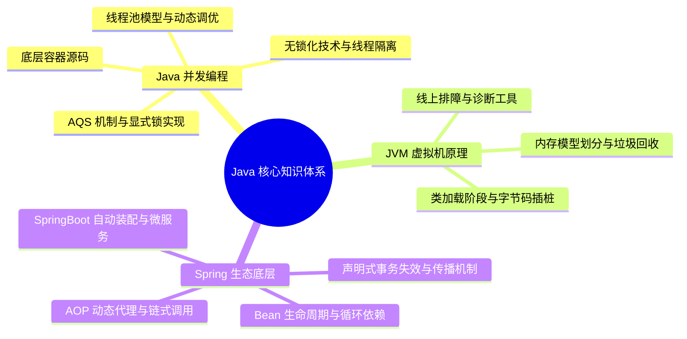

# Java 核心技术知识体系大纲

欢迎来到 Java 核心技术知识体系仓库。本大纲旨在为具有中高级 Java 开发背景、致力于向资深/专家级架构师迈进的开发者，提供一套结构清晰、底层原理扎实、实战性强的深度知识学习路线图。

---

## 🗺️ 架构全局视图

---

## 📂 体系目录指南

### 1. Java 并发编程 (Concurrency)

多线程与并发是 Java 高性能应用的基石。本板块深入 JUC 源码，剖析 AQS、并发容器、无锁机制以及线程池调优。

- **[aqs-locks.md](concurrent/aqs-locks.md)**：深入 `AbstractQueuedSynchronizer` 状态变量 `state` 与双向 CLH 队列，解析独占/共享模式及 ReentrantLock 公平与非公平锁实现差异；还原 JVM 内部 `synchronized` 偏向锁、轻量级锁至重量级锁的锁升级过程与 JDK 15+ 偏向锁废弃背景。
- **[hashmap-concurrenthashmap.md](concurrent/hashmap-concurrenthashmap.md)**：对比 JDK 7 与 JDK 8 中 HashMap 结构的重大演化与 8 树化阈值退树化逻辑；复现 JDK 7 头插法下的扩容死循环；透析 `ConcurrentHashMap` 从 Segment 分段锁到 CAS + synchronized 桶锁的锁粒度演化。
- **[threadlocal-cas.md](concurrent/threadlocal-cas.md)**：图解 Thread 内部 ThreadLocalMap 的强弱引用依赖链路，探讨内存泄漏的根本原因与 `remove()` 机制；拆解 CAS 硬件级 `lock cmpxchg` 原子性，对比 `LongAdder` 的分段分散热点提升并发吞吐量。
- **[threadpool.md](concurrent/threadpool.md)**：理解 ThreadPoolExecutor 七大参数和工作流，明晰有界/无界及不储元素阻塞队列机制；剖析 `ctl` 高 3 位运行状态与低 29 位线程数的位运算；分享动态可监控/调优线程池思路及 OOM 异常丢失预防。

### 2. JVM 虚拟机原理 (Virtual Machine)

精通 JVM 调优与底层指令是资深工程师和中级开发的分水岭。本板块从类加载、内存结构、GC 算法以及诊断工具进行深度拆解。

- **[classloader-bytecode.md](jvm/classloader-bytecode.md)**：解析类加载从验证、准备到初始化的完整的 7 个生命周期；解构双清委派模型机制、SPI 及 Tomcat 的打破实践；掌握 CGLIB 与 JDK 代理的选择机制，解构 Java Agent (premain / agentmain) 动态字节码拦截插桩原理。
- **[memory-gc.md](jvm/memory-gc.md)**：辨析堆外零拷贝 Direct Memory 与基于本地内存的 Metaspace 优缺点；深度解构并发标记下的三色标记漏标细节，对比 G1 的 SATB 原始快照与 CMS 的增量更新解决方案；剖析 ZGC 染色指针、读屏障与自 healed。
- **[tuning-tools.md](jvm/tuning-tools.md)**：实战演练线上 CPU 飙高 100% 极速排查，使用 MAT 分析 `Shallow/Retained Heap`、Dominator Tree 追踪 GC Roots；熟练运用 Arthas `dashboard`、`thread -b` 查死锁、`jad` 反编译、`watch`/`trace` 链路时延诊断。

### 3. Spring 原理与微服务生态 (Spring Ecosystem)

Spring 是企业级开发的事实标准。本板块直面 Spring IoC, AOP 源码、事务、自动装配及微服务高可用方案。

- **[ioc-aop.md](spring/ioc-aop.md)**：贯通 Spring Bean 的实例化、填充、Aware 监听、BeanPostProcessor 环绕及销毁 4 阶段；精讲 Spring 三级缓存 singletonFactories 设计，揭秘为什么只有两级缓存无法统一 AOP 代理的循环依赖；解析 ReflectiveMethodInvocation 递归责任链切面调用。
- **[transaction.md](spring/transaction.md)**：探讨 `@Transactional` 底层 AOP 代理判定，详述物理连接 Savepoint 的 `NESTED` 嵌套与 `REQUIRES_NEW` 物理独立执行差异；总结自身的 Self-invocation 绕过、Checked Exception 默认不回滚、多线程 ThreadLocal 状态丢失等 12 种失效场景。
- **[springboot-springcloud.md](spring/springboot-springcloud.md)**：详解 `@EnableAutoConfiguration` 及 2.7 之后 `imports` 文件候选包扫描；精讲 Nacos 临时实例心跳与持久实例探测机制、Distro AP 异步流与 Raft 强一致 CP 选择；拆解 Sentinel 滑动窗口监控与令牌桶/漏桶限流、慢调用降级行为。
