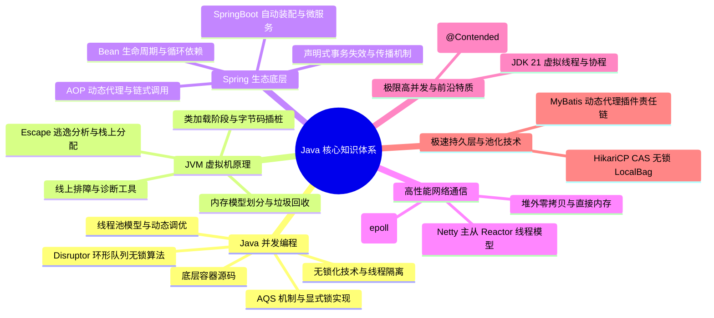

# Java 核心技术知识体系大纲

欢迎来到 Java 核心技术知识体系仓库。本大纲旨在为具有中高级 Java 开发背景、致力于向资深/专家级架构师迈进的开发者，提供一套结构清晰、底层原理扎实、实战性强的深度知识学习路线图。

---

## 🗺️ 架构全局视图

---

## 📂 体系目录指南

### 1. Java 并发编程 (Concurrency)

多线程与并发是 Java 高性能应用的基石。本板块深入 JUC 源码，剖析 AQS、并发容器、无锁机制以及线程池调优。

- **[aqs-locks.md](concurrent/aqs-locks.md)**：深入 `AbstractQueuedSynchronizer` 状态变量 `state` 与双向 CLH 队列，解析独占/共享模式及 ReentrantLock 公平与非公平锁实现差异；还原 JVM 内部 `synchronized` 偏向锁、轻量级锁至重量级锁的锁升级过程与 JDK 15+ 偏向锁废弃背景。
- **[hashmap-concurrenthashmap.md](concurrent/hashmap-concurrenthashmap.md)**：对比 JDK 7 与 JDK 8 中 HashMap 结构的重大演化与 8 树化阈值退树化逻辑；复现 JDK 7 头插法下的扩容死循环；透析 `ConcurrentHashMap` 从 Segment 分段锁到 CAS + synchronized 桶锁的锁粒度演化。
- **[threadlocal-cas.md](concurrent/threadlocal-cas.md)**：图解 Thread 内部 ThreadLocalMap 的强弱引用依赖链路，探讨内存泄漏的根本原因与 `remove()` 机制；拆解 CAS 硬件级 `lock cmpxchg` 原子性，对比 `LongAdder` 的分段分散热点提升并发吞吐量。
- **[threadpool.md](concurrent/threadpool.md)**：理解 ThreadPoolExecutor 七大参数和工作流，明晰有界/无界及不储元素阻塞队列机制；剖析 `ctl` 高 3 位运行状态与低 29 位线程数的位运算；分享动态可监控/调优线程池思路及 OOM 异常丢失预防。

### 2. JVM 虚拟机原理 (Virtual Machine)

精通 JVM 调优与底层指令是资深工程师和中级开发的分水岭。本板块从类加载、内存结构、GC 算法以及诊断工具进行深度拆解。

- **[classloader-bytecode.md](jvm/classloader-bytecode.md)**：解析类加载从验证、准备到初始化的完整的 7 个生命周期；解构双清委派模型机制、SPI 及 Tomcat 的打破实践；掌握 CGLIB 与 JDK 代理的选择机制，解构 Java Agent (premain / agentmain) 动态字节码拦截插桩原理。
- **[memory-gc.md](jvm/memory-gc.md)**：辨析堆外零拷贝 Direct Memory 与基于本地内存的 Metaspace 优缺点；深度解构并发标记下的三色标记漏标细节，对比 G1 的 SATB 原始快照与 CMS 的增量更新解决方案；剖析 ZGC 染色指针、读屏障与自 healed。
- **[tuning-tools.md](jvm/tuning-tools.md)**：实战演练线上 CPU 飙高 100% 极速排查，使用 MAT 分析 `Shallow/Retained Heap`、Dominator Tree 追踪 GC Roots；熟练运用 Arthas `dashboard`、`thread -b` 查死锁、`jad` 反编译、`watch`/`trace` 链路时延诊断。

### 3. Spring 原理与微服务生态 (Spring Ecosystem)

Spring 是企业级开发的事实标准。本板块直面 Spring IoC, AOP 源码、事务、自动装配及微服务高可用方案。

- **[ioc-aop.md](spring/ioc-aop.md)**：贯通 Spring Bean 的实例化、填充、Aware 监听、BeanPostProcessor 环绕及销毁 4 阶段；精讲 Spring 三级缓存 singletonFactories 设计，揭秘为什么只有两级缓存无法统一 AOP 代理的循环依赖；解析 ReflectiveMethodInvocation 递归责任链切面调用。
- **[transaction.md](spring/transaction.md)**：探讨 `@Transactional` 底层 AOP 代理判定，详述物理连接 Savepoint 的 `NESTED` 嵌套与 `REQUIRES_NEW` 物理独立执行差异；总结自身的 Self-invocation 绕过、Checked Exception 默认不回滚、多线程 ThreadLocal 状态丢失等 12 种失效场景。
- **[springboot-springcloud.md](spring/springboot-springcloud.md)**：详解 `@EnableAutoConfiguration` 及 2.7 之后 `imports` 文件候选包扫描；精讲 Nacos 临时实例心跳与持久实例探测机制、Distro AP 异步流与 Raft 强一致 CP 选择；拆解 Sentinel 滑动窗口监控与令牌桶/漏桶限流、慢调用降级行为。

### 4. 高性能 I/O 与 Netty 高级通信 (High-Performance Network)

在高并发微服务系统（如 Dubbo、Spring Cloud Gateway、Nacos 心跳协议）底层，高性能网络 I/O 驱动是系统的命脉。

- **高性能 I/O 原理与 Linux epoll（占位）**：剖析同步阻塞（BIO）、同步非阻塞（NIO）、异步非阻塞（AIO）的演进轨迹；深剖 Linux 底层 `select`、`poll` 以及 `epoll` 多路复用内核调用设计，探讨经典的 **JDK NIO Epoll 空轮询 CPU 100% Bug** 产生的根源及 Netty 的规避设计。
- **Netty 主从 Reactor 线程模型（占位）**：精解 Netty 如何通过一主多从、多主多从 Reactor 模式实现单台服务器连接千万级长连接而不卡顿；剖析 Pipeline 责任链模式下 `ChannelInboundHandler` 和 `ChannelOutboundHandler` 在双向链表中的生命周期和传播次序。
- **堆外零拷贝与 Direct Memory 极致调优（占位）**：区分操作系统级零拷贝（如 sendfile）与 Netty 级内存零拷贝（`ByteBuf` 切片、`CompositeByteBuf` 组合）；拆解 JVM 直接内存分派、回收机制以及防范堆外内存泄漏的排查方针。

### 5. 极速持久化与连接池极限设计 (Database Persistence & Pooled Connections)

在复杂业务流与超大规模数据承载中，JVM 连接池往往是首当其冲的吞吐死穴。本板块直击企业级持久层底层。

- **HikariCP 数据库连接池极致压榨（占位）**：深度揭秘 HikariCP 为何能够横扫群雄。剖析其底层采用 `FastList` 数组实现避免边界索引自增、使用 ThreadLocal 本地缓存 `LocalBag` 避免锁竞争，以及使用 CAS 无锁结构对分配连接进行分配和并发回收的核心秘密。
- **MyBatis 持久层动态代理插件原理（占位）**：解密 MyBatis 工作全生命周期，深剖 Executor、ParameterHandler、ResultSetHandler 拦截器机制；演示重构拦截织入与如何定制生产级多租户隔离、数据脱敏、动态分表插件。
- **锁与多版本并发控制 MVCC 全景融合**：将 `@Transactional` 事务底层与 MySQL 的 MVCC 读写隔离级别强强打通：探究在 Java 持有的 Connection 物理对象上是如何隐式关闭 `autoCommit`（`setAutoCommit(false)`），以及它又是怎么拦截和隔离底层 `SELECT ... FOR UPDATE` 悲观锁导致的分页锁和死锁。可联动学习 [docs/database/mysql/mvcc-locks.md](docs/database/mysql/mvcc-locks.md) 与 [docs/database/mysql/optimization.md](docs/database/mysql/optimization.md)。

### 6. 现代 JDK 巅峰革命与性能极境 (Modern JDK & Frontier High-Concurrency)

JVM 的底层技术正在经历前所未有的科技迭代，掌握最新的高级调优和现代化协程机制，是从资深开发跃进至顶级架构师的核心护城河。

- **JDK 逃逸分析技术极其最强调优（占位）**：解密 Java 代码 JIT 编译器的瞬态优化手段，深剖在**逃逸分析 (Escape Analysis)** 中，若对象未逃逸当前方法，编译器如何实现**栈上分配**以减轻 GC 压力、如何通过**标量替换**对对象结构实施解构，以及利用**锁消除**优化多线程无用抢占。
- **JDK 21+ 虚拟线程与协程深度解构（占位）**：解密 Project Loom 带来的高并发巨变。彻底终结传统“一逻辑一物理线程”（One-Thread-Per-Command）的重上下文开销；介绍运行在 User-space 的轻量虚拟线程，分析底层 carrier 线程分发逻辑、以及对 I/O 挂起线程协作挂起让出的非阻塞革命。
- **缓存行伪共享伪造与 `@Contended`（占位）**：从 CPU 多级硬件缓存行（Cache Line）级揭秘多核心计算时的“伪共享（False Sharing）”并发阻力；探讨单行高速缓存竞争成因，以及如何通过 JDK 内部使用的 `@Contended` 标签及字段对齐填充解决核心性能损耗。

### 7. 环形队列与极致无锁黑科技 (Disruptor Lock-Free Architecture)

在微秒级极端交易和大型消息中转站中，线程阻塞就是性能的深渊。JUC 的 BlockingQueue 在极境下难承其重，高阶架构必须引入无锁高能。

- **LMAX Disruptor 的极致环形无锁架构（占位）**：深入分析 Disruptor 的核心 `RingBuffer` 设计原理，剖析单生产者/多消费者序号递增协调机制；探讨它如何基于 CAS 自旋实现完全不依赖任何显示重锁（Lock）的极速并发，了解其每秒处理超 600 万订单这一神话背后的架构艺术。
- **分布式协同 ZooKeeper Curator 与 Redis 跨界融合**：
  - 结合 ZooKeeper 的 Znode 探活，剖析 Java 专属第三方客户端 **Apache Curator** 所封装的 `InterProcessMutex` 分布式重入锁、`RetryPolicy` 一系列重试策略，以及其使用的异步 Watcher 事件监听，深度联动学习 [docs/distributed/system/lock-zookeeper.md](docs/distributed/system/lock-zookeeper.md)。
  - 对抗缓存异常压力，引导在 Redis 场景下引入本地二级缓存（Caffeine）以缓解击穿，掌握高并发客户端 **Redisson** 与 JVM 内 AQS 自旋效果相同的工作原理以及 **Watchdog（看门狗自动延期）** 底层机制，深度联动学习 [docs/cache/redis/scenarios.md](docs/cache/redis/scenarios.md)、[docs/cache/redis/consistency-eviction.md](docs/cache/redis/consistency-eviction.md) 与 [docs/cache/redis/highavailability.md](docs/cache/redis/highavailability.md)。
  - 了解 Seata 分布式事务在 Java 里的核心运作：透析 Seata 的 **AT 模式（利用 SQL 解析生成 Undo Log 建立两阶段提交方案）**、**TCC 模式（基于接口的幂等/悬挂处理与空回滚实现）** 与强一致 **XA 模式**在微服务间的一致性协同，深度联动学习 [docs/distributed/system/transactions.md](docs/distributed/system/transactions.md)。
