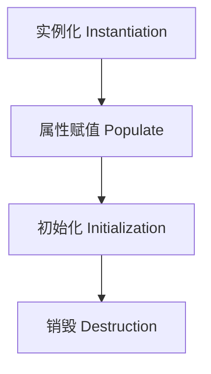
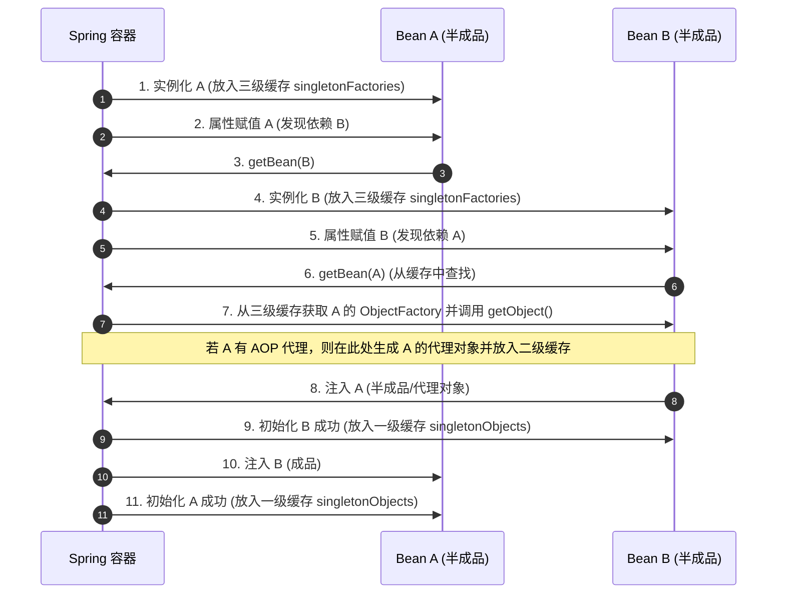

## Spring IoC 与 AOP 源码级解析

Spring 框架是 Java 企业级开发的事实标准。在高级面试中，Spring 的底层源码（如 Bean 的生命周期、三级缓存解决循环依赖、AOP 动态代理）是必考的硬核内容。

---

## 一、 Spring Bean 的生命周期

Spring Bean 的生命周期非常复杂，但可以概括为四个核心阶段：**实例化 -> 属性赋值 -> 初始化 -> 销毁**。



### 1. 详细生命周期链路

1. **实例化（Instantiation）**：
   - 对应方法：`createBeanInstance()`。通过反射或工厂方法创建 Bean 实例。
2. **属性赋值（Populate）**：
   - 对应方法：`populateBean()`。进行依赖注入（DI），填充 Bean 的属性。
3. **初始化（Initialization）**：
   - **Aware 接口回调**：如果 Bean 实现了 `BeanNameAware`、`BeanFactoryAware` 等接口，Spring 会回调对应方法，注入容器上下文。
   - **BeanPostProcessor 前置处理**：执行所有已注册的 `BeanPostProcessor` 的 `postProcessBeforeInitialization()` 方法。
   - **初始化方法回调**：
     - 如果实现了 `InitializingBean` 接口，执行 `afterPropertiesSet()`。
     - 如果配置了自定义的 `init-method`，执行该初始化方法。
   - **BeanPostProcessor 后置处理**：执行所有已注册的 `BeanPostProcessor` 的 `postProcessAfterInitialization()` 方法。**AOP 动态代理通常就是在此阶段生成的。**
4. **销毁（Destruction）**：
   - 当容器关闭时，触发销毁流程：
     - 如果实现了 `DisposableBean` 接口，执行 `destroy()`。
     - 如果配置了自定义的 `destroy-method`，执行该方法。

---

## 二、 三级缓存与循环依赖

循环依赖是指两个或多个 Bean 互相持有对方的引用，例如 Class A 依赖 Class B，Class B 又依赖 Class A。

Spring 默认支持**单例（Singleton）**作用域下的**属性注入**循环依赖，而不支持构造器注入的循环依赖。Spring 是通过**三级缓存**机制来解决这个问题的。

### 1. 三级缓存的定义

在 `DefaultSingletonBeanRegistry` 类中，定义了以下三个 Map：

```java
// 一级缓存：存放完全初始化好的单例 Bean（可以直接使用的成品）
private final Map<String, Object> singletonObjects = new ConcurrentHashMap<>(256);

// 二级缓存：存放早期暴露的单例 Bean（已经实例化但尚未填充属性、未初始化的半成品）
private final Map<String, Object> earlySingletonObjects = new ConcurrentHashMap<>(16);

// 三级缓存：存放单例工厂对象（ObjectFactory），用于生成早期暴露的 Bean 或者是其 AOP 代理对象
private final Map<String, ObjectFactory<?>> singletonFactories = new HashMap<>(16);
```

### 2. 解决循环依赖的核心流程

假设 A 和 B 互相依赖：



### 3. 为什么必须是三级缓存？二级缓存不行吗？

- 如果**没有 AOP**，确实只需要二级缓存。在实例化 A 之后，直接把 A（半成品）放入二级缓存，B 注入 A 时直接从二级缓存拿即可

如果**存在 AOP**，A 需要被代理。按照 Spring 的设计原则，**代理对象应该在 Bean 初始化阶段（AnnotationAwareAspectJAutoProxyCreator）创建**，而不是在实例化阶段创建

但是，如果发生了循环依赖，B 必须在初始化之前就注入 A 的代理对象

**三级缓存的作用**：三级缓存中存放的是 `ObjectFactory`。当 B 需要注入 A 时，B 会调用 A 的 `ObjectFactory.getObject()`。这个工厂方法会判断 A 是否需要被代理：如果需要，就提前创建 A 的代理对象并返回；如果不需要，就返回原始的 A

  因为 `ObjectFactory.getObject()` 每次调用都会生成一个新的代理对象（或者执行一次判断逻辑）。为了保证单例，必须将生成的早期代理对象放入二级缓存中缓存起来，确保后续其他地方注入 A 时拿到的是同一个代理对象。

### 4. 三级缓存解决循环依赖的局限性

虽然 Spring 的三级缓存能够优雅地解决单例属性注入下的循环依赖，但在以下三种经典场景下，三级缓存依然无能为力：

#### (1) 构造器注入循环依赖

- **场景**：

  ```java
  @Component
  public class A {
      public A(B b) {}
  }
  @Component
  public class B {
      public B(A a) {}
  }
  ```

- **原理**：Spring 在创建 A 时需要调用构造函数进行实例化，此时需要传入 B。由于 A 还没有实例化完成，因此**无法将其 ObjectFactory 提前放入三级缓存**。此时去获取 B，B 实例化也需要 A，从而陷入死锁，抛出 `BeanCurrentlyInCreationException`。
- **解决办法**：在其中一个构造器参数上加上 **`@Lazy`** 注解。Spring 会为其注入一个懒加载代理对象，直到真正调用方法时才触发实际实例化。

#### (2) prototype（原型/多例）作用域循环依赖

- **场景**：A 和 B 的 Scope 均为 `prototype`，且互相依赖。
- **原理**：Spring 容器只对 `singleton`（单例）作用域的 Bean 进行缓存。对于 prototype 的 Bean，Spring 不会将其放入任何缓存中。每次请求 getBean 都会创建一个全新实例，导致无限循环，直到内存溢出。
- **解决办法**：修改设计以消除循环依赖，或将其中一方改为单例作用域。

#### (3) `@Async` 异步 Bean 引发的循环依赖

- **场景**：A 和 B 互为单例依赖，且 A 的类中包含 `@Async` 标注的异步方法。
- **原理**：`@Async` 代理对象不是由通用的 AOP 处理器 `AbstractAutoProxyCreator` 生成的，而是由 `AsyncAnnotationBeanPostProcessor` 处理。它没有实现 `SmartInstantiationAwareBeanPostProcessor`，意味着它**不支持在三级缓存提前获取代理**（在 `getEarlyBeanReference` 阶段它只返回原始裸对象）。
  当 B 注入 A 时，从三级缓存拿到的是 A 的**原始裸对象**。而在 A 自身初始化后期，`AsyncAnnotationBeanPostProcessor` 强行将其包装为 **`@Async` 代理对象** 并放入容器。在容器检查阶段，发现注入给 B 的 A（裸对象）与容器最终保存的 A（代理对象）地址不一致，直接抛出异常。
- **解决办法**：
  1. 在 A 的注入点上加上 `@Lazy` 延迟加载。
  2. **最佳实践**：将异步 `@Async` 方法剥离到专门的 Task/Helper 类中，避免与核心业务 Service 混合在一起，从根本上避开循环依赖。

---

## 三、 Spring AOP 底层原理

Spring AOP 是基于动态代理实现的。在运行时，Spring 会根据目标类是否实现了接口，动态选择使用 **JDK 动态代理** 还是 **CGLIB 动态代理**。

### 1. 代理的选择策略（`DefaultAopProxyFactory`）

```java
public class DefaultAopProxyFactory implements AopProxyFactory, Serializable {
    @Override
    public AopProxy createAopProxy(AdvisedSupport config) throws AopConfigException {
        if (config.isOptimize() || config.isProxyTargetClass() || hasNoUserSuppliedProxyInterfaces(config)) {
            Class<?> targetClass = config.getTargetClass();
            if (targetClass == null) {
                throw new AopConfigException("TargetSource cannot determine target class");
            }
            // 如果目标类是接口，或者目标类是 Proxy 的子类（已经是 JDK 代理类），依然使用 JDK 动态代理
            if (targetClass.isInterface() || Proxy.isProxyClass(targetClass)) {
                return new JdkDynamicAopProxy(config);
            }
            // 否则，使用 CGLIB 动态代理
            return new ObjenesisCglibAopProxy(config);
        } else {
            // 默认情况下，如果目标类实现了接口，使用 JDK 动态代理
            return new JdkDynamicAopProxy(config);
        }
    }
}
```

### 2. JDK 动态代理与 CGLIB 代理深度对比

在底层，Spring 会在运行时决定使用 JDK 动态代理还是 CGLIB。它们的对比是面试和架构设计中的核心考察点：

| 对比维度 | JDK 动态代理 | CGLIB 动态代理 |
| :--- | :--- | :--- |
| **底层实现机制** | 利用 Java 反射机制（`Proxy.newProxyInstance`）在内存中动态生成代理类，代理类必须继承 `java.lang.reflect.Proxy`。 | 基于 **ASM** 字节码操纵框架，直接在内存中构建目标类的**子类**（Subclass）。 |
| **对目标类的限制** | 目标类**必须实现至少一个接口**。 | 目标类**不能被 `final` 修饰**，且目标方法**不能被 `final` 或 `static` 修饰**（因为无法被子类重写）。 |
| **拦截与执行速度** | 早期版本反射速度慢。在 **JDK 8+** 优化后，反射调用速度大幅提升，在对象创建和运行性能上已不亚于 CGLIB。 | 运行时基于 **FastClass** 机制（为代理类和目标类生成索引映射，避免反射直接调用），执行速度极快；但代理对象的创建开销比 JDK 大。 |
| **使用便利度** | 原生 JDK 支持，不需要引入额外的三方依赖。 | 需要引入 CGLIB 包（Spring 已内置将其 repackage 包含在核心包内）。 |

#### Spring 框架中代理默认选择的演进

- **Spring 5.x 之前（以及传统 XML 配置）**：
  默认遵循“有接口用 JDK，无接口用 CGLIB”的策略。
- **Spring Boot 2.x + / Spring Boot 3.x**：
  Spring Boot 默认将配置项 `spring.aop.proxy-target-class` 设为 `true`。也就是说，**即便目标类实现了接口，默认也全部强制使用 CGLIB 动态代理**。
  - **为什么要做这个改变？**
    如果使用 JDK 动态代理，生成的代理类只能强转为接口类型。如果开发人员在依赖注入时习惯使用具体实现类接收（例如 `@Autowired private UserServiceImpl userService;`），程序启动时就会直接抛出 `BeanNotOfRequiredTypeException`。为了从根本上消除此类型转换隐患，Spring Boot 默认采用 CGLIB（代理对象也是子类，能成功注入到实现类变量中）。

### 3. AOP 链式调用与责任链模式

Spring AOP 将切面（Aspect）中的通知（Advice，如 `@Before`、`@After`、`@Around`）统一封装为 **`MethodInterceptor`（方法拦截器）**。

当目标方法被调用时，Spring 会将所有适用于该方法的拦截器组成一个**拦截器链（Interceptor Chain）**，并通过**责任链模式**进行链式调用。

```java
public class ReflectiveMethodInvocation implements MethodInvocation, Cloneable {
    protected final Object proxy;
    protected final Object target;
    protected final Method method;
    protected Object[] arguments;
    private final List<?> interceptorsAndDynamicMethodMatchers;
    // 当前执行的拦截器索引，初始化为 -1
    private int currentInterceptorIndex = -1;

    public Object proceed() throws Throwable {
        // 如果已经执行完了所有的拦截器，直接调用目标方法（通过反射）
        if (this.currentInterceptorIndex == this.interceptorsAndDynamicMethodMatchers.size() - 1) {
            return invokeJoinpoint();
        }

        // 获取下一个拦截器
        Object interceptorOrInterceptionAdvice =
            this.interceptorsAndDynamicMethodMatchers.get(++this.currentInterceptorIndex);

        // 链式调用：将当前 MethodInvocation 对象（this）传给拦截器
        // 拦截器内部会再次调用 invocation.proceed()，从而形成递归调用
        return ((MethodInterceptor) interceptorOrInterceptionAdvice).invoke(this);
    }
}
```

这种基于递归的责任链模式，优雅地实现了前置通知、后置通知、环绕通知以及异常通知的嵌套执行。
