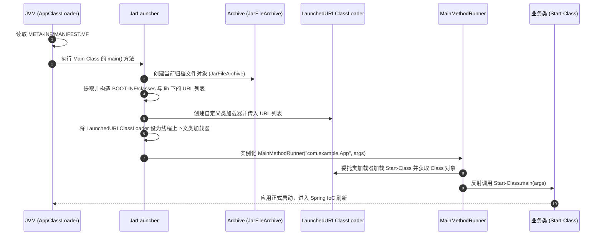

## Spring Boot Fat Jar 启动原理深度解析

Spring Boot 打包生成的 "Fat Jar"（或称 Executable Jar）可以直接通过 `java -jar` 启动。这种机制的精妙之处在于，它解决了 Java 原生类加载器无法加载嵌套 Jar 包（Jar in Jar，即嵌套在 Jar 内部的第三方依赖库）中类和资源的问题。

---

## 一、 Fat Jar 的目录结构

一个典型的 Spring Boot Fat Jar（通过 `spring-boot-maven-plugin` 的 `repackage` 目标构建）内部物理构造如下：

```text
example-app.jar
├── META-INF/
│   ├── MANIFEST.MF              # 关键入口配置文件
│   └── maven/                   # Maven 构建元数据
├── org/
│   └── springframework/
│       └── boot/
│           └── loader/         # Spring Boot 自定义类加载器源码 (直接解压存放于根部)
│               ├── JarLauncher.class
│               ├── archive/
│               ├── jar/
│               └── LaunchedURLClassLoader.class
└── BOOT-INF/
    ├── classes/                # 业务代码及应用自身的 .class 字节码、配置文件
    └── lib/                    # 嵌套的第三方依赖 Jar 包 (Jar in Jar)
```

> [!NOTE]
> 在标准的 Jar 规范中，JVM 默认的 AppClassLoader 只能加载根目录下直接存放的类或通过 `Class-Path` 指定的外部依赖，**不支持**直接加载嵌套在 `BOOT-INF/lib` 下的嵌套 Jar 包。因此，Spring Boot 必须在根部存放它自己的引导器（`org/springframework/boot/loader`），用以接管后续的类加载。

---

## 二、 核心启动流程

当我们在终端运行 `java -jar example-app.jar` 时，整套加载引导链条随即启动：



### 1. MANIFEST.MF 入口定义

JVM 调取并解析 `MANIFEST.MF` 文件：

```properties
Manifest-Version: 1.0
Spring-Boot-Version: 2.7.0
Main-Class: org.springframework.boot.loader.JarLauncher
Start-Class: com.example.MyApplication
Spring-Boot-Classes: BOOT-INF/classes/
Spring-Boot-Lib: BOOT-INF/lib/
```

- **`Main-Class`**：这是 JVM 规范的物理入口类，它会被 JVM 默认类加载器加载并首先执行其 `main` 方法。
- **`Start-Class`**：这是开发者编写的包含 `@SpringBootApplication` 标注的实际业务引导类。

### 2. Archive 归档模型抽象

为了统一处理“已打包成 Fat Jar 运行”与“在开发环境下解压后运行”两种场景，Spring Boot Loader 设计了 **`Archive`**（归档）模型：
- **`JarFileArchive`**：当以单 Jar 包文件运行时，将整个 Jar 抽象为此对象。
- **`ExplodedArchive`**：当解压目录后运行时，将其目录结构抽象为此对象。
它支持遍历其内部的实体（`Entry`），并提取出子级实体的 `URL` 以供加载。

---

## 三、 LaunchedURLClassLoader 与自定义 URL 协议处理

`LaunchedURLClassLoader` 是 Spring Boot 自定义的类加载器，它继承自 Java 官方的 `URLClassLoader`。

### 1. 自定义 Jar 协议处理器

Java 原生的 `URLClassLoader` 只支持标准的 `file:` 协议，或指向某个物理 Jar 包的 `jar:file:/path/to/app.jar!/` 协议。它无法识别并解析**双重惊叹号**的嵌套路径，例如：
`jar:file:/app.jar!/BOOT-INF/lib/commons-lang3.jar!/`

为了打破这一局限，Spring Boot 在初始化类加载器时，往 JVM 中注册了自定义的 **URL 协议处理器**：
1. **注入 Handler**：在启动时，JVM 会读取系统属性 `java.protocol.handler.pkgs`，Loader 将 `org.springframework.boot.loader` 追加到此路径中。
2. **包寻址机制**：当 JVM 遇到 `jar:` 协议的 URL 时，会依据命名规范去寻找 `org.springframework.boot.loader.jar.Handler` 类。
3. **重写连接**：该自定义 `Handler` 会返回一个特殊的 `JarURLConnection`，其底层调用了自定义的 `org.springframework.boot.loader.jar.JarFile`。这个类能够精确计算出嵌套在母 Jar 内部的子 Jar 包的物理偏移量（Offset）与数据长度（Length），并在内存中通过文件流直接定位，**无需在磁盘上进行临时解压**，极大地节省了 I/O 资源。

### 2. 线程上下文类加载器切换

在类加载器构造完毕后，`JarLauncher` 并不能直接执行反射调用。因为如果直接调用，后续由 Spring Framework 动态加载的第三方库（如 Spring 的 AOP 增强类）会因为使用 `Thread.currentThread().getContextClassLoader()` 而获取到系统类加载器（AppClassLoader），从而抛出 `ClassNotFoundException`。

因此，在反射调用 `Start-Class.main` 前，必须进行上下文线程加载器的切换：

```java
// 切换当前执行线程的类加载器为 LaunchedURLClassLoader
Thread.currentThread().setContextClassLoader(launchedUrlClassLoader);
// 随后执行反射拉起
MainMethodRunner runner = new MainMethodRunner(startClass, args);
runner.run();
```

---

## 四、 spring-boot-maven-plugin 的 repackage 原理

当我们在 pom.xml 中配置并执行 `mvn clean package` 时，Maven 默认的打包插件 `maven-jar-plugin` 首先会将我们编译出来的类和配置文件打包成一个普通的 Jar 包（暂称为**原始包**）。

随后，`spring-boot-maven-plugin` 的 **`repackage`** 目标启动，执行以下重构步骤：

1. **备份原始包**：将原始包重命名为 `*.jar.original`。
2. **创建新归档**：新建一个空白的 Jar 包，作为最终输出。
3. **写入引导类**：解压 `spring-boot-loader.jar` 的 `.class` 字节码文件，并写入到新 Jar 包的根部（即 `org/` 目录）。
4. **移动业务代码**：将备份的原始包解压，并将其中的业务类和配置文件写入到新 Jar 包的 `BOOT-INF/classes` 目录下。
5. **归档第三方依赖**：从 Maven 项目依赖树中找出所有的依赖包，将其原封不动地拷入到新 Jar 包的 `BOOT-INF/lib` 目录下。
6. **注入 MANIFEST.MF**：自动生成符合规范的元数据清单，并写入到新 Jar 包的 `META-INF/MANIFEST.MF` 中。

---

## 五、 面试高频问题

### Q1：为什么不能直接用 JVM 原生的 AppClassLoader 加载 Spring Boot 项目？

- **原因**：JVM 默认的 `AppClassLoader` 只认识平铺的目录结构或者外挂的第三方 Jar 包（通过 `-classpath` 指定）。它对于隐藏在 `BOOT-INF/lib` 下的嵌套 Jar 包是完全“盲目”的，因为它无法解析嵌套包的 URL 协议。若直接启动业务类，会在遇到第一个外部类时报出 `NoClassDefFoundError`。

### Q2：LaunchedURLClassLoader 会破坏 JVM 的双亲委派模型吗？

- **分析**：**没有破坏**。
- **机制**：双亲委派的核心在于：先将类加载请求委派给父类加载器（Parent），只有父类加载器无法加载时，才由子类加载器自己尝试加载。
- `LaunchedURLClassLoader` 的 `loadClass` 仍然遵循这一流程：首先将其委托给父类加载器（如 AppClassLoader 甚至 Extension/Bootstrap ClassLoader）。由于父类加载器确实在它们的搜索路径（CLASSPATH）下找不到 `BOOT-INF/` 里面的类，因此最终退回到 `LaunchedURLClassLoader` 本身，由其通过自定义的 `jar:` 协议处理器在 `BOOT-INF/classes` 和 `BOOT-INF/lib` 下检索并载入字节码。整个委派链条完好无损。
