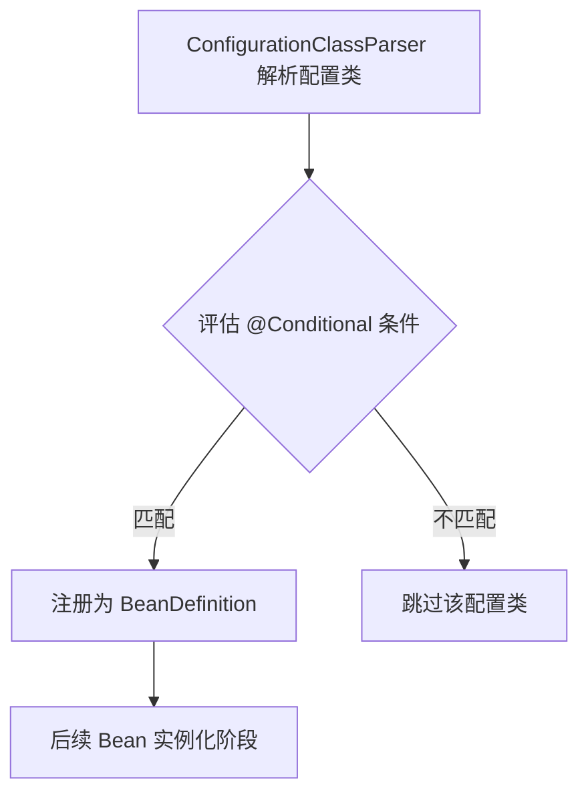
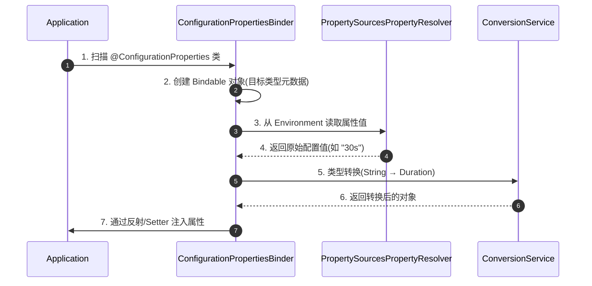
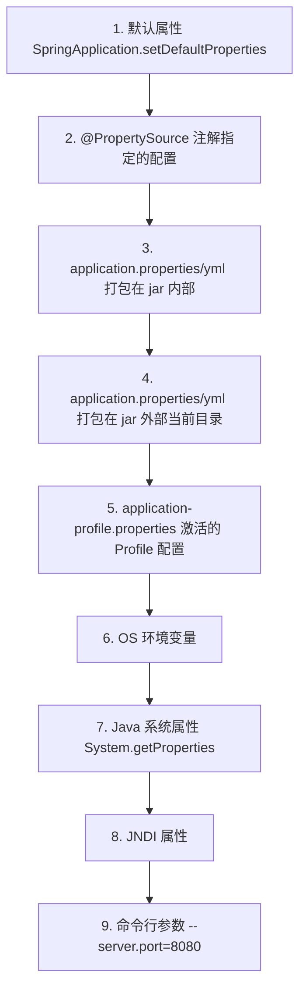
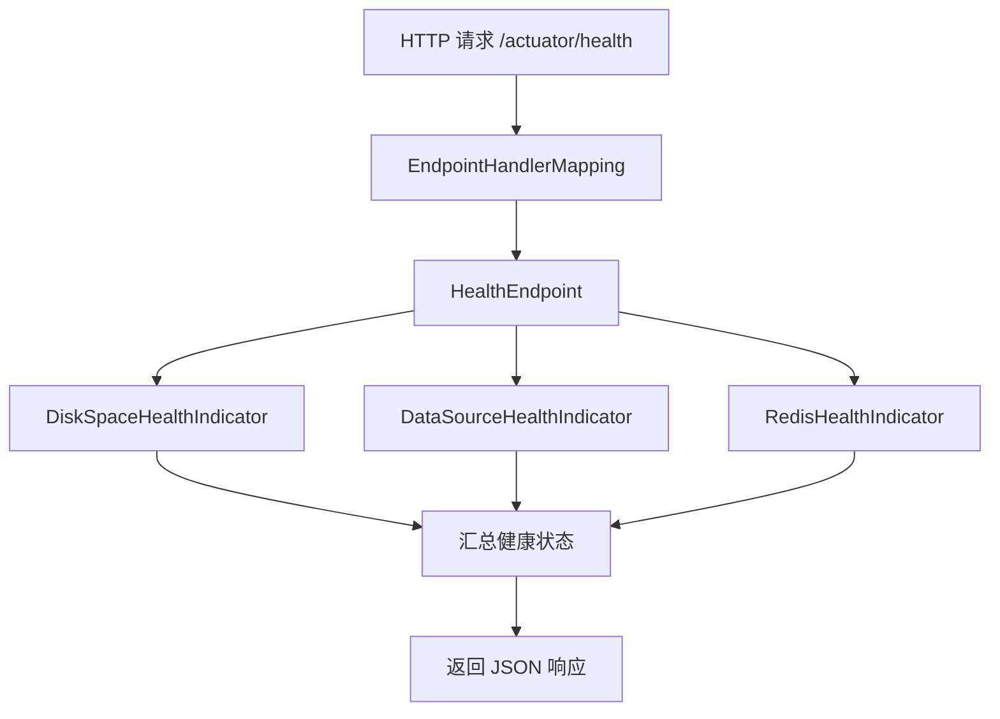

## Spring Boot 高级原理深度解析

SpringBoot 作为 Spring 生态的集大成者,不仅简化了应用开发,还在底层实现了众多精巧的设计。本文深入剖析 SpringBoot 的高级原理,包括**条件装配机制**、**配置绑定与元数据**、**Actuator 监控原理**、**外部化配置加载**以及**嵌入式容器定制**等核心技术。

---

## 一、条件装配深度剖析

### 1. `@Conditional` 注解体系

Spring Boot 的自动装配之所以如此智能,核心在于条件注解的灵活运用。所有条件注解都基于 `@Conditional` 实现。

```java
@Target({ElementType.TYPE, ElementType.METHOD})
@Retention(RetentionPolicy.RUNTIME)
@Documented
public @interface Conditional {
    // 指定条件评估器(实现 Condition 接口)
    Class<? extends Condition>[] value();
}

@FunctionalInterface
public interface Condition {
    // 返回 true 表示条件匹配,配置类/Bean 会被注册
    boolean matches(ConditionContext context, AnnotatedTypeMetadata metadata);
}
```

### 2. 常用条件注解实现原理

**`@ConditionalOnClass` 源码分析**:

```java
@Target({ ElementType.TYPE, ElementType.METHOD })
@Retention(RetentionPolicy.RUNTIME)
@Documented
@Conditional(OnClassCondition.class)
public @interface ConditionalOnClass {
    Class<?>[] value() default {};
    String[] name() default {};
}

// OnClassCondition 核心逻辑
class OnClassCondition extends FilteringSpringBootCondition {
    @Override
    public ConditionOutcome getMatchOutcome(ConditionContext context, AnnotatedTypeMetadata metadata) {
        ClassLoader classLoader = context.getClassLoader();
        List<String> missing = new ArrayList<>();
        
        // 获取注解中指定的类名
        for (String className : getCandidates(metadata)) {
            // 尝试加载类,加载失败则认为类不存在
            if (!ClassUtils.isPresent(className, classLoader)) {
                missing.add(className);
            }
        }
        
        if (missing.isEmpty()) {
            return ConditionOutcome.match("所有类都存在于 Classpath");
        }
        return ConditionOutcome.noMatch("缺少类: " + missing);
    }
}
```

**`@ConditionalOnBean` 实现细节**:

```java
@ConditionalOnBean(name = "redisTemplate")
public class MyConfig {
    // 只有当容器中存在名为 redisTemplate 的 Bean 时,此配置类才生效
}

// OnBeanCondition 核心逻辑
class OnBeanCondition extends FilteringSpringBootCondition {
    @Override
    public ConditionOutcome getMatchOutcome(ConditionContext context, AnnotatedTypeMetadata metadata) {
        // 从 BeanFactory 中搜索指定类型/名称的 Bean
        ConfigurableListableBeanFactory beanFactory = context.getBeanFactory();
        
        // 注意:这里会搜索 BeanDefinition,而非已实例化的 Bean
        // 这意味着即使 Bean 还没创建,只要 BeanDefinition 已注册,条件就匹配
        String[] beanNames = BeanFactoryUtils.beanNamesForTypeIncludingAncestors(
            beanFactory, ResolvableType.forClass(RedisTemplate.class)
        );
        
        return beanNames.length > 0 
            ? ConditionOutcome.match("找到 Bean: " + Arrays.toString(beanNames))
            : ConditionOutcome.noMatch("未找到匹配的 Bean");
    }
}
```

### 3. 条件评估时机与顺序

条件评估发生在 **Bean 定义注册阶段**,而非 Bean 实例化阶段。Spring Boot 在解析配置类时,会按以下顺序评估:



**条件评估的缓存机制**:

为了避免重复评估,Spring Boot 使用了 `ConditionEvaluationReport` 记录每个配置类的评估结果:

```java
// 可通过以下方式获取条件评估报告
ConditionEvaluationReport report = ConditionEvaluationReport.get(context.getBeanFactory());
Map<String, ConditionEvaluationReport.ConditionAndOutcomes> outcomes = report.getConditionAndOutcomesBySource();
```

---

## 二、配置绑定与类型安全

### 1. `@ConfigurationProperties` 绑定原理

Spring Boot 提供了类型安全的配置绑定机制,通过 `@ConfigurationProperties` 注解将外部配置映射到 Java 对象。

```java
@ConfigurationProperties(prefix = "app.datasource")
@Data
public class DataSourceProperties {
    private String url;
    private String username;
    private String password;
    private PoolConfig pool;
    
    @Data
    public static class PoolConfig {
        private int maxSize = 10;
        private int minIdle = 2;
        private Duration timeout = Duration.ofSeconds(30);
    }
}
```

**绑定流程**:



### 2. 核心源码分析

**`ConfigurationPropertiesBindingPostProcessor`**:

```java
// 这是一个 BeanPostProcessor,在 Bean 初始化后进行属性绑定
public class ConfigurationPropertiesBindingPostProcessor implements BeanPostProcessor {
    
    @Override
    public Object postProcessBeforeInitialization(Object bean, String beanName) {
        // 查找 Bean 上是否有 @ConfigurationProperties 注解
        ConfigurationProperties annotation = AnnotationUtils.findAnnotation(
            bean.getClass(), ConfigurationProperties.class
        );
        
        if (annotation != null) {
            // 执行绑定
            bind(bean, annotation);
        }
        return bean;
    }
    
    private void bind(Object bean, ConfigurationProperties annotation) {
        // 创建 Binder 对象
        Binder binder = new Binder(
            ConfigurationPropertySources.get(environment),
            new PropertySourcesPlaceholdersResolver(environment),
            conversionService,
            propertyEditorInitializer
        );
        
        // 执行绑定
        binder.bind(annotation.prefix(), Bindable.ofInstance(bean));
    }
}
```

### 3. 高级特性:宽松绑定(Relaxed Binding)

Spring Boot 支持多种命名风格的配置键:

```yaml
# 以下四种写法都能绑定到 maxSize 属性
app.datasource.pool.max-size: 20   # 烤串命名(推荐)
app.datasource.pool.maxSize: 20    # 驼峰命名
app.datasource.pool.max_size: 20   # 下划线命名
APP_DATASOURCE_POOL_MAXSIZE: 20    # 环境变量风格
```

**宽松绑定的实现**:

```java
// ConfigurationPropertyName 类负责统一不同命名风格
public final class ConfigurationPropertyName {
    
    // 所有命名风格最终都会规范化为统一格式
    public static ConfigurationPropertyName of(String name) {
        // "max-size", "maxSize", "max_size" 都会转换为相同的内部表示
        return adapt(name, '.');
    }
    
    private static ConfigurationPropertyName adapt(String name, char separator) {
        // 移除分隔符,转为小写,建立索引
        // "max-size" → "maxsize"
        // "maxSize" → "maxsize"
        return new ConfigurationPropertyName(Elements.of(name, separator));
    }
}
```

---

## 三、配置文件加载机制

### 1. 配置文件加载顺序

Spring Boot 支持多种配置源,按以下优先级加载(后者覆盖前者):



### 2. `application.yml` 多 Profile 配置

**Spring Boot 2.4+ 新语法**:

```yaml
# application.yml
spring:
  config:
    activate:
      on-profile: dev
server:
  port: 8081

---
spring:
  config:
    activate:
      on-profile: prod
server:
  port: 8080
```

**激活 Profile**:

```bash
# 方式 1: 命令行参数
java -jar app.jar --spring.profiles.active=prod

# 方式 2: 环境变量
export SPRING_PROFILES_ACTIVE=prod

# 方式 3: 代码中设置
SpringApplication app = new SpringApplication(MyApp.class);
app.setAdditionalProfiles("prod");
```

### 3. 外部配置文件加载源码

**`ConfigFileApplicationListener`** (Spring Boot 2.3 及以前):

```java
// 核心方法:从指定位置加载配置文件
private void load(String location, String name, Profile profile, 
                  DocumentFilterFactory filterFactory, DocumentConsumer consumer) {
    
    // 默认搜索位置
    String[] searchLocations = {
        "classpath:/",
        "classpath:/config/",
        "file:./",
        "file:./config/"
    };
    
    // 默认文件名
    String[] searchNames = {
        "application"
    };
    
    // 支持的文件扩展名
    for (PropertySourceLoader loader : propertySourceLoaders) {
        // YamlPropertySourceLoader 处理 .yml/.yaml
        // PropertiesPropertySourceLoader 处理 .properties/.xml
    }
}
```

**Spring Boot 2.4+ 新机制 `ConfigDataEnvironmentPostProcessor`**:

采用了更灵活的 `ConfigData` API,支持从云配置中心、Git 仓库等加载配置。

---

## 四、Spring Boot Actuator 监控原理

### 1. Actuator 核心架构

Actuator 通过暴露一系列 HTTP 端点(Endpoint)来提供应用的运行时信息。



### 2. 自定义 HealthIndicator

```java
@Component
public class CustomHealthIndicator implements HealthIndicator {
    
    @Override
    public Health health() {
        // 执行健康检查逻辑
        boolean isHealthy = checkExternalService();
        
        if (isHealthy) {
            return Health.up()
                .withDetail("service", "available")
                .withDetail("responseTime", "50ms")
                .build();
        } else {
            return Health.down()
                .withDetail("service", "unavailable")
                .withDetail("error", "Connection timeout")
                .build();
        }
    }
    
    private boolean checkExternalService() {
        // 实际的健康检查逻辑
        return true;
    }
}
```

### 3. 自定义 Endpoint

```java
@Endpoint(id = "custom")
@Component
public class CustomEndpoint {
    
    // 对应 GET /actuator/custom
    @ReadOperation
    public Map<String, Object> customInfo() {
        Map<String, Object> info = new HashMap<>();
        info.put("version", "1.0.0");
        info.put("buildTime", "2026-01-01");
        return info;
    }
    
    // 对应 POST /actuator/custom
    @WriteOperation
    public void updateConfig(@Selector String key, String value) {
        // 动态更新配置
        System.setProperty(key, value);
    }
    
    // 对应 DELETE /actuator/custom/{name}
    @DeleteOperation
    public void clearCache(@Selector String name) {
        // 清除缓存
    }
}
```

### 4. Metrics 指标收集原理

Actuator 集成了 Micrometer 框架,支持多种监控系统(Prometheus、Grafana、InfluxDB 等)。

```java
@Component
public class CustomMetrics {
    
    private final MeterRegistry meterRegistry;
    
    public CustomMetrics(MeterRegistry meterRegistry) {
        this.meterRegistry = meterRegistry;
        
        // 注册自定义计数器
        Counter.builder("custom.api.calls")
            .description("API 调用次数")
            .tag("method", "POST")
            .register(meterRegistry);
    }
    
    public void recordApiCall() {
        meterRegistry.counter("custom.api.calls", "method", "POST").increment();
    }
}
```

---

## 五、嵌入式容器深度定制

### 1. Tomcat 线程池配置

```java
@Configuration
public class TomcatCustomizer {
    
    @Bean
    public WebServerFactoryCustomizer<TomcatServletWebServerFactory> tomcatCustomizer() {
        return factory -> {
            factory.addConnectorCustomizers(connector -> {
                ProtocolHandler handler = connector.getProtocolHandler();
                if (handler instanceof AbstractProtocol) {
                    AbstractProtocol<?> protocol = (AbstractProtocol<?>) handler;
                    
                    // 设置最大线程数
                    protocol.setMaxThreads(200);
                    // 设置最小空闲线程数
                    protocol.setMinSpareThreads(10);
                    // 设置最大连接数
                    protocol.setMaxConnections(10000);
                    // 设置连接超时时间
                    protocol.setConnectionTimeout(20000);
                }
            });
            
            // 配置 Tomcat 访问日志
            factory.addContextCustomizers(context -> {
                AccessLogValve accessLogValve = new AccessLogValve();
                accessLogValve.setDirectory("logs");
                accessLogValve.setPrefix("access_log");
                accessLogValve.setSuffix(".txt");
                accessLogValve.setPattern("combined");
                context.getPipeline().addValve(accessLogValve);
            });
        };
    }
}
```

### 2. 切换到 Undertow 容器

```xml
<!-- pom.xml -->
<dependency>
    <groupId>org.springframework.boot</groupId>
    <artifactId>spring-boot-starter-web</artifactId>
    <exclusions>
        <!-- 排除 Tomcat -->
        <exclusion>
            <groupId>org.springframework.boot</groupId>
            <artifactId>spring-boot-starter-tomcat</artifactId>
        </exclusion>
    </exclusions>
</dependency>

<!-- 引入 Undertow -->
<dependency>
    <groupId>org.springframework.boot</groupId>
    <artifactId>spring-boot-starter-undertow</artifactId>
</dependency>
```

```java
@Configuration
public class UndertowCustomizer {
    
    @Bean
    public WebServerFactoryCustomizer<UndertowServletWebServerFactory> undertowCustomizer() {
        return factory -> {
            factory.addBuilderCustomizers(builder -> {
                builder.setIoThreads(4)  // IO 线程数
                       .setWorkerThreads(20)  // 工作线程数
                       .setBufferSize(1024);  // 缓冲区大小
            });
        };
    }
}
```

---

## 六、SpringBoot 启动优化技巧

### 1. 延迟初始化(Lazy Initialization)

```yaml
spring:
  main:
    lazy-initialization: true  # 全局开启延迟初始化
```

```java
// 针对单个 Bean 开启延迟初始化
@Bean
@Lazy
public MyService myService() {
    return new MyService();
}
```

**注意**: 延迟初始化会将启动时的错误推迟到首次使用时才暴露,需谨慎使用。

### 2. 排除不需要的自动配置

```java
@SpringBootApplication(exclude = {
    DataSourceAutoConfiguration.class,
    RedisAutoConfiguration.class
})
public class MyApplication {
}
```

或在配置文件中:

```yaml
spring:
  autoconfigure:
    exclude:

      - org.springframework.boot.autoconfigure.jdbc.DataSourceAutoConfiguration

```

### 3. 使用 Spring Native 编译为原生镜像

Spring Boot 3.0+ 支持 GraalVM Native Image,可将应用编译为原生可执行文件:

```bash
# 构建原生镜像
./mvnw -Pnative native:compile

# 启动时间从秒级降低到毫秒级
./target/myapp
```

---

## 七、常见问题与最佳实践

### 1. 为什么自动配置类不生效?

**排查步骤**:

1. **检查依赖是否引入**: `@ConditionalOnClass` 要求对应的类必须在 Classpath 中。
2. **查看条件评估报告**:

   ```yaml
   # 启用条件评估报告
   logging:
     level:
       org.springframework.boot.autoconfigure: DEBUG
   ```

   启动日志会输出类似：

```text
   Positive matches:
   -----------------
   RedisAutoConfiguration matched:

      - @ConditionalOnClass found required class 'RedisOperations' (OnClassCondition)
   
   Negative matches:
   -----------------
   DataSourceAutoConfiguration did not match:

      - @ConditionalOnClass did not find required class 'javax.sql.DataSource'

```

### 2. 配置属性注入失败

**常见原因**:

- 忘记在配置类上添加 `@EnableConfigurationProperties(MyProperties.class)`
- 配置键名拼写错误(注意宽松绑定规则)
- 配置文件编码问题(YAML 必须是 UTF-8)

**解决方案**:

```java
@Configuration
@EnableConfigurationProperties(MyProperties.class)  // 关键注解
public class MyConfig {
    
    @Autowired
    private MyProperties properties;
}
```

### 3. 多数据源配置

```java
@Configuration
public class MultiDataSourceConfig {
    
    @Bean
    @Primary
    @ConfigurationProperties(prefix = "spring.datasource.primary")
    public DataSource primaryDataSource() {
        return DataSourceBuilder.create().build();
    }
    
    @Bean
    @ConfigurationProperties(prefix = "spring.datasource.secondary")
    public DataSource secondaryDataSource() {
        return DataSourceBuilder.create().build();
    }
    
    @Bean
    @Primary
    public JdbcTemplate primaryJdbcTemplate(@Qualifier("primaryDataSource") DataSource ds) {
        return new JdbcTemplate(ds);
    }
    
    @Bean
    public JdbcTemplate secondaryJdbcTemplate(@Qualifier("secondaryDataSource") DataSource ds) {
        return new JdbcTemplate(ds);
    }
}
```

---

## 总结

Spring Boot 的高级特性构建在精妙的设计之上:

1. **条件装配机制**通过 `@Conditional` 注解实现按需加载,避免了冗余配置。
2. **配置绑定机制**提供类型安全的外部化配置,支持宽松绑定和多种配置源。
3. **Actuator 监控**通过 Endpoint 和 Micrometer 提供生产级别的运维能力。
4. **嵌入式容器**可深度定制,适应不同的性能需求。
5. **启动优化**通过延迟初始化、排除不需要的自动配置等手段提升启动速度。

掌握这些原理,不仅能应对高级面试,更能在实际项目中游刃有余地定制和优化 Spring Boot 应用。
