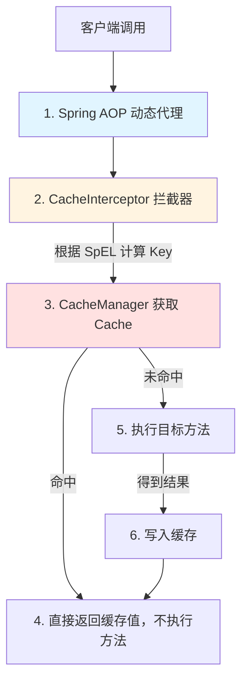

## Spring Cache 缓存抽象与声明式缓存原理

在高并发场景下，缓存是保护数据库、提升系统响应速度的最有效手段。Spring 从 3.1 版本起引入了**缓存抽象（Cache Abstraction）**。它并不是一种具体的缓存实现（如 Redis 或 Caffeine），而是对缓存操作的一层统一抽象。通过 Spring Cache，开发者只需在方法上标注几个简单的注解，即可实现强大的声明式缓存功能，并且能够无缝在本地缓存（如 Caffeine）和分布式缓存（如 Redis）之间切换。

---

## 一、 Spring Cache 核心注解与常用参数

Spring Cache 的使用极其简洁，其核心注解如下：

### 1. 常用缓存注解

| 注解 | 作用说明 | 常见应用场景 |
| :--- | :--- | :--- |
| **`@Cacheable`** | 触发缓存读取与写入。在方法执行前先查缓存，若命中则直接返回缓存值；若未命中，执行方法并将返回值存入缓存。 | 商品详情查询、用户基本信息获取等读操作。 |
| **`@CachePut`** | 触发缓存更新。无论缓存是否存在，每次都一定会执行目标方法，并将执行结果写入缓存。 | 商品修改、用户信息更新等写/改操作。 |
| **`@CacheEvict`** | 触发缓存清除。将指定的缓存从缓存库中移除。 | 删除商品、用户注销等删除操作。 |
| **`@Caching`** | 组合注解。允许在同一个方法上组合使用多个上述缓存注解。 | 当更新一个数据需要同时清除/更新多个不同 key 的缓存时。 |
| **`@CacheConfig`** | 类级别注解。用于在类级别共享公共配置（如缓存区域名 `cacheNames`）。 | 简化方法注解的重复配置。 |

### 2. 注解的核心参数

* **`value` / `cacheNames`**：指定缓存名（即缓存分区/Namespace），支持配置多个。
* **`key`**：缓存的键值，支持使用 **SpEL 表达式**。例如：`key = "#id"` 或是 `key = "#p0"`（代表第一个参数）。如果不指定，Spring 默认使用 `SimpleKeyGenerator` 根据方法参数生成 Key。
* **`condition`**：触发缓存的条件（SpEL）。只有满足条件时才读取/写入缓存。例如：`condition = "#id > 10"`。
* **`unless`**：否定缓存的条件（SpEL）。在**方法执行后**进行评估，如果为 true，则**不**将结果存入缓存。通常用来过滤空值或特定错误码。例如：`unless = "#result == null"`。
* **`allEntries`**（仅限 `@CacheEvict`）：若设为 `true`，则清除该 `value` 分区下的**所有**缓存，默认 `false`。
* **`beforeInvocation`**（仅限 `@CacheEvict`）：若设为 `true`，会在方法**执行之前**清除缓存；若为 `false`（默认），则在方法**成功执行之后**清除。若方法报错，缓存将不会被清除。

---

## 二、 缓存抽象的底层工作原理

Spring 声明式缓存的底层实现是典型的 **AOP（面向切面编程）** 机制。



### 1. 核心工作链路

1. **代理生成**：Spring 启动时，`CacheAdvisor` 会扫描所有标注了 `@Cacheable` 等注解的 Bean，并使用 JDK 或 CGLIB 为其生成代理对象。
2. **拦截调用**：当客户端调用代理对象的方法时，请求会被 `CacheInterceptor` 拦截。
3. **Key 计算**：拦截器解析注解中的 SpEL 表达式，结合传入的方法参数，生成唯一的缓存 `key`。
4. **缓存查找**：拦截器通过持有的 `CacheManager` 寻找对应的 `Cache` 实例（如 `RedisCache`），并调用 `cache.get(key)`。
5. **策略执行**：
   * **若缓存命中**：直接返回缓存中的值，目标方法**不会**被执行。
   * **若缓存未命中**：反射执行目标方法，获取返回值。如果返回值不满足 `unless` 条件，拦截器会调用 `cache.put(key, result)` 将结果存入缓存，最后返回给客户端。

---

## 三、 声明式缓存失效的场景

由于基于 AOP 实现，Spring Cache 存在与 Spring 事务相似的“失效”陷阱：

1. **同类内部方法调用（Self-Invocation）**：
   * **现象**：在类 `ProductService` 中，非缓存方法 A 内部直接调用了同类标注了 `@Cacheable` 的方法 B，B 的缓存功能失效。
   * **原因**：方法 A 内部通过 `this.B()` 绕过了 AOP 代理对象，因此 `CacheInterceptor` 无法拦截该调用。
   * **解决**：将方法 B 拆分到其他类，或者通过注入自身代理对象来调用。
2. **非 `public` 方法修饰**：
   * **现象**：在 `private` 或 `protected` 方法上加缓存注解无效。
   * **原因**：Spring 默认只对 `public` 方法进行代理。
3. **异常阻断**：
   * **现象**：当方法抛出异常时，默认不会将任何数据存入缓存。如果方法在抛出异常前已经局部修改了数据，可能导致缓存与数据库不一致。

---

## 四、 生产实战：Spring Boot 结合 Redis 实现声明式缓存

### 1. 引入 POM 依赖

```xml
<dependencies>
    <!-- Spring Boot 缓存抽象起步依赖 -->
    <dependency>
        <groupId>org.springframework.boot</groupId>
        <artifactId>spring-boot-starter-cache</artifactId>
    </dependency>
    <!-- Redis 驱动与起步依赖 -->
    <dependency>
        <groupId>org.springframework.boot</groupId>
        <artifactId>spring-boot-starter-data-redis</artifactId>
    </dependency>
    <!-- 连接池依赖 -->
    <dependency>
        <groupId>org.apache.commons</groupId>
        <artifactId>commons-pool2</artifactId>
    </dependency>
</dependencies>
```

### 2. 编写 Redis 缓存配置类（避免序列化乱码）

默认的 Redis 缓存使用 JDK 序列化，会导致写入 Redis 的 key 和 value 出现乱码（如 `\xac\xed\x00\x05` 等前缀），不便于排查。我们需要自定义配置：

```java
@Configuration
@EnableCaching // 开启声明式缓存支持
public class RedisCacheConfig {

    @Bean
    public RedisCacheManager cacheManager(RedisConnectionFactory connectionFactory) {
        // 1. 定义 Key 序列化器（String 格式）
        RedisSerializer<String> strSerializer = new StringRedisSerializer();
        // 2. 定义 Value 序列化器（JSON 格式，采用 Jackson）
        Jackson2JsonRedisSerializer<Object> jacksonSerializer = new Jackson2JsonRedisSerializer<>(Object.class);
        
        ObjectMapper om = new ObjectMapper();
        om.setVisibility(PropertyAccessor.ALL, JsonAutoDetect.Visibility.ANY);
        // 必须配置此项，否则反序列化时无法识别具体的子类对象，会变成 Map
        om.activateDefaultTyping(LaissezFaireSubTypeValidator.instance, ObjectMapper.DefaultTyping.NON_FINAL);
        jacksonSerializer.setObjectMapper(om);

        // 3. 配置默认的缓存策略
        RedisCacheConfiguration config = RedisCacheConfiguration.defaultCacheConfig()
                .entryTtl(Duration.ofHours(2)) // 默认缓存失效时间为 2 小时
                .serializeKeysWith(RedisSerializationContext.SerializationPair.fromSerializer(strSerializer))
                .serializeValuesWith(RedisSerializationContext.SerializationPair.fromSerializer(jacksonSerializer))
                .disableCachingNullValues(); // 默认不缓存空值

        // 4. 对特定的缓存空间单独配置 TTL 寿命
        Map<String, RedisCacheConfiguration> initialCacheConfigurations = new HashMap<>();
        initialCacheConfigurations.put("product:details", config.entryTtl(Duration.ofMinutes(30))); // 商品详情存 30 分钟

        return RedisCacheManager.builder(connectionFactory)
                .cacheDefaults(config)
                .withInitialCacheConfigurations(initialCacheConfigurations)
                .build();
    }
}
```

### 3. 在业务 Service 中使用缓存

```java
@Service
@Slf4j
@CacheConfig(cacheNames = "product") // 类级别声明缓存前缀
public class ProductService {

    @Autowired
    private ProductRepository productRepository;

    // 1. 查询操作：优先查缓存，缓存未命中则查 DB 并写入缓存
    @Cacheable(key = "#id", unless = "#result == null")
    public Product getById(Long id) {
        log.info("【缓存未命中】从数据库查询商品, id = {}", id);
        return productRepository.findById(id).orElse(null);
    }

    // 2. 更新操作：必定更新数据库，同时把返回值同步更新到缓存 key 中
    @CachePut(key = "#product.id")
    @Transactional(rollbackFor = Exception.class)
    public Product update(Product product) {
        log.info("【数据库更新】修改商品信息, id = {}", product.getId());
        productRepository.save(product);
        return product;
    }

    // 3. 删除操作：删除数据库，并同步把缓存中对应的 key 清理掉
    @CacheEvict(key = "#id", beforeInvocation = false)
    @Transactional(rollbackFor = Exception.class)
    public void delete(Long id) {
        log.info("【数据库删除】删除商品, id = {}", id);
        productRepository.deleteById(id);
    }
}
```

---

## 五、 生产环境高并发挑战与防护

在真实的高并发生产环境下，单纯使用 `@Cacheable` 容易遭遇三大经典缓存问题：

### 1. 缓存击穿（Hotspot Invalid）

* **痛点**：某一个超热点数据（如大促商品）在缓存过期的瞬间，有数十万并发请求同时涌入。由于此时缓存为空，所有请求会同时穿透到数据库，造成数据库瞬间崩溃。
* **解决办法**：在 `@Cacheable` 注解中配置 **`sync = true`**。

  ```java
  @Cacheable(key = "#id", sync = true) // 开启同步锁
  public Product getById(Long id) { ... }
  ```

  **原理**：当开启 `sync = true` 时，Spring 在底层获取缓存时会对其加锁。如果发现未命中，只会允许**一个线程**去加载数据库，其余线程阻塞等待。等第一个线程把结果存入缓存后，其他线程直接从缓存获取，从而起到“挡箭牌”的作用。

### 2. 缓存穿透（Cache Penetration）

* **痛点**：恶意请求故意查询数据库中根本不存在的数据（如 `id = -9999`）。由于数据库没有，缓存默认也不会记录，导致每次请求都会穿透到数据库，导致数据库压力剧增。
* **解决办法**：
  1. **缓存空对象**：在配置中允许缓存 null 值，并设置一个较短的过期时间。

     ```java
     // Redis 配置类中
     RedisCacheConfiguration.defaultCacheConfig().serializeValuesWith(...); // 不调用 disableCachingNullValues() 即可
     ```

  2. **布隆过滤器（Bloom Filter）**：在进入 Spring Cache 之前，通过拦截器利用布隆过滤器拦截不存在的非法 ID。

### 3. 缓存雪崩（Cache Avalanche）

* **痛点**：大量缓存在同一时间大面积集中失效（例如系统初始化时批量录入缓存，TTL 全是 2 小时），或者缓存服务发生宕机。高并发流量直接冲击数据库，导致系统雪崩。
* **解决办法**：
  1. 给不同 Key 的过期时间加上**随机扰动值**（如在基础 TTL 上随机加上 1-10 分钟）。
  2. 搭建高可用的 Redis 哨兵或集群架构。
