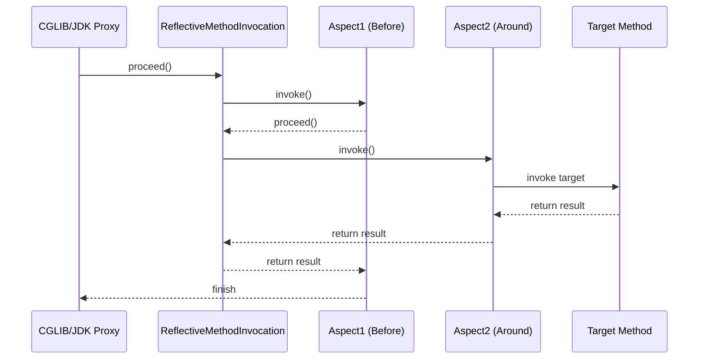

## Spring AOP 代理选择与切面链路深度解析

Spring AOP 的底层实现是动态代理。理解代理对象的生成策略（JDK vs CGLIB）以及多切面叠加时的拦截器链（Interceptor Chain）执行模型，是掌握 Spring 高级特性的必经之路。

---

## 一、 代理策略的选择：JDK 还是 CGLIB？

Spring 在 `DefaultAopProxyFactory` 中决定为某个 Bean 创建哪种代理。

### 1. 核心判断逻辑

Spring 默认遵循以下优先级进行代理选择：

1. **强制性强制 CGLIB**：如果设置了 `proxy-target-class="true"`（或 Spring Boot 2.x+ 默认 `spring.aop.proxy-target-class=true`），则统一使用 CGLIB。
2. **JDK 动态代理**：如果目标类实现了**至少一个接口**，且未开启强制 CGLIB，则使用 JDK 动态代理。
3. **CGLIB 代理**：如果目标类**没有实现任何接口**，则使用 CGLIB。

### 2. 对比与优劣

$$
\begin{array}{|l|l|l|}
\hline
\textbf{维度} & \textbf{JDK 动态代理} & \textbf{CGLIB 代理} \\
\hline
\text{实现原理} & \text{Java 反射机制 (Proxy/InvocationHandler)} & \text{ASM 字节码转换生成子类} \\
\hline
\text{限制} & \text{目标类必须实现接口} & \text{目标类及方法不能被 final 修饰} \\
\hline
\text{性能 (创建)} & \text{较快} & \text{较慢 (涉及字节码生成)} \\
\hline
\text{性能 (运行)} & \text{较慢 (拦截时多一跳反射)} & \text{较快 (直接方法调用)} \\
\hline
\end{array}
$$

---

## 二、 AOP 拦截器链的执行模型

当一个方法被多个切面（`@Around`, `@Before`, `@After` 等）增强时，Spring 将其封装为一条**拦截器链（Interceptor Chain）**。

### 1. 责任链设计模式

Spring 将所有的 Advice（通知）通过对应的适配器转化为 `MethodInterceptor`，并存储在 `Advised` 容器中。



### 2. 递归调用：`ReflectiveMethodInvocation.proceed()`

核心源码模型简化如下：

```java
public Object proceed() throws Throwable {
    // 1. 如果执行到了链的末尾，直接执行目标方法（Base Case）
    if (this.currentInterceptorIndex == this.interceptorsAndDynamicMethodMatchers.size() - 1) {
        return invokeJoinpoint();
    }

    // 2. 获取下一个拦截器
    Object interceptorOrInterceptionAdvice = this.interceptorsAndDynamicMethodMatchers.get(++this.currentInterceptorIndex);
    
    // 3. 递归调用直到 Base Case 触发
    return ((MethodInterceptor) interceptorOrInterceptionAdvice).invoke(this);
}
```

---

## 三、 AOP 避坑：内部调用失效

这是最经典的问题：在 `ServiceA` 的 `methodA`（无事务/无 AOP）中直接调用 `this.methodB`（有事务/有 AOP），则 `methodB` 的增强会失效。

### 1. 原理解析

`this` 指向的是原始的目标对象实例，而不是 Spring 容器创建的容器代理对象。只有通过代理对象发起的调用才会经过 `intercept()` 逻辑。

### 2. 技术解决方案：露出代理（Expose Proxy）

1. **开启配置**：

    ```java
    @EnableAspectJAutoProxy(exposeProxy = true)
    ```

2. **手动获取代理**：

    ```java
    public void methodA() {
        // 利用 AopContext 获取当前线程绑定的代理对象执行
        ((ServiceA) AopContext.currentProxy()).methodB();
    }
    ```

---

## 四、 总结

AOP 不仅仅是配置 `@Aspect`。深入理解 `BeanPostProcessor` 在初始化阶段如何钩入代理生成逻辑，以及 `proceed()` 的递归回溯模型，才能在处理复杂的嵌套事务和多维度日志切面时立于不败之地。
