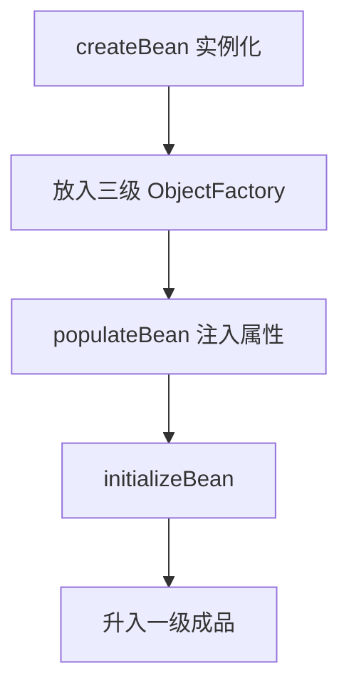
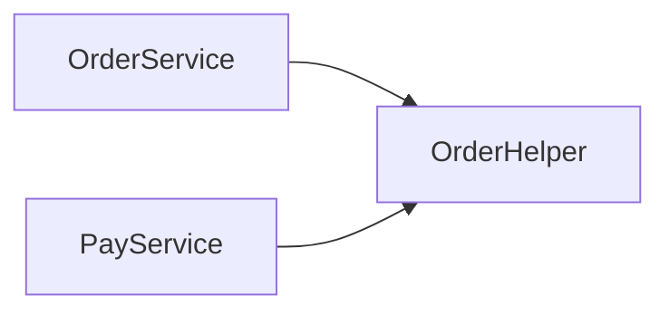

## Spring 循环依赖深度进阶解析

三级缓存解决的是 **单例 + setter/字段注入** 的循环依赖。本篇讲清边界：构造器为何不行、AOP 为何要三级、`@Async` 为何炸、以及生产上如何拆环。

基础生命周期见 [Bean 生命周期](0-bean-lifecycle.md)、[AOP 与三级缓存](1-ioc-aop.md)、[代理链路](17-aop-proxy-chain.md)。

---

## 一、三级缓存分别存什么

| 缓存 | 结构 | 内容 |
| :--- | :--- | :--- |
| 一级 `singletonObjects` | Map | 成品 Bean |
| 二级 `earlySingletonObjects` | Map | 早期暴露对象（可能已是代理） |
| 三级 `singletonFactories` | Map | `ObjectFactory`，延迟生成早期引用 |



暴露早期引用时机：实例化后、属性注入前，调用 `addSingletonFactory`。

---

## 二、setter 循环如何走通

场景：A 依赖 B，B 依赖 A（字段/`@Autowired`）。

```text
1. 创建 A 原对象，A 进三级缓存
2. 填充 A 时要 B → 创建 B
3. B 进三级；填充 B 时要 A → getSingleton(A)
4. 从三级 ObjectFactory.getObject() 得到 A 早期引用（可触发提前 AOP）
5. 早期 A 放二级；B 注入早期 A，B 完成进一级
6. A 继续注入已完成的 B，A 初始化后进一级
```

核心前提：**先有堆上的空壳对象，再填属性**。

---

## 三、构造器循环为什么不行

```java
@Service
public class A {
    public A(B b) { }
}
@Service
public class B {
    public B(A a) { }
}
```

创建 A 必须先有 B，创建 B 必须先有 A → 无“半成品引用”可暴露窗口。

数学表达：

$$
\text{new } A \Rightarrow B \Rightarrow \text{new } B \Rightarrow A \Rightarrow \cdots
$$

**Spring 默认不支持构造器循环依赖**，启动直接报 `BeanCurrentlyInCreationException`。

可选出路：

1. 改为 setter/字段注入（仍建议重构）。
2. `@Lazy` 构造参数：注入懒代理，推迟取真实 Bean。
3. 消除循环：提取第三服务 C。

---

## 四、为何是三级而不是两级

若只有“早期原对象”二级缓存：

1. B 注入了 **原始 A**。
2. A 初始化时 AOP 生成 **代理 A'** 放入一级。
3. B 手里仍是原始 A → **事务/鉴权失效**。

三级缓存把“是否需要代理”推迟到 `ObjectFactory.getObject()`：

- 若需代理，早期暴露的就是 **A'**。
- B 与最终容器拿到的是同一代理引用。

这是 `@Transactional` 等标准 AOP 能与循环依赖共存的关键。

---

## 五、源码级 getSingleton

```java
protected Object getSingleton(String beanName, boolean allowEarlyReference) {
    Object singletonObject = this.singletonObjects.get(beanName);
    if (singletonObject == null && isSingletonCurrentlyInCreation(beanName)) {
        singletonObject = this.earlySingletonObjects.get(beanName);
        if (singletonObject == null && allowEarlyReference) {
            synchronized (this.singletonObjects) {
                singletonObject = this.singletonObjects.get(beanName);
                if (singletonObject == null) {
                    singletonObject = this.earlySingletonObjects.get(beanName);
                    if (singletonObject == null) {
                        ObjectFactory<?> singletonFactory = this.singletonFactories.get(beanName);
                        if (singletonFactory != null) {
                            singletonObject = singletonFactory.getObject();
                            this.earlySingletonObjects.put(beanName, singletonObject);
                            this.singletonFactories.remove(beanName);
                        }
                    }
                }
            }
        }
    }
    return singletonObject;
}
```

流程：一级 → 二级 →（允许早期引用时）三级工厂 → 升二级。

---

## 六、`@Async` 为何导致循环依赖失败

### 1. 报错特征

```text
Bean with name 'a' has been injected into other beans [...]
but has been wrapped since it was injected
```

### 2. 原因

| 代理类型 | 处理器 | 能否在三级缓存提前创建 |
| :--- | :--- | :--- |
| 事务等常规 AOP | `AnnotationAwareAspectJAutoProxyCreator`（SmartInstantiationAware BPP） | 能 |
| `@Async` | `AsyncAnnotationBeanPostProcessor` | **不能**（初始化后再包一层） |

结果：

1. B 注入了早期 A（原对象或普通 AOP 代理）。
2. A 初始化末尾又被 `@Async` 包成新代理 A''。
3. Spring 发现“注入出去的引用 ≠ 最终单例”，为防错直接失败。

### 3. 处理

1. **`@Lazy` 注入** 打断即时解析。
2. **消除循环**（首选）。
3. 异步门面独立 Bean，避免与循环图纠缠。
4. 不用 `@Async`，改为显式线程池 `execute`。

---

## 七、其他边界与坑

| 场景 | 结果 |
| :--- | :--- |
| prototype 循环 | 不支持三级缓存那套 |
| `@Lookup` / Provider | 可推迟依赖获取 |
| 构造器 + `@Lazy` | 可以启动，但是懒代理 |
| 字段循环 + 双方 `@Transactional` | 一般 OK（标准 AOP） |
| 依赖依赖 `@Configuration` 全 CGLIB | 偶发顺序问题，保持配置类无业务循环 |

Spring Boot 2.6+ 默认 **`spring.main.allow-circular-references=false`** 时可直接禁止循环依赖，强制暴露设计问题。需要时显式：

```yaml
spring:
  main:
    allow-circular-references: true
```

更推荐修代码而不是开开关。

---

## 八、重构手法（生产）



1. **下沉公共逻辑**到无环依赖的第三组件。
2. **事件解耦**：`ApplicationEvent` / MQ，异步最终一致。
3. **接口隔离**：A 依赖 `BApi` 抽象，实现侧再组装。
4. **按领域拆模块**，避免 Service 网状互调。

循环依赖往往是**模块边界不清**的味道，不只是 Spring 技巧题。

---

## 九、面试口述模板

1. 三级缓存是什么、各存什么。
2. setter 循环六步时序。
3. 构造器为何不行。
4. 三级为了 AOP 早期代理与最终一致。
5. `@Async` 反例与 `@Lazy`/重构。
6. Boot 2.6 默认不允许循环。

---

## 十、总结

- 循环依赖解决方案有严格前提：单例、非构造器、代理生命周期可提前。
- `@Async`、prototype、构造器注入是经典雷区。
- 工程上：**拆环 > `@Lazy` > 打开 allow-circular-references`**。

结合 [代理链路](17-aop-proxy-chain.md) 可完整回答“注入的到底是原对象还是代理”。
