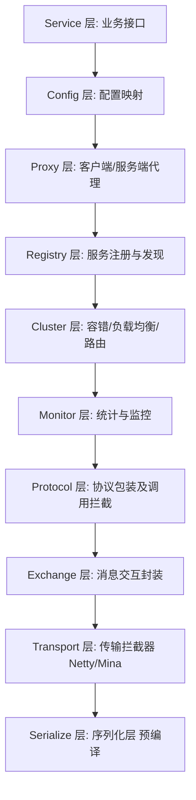
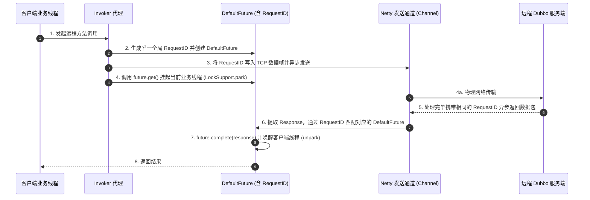

## Dubbo 核心架构与高性能 RPC 通信原理

在微服务架构中，RPC（Remote Procedure Call，远程过程调用）是核心的通信基石。Dubbo 作为高性能 Java RPC 框架的代表，其底层对于同步/异步双工通信、服务自适应 SPI、以及调用责任链的设计都有着经典的工业表达。

---

## 一、 Dubbo 10 层核心架构

Dubbo 将整个框架自底向上抽象为 10 层结构，每一层之间单向依赖，实现极高内聚的组件耦合：



### 关键抽象层作用
- **`Cluster`**：负责将多个提供者封装为一个虚拟节点。在此实现 **负载均衡（LoadBalance）**、**集群容错（ClusterInvoker）** 和 **服务路由（Router）**。
- **`Protocol`**：直接负责调用链的生命周期处理，在此可挂载大量的 AOP 拦截器（`Filter`）。
- **`Serialize`**：网络包压缩序列化。如 FastJSON2、Hessian2、Kryo 等二进制多维转换。

---

## 二、 自适应微插槽：Dubbo 增强式 SPI 原理

与 Spring 的 IoC 或 Java 原生的 SPI 不同，Dubbo 创造性地提供了 **ExtensionLoader（扩展器加载）**、**自适应包装（Wrapper）** 以及 **自适应参数选择（`@Adaptive`）** 技术。

```java
// 伪代码：自适应动态获取指定的协议类型，如 dubbo:// 或 tri://
Protocol protocol = ExtensionLoader.getExtensionLoader(Protocol.class).getAdaptiveExtension();
```

1.  **动态编译代理**：Dubbo 内部会根据 URL 中的协议值，在内存中使用 Javassist/JDK 动态生成一段 Adaptive 代码并编译装载，避免了类静态硬编码引用的尴尬。
2.  **AOP 自动包裹（IOC）**：若某个 SPI 实现类中包含带有其他接口作为入参的 Setter 方法，`ExtensionLoader` 会自动将该依赖属性注入进来完成装配。

---

## 三、 基于 Netty 的单连接异步双工通信原理

客户端发起的 RPC 调用通常是**同步**（`Blocking`）的（例如，方法调用需要等待返回值）；但底层的网络通信（Netty）却是**异步双工**的，即发送数据与接收数据完全隔离。

Dubbo 是如何解决这二者之间的矛盾，实现“发送 $\implies$ 挂起等待 $\implies$ 响应激活”的？



### 核心机制：RequestID 与 Thread 映射

1.  **RequestID 标箱化**：Dubbo 在写出报文时，会在协议头固化注入一个自增的唯一长整形标示：`RequestID`。
2.  **缓存注册表**：客户端在发送前，将这个 `RequestID` 作为 Key，与当前调用线程的 `DefaultFuture` 实例映射，并存入私有并发哈希表 `FUTURES` 中：
    $$
    \text{FUTURES.put(requestId, future)}
    $$
3.  **连接复用与线程让步**：一个物理 TCP 连接可以被上万个并发网络包共享。发送完毕后，客户端线程使用 `LockSupport.park()` 进入高效让步，等待结果。
4.  **事件响应与回填**：当 Netty 监听到响应网络帧进入时，从包头提取 `RequestID`。通过查找 `FUTURES.remove(requestId)` 锁定挂起的调用，将返回值塞入 Future，并立即执行 `unpark()` 唤醒业务线程，流程完美闭环。

---

## 四、 总结

Dubbo 通过 **10 层架构规范** 进行了完美的横深解耦，利用 **动态 URL 驱动** 与 **增强自适应 SPI** 达成了组件高度可插拔，并依靠 **Netty 环形网络通信机制的精妙时隔抽象** 解答了分布式场景下“微多路复用连接”的高吞吐性能诉求。
