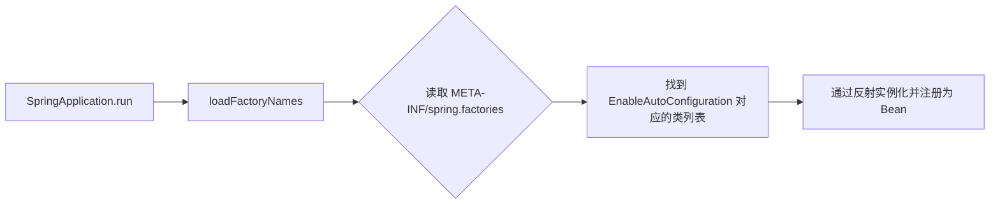

## Spring 核心扩展点与 SPI 机制深度剖析

Spring 的强大之处在于其卓越的扩展性。无论是 Spring Boot 的自动装配，还是各种第三方中间件（MyBatis、Apollo、Sentinel）的集成，都离不开 Spring 提供的核心扩展接口。

---

## 一、 Spring 容器级扩展点

在 Bean 的生命周期中，Spring 留出了多个钩子接口供开发者干预。

### 1. BeanPostProcessor (Bean 后置处理器)
这是最常用的扩展点，作用于 Bean 的**初始化阶段**。

- **`postProcessBeforeInitialization`**：在 `init-method` 之前执行。
- **`postProcessAfterInitialization`**：在 `init-method` 之后执行。**AOP 代理增益通常在此发生。**

### 2. BeanFactoryPostProcessor (工厂后置处理器)
作用于 **BeanDefinition 注册之后，Bean 实例化之前**。
- **典型应用**：`PropertyPlaceholderConfigurer`（解析 `${}` 占位符）。
- **`BeanDefinitionRegistryPostProcessor`**：它是 `BeanFactoryPostProcessor` 的子接口，允许在运行时动态注册更多 `BeanDefinition`（如 MyBatis 扫描 Mapper 并注册为 Proxy Bean）。

---

## 二、 知晓接口 (Aware Group)

Aware 接口允许 Bean 获取容器层面的资源。

$$
\begin{array}{|l|l|}
\hline
\textbf{接口名称} & \textbf{注入的内容} \\
\hline
\text{BeanNameAware} & \text{当前 Bean 的 ID/Name} \\
\hline
\text{BeanFactoryAware} & \text{当前 BeanFactory 工厂} \\
\hline
\text{ApplicationContextAware} & \text{整个应用上下文 (Spring 容器)} \\
\hline
\text{EnvironmentAware} & \text{配置环境 (Properties/YAML)} \\
\hline
\end{array}
$$

---

## 三、 Spring 内部 SPI 机制：SpringFactoriesLoader

Spring 没有直接使用 Java 原生的 SPI（`ServiceLoader`），而是设计了一套功能更强大的 `spring.factories` 机制。

### 1. 核心流程
Spring Boot 的启动类通过读取所有 Jar 包下 `META-INF/spring.factories` 文件中的配置，自动加载指定的实现类。

### 2. 为什么不用 Java SPI？
- **性能更优**：Java SPI 必须遍历实例化所有类，Spring 可以按需加载。
- **功能更全**：支持排序（`@Order`）、条件加载（`@Conditional`）。

---

## 四、 总结

理解这些扩展点是开发“框架级代码”的关键。
- 如果你要修改 Bean 属性，找 `BeanPostProcessor`。
- 如果你要动态注册 Bean，找 `BeanDefinitionRegistryPostProcessor`。
- 如果你要做外部集成，研究 `spring.factories`。
