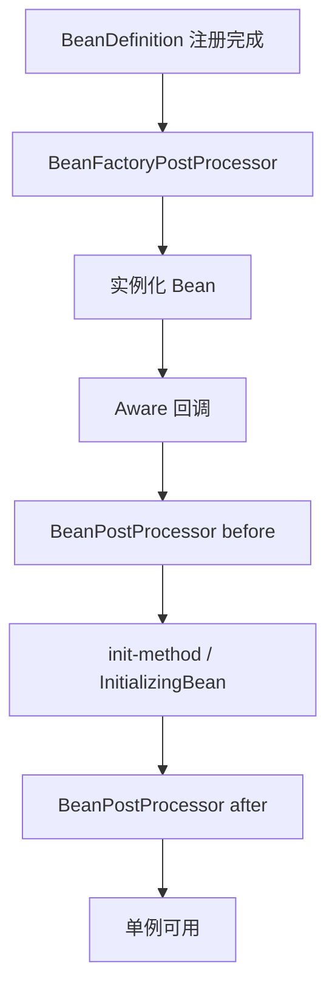

## Spring 核心扩展点与 SPI 机制深度剖析

Spring 的强大之处在于扩展性。无论是 Spring Boot 自动装配，还是 MyBatis、Sentinel、Nacos 等中间件集成，都落在一组稳定的**容器扩展接口**与 **SPI 加载机制**上。

相关阅读：[Bean 生命周期](0-bean-lifecycle.md)、[BeanDefinition](2-beandefinition-internals.md)、[Boot 扩展](12-springboot-extension.md)、[条件装配](29-springboot-conditional-autoconfig.md)。

---

## 一、容器级扩展点总览

按**作用对象**与**触发时机**分类：



| 扩展点 | 作用对象 | 典型时机 | 典型用途 |
| :--- | :--- | :--- | :--- |
| `BeanDefinitionRegistryPostProcessor` | Bean 定义注册表 | 实例化前最早 | 动态注册 Mapper、Feign Client |
| `BeanFactoryPostProcessor` | BeanFactory / BeanDefinition | 实例化前 | 占位符替换、改属性 |
| `InstantiationAwareBeanPostProcessor` | 实例化与属性注入 | 实例化前后 | 短路实例化、字段注入扩展 |
| `BeanPostProcessor` | Bean 实例 | init 前后 | **AOP 代理**、注解解析 |
| Aware 系列 | 当前 Bean | 初始化前 | 拿到容器资源 |
| `ApplicationListener` / `@EventListener` | 应用事件 | 运行期 | 解耦业务 |
| `FactoryBean` | 特殊 Bean 生产 | getObject | 复杂对象构建（SqlSessionFactory） |
| `ImportBeanDefinitionRegistrar` | 注册表 | `@Import` 解析 | 注解驱动模块注册 |
| `ImportSelector` | 选择配置类 | `@Import` 解析 | 批量导入自动配置 |

---

## 二、BeanPostProcessor vs BeanFactoryPostProcessor

### 1. BeanPostProcessor（操作实例）

```java
public interface BeanPostProcessor {
    default Object postProcessBeforeInitialization(Object bean, String beanName) {
        return bean;
    }
    default Object postProcessAfterInitialization(Object bean, String beanName) {
        return bean;
    }
}
```

- **Before**：`@PostConstruct` / `InitializingBean` / 自定义 init **之前**。
- **After**：**初始化完成之后**；`AbstractAutoProxyCreator` 多在此生成 AOP 代理。

注意：`BeanPostProcessor` 自身也是 Bean，Spring 会优先初始化它们，且它们通常**不会**再被其他 BPP 代理，避免鸡生蛋问题。

### 2. BeanFactoryPostProcessor（操作定义）

作用于 **所有 BeanDefinition 已加载、任何业务 Bean 实例化之前**。

经典实现：

- `PropertySourcesPlaceholderConfigurer`：把 `${db.url}` 替换成真实值。
- `CustomEditorConfigurer`：自定义属性编辑器。

### 3. BeanDefinitionRegistryPostProcessor

`BeanFactoryPostProcessor` 的子接口，额外提供：

```java
void postProcessBeanDefinitionRegistry(BeanDefinitionRegistry registry);
```

可在运行时 `registry.registerBeanDefinition(...)`。MyBatis 的 `MapperScannerConfigurer`、Spring 的配置类解析相关处理器都依赖这一能力。

**执行顺序：**

1. 所有 `BeanDefinitionRegistryPostProcessor.postProcessBeanDefinitionRegistry`
2. 所有 `BeanDefinitionRegistryPostProcessor.postProcessBeanFactory`（继承自 BFPP）
3. 其余普通 `BeanFactoryPostProcessor.postProcessBeanFactory`

可用 `PriorityOrdered` / `Ordered` / `@Order` 控制同类型内顺序。

---

## 三、Aware 回调族

| 接口 | 注入内容 | 常见用途 |
| :--- | :--- | :--- |
| `BeanNameAware` | Bean id | 日志、按名区分实例 |
| `BeanFactoryAware` | 当前 `BeanFactory` | 编程式取 Bean（慎用） |
| `ApplicationContextAware` | 应用上下文 | 发事件、取国际化消息 |
| `EnvironmentAware` | `Environment` | 读配置 |
| `EmbeddedValueResolverAware` | 嵌入值解析器 | 解析 `${}` / SpEL |
| `ApplicationEventPublisherAware` | 事件发布器 | 解耦发事件 |

Aware 在 `BeanPostProcessor` 的 before 初始化阶段由 `ApplicationContextAwareProcessor` 等统一调用。过度依赖 Aware 会让业务与容器耦合，优先构造器注入协作 Bean。

---

## 四、FactoryBean：Bean 的“工厂 Bean”

`FactoryBean<T>` 本身是容器中的一个 Bean，但 `getBean("id")` 默认返回 **`getObject()` 产物**。

| 写法 | 得到 |
| :--- | :--- |
| `getBean("sqlSessionFactory")` | `SqlSessionFactory` 实例 |
| `getBean("&sqlSessionFactory")` | `SqlSessionFactoryBean` 自身 |

适用：创建过程极复杂（需要很多依赖、条件分支）又不想把逻辑塞进 `@Bean` 方法。MyBatis-Spring 的 `SqlSessionFactoryBean` 是教科书级例子。

---

## 五、`@Import` 三件套：配置模块化

### 1. 直接 Import 配置类

`@Import(OtherConfig.class)` —— 最简单。

### 2. ImportSelector

返回应导入的类名数组，适合按条件批量选择：

```java
public class MyImportSelector implements ImportSelector {
    @Override
    public String[] selectImports(AnnotationMetadata metadata) {
        return new String[] { "com.app.FooAutoConfiguration" };
    }
}
```

Spring Boot 的 `AutoConfigurationImportSelector` 是其加强版（还处理 exclusions、过滤条件等）。

### 3. ImportBeanDefinitionRegistrar

直接操作 `BeanDefinitionRegistry`，适合为注解属性生成一批定义（如 `@EnableFeignClients`、`@MapperScan`）：

```java
public class MyRegistrar implements ImportBeanDefinitionRegistrar {
    @Override
    public void registerBeanDefinitions(
            AnnotationMetadata metadata,
            BeanDefinitionRegistry registry) {
        RootBeanDefinition bd = new RootBeanDefinition(MyService.class);
        registry.registerBeanDefinition("myService", bd);
    }
}
```

---

## 六、Spring SPI：`SpringFactoriesLoader` 与 Boot 3 演进

### 1. 为什么不用 JDK `ServiceLoader`？

| | JDK SPI | SpringFactoriesLoader |
| :--- | :--- | :--- |
| 文件 | `META-INF/services/` | `META-INF/spring.factories` |
| 加载 | 往往全量迭代实例化 | 可只读类名、按需实例化 |
| 条件装配 | 无 | 与 `@Conditional` 完美配合 |
| 排序 | 弱 | 可与 `Ordered` 协作 |

### 2. 经典 spring.factories

```properties
org.springframework.boot.autoconfigure.EnableAutoConfiguration=\
com.example.demo.MyAutoConfiguration
```

`SpringApplication` 启动时加载所有 jar 中该文件，汇总 `EnableAutoConfiguration` 列表，再经条件注解过滤后注册。

### 3. Spring Boot 3 / Spring Framework 6

新约定：

```text
META-INF/spring/org.springframework.boot.autoconfigure.AutoConfiguration.imports
```

每行一个自动配置类名，不再用 `spring.factories` 注册 `EnableAutoConfiguration`（其他类型工厂仍可能用 factories）。写新 Starter 时优先新格式，并保证配置类进入自动配置扫描列表。

```mermaid
flowchart LR
    A[SpringApplication.run] --> B[load 自动配置候选]
    B --> C[过滤 exclusions]
    C --> D[@Conditional 评估]
    D --> E[注册 Configuration 类]
    E --> F[刷新容器创建 Bean]
```

---

## 七、实战选型决策树

| 你想做什么 | 用哪个扩展点 |
| :--- | :--- |
| 改 Bean 的属性值 / 解析 `${}` | `BeanFactoryPostProcessor` |
| 运行时注册新的 Bean 定义 | `BeanDefinitionRegistryPostProcessor` 或 `ImportBeanDefinitionRegistrar` |
| 包装 Bean（代理、监控） | `BeanPostProcessor`（after） |
| 复杂对象创建 | `FactoryBean` 或 `@Bean` 方法 |
| 引入一整套中间件自动配置 | 自动配置类 + `AutoConfiguration.imports` |
| 业务解耦通知 | `ApplicationEvent` + Listener |
| 按环境开关 Bean | `@Conditional*`（见条件装配篇） |

---

## 八、常见坑

1. **在 `BeanFactoryPostProcessor` 里 `getBean`**：会提前实例化，破坏正常生命周期，甚至触发诡异循环依赖。
2. **自定义 BPP 依赖了业务 Bean**：可能导致该业务 Bean 过早初始化且不被代理。
3. **Starter 写了自动配置但未登记 imports / factories**：类在 jar 里却永远不生效。
4. **忽略 `Ordered`**：多 BPP 顺序错误导致 AOP、校验、脱敏顺序不符合预期。

---

## 九、总结

- 改**定义**用 BFPP / Registrar；改**实例**用 BPP；拿**容器资源**用 Aware（克制使用）。
- SPI 是生态集成的总线：Boot 靠它发现自动配置，中间件靠它零侵入接入。
- 真正掌握扩展点后，自定义 Starter、对接公司内部框架会从“抄配置”变成“设计扩展”。
