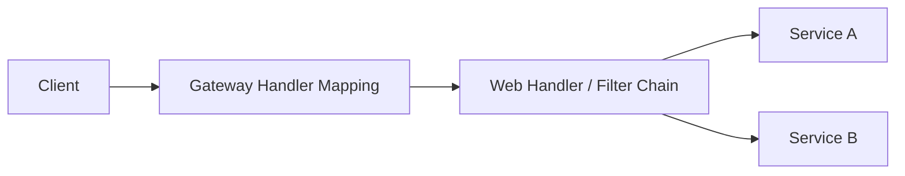

---
title: Spring Cloud Gateway 流量入口与安全网关实战
hide_title: true
sidebar_label: Gateway 统一网关
---

## Spring Cloud Gateway 流量入口与安全网关实战

在微服务架构中，**网关 (Gateway)** 是系统的唯一入口。它不仅承担着请求路由、负载均衡的职责，还是实现统一鉴权、限流、日志审计的核心位置。

---

## 一、 为什么需要网关？

如果没有网关，客户端需要直接面对成百上千个微服务，这会带来：
1. **认证复杂**：每个微服务都需要独立实现登录校验。
2. **耦合严重**：服务端 IP 或端口变动，客户端必须修改配置。
3. **安全隐患**：所有服务直接暴露在公网，极易受到攻击。

Spring Cloud Gateway 基于 **Project Reactor** 和 **WebFlux** 构建，能够提供非阻塞的高性能路由能力。

---

## 二、 核心三要素：Route, Predicate, Filter

1. **Route (路由)**：网关的基本模块。由 ID、目标 URI、断言集合和过滤器集合组成。
2. **Predicate (断言)**：匹配条件。例如“请求路径必须是 `/api/**`”或“必须在特定时间之后”。
3. **Filter (过滤器)**：在发送给下游服务之前或之后修改请求。例如添加请求头或进行限流。



---

## 三、 实战：动态路由与断言配置

我们在 `application.yml` 中定义路由规则：

```yaml
spring:
  cloud:
    gateway:
      routes:
        - id: order-service-route
          uri: lb://order-service # 使用 Ribbon/LoadBalancer 进行负载均衡
          predicates:
            - Path=/order/** # 匹配路径
            - Header=X-Request-Id, \d+ # 匹配特定值的 Header
          filters:
            - AddRequestHeader=X-Source, Gateway # 自动添加请求头
```

---

## 四、 高级特性：跨域与统一限流

### 1. 跨域配置 (CORS)
网关是解决前端跨域的最佳位置，无需在每个微服务上配置。

```yaml
spring:
  cloud:
    gateway:
      globalcors:
        cors-configurations:
          '[/**]':
            allowedOrigins: "*"
            allowedMethods: "*"
```

### 2. 基于 Redis 的令牌桶限流
网关保护下游服务最直接的手段。

```yaml
filters:
  - name: RequestRateLimiter
    args:
      redis-rate-limiter.replenishRate: 10 # 令牌桶每秒充填速度
      redis-rate-limiter.burstCapacity: 20 # 令牌桶容量
      key-resolver: "#{@userKeyResolver}" # 按用户 ID 限流
```

---

## 五、 后续思考：零信任安全架构

网关并非万能。在高级微服务开发中，通常在网关层完成 **JWT 令牌校验**，将解析后的 `UserId` 放在 Header 中透传给下游服务，而下游服务则通过 **“内部鉴权拦截器”** 确保请求只来自于网关。

> 想要了解如何保障分布式事务一致性？请参考 [Seata 分布式事务全解](./25-seata-distributed-transaction.md)。
