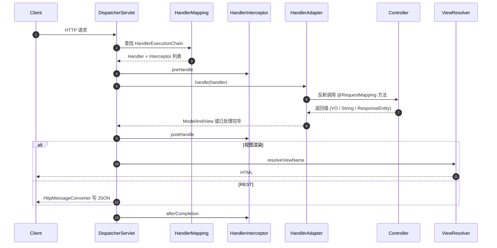
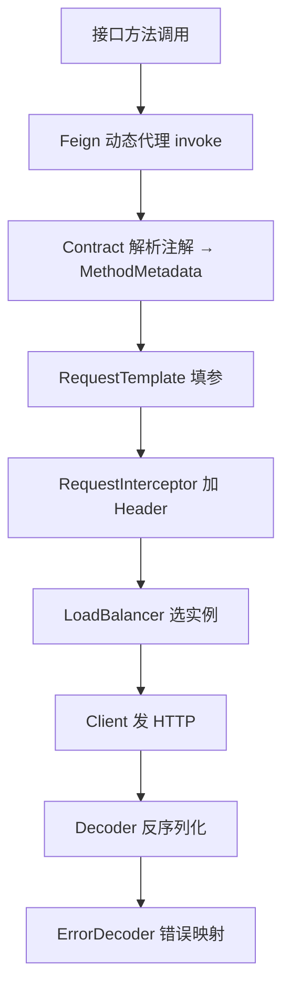

## Spring MVC 执行流程与远程调用原理

Spring MVC 的中枢是 `DispatcherServlet`；微服务之间的同步调用则绕不开 `RestTemplate`、`WebClient` 与 **OpenFeign**。本篇把“接入请求”和“发出请求”两条链路放在一起看清抽象共性。

相关阅读：[MVC 核心原理](8-springmvc-principles.md)、[MVC 高级特性](9-springmvc-advanced.md)、[Gateway](21-gateway-advanced.md)、[Dubbo RPC](19-dubbo-rpc-kernel.md)。

---

## 一、Spring MVC 请求处理生命周期



### 1. 三大件职责

| 组件 | 职责 |
| :--- | :--- |
| `HandlerMapping` | URL / 条件 → Handler 方法（`RequestMappingHandlerMapping`） |
| `HandlerAdapter` | 统一调用形态各异的 Handler（`RequestMappingHandlerAdapter`） |
| `HandlerExceptionResolver` | 控制器与拦截器异常 → 错误响应 |

### 2. 参数与返回值

`RequestMappingHandlerAdapter` 内部两大扩展点：

- **`HandlerMethodArgumentResolver`**：`@RequestBody`、`@RequestParam`、`@PathVariable` 等。
- **`HandlerMethodReturnValueHandler`**：`@ResponseBody`、视图名、`ResponseEntity` 等。

JSON 场景最终落到 `HttpMessageConverter`（Jackson 的 `MappingJackson2HttpMessageConverter`）。

### 3. 拦截器 vs 过滤器

| | Servlet Filter | Spring HandlerInterceptor |
| :--- | :--- | :--- |
| 位置 | Servlet 容器 | Spring MVC |
| 范围 | 所有进入 DispatcherServlet 前后 | 仅映射到 Handler 的请求 |
| 能力 | 更底层，可改请求包装 | 能拿到 Handler 方法元数据 |

鉴权可在 Filter（JWT 解析）或拦截器（基于 Handler 注解）完成，网关层做统一鉴权更常见。

---

## 二、RestTemplate：同步 HTTP 客户端模板

### 1. 核心设计

`RestTemplate` 把“拼 URL、设 Header、序列化 Body、发请求、反序列化”收成模板方法，真正 IO 交给 `ClientHttpRequestFactory`：

| 工厂 | 底层 | 特点 |
| :--- | :--- | :--- |
| `SimpleClientHttpRequestFactory` | JDK `HttpURLConnection` | 默认，连接池弱 |
| `HttpComponentsClientHttpRequestFactory` | Apache HttpClient | 生产常用，可配连接池 |
| `OkHttp3ClientHttpRequestFactory` | OkHttp | 现代 API、拦截器生态 |

### 2. 拦截器链

```java
RestTemplate rest = new RestTemplate(factory);
rest.getInterceptors().add((request, body, execution) -> {
    request.getHeaders().add("X-Trace-Id", MDC.get("traceId"));
    return execution.execute(request, body);
});
```

适合透传追踪 ID、统一 Token、度量耗时。

### 3. 消息转换

与 MVC 对称：出站用 `HttpMessageConverter` 写 Body，入站再读成对象。自定义日期格式、枚举序列化时，MVC 与 RestTemplate 应共用 `ObjectMapper` 配置，避免“服务端能序列化、客户端反序列化失败”。

### 4. 现状

Spring 6 / Boot 3 起 RestTemplate 进入维护模式，**新项目优先 `WebClient`（或 JDK 11+ `HttpClient`）**；存量同步代码仍大量使用 RestTemplate。

---

## 三、WebClient 简述（响应式客户端）

```java
WebClient client = WebClient.builder()
    .baseUrl("http://order-service")
    .filter(ExchangeFilterFunction.ofRequestProcessor(req -> {
        // 透传 Header
        return Mono.just(req);
    }))
    .build();

Mono<Order> order = client.get()
    .uri("/orders/{id}", id)
    .retrieve()
    .bodyToMono(Order.class);
```

- 非阻塞，适合高并发网关式聚合。
- 在 Servlet MVC 中 `block()` 可桥接同步世界，但会占用 Servlet 线程，需评估。

---

## 四、OpenFeign：声明式 HTTP 客户端

### 1. 使用形态

```java
@FeignClient(name = "order-service", path = "/orders")
public interface OrderClient {
    @GetMapping("/{id}")
    Order getById(@PathVariable("id") Long id);
}
```

业务侧像调本地接口；运行时是 **JDK 动态代理**。

### 2. 执行链路



关键组件：

| 组件 | 作用 |
| :--- | :--- |
| `Contract` | 解析 Spring MVC / Feign 原生注解 |
| `Encoder` / `Decoder` | 参数编码与响应解码（常接 Jackson） |
| `RequestInterceptor` | 统一鉴权、灰度标、traceId |
| `Client` | 真正 HTTP 实现（默认 JDK，可换 OkHttp） |
| `LoadBalancerFeignClient` | 与 Spring Cloud LoadBalancer 集成 |
| `ErrorDecoder` | 4xx/5xx 映射为业务异常 |
| `Fallback` / `FallbackFactory` | 与 Sentinel/Resilience4j 降级配合 |

### 3. 与 RestTemplate 对比

| | RestTemplate | Feign |
| :--- | :--- | :--- |
| API | 命令式 URL 字符串 | 声明式接口 |
| 服务发现 | 需 `LoadBalancerClient` 包装 | 注解级开箱 |
| 可读性 | 分散 | 接口即文档 |
| 调试 | 直观 | 需理解代理与编解码 |
| 性能 | 略直接 | 多一层抽象，一般可忽略 |

### 4. 生产注意点

1. **超时**：`connectTimeout` / `readTimeout` 必配，禁止无限等待。
2. **重试**：非幂等接口默认不要盲目重试；与幂等键、MQ 配合。
3. **Hystrix 已退役**：熔断限流转向 Sentinel / Resilience4j。
4. **大响应 / 文件**：Feign 不如专用下载客户端清晰，注意内存。
5. **日志级别 `FULL`**：只在排查时短暂打开，避免日志打满磁盘与泄露敏感数据。

---

## 五、两条链路的设计共性

无论是 MVC 处理入站，还是 Feign 发出站：

1. **适配器模式**统一多种参数/返回形态。
2. **转换器**负责对象 ↔ 字节（JSON）。
3. **拦截器/过滤器责任链**做横切（鉴权、日志、追踪）。
4. **动态代理**降低样板代码（Controller 映射 vs Feign 接口）。

理解这四点，看到 Dubbo Filter 链、Gateway GlobalFilter 都会有熟悉感。

---

## 六、总结

- 入站：`DispatcherServlet` → Mapping → Adapter → Converter。
- 出站：RestTemplate 模板方法 / WebClient 响应式 / Feign 接口代理 + 负载均衡。
- 微服务调用选型：同步简单用 Feign；高并发聚合看 WebClient；私有协议与极致性能看 [Dubbo](19-dubbo-rpc-kernel.md) / [Netty RPC](../network/7-netty-rpc-practice.md)。
