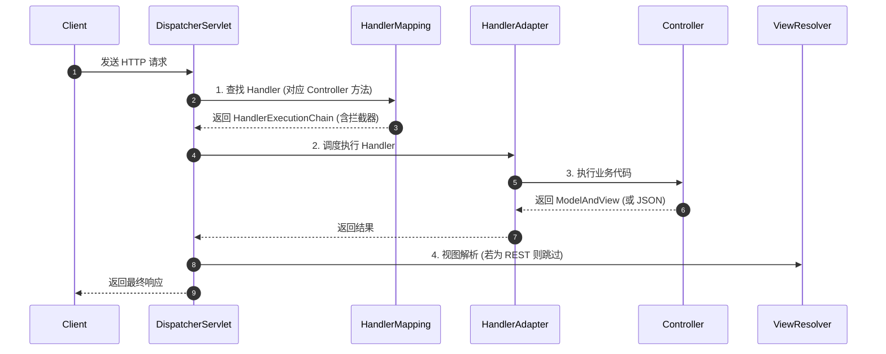
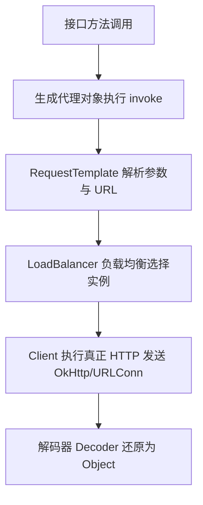

## Spring MVC 执行流程与远程调用原理

Spring MVC 处理请求的精髓在于 `DispatcherServlet`。同时，作为微服务之间的通信桥梁，`RestTemplate` 与 `Feign` 的底层原理也是高级工程师必须掌握的知识。

---

## 一、 Spring MVC 处理请求的全生命周期

`DispatcherServlet` 是整个流程的“中枢神经”。

### 1. 关键组件的作用
- **`HandlerMapping`**：建立 URL 与方法之间的映射（`RequestMappingHandlerMapping`）。
- **`HandlerAdapter`**：由于 Controller 方法参数各异，通过适配器模式统一调用借口。
- **`HandlerInterceptor`**：拦截器链，允许在执行前后进行权限验证或日志记录。

---

## 二、 RestTemplate 底层原理

`RestTemplate` 是 Spring 提供的一个同步 HTTP 客户端。其核心设计在于 **`ClientHttpRequestInterceptor`**。

1.  **请求模板化**：通过 `execute` 方法封装复杂的 HTTP 操作（Headers, Body）。
2.  **可插拔式 HTTP 库**：底层可以切换 `HttpComponents` (Apache), `OkHttp`, 或者原生的 `JdkHttpConnection`。
3.  **消息转换**：利用 `HttpMessageConverter` 自动将 JSON 转换为 Java 对象。

---

## 三、 声明式客户端：Feign 工作原理

Feign 使得调用远程服务像调用本地接口一样简单。

### 1. 动态代理生成
当我们在接口上标注 `@FeignClient` 时：
- Spring 会为该接口创建一个 `Proxy` 对象（基于 JDK 动态代理）。
- 代理对象内部持有一个 `SynchronousMethodHandler`。

### 2. 执行链路

---

## 四、 总结

无论是在 Web 层处理请求，还是在微服务之间发起请求，Spring 的设计哲学是一致的：**高度抽象、适配器增强、以及基于动态代理的零侵入扩展**。
