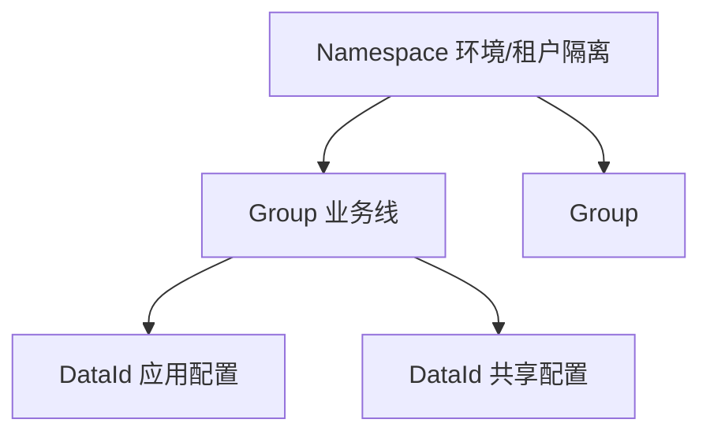
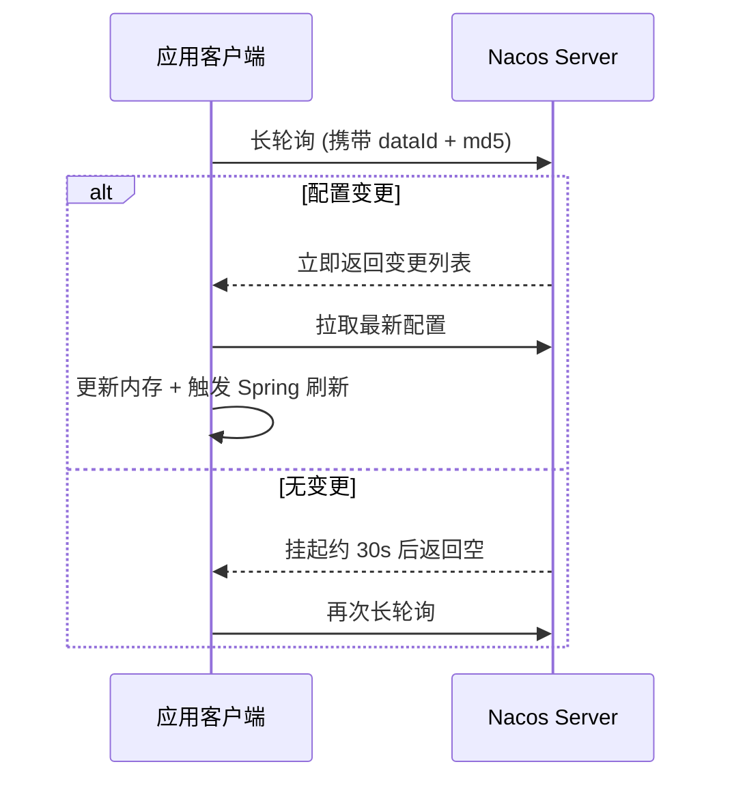
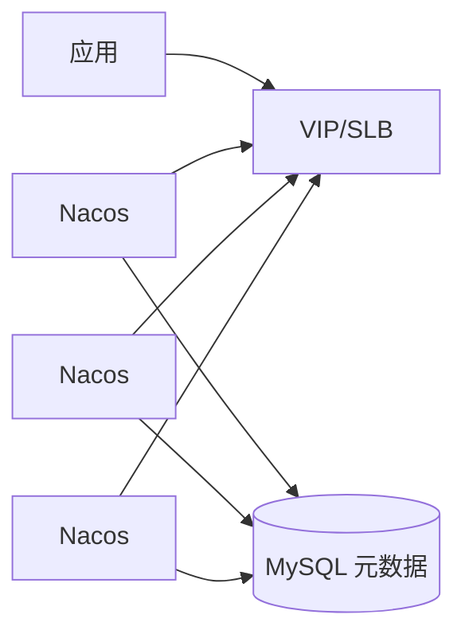

## Nacos 动态配置管理与多租户隔离实践

Nacos 同时承担**注册中心**与**配置中心**。配置侧解决：集中管理、环境隔离、动态推送、共享配置与灰度。本篇聚焦配置模型、长轮询、Spring Cloud 集成与生产安全。

相关：[微服务起步](30-springcloud-quickstart.md)、[Sentinel 规则持久化](27-sentinel-governance.md)、[Boot 配置环境](11-springboot-internals.md)。

---

## 一、三层模型：Namespace / Group / DataId



| 概念 | 建议用法 |
| :--- | :--- |
| **Namespace** | `dev` / `test` / `prod`，或 SaaS 租户级隔离 |
| **Group** | 业务域：`ORDER_GROUP`、`DEFAULT_GROUP` |
| **DataId** | 文件名：`order-service-prod.yaml` |

DataId 推荐：

```text
${spring.application.name}-${spring.profiles.active}.${file-extension}
例：order-service-prod.yaml
```

**多租户**：

- 强隔离：每租户独立 Namespace（权限与审计最好做）。
- 弱隔离：同 Namespace + Group/DataId 前缀区分（注意 ACL）。

---

## 二、动态感知：长轮询原理



要点：

1. 客户端带 **MD5**，服务端比较内容是否变化。
2. 无变化时连接挂起（长轮询），不是疯狂短轮询。
3. 变更时服务端打断挂起，客户端拉全量/增量后回调 Listener。
4. Nacos 2.x 另有 gRPC 双向流优化，语义仍是“订阅 + 推送”。

与 ZK 对比：Nacos 配置对运维更友好（控制台、命名空间）；强一致场景可开 CP 相关模式（版本能力以官方文档为准）。

---

## 三、Spring Cloud 集成

### 1. 引导配置

Boot 2.4+ 可用 `spring.config.import`，不必强依赖 bootstrap：

```yaml
spring:
  application:
    name: order-service
  profiles:
    active: prod
  config:
    import: optional:nacos:order-service-prod.yaml
  cloud:
    nacos:
      config:
        server-addr: 127.0.0.1:8848
        namespace: prod-namespace-id
        group: DEFAULT_GROUP
        file-extension: yaml
        refresh-enabled: true
      discovery:
        server-addr: 127.0.0.1:8848
        namespace: prod-namespace-id
```

旧项目 `bootstrap.yml` 仍常见：保证 Nacos 配置在应用上下文刷新前加载。

### 2. `@RefreshScope` 与 `@ConfigurationProperties`

```java
@RestController
@RefreshScope
public class TimeoutController {

    @Value("${user.order.timeout:10}")
    private int orderTimeout;

    @GetMapping("/timeout")
    public int timeout() {
        return orderTimeout;
    }
}
```

| 绑定方式 | 动态刷新 |
| :--- | :--- |
| `@Value` + `@RefreshScope` | 刷新时重建 Bean |
| `@ConfigurationProperties` + `@RefreshScope` | 同上 |
| 监听 `EnvironmentChangeEvent` / `NacosConfigListener` | 精细控制 |

注意：`@RefreshScope` 代理 Bean 有序列化与原型行为差异；数据库连接池等重资源**不要**整 Bean Refresh，应只刷新业务开关。

### 3. 共享配置与扩展配置

```yaml
spring:
  cloud:
    nacos:
      config:
        shared-configs:
          - data-id: common-redis.yaml
            group: COMMON_GROUP
            refresh: true
        extension-configs:
          - data-id: order-ext.yaml
            group: ORDER_GROUP
            refresh: true
```

**优先级（高 → 低，常见规则）**：

1. 精确 profile DataId（`app-prod.yaml`）
2. 应用默认 DataId（`app.yaml`）
3. `extension-configs`（列表中后者覆盖前者，以版本为准）
4. `shared-configs`
5. 本地 `application.yml`

冲突时以高优先级为准；排查用 `/actuator/env` 看最终 property source。

---

## 四、配置变更与灰度

1. **Beta 发布**：Nacos 控制台可对部分 IP 灰度推送，验证后再全量。
2. **历史版本**：保留变更历史，支持一键回滚。
3. **监听回调**：业务可注册 Listener，做缓存失效、线程池参数热更新。

```java
@NacosConfigListener(dataId = "order-service-prod.yaml", timeout = 5000)
public void onChange(String newContent) {
    // 解析 yaml 后更新本地开关
}
```

（具体注解/API 随 `nacos-spring` 与 `spring-cloud-alibaba` 版本略有差异，以项目依赖为准。）

---

## 五、注册中心侧（简要联动）

同一 Nacos 上配置与发现建议 **Namespace 对齐**，避免 dev 服务注册到 prod。

健康检查：临时实例心跳 vs 永久实例；网关与 Feign 只调健康实例。

临时实例下线快，适合无状态微服务；有状态或需人工上下线场景再评估。

---

## 六、高可用与存储



生产建议：

1. **≥3 节点** 集群；客户端地址写域名/SLB。
2. 元数据外置 **MySQL**（多数据源主备按官方方案）。
3. 监控：推送延迟、长轮询连接数、磁盘与 DB 连接。
4. 网络分区时理解 AP 倾向：配置短暂不一致窗口 vs 可用性。

---

## 七、安全与合规

| 项 | 做法 |
| :--- | :--- |
| 鉴权 | 开 Nacos Auth；生产禁空密码 |
| 敏感配置 | 密文 + 解密插件 / 对接 KMS |
| 权限 | 按 Namespace 做 RBAC，开发无 prod 写权限 |
| 审计 | 变更人、变更内容、回滚记录 |
| 传输 | 内网 TLS 或专线；公网慎暴露 8848 |
| 禁止 | 把 prod 密码提交到 Git |

数据库密码、三方密钥不要明文落 DataId；可用 Jasypt/Nacos 加密插件，启动时解密。

---

## 八、常见故障

1. **改了配置不生效**：缺 `@RefreshScope`；或改了 DataSource 类重资源未重建。
2. **连错环境**：Namespace ID 填成名称；发现与配置 Namespace 不一致。
3. **本地覆盖远程**：`spring.config.import` 顺序与 `optional:` 行为理解错误。
4. **推送风暴**：超大配置频繁改 → 拆分 DataId，减少刷新面。
5. **客户端狂打日志**：长轮询超时属正常，调日志级别避免噪音。

---

## 九、总结

- 模型：`Namespace` 隔离环境，`Group` 分业务，`DataId` 定文件。
- 动态：长轮询/gRPC 订阅 + MD5 比较 + Spring 刷新。
- 生产：集群 + MySQL + 鉴权加密 + 灰度回滚 + 监控。

规则持久化场景可把 [Sentinel 规则](27-sentinel-governance.md) 也放进 Nacos，实现“配置中心驱动流量治理”。
