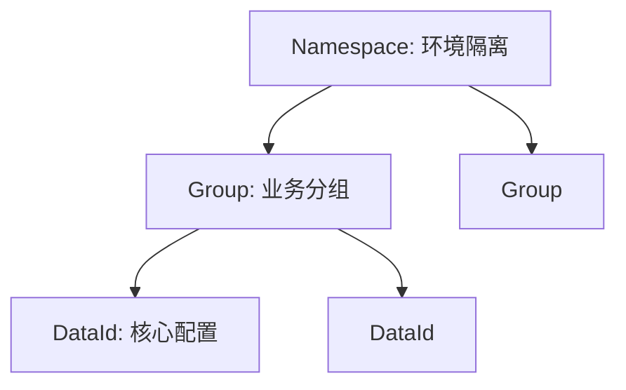

---
title: Nacos 动态配置管理与多租户隔离实践
hide_title: true
sidebar_label: Nacos 配置中心
---

## Nacos 动态配置管理与多租户隔离实践

在分布式系统中，**配置中心**是服务的“中枢神经”。Nacos 不仅是注册中心，更是业界领先的配置中心，它彻底解决了传统应用中修改配置需重启、配置文件散落在各服务中的痛点。

---

## 一、 Nacos 配置管理的核心概念

理解 Nacos 的配置结构，需要掌握 **DataId**、**Group** 和 **Namespace**（三层结构）：

- **DataId**：具体的配置文件名，通常建议采用 `${prefix}-${spring.profiles.active}.${file-extension}` 格式。
- **Group**：分组。用于区分不同的业务模块（如 `DEFAULT_GROUP`, `ORDER_PAY`）。
- **Namespace**：命名空间（逻辑隔离）。最高级别的隔离，通常用于区分 **环境**（如 `dev`, `test`, `prod`）。



---

## 二、 动态感知的底层原理

Nacos 是如何实现“不重启应用即生效”的？这得益于其高效的 **长轮询 (Long Polling)** 机制：

1. **客户端发起请求**：客户端通过 HTTP 请求 Nacos Server，带上当前配置的 MD5 摘要。
2. **服务端挂起**：Server 获取请求后，发现没有变更，不会立即返回（通常挂起 20~30s）。
3. **数据变更推送**：
   - 如果此时管理员修改了配置，Server 会立即写回响应。
   - 如果超时（30s）仍无变更，Server 返回“无变更”。
4. **客户端感知并更新**：一旦感知到 MD5 不一致，客户端会重新拉取最新配置，并通过 Spring 的 `RefreshScope` 重新加载 Bean。

---

## 三、 实战：多环境配置隔离 (Namespace)

在生产环境中，严禁逻辑代码与环境配置混淆。

### 1. 配置文件定义

在微服务中，我们需要使用 `bootstrap.yml`（或 `bootstrap.properties`）来加载 Nacos 配置，因为 Nacos 的加载优先级必须高于 `application.yml`。

```yaml
spring:
  cloud:
    nacos:
      config:
        server-addr: 127.0.0.1:8848
        file-extension: yaml
        namespace: 35a8-xxx-xxx # 填写 Nacos 后台生成的 Namespace ID
        group: DEFAULT_GROUP
```

### 2. 局部刷新：`@RefreshScope`

在需要动态刷新的 Bean（如 Controller 或 Service）上添加该注解，否则即便 Nacos 值变了，Spring 容器里的 Bean 属性仍是旧值。

```java
@RestController
@RefreshScope // 关键：允许动态刷新配置
public class TestController {

    @Value("${user.order.timeout:10}") // 默认值 10
    private int orderTimeout;

    @GetMapping("/config")
    public String getConfig() {
        return "当前订单超时时间: " + orderTimeout;
    }
}
```

---

## 四、 共享配置与冲突优先级

当一个微服务需要引入多个配置（如 `common.yml` 和 `order.yml`）时，优先级如下：

1. **`${prefix}-${spring.profiles.active}.${file-extension}`** (精确匹配) - **最高**
2. **`${prefix}.${file-extension}`**
3. **`extension-configs` / `shared-configs`** - 优先级随 index 增加而递增。

---

## 五、 企业级安全建议

1. **配置加解密**：Nacos 2.x 支持敏感配置（如数据库密码）的插件化加密。
2. **读写分离与高可用**：在生产环境，Nacos 应部署为 3 节点以上的集群，并使用外部 MySQL 存储元数据。
3. **隔离策略**：严禁在生产 Namespace 进行任何手动调试，应通过 Nacos 的“配置克隆”功能进行变更，并开启配置变更审计。

> 进阶探讨：当流量激增时，如何利用 Nacos 配合 Sentinel 实现快速扩容与限流？请参考 [Sentinel 高级流量治理](./27-sentinel-governance.md)。
