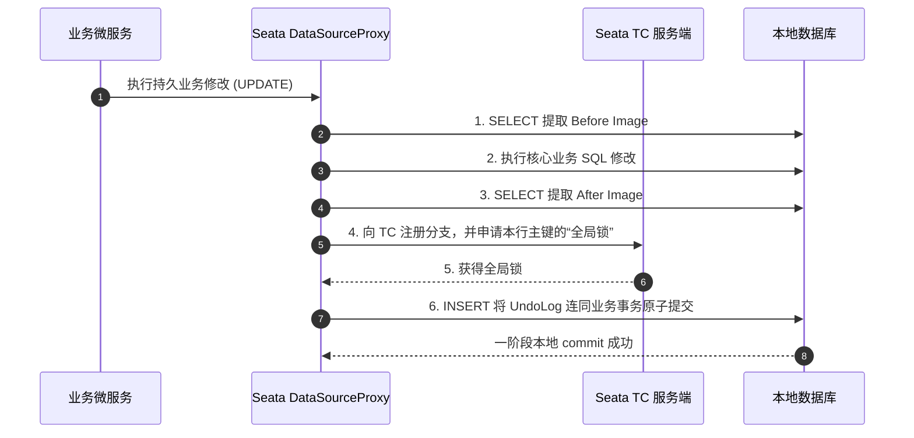

## Seata AT 模式无锁化两阶段提交原理

在微服务架构下，由于数据库被物理拆分，保障跨服务的一致性需要引入分布式事务。Seata AT 模式以其**对业务零侵入、低门槛**的优势成为生产环境中最常用的方案。本篇将深度透解 Seata AT 模式底层的两阶段提交、自动脏写检测防交叉冲突、以及全局锁的无锁化判定原理。

---

## 一、 Seata AT 核心架构：TC、TM 与 RM

分布式事务的稳定运行依赖于三个核心组件之间的协同流转：

- **`Transaction Manager (TM)`**：全局事务管理器。负责定义全局事务的边界，发起全局提交（Global Commit）或全局回滚（Global Rollback）的指令。
- **`Resource Manager (RM)`**：资源管理器。控制分支事务，管理分支向 `TC` 的注册、执行状态报告，并执行本地事务的提交与回滚。
- **`Transaction Coordinator (TC)`**：事务协调器（即 Seata 服务端）。维护全局事务和分支事务的状态，驱动全局事务的两阶段提交与回滚。

---

## 二、 AT 模式的两阶段执行模型

AT 模式通过数据代理（`DataSourceProxy`）无感知地重写了 JDBC 的两阶段行为。

### 一阶段：执行业务 SQL 并在本地提交

在第一阶段，Seata 代理了业务执行：
1.  **解析 SQL**：解析业务要执行的 SQL（如 `UPDATE`），获取其更新前后的原始镜像数据。
2.  **构建 Undo Log**：
    - 查询前置镜像（**Before Image**）：保存修改前的值。
    - 执行业务 SQL 操作。
    - 查询后置镜像（**After Image**）：保存修改后的值。
3.  **本地回滚日志打包**：将 Before/After 镜像和一阶段 SQL 的元数据序列化组成一条 `UndoLog` 数据。
4.  **注册分支与锁申请**：在本地事务提交前，RM 向 TC 注册分支事务，并**申请该条记录的全局锁（Global Lock）**。
5.  **本地原子提交**：在同一个物理数据库事务中，将持久业务修改和 `UndoLog` **同时原子提交**到本地数据库。

### 二阶段：无锁极速提交与平滑回滚

根据一阶段全局事务的执行结果，TC 发起二阶段决策：

- **场景 A：全局提交（Global Commit）**：
  若其它服务均无异常，TM 发起全局提交。TC 通知 RM 异步清理该事务产生的 `UndoLog` 和全局锁内存。由于一阶段本地事务已经提交成功，**二阶段无需任何阻塞，极速完成且没有任何额外锁开销**。

- **场景 B：全局回滚（Global Rollback）**：
  若一阶段发生异常，TM 触发全局回滚。
  1.  **启动回源**：RM 接收到 TC 的 rollback 指令，根据分支 ID 找到对应的 `UndoLog`。
  2.  **数据校对（脏写防御算法）**：
      - 重新查询数据库该记录的当前实时数据（**Current Image**）。
      - 比对 $\text{Current Image}$ 是否等于一阶段生成的 $\text{After Image}$。
      - 如果不等于，说明在中间某个时段，此行记录被未受 Seata 事务控制的外部非标准 SQL（或直调 SQL）修改了，发生**脏写（Dirty Write）**。此时 Seata 触发高能报警，暂停自动回滚，等待人工介入。
  3.  **回滚应用**：如果等于，说明未发生脏写。RM 根据 $\text{Before Image}$ 生成 `UPDATE` 还原语句并执行，在本地事务中一并清除 `UndoLog`，完成原样回滚。

$$
\text{No Dirty Write} \iff \text{Current Image} = \text{After Image}
$$

---

## 三、 读写一致性与无锁化全局锁原理

在全局事务未完全提交期间，其他业务操作或读请求可能会尝试抢占该数据。为了保证事务隔离性且尽可能降低锁阻塞的影响，Seata 提出了双层锁控制模型：

1.  **本地锁（Local Lock）**：各节点物理数据库底层的行锁（如 InnoDB 的排他锁 `X-Lock`）。其生命周期极短，仅在一阶段本地事务提交前持有，释放速度极快。
2.  **全局锁（Global Lock）**：TC 服务端维护的信息。作用于当一个 Seata 事务未完全走完时，防止其他 Seata 事务改写该行记录。

### 防交叉写冲突策略
当事务 A（Seata 管理）和 事务 B（Seata 管理）尝试修改同一行数据：
- 事务 A 首先抢占本地锁，并在提交前获得了全局锁。
- 事务 B 随后也获取了本地锁尝试修改。由于 A 的全局事务未完，A 依然持有全局锁。
- 事务 B 提交前向 TC 申请全局锁失败，此时 B 会**不断自旋等待全局锁释放**，但在此期间 B **必须持有自己的本地锁不释放**。
- 如果 A 回滚（或 A 异步释放），B 获得全局锁，B 本地提交。这保障了两个分布式事务之间的强制排他写。

---

## 四、 总结

Seata AT 模式将繁重的“隔离逻辑”转移到了 **代理 DataSource** 中，采用：
- **一阶段强写本地元镜像**
- **二阶段异步无锁极速异步清障**
- **读/写全局锁自旋机制防交叉冲突**

从而在降低侵入性的同时，兼顾了分布式在云原生架构下的卓越事务吞吐能力。
