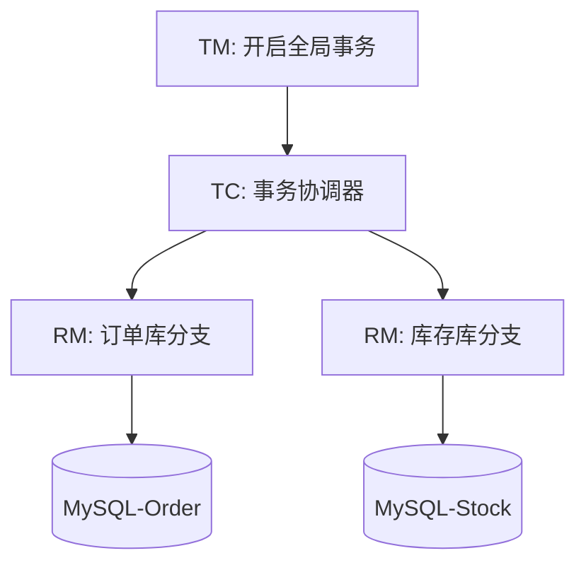

---
title: Seata 分布式事务全解：AT 模式深度剖析与实战
hide_title: true
sidebar_label: Seata 分布式事务
---

## Seata 分布式事务全解：AT 模式深度剖析与实战

在微服务拆分后，原本在一个 `Local Transaction` 中的 ACID 特性被打破。多个服务对应多个数据库，如何保证“要么全成功，要么全失败”？**Seata (Simple Extensible Autonomous Transaction Architecture)** 是目前最成熟的 Java 分布式事务解决方案。

---

## 一、 Seata 核心角色 (The Three Roles)

Seata 的架构由三个核心角色组成：

1. **TM (Transaction Manager)**：事务管理器。负责开启、提交或回滚全局事务。
2. **RM (Resource Manager)**：资源管理器。管理分支事务处理的资源，与 TC 交谈。
3. **TC (Transaction Coordinator)**：事务协调器。独立的中间件，负责维护全局及分支事务的状态，驱动全局提交或回滚。



---

## 二、 核心明星：AT 模式（自动模式）

AT 模式是 Seata 默认且最常用的模式，它最大的特点是 **对业务代码无侵入**。

### 1. AT 模式的一阶段（执行阶段）
- RM 拦截业务 SQL。
- **查询前镜像 (Before Image)**：记录该行数据修改前的值。
- 执行业务 SQL。
- **查询后镜像 (After Image)**：记录修改后的值。
- 以上操作全部在 **同一本地事务** 中提交。

### 2. AT 模式的二阶段（决议阶段）
- **全局提交**：如果所有分支都成功，TC 通知 RM 异步清理镜像数据（Undo Log），效率极高。
- **全局回滚**：如果任一分支失败，TC 通知 RM 启动反向补偿。RM 利用 **Before Image** 逻辑上还原数据（并校验期间有无脏写）。

---

## 三、 实战：零代码侵入实现分布式事务

只要引入 `spring-cloud-starter-alibaba-seata` 环境，并通过一个注解即可完成复杂的事务控制。

```java
@Service
public class OrderServiceImpl implements OrderService {

    @Autowired
    private StockClient stockClient; // 远程库存服务
    @Autowired
    private OrderMapper orderMapper;

    @GlobalTransactional(name = "create-order", rollbackFor = Exception.class)
    public void createOrder(Order order) {
        // 1. 本地保存订单
        orderMapper.insert(order);
        
        // 2. 远程调用库存服务扣减
        // 即使 stockClient 报错，Seata 也会自动回滚本地的 orderMapper 插入操作
        stockClient.deduct(order.getProductId(), order.getCount());
    }
}
```

---

## 四、 TCC 模式与 AT 模式的区别

当业务涉及非关系型数据库或不支持 Undo Log 的场景时，我们需要 TCC：

| 维度 | **AT 模式** | **TCC 模式** |
| :--- | :--- | :--- |
| **侵入性** | 无（自动拦截 SQL） | 高（需手动编写 Try/Confirm/Cancel） |
| **性能** | 好（基于本地锁） | 极好（由于不锁定资源，适合高并发） |
| **场景** | 强一致性、关系型数据库 | 跨中间件、极端高并发、金融结算 |

---

## 五、 企业级避坑指南：脏写与读已提交

1. **防止脏写**：Seata 通过 **Global Lock（全局锁）** 机制确保分布式事务之间的隔离。如果一个非 Seata 管理的线程修改了正在回滚中的数据，会触发脏写检测报错。
2. **Undolog 清理**：在高并发场景下，如果 undo_log 表积压过多，会影响性能。应定期清理或开启 Seata 的自动清理机制。
3. **TC 存储选择**：在生产环境，TC 的元数据建议存储在 MySQL 或 Redis 中，保持 TC 节点无状态可横向扩充。

---

## 六、 总结

1. **分布式事务是最后的底线**。在设计微服务时，应优先考虑通过分布式锁或基于消息队列的可靠性投递实现最终一致性。
2. **AT 模式是首选**。它兼顾了开发效率与数据准确性。
3. **保证隔离性**。务必理解 `GlobalLock` 对读写性能的影响。

> 了解微服务网关如何统一管理入口？请参考 [Spring Cloud Gateway 流量入口与安全网关实战](./21-gateway-advanced.md)。
