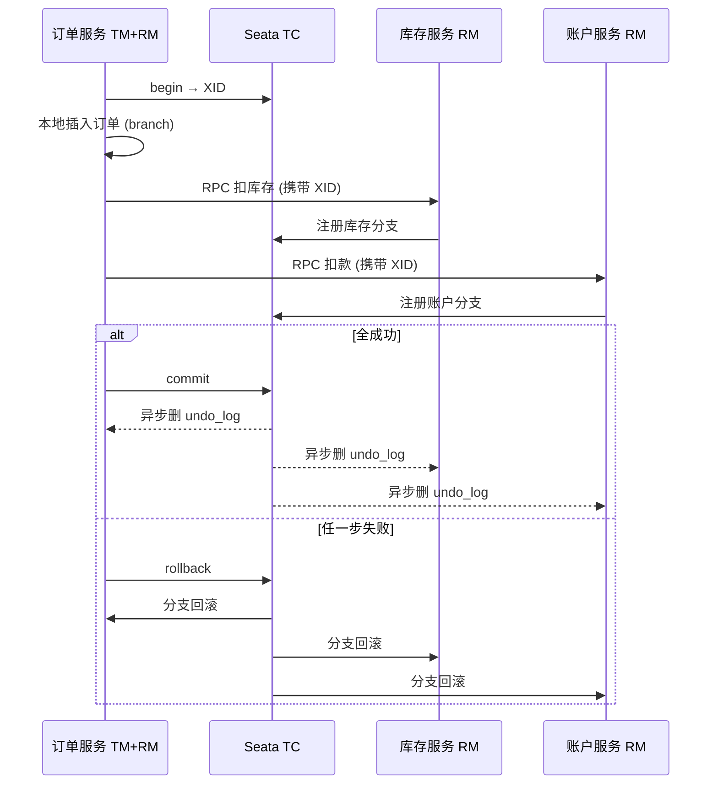
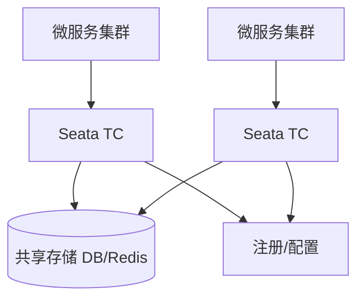

## Seata 分布式事务全解：AT 模式深度剖析与实战

微服务拆分后，“下单 + 扣库存 + 写积分”不再共享一个本地事务。**Seata** 提供 AT / TCC / Saga / XA 等模式。本篇偏工程落地：角色、`@GlobalTransactional`、模式选型、脏写与运维。

AT 两阶段与全局锁细节见 [Seata AT 内核](24-seata-at-kernel.md)。

---

## 一、问题定义：为什么需要分布式事务

| 方案 | 一致性 | 复杂度 | 适用 |
| :--- | :--- | :--- | :--- |
| 最大努力通知 + 本地消息表 | 最终 | 中 | 多数业务 |
| 事务消息（RocketMQ） | 最终 | 中 | 异步解耦 |
| Seata AT | 较强（近实时补偿） | 低侵入 | 多库同步写 |
| Seata TCC | 强业务可控 | 高侵入 | 金融高并发 |
| XA | 强 | 资源占用高 | 短事务、DB 支持好 |

原则：**能最终一致就不要强分布式事务**；AT 是“必须同步多写且要回滚”时的默认选项。

---

## 二、三大角色与一次下单时序



---

## 三、AT 模式回顾（工程视角）

1. **一阶段**：各 RM 执行业务 SQL，写 UndoLog，本地 commit，向 TC 持有全局锁。
2. **二阶段 commit**：删 UndoLog。
3. **二阶段 rollback**：Before Image 补偿 + 脏写校验。

业务代码无感，靠 JDBC 代理；要求：

- 业务表有主键
- 使用 DataSource 代理（Seata 自动配置或手动 `DataSourceProxy`）
- 各库建 `undo_log` 表

```sql
CREATE TABLE IF NOT EXISTS undo_log (
  id            BIGINT       NOT NULL AUTO_INCREMENT,
  branch_id     BIGINT       NOT NULL,
  xid           VARCHAR(100) NOT NULL,
  context       VARCHAR(128) NOT NULL,
  rollback_info LONGBLOB     NOT NULL,
  log_status    INT          NOT NULL,
  log_created   DATETIME     NOT NULL,
  log_modified  DATETIME     NOT NULL,
  PRIMARY KEY (id),
  UNIQUE KEY ux_undo_log (xid, branch_id)
);
```

---

## 四、实战：`@GlobalTransactional`

### 1. 依赖与配置（要点）

```yaml
seata:
  enabled: true
  tx-service-group: my_tx_group
  service:
    vgroup-mapping:
      my_tx_group: default
    grouplist:
      default: 127.0.0.1:8091
  registry:
    type: nacos
    nacos:
      server-addr: 127.0.0.1:8848
      application: seata-server
  config:
    type: nacos
```

TC 地址、事务分组 `tx-service-group` 与 TC 侧 `vgroupMapping` 必须对齐，否则开启全局事务直接失败。

### 2. 业务代码

```java
@Service
public class OrderServiceImpl implements OrderService {

    @Autowired
    private OrderMapper orderMapper;
    @Autowired
    private StockClient stockClient;
    @Autowired
    private AccountClient accountClient;

    @GlobalTransactional(name = "create-order", rollbackFor = Exception.class, timeoutMills = 60000)
    public void createOrder(Order order) {
        orderMapper.insert(order);
        stockClient.deduct(order.getProductId(), order.getCount());
        accountClient.debit(order.getUserId(), order.getAmount());
    }
}
```

注意：

- `rollbackFor` 默认多只滚 RuntimeException，受检异常要显式声明。
- 远程调用必须走被 Seata 增强的 RPC（OpenFeign/Dubbo 集成包），否则 **XID 传不过去**。
- 全局事务内避免长耗时外部调用（HTTP 三方支付），缩小事务边界。

### 3. 仅加全局锁的读

```java
@GlobalLock
public Product getForUpdate(Long id) {
    return productMapper.selectById(id);
}
```

用于需要检查全局写锁的场景，防止读到即将被回滚的中间态（有性能成本）。

---

## 五、TCC 模式（对照）

TCC = Try / Confirm / Cancel，业务自己实现资源预留与确认。

```java
@LocalTCC
public interface StockTccService {

    @TwoPhaseBusinessAction(name = "deduct", commitMethod = "confirm", rollbackMethod = "cancel")
    boolean tryDeduct(BusinessActionContext ctx,
                      @BusinessActionContextParameter(paramName = "productId") Long productId,
                      @BusinessActionContextParameter(paramName = "count") Integer count);

    boolean confirm(BusinessActionContext ctx);

    boolean cancel(BusinessActionContext ctx);
}
```

| 阶段 | 含义 |
| :--- | :--- |
| Try | 预留库存（冻结，而非直接扣减可售） |
| Confirm | 确认扣减冻结 |
| Cancel | 释放冻结 |

**空回滚、悬挂**：Cancel 先于 Try 到达时要靠事务状态机幂等防呆；Seata 提供防悬挂机制，业务仍需幂等键。

---

## 六、AT vs TCC vs Saga vs XA

| 维度 | AT | TCC | Saga | XA |
| :--- | :--- | :--- | :--- | :--- |
| 侵入性 | 低 | 高 | 中（补偿流程） | 低 |
| 性能 | 中高 | 高（无长持 DB 锁） | 高 | 低 |
| 一致性 | 较强 | 强（业务保证） | 最终 | 强 |
| 适用 | 常规多库同步 | 资金/库存高并发 | 长流程编排 | 短事务、XA 支持好 |
| 典型坑 | 全局锁热点、脏写 | 幂等与悬挂 | 补偿难写全 | 连接占用 |

Saga：一长串本地事务 + 失败逆向补偿服务，适合订单状态机长链路，而不是简单两库强一致。

---

## 七、企业级避坑清单

### 1. 脏写

- 禁止旁路改正在 AT 事务中的行（运维脚本、定时任务直连 SQL）。
- 回滚报脏写 → 停自动补偿，查审计日志后人工修数。

### 2. 全局锁与超卖

- 热点 SKU 扣库存用 AT 可能锁等待严重 → 分段库存 / TCC / Redis 预减 + 异步对账。

### 3. undo_log 膨胀

- 二阶段失败重试、TC 宕机导致日志堆积。
- 监控 `undo_log` 行数；修好 TC 后依赖重试清理。

### 4. 代理未生效

- 部分连接池/动态数据源未包到 Proxy → 分支根本没注册。
- 启动日志确认 Seata DataSource 包装；用 TC 控制台看分支列表。

### 5. 异常被“吞掉”

- `try/catch` 后不抛出 → 全局事务以为成功而 commit。
- 与 `@Transactional` 嵌套时分清本地回滚与全局回滚边界。

### 6. 超时与重试

- `timeoutMills` 过短导致误回滚；过长导致锁持有久。
- RPC 超时 < 全局事务超时，避免下游还在跑 TM 已 rollback。

---

## 八、生产部署建议



1. TC **至少双节点** + 共享存储；与业务应用隔离部署。
2. 注册配置中心用 Nacos，和微服务同一套环境隔离（Namespace）。
3. 压测关注：全局锁等待 RT、TC CPU、undo_log 写入量。
4. 灰度：先非核心链路开 AT，再推广；准备降级开关（关 Seata 走最终一致）。

---

## 九、与消息最终一致如何选型

| 业务 | 更优解 |
| :--- | :--- |
| 下单后发积分/发短信 | 本地消息表 / 事务消息 |
| 下单必须同步扣库存扣款 | AT 或 TCC |
| 跨公司接口无法代理 DB | TCC 或人工对账 |
| 仅查询聚合 | 不需要分布式事务 |

---

## 十、总结

1. 分布式事务是最后手段；优先领域拆分与最终一致。
2. AT：低侵入默认项；吃透 [全局锁与脏写](24-seata-at-kernel.md)。
3. TCC：高并发资金类；必须幂等与防悬挂。
4. 工程关键：XID 透传、DataSource 代理、TC 高可用、超时预算。

入口层统一治理见 [Gateway](21-gateway-advanced.md)；流量防护见 [Sentinel](27-sentinel-governance.md)。
