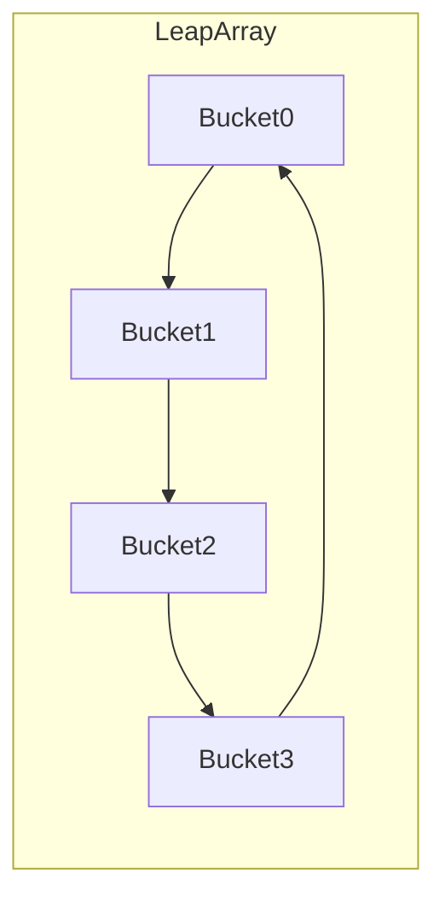

## Sentinel 滑动窗口与高性能限流算法深度内核

Sentinel 能在高 QPS 下做实时限流/熔断，核心不在规则 UI，而在 **无锁滑动窗口统计（LeapArray）** 与多种流量整形算法。本篇拆内核；场景与集成见 [Sentinel 流量治理](27-sentinel-governance.md)。

---

## 一、为什么需要滑动窗口

固定窗口（每秒清零计数）有**临界突发**：

```text
窗口 1: 在 0.9s~1.0s 来 100 次
窗口 2: 在 1.0s~1.1s 再来 100 次
阈值 100/s → 实际 0.2s 内 200 次
```

滑动窗口把时间切成多个 **sample bucket**，统计最近一个完整区间，平滑边界误差。

---

## 二、LeapArray 环形结构



参数：

| 参数 | 含义 | 例 |
| :--- | :--- | :--- |
| `intervalInMs` | 统计总时长 | 1000 ms |
| `sampleCount` | 桶个数 | 2 |
| `windowLength` | 单桶宽度 | `interval/sampleCount = 500ms` |

桶内指标（`MetricBucket`）通常包含：通过数、拒绝数、异常数、RT 总和、并发占位等，用 **LongAdder** 类结构累加，减少多线程写冲突。

### 1. 定位当前桶

$$
\text{idx} = \left\lfloor \frac{t}{\text{windowLength}} \right\rfloor \bmod \text{sampleCount}
$$

$$
\text{windowStart} = t - (t \bmod \text{windowLength})
$$

### 2. CAS 复用与重置

并发下同一槽位三种情况：

| 槽位状态 | 动作 |
| :--- | :--- |
| 空 | CAS 放入新 `WindowWrap` |
| 已有且 `start == windowStart` | 当前桶，直接累加 |
| 已有且 `start` 更旧 | 时间轮转过一轮，CAS **reset** 指标并更新 start |

无全局大锁、无数组搬移，靠环形覆盖实现“滑动”。

### 3. 汇总 QPS / RT

对所有“仍在 interval 内”的桶求和：

$$
\text{QPS} \approx \frac{\sum pass}{\text{intervalInSec}}
$$

$$
\text{avgRT} \approx \frac{\sum \text{rtTotal}}{\sum \text{success}}
$$

熔断慢调用比例、异常比例都建立在这套统计上。

---

## 三、经典限流算法

### 1. 漏桶（Leaky Bucket）

- 请求进入队列（桶），以**恒定速率**流出。
- 桶满则拒绝或阻塞。
- 输出平滑，能整形尖刺；不能很好利用空闲时的突发额度。

```text
入: 不定速 → [Bucket] → 出: 恒定 r
```

### 2. 令牌桶（Token Bucket）

- 以速率 \(r\) 放令牌，桶容量 \(b\)。
- 请求取到令牌才通过。
- 允许突发：短时间最多约 \(b\) 个请求，长期平均 \(r\)。

$$
M(t) \leq b + r \cdot t
$$

Gateway `RequestRateLimiter`、Guava `RateLimiter` 都是令牌桶族。

### 3. 滑动窗口计数（Sentinel 常用）

- 直接基于 LeapArray 的 pass 计数与阈值比较。
- 实现简单、与统计同源，规则热更新方便。

### 4. 温控 / 匀速排队（Sentinel WarmUp & Pace）

- **WarmUp**：冷启动时阈值从低到高爬升，保护缓存未热系统。
- **匀速排队**：超阈值请求在队列等待到“令牌时刻”，平滑对下游的调用（类似漏桶出流）。

---

## 四、Sentinel 流控效果选项（与算法映射）

| controlBehavior | 行为 | 算法直觉 |
| :--- | :--- | :--- |
| `Reject` 快速失败 | 超阈值直接抛 `BlockException` | 硬阈值 |
| `WarmUp` | 冷启动爬坡 | 令牌/阈值渐进 |
| `Waiting` 匀速排队 | 等待间隔发放 | 漏桶出流 |
| `WarmUp + 排队` | 组合 | 冷启动 + 整形 |

规则字段直觉：

- `count`：阈值（QPS 或并发线程数）
- `grade`：QPS vs 线程数
- `strategy`：直接 / 关联 / 链路
- `clusterMode`：是否集群限流

---

## 五、并发线程数限流 vs QPS 限流

| 维度 | QPS | 线程数 |
| :--- | :--- | :--- |
| 度量 | 单位时间通过次数 | 正在执行的占用 |
| 慢调用 | 仍可能大量排队进系统 | 更能保护线程池打满 |
| 适用 | 入口防刷 | 保护慢依赖、防堆积 |

慢接口更适合 **线程数阈值** + 熔断慢调用比例双保险。

---

## 六、集群限流简述

单机限流在多副本下阈值会放大（每实例 100 QPS × N）。集群限流：

1. Token Server 集中发令牌；或
2. 各实例上报统计由控制面汇总。

代价：网络依赖与单点风险；核心入口可做，普通接口单机限流 + 网关限流往往够用。

---

## 七、性能注意

1. 统计路径必须无锁或细粒度 CAS，禁止每请求写 DB/Redis 做计数（网关 Redis 限流是另一层）。
2. `sampleCount` 越大边界越平滑，内存与汇总成本略增。
3. 规则匹配应 O(1)/低复杂度；热点参数用特化结构（LRU 参数表）。
4. 不要在 `BlockException` 处理里再做重逻辑。

---

## 八、与 Slot 链的关系

```text
SphU.entry
  → NodeSelectorSlot
  → ClusterBuilderSlot
  → StatisticSlot      ← LeapArray 记账
  → FlowSlot           ← 限流算法判定
  → DegradeSlot        ← 熔断
  → ...
  → 业务
  → exit 更新 RT
```

`StatisticSlot` 负责进出记账；`FlowSlot` 读统计做 allow/deny。算法内核与责任链插槽解耦，便于扩展。

---

## 九、总结

- **LeapArray**：环形桶 + CAS 重置 = 高并发滑动窗口。
- **令牌桶**偏突发，**漏桶**偏平滑，**硬阈值计数**最直观。
- 选算法先看保护对象：入口 QPS、线程池、冷启动还是下游匀速。

规则配置、熔断场景与 Nacos 持久化见 [Sentinel 流量治理](27-sentinel-governance.md)。
