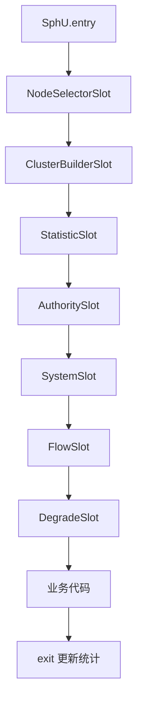

## Sentinel 核心原理：高可用流量治理与故障容错之道

微服务中任一依赖变慢都可能耗尽线程池引发雪崩。**Sentinel** 以“资源”为切面，提供流控、熔断、热点、系统保护与集群限流。算法内核见 [滑动窗口与限流算法](26-sentinel-algorithm-core.md)。

相关：[Gateway 限流](21-gateway-advanced.md)、[Nacos 配置](23-nacos-config-advanced.md)、[Feign 调用](22-mvc-remote-call.md)。

---

## 一、Sentinel vs Hystrix

| 维度 | Hystrix | Sentinel |
| :--- | :--- | :--- |
| 隔离 | 线程池隔离为主 | 信号量/统计隔离，更轻 |
| 熔断 | 错误率 | 慢调用比例、异常比/异常数 |
| 规则动态 | 弱 | 控制台 + 配置中心 |
| 热点参数 | 无 | 有 |
| 系统自适应 | 弱 | Load/CPU/RT 等 |
| 生态现状 | 进入维护 | 国内微服务主流 |

---

## 二、核心概念

| 概念 | 含义 |
| :--- | :--- |
| **资源 Resource** | 被保护的代码入口：URL、方法、`SphU.entry("key")` |
| **规则 Rule** | 阈值与策略：流控、熔断、授权、热点 |
| **Slot 链** | 责任链：统计 → 流控 → 熔断 → … |
| **BlockException** | 被限流/熔断时抛出，进入降级逻辑 |
| **Fallback** | 托底返回，保证体验与稳定性 |

定义资源 → 挂规则 → 运行时判定，三步模型。

---

## 三、四大治理能力

### 1. 流控 Flow

| 模式 | 含义 | 例子 |
| :--- | :--- | :--- |
| 直接 | 自身超阈值就限 | `/api/order` QPS>200 拒绝 |
| 关联 | 关联资源忙则限自己 | 支付忙时限下单查询 |
| 链路 | 只统计某条入口链路 | 仅网关入口链路限流 |

效果：快速失败 / WarmUp / 匀速排队（见算法篇）。

### 2. 熔断 Degrade

| 策略 | 触发 | 适合 |
| :--- | :--- | :--- |
| 慢调用比例 | RT 超阈值且比例达标 | 下游变慢 |
| 异常比例 | 错误占比过高 | 不稳定依赖 |
| 异常数 | 时间窗异常次数 | 低频但关键调用 |

熔断开启后有 **熔断时长**，半开探测成功则恢复。

### 3. 热点参数限流

对 `productId`、`userId` 等参数单独统计：爆款 ID 限更严，长尾保持宽松。

```java
@SentinelResource(
    value = "getProduct",
    blockHandler = "blockGetProduct"
)
public Product getProduct(Long productId) { ... }

public Product blockGetProduct(Long productId, BlockException ex) {
    return Product.soldOut(productId);
}
```

热点规则在控制台或配置中心配置参数索引与阈值。

### 4. 系统自适应保护

根据整体指标（Load、CPU、入口 QPS、RT、线程数）在入口处保护整机，防止被打满后假死。适合作为**最后一道闸**。

---

## 四、Slot 执行链



- **StatisticSlot**：LeapArray 记账。
- **FlowSlot / DegradeSlot**：读统计做判定。
- 自定义 Slot 可扩展，但生产优先用规则而不是改内核。

---

## 五、Spring Cloud 集成实战

### 1. 依赖与自动埋点

```xml
<dependency>
  <groupId>com.alibaba.cloud</groupId>
  <artifactId>spring-cloud-starter-alibaba-sentinel</artifactId>
</dependency>
```

```yaml
spring:
  cloud:
    sentinel:
      transport:
        dashboard: 127.0.0.1:8080
        port: 8719
      eager: true
```

Web MVC / WebFlux 请求默认可作为资源；Feign 需打开：

```yaml
feign:
  sentinel:
    enabled: true
```

### 2. Feign 降级

```java
@FeignClient(name = "product-service", fallbackFactory = ProductFallbackFactory.class)
public interface ProductClient {
    @GetMapping("/products/{id}")
    Product get(@PathVariable("id") Long id);
}

@Component
public class ProductFallbackFactory implements FallbackFactory<ProductClient> {
    @Override
    public ProductClient create(Throwable cause) {
        return id -> Product.degraded(id, cause.getMessage());
    }
}
```

`fallbackFactory` 比 `fallback` 更能区分超时/限流/业务异常。

### 3. `@SentinelResource` 注意点

- `blockHandler`：处理 **BlockException**（限流熔断）。
- `fallback`：处理业务异常（可配置）。
- 方法需 `public`；blockHandler 默认与原方法同容器类且签名匹配。
- 同类内部自调用不走代理 → 保护失效（与 Spring AOP 同坑）。

---

## 六、规则持久化（生产必做）

默认规则在**内存**，重启丢失。推荐：

```text
Sentinel Dashboard 修改 → 推到 Nacos → 客户端监听刷新
```

```yaml
spring:
  cloud:
    sentinel:
      datasource:
        flow:
          nacos:
            server-addr: 127.0.0.1:8848
            dataId: order-flow-rules
            groupId: SENTINEL_GROUP
            rule-type: flow
        degrade:
          nacos:
            server-addr: 127.0.0.1:8848
            dataId: order-degrade-rules
            groupId: SENTINEL_GROUP
            rule-type: degrade
```

Nacos 中 JSON 规则示例（流控）：

```json
[
  {
    "resource": "/api/orders",
    "grade": 1,
    "count": 200,
    "strategy": 0,
    "controlBehavior": 0
  }
]
```

变更走配置中心审计，避免只在 Dashboard 点点点。

---

## 七、网关层 vs 服务层限流

| 层 | 作用 |
| :--- | :--- |
| Gateway + Redis 令牌桶 | 保护整个后端集群入口 |
| 服务 Sentinel | 保护具体资源与依赖 |
| 线程池隔离（业务） | 防止慢调用占满容器线程 |

推荐叠加：**入口粗限流 + 服务细治理 + 依赖熔断**。

---

## 八、生产治理建议

1. **阈值从监控来**：先看 P99 RT 与峰值 QPS，再定 count。
2. **降级返回可预期**：前端可展示，不可抛栈。
3. **核心链路单独资源名**，避免一个大 URL 正则误伤。
4. **写接口慎用排队**，避免库存超卖窗口被拉长。
5. **压测验证半开恢复**，防止熔断抖动。
6. **Dashboard 勿暴露公网**。

---

## 九、常见问题

| 现象 | 排查 |
| :--- | :--- |
| 规则不生效 | 资源名是否一致；Feign 是否开启 sentinel |
| 重启规则没了 | 未持久化到 Nacos |
| 降级不走 | 抛的是业务异常不是 Block；fallback 配置错 |
| 性能毛刺 | 规则过多、日志过详、Dashboard 频繁拉指标 |
| 多实例限流不准 | 需要集群限流或网关统一限 |

---

## 十、总结

- 资源 + 规则 + Slot 链是 Sentinel 心智模型。
- 流控防打满，熔断防拖垮，热点防爆款，系统保护防整机假死。
- 生产三件套：合理阈值、托底降级、**Nacos 持久化**。

数据一致性问题用 [Seata](25-seata-distributed-transaction.md)，不要用限流代替事务。
