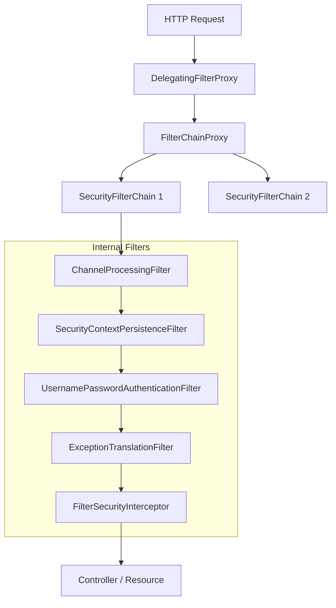

## Spring Security 安全架构与过滤器链深度解析

Spring Security 是一个功能强大且高度可定制的身份验证和访问控制框架。它的核心是基于 Servlet **`Filter`** 的拦截体系。

---

## 一、 核心架构：SecurityFilterChain

Spring Security 的所有功能都是通过一系列过滤器实现的，这些过滤器组成了一个 `SecurityFilterChain`。

### 1. 委托过滤器：DelegatingFilterProxy

Servlet 容器（如 Tomcat）并不知道 Spring 容器中的 Bean。Spring 通过 `DelegatingFilterProxy` 作为一个桥梁，将过滤逻辑委托给 Spring 容器中的 `FilterChainProxy`。

### 2. 过滤器链全景图

---

## 二、 认证流程 (Authentication)

认证是确定“你是谁”的过程。核心接口是 `AuthenticationManager`。

1.  **收集凭证**：`UsernamePasswordAuthenticationFilter` 提取用户名和密码，封装成 `UsernamePasswordAuthenticationToken`。
2.  **委托验证**：调用 `ProviderManager`（`AuthenticationManager` 的默认实现）。
3.  **多策略验证**：`ProviderManager` 遍历 `AuthenticationProvider`（如 `DaoAuthenticationProvider`），调用 `UserDetailsService` 加载用户信息并比对。
4.  **存储上下文**：认证成功后，将 `Authentication` 对象存入 `SecurityContextHolder`。

---

## 三、 授权流程 (Authorization)

授权是确定“你能做什么”的过程。

1.  **决策入口**：`FilterSecurityInterceptor` 是过滤器链的最后一环。
2.  **访问决策**：它调用 `AccessDecisionManager` 进行投票决策。
3.  **权限比对**：根据用户拥有的 `GrantedAuthority` 与资源要求的权限进行匹配。

---

## 四、 常见避坑指南

- **记住我 (Remember Me)**：由 `RememberMeAuthenticationFilter` 实现，依赖于 Cookie 和 `TokenRepository`。
- **CSRF 防护**：通过 `CsrfFilter` 实现。在前后端分离架构（如使用 JWT）时，通常需要手动禁用 `http.csrf().disable()`，因为 JWT 本身具备防篡改特性。
- **异常处理**：`ExceptionTranslationFilter` 只处理 `FilterSecurityInterceptor` 抛出的安全异常，业务异常不归它管。

---

## 五、 总结

Spring Security 的精髓在于 **Filter 链条的编排**。理解了 `SecurityContextHolder` 这种基于 `ThreadLocal` 的上下文存储机制，以及认证/授权的责任链模式，就能灵活应对复杂的 SSO、OAuth2 等高级安全场景。
