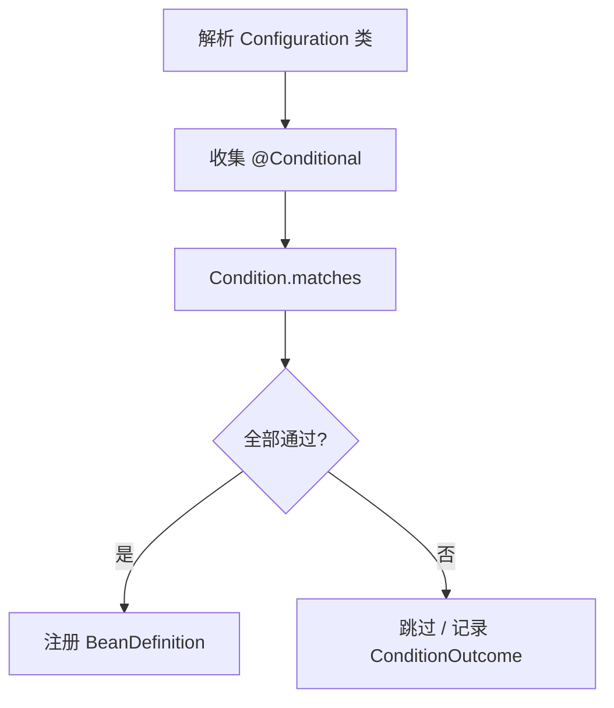

## Spring Boot 条件装配与自动配置深度内核

Spring Boot “约定优于配置”的工程实现 = **候选自动配置类列表** + **`@Conditional` 过滤** + **`@Configuration` 注册 Bean**。本篇把条件体系、导入选择器、Starter 结构与排障一次讲清。

相关：[Boot 启动](10-springboot-core.md)、[扩展机制](12-springboot-extension.md)、[SPI 扩展点](20-extension-points-spi.md)。

---

## 一、@Conditional 体系

### 1. 常用注解

| 注解 | 生效条件 |
| :--- | :--- |
| `@ConditionalOnClass` | 类路径存在指定类 |
| `@ConditionalOnMissingClass` | 类路径不存在 |
| `@ConditionalOnBean` | 容器中已有指定 Bean |
| `@ConditionalOnMissingBean` | 容器中尚无指定 Bean |
| `@ConditionalOnProperty` | 配置属性存在/等于某值 |
| `@ConditionalOnWebApplication` | Servlet/Reactive Web 环境 |
| `@ConditionalOnExpression` | SpEL 为 true |
| `@ConditionalOnResource` | 类路径资源存在 |
| `@ConditionalOnSingleCandidate` | 指定类型仅有一个候选 Bean |

### 2. 判定流程



实现接口：

```java
public interface Condition {
    boolean matches(ConditionContext context, AnnotatedTypeMetadata metadata);
}
```

`ConditionOutcome` 带 match 原因字符串，**`--debug`** 或 `ConditionEvaluationReport` 可打印为何某自动配置没生效——排障神器。

### 3. 阶段差异：ConfigurationPhase

- **PARSE_CONFIGURATION**：解析配置类时就判断（如 `@ConditionalOnClass`，避免类不存在导致解析失败）。
- **REGISTER_BEAN**：注册 Bean 时再判断（如 `@ConditionalOnBean`，此时别的 BD 已可见）。

`@ConditionalOnBean` 写在类上时要小心顺序；更稳妥常放在 `@Bean` 方法上。

---

## 二、自动配置入口

```text
@SpringBootApplication
  └─ @EnableAutoConfiguration
       └─ @Import(AutoConfigurationImportSelector)
```

### 1. 收集候选类

| Boot 版本 | 清单位置 |
| :--- | :--- |
| 2.x | `META-INF/spring.factories` → `EnableAutoConfiguration` |
| 3.x | `META-INF/spring/org.springframework.boot.autoconfigure.AutoConfiguration.imports` |

每行一个全限定类名；多个 Starter 的列表会合并去重。

### 2. 过滤

1. 用户 `exclude` / `excludeName`
2. `Autoconfiguration.imports` 中的过滤 SPI
3. 各配置类上的 `@Conditional*`
4. 最终剩余类当作配置类导入容器

### 3. 排序

`@AutoConfigureBefore` / `@AutoConfigureAfter` / `@AutoConfigureOrder` 保证例如：

```text
DataSourceAutoConfiguration
  → before → Mybatis 自动配置
  → before → 业务 Repository
```

---

## 三、典型自动配置类解剖

```java
@AutoConfiguration
@ConditionalOnClass(RedisOperations.class)
@EnableConfigurationProperties(RedisProperties.class)
@ConditionalOnProperty(name = "spring.data.redis.host")
public class RedisAutoConfiguration {

    @Bean
    @ConditionalOnMissingBean(name = "redisTemplate")
    public RedisTemplate<?, ?> redisTemplate(RedisConnectionFactory factory) {
        RedisTemplate<?, ?> template = new RedisTemplate<>();
        template.setConnectionFactory(factory);
        return template;
    }
}
```

设计套路：

1. **类路径门闩** `@ConditionalOnClass`：没引依赖就不加载。
2. **属性绑定** `@EnableConfigurationProperties`。
3. **可覆盖** `@ConditionalOnMissingBean`：用户自定义同类型 Bean 则跳过默认。
4. **开关** `@ConditionalOnProperty`。

---

## 四、自定义 Starter 标准结构

```text
my-spring-boot-starter          // 空壳，只管依赖聚合
  └─ pom 依赖 my-autoconfigure + 第三方库

my-spring-boot-autoconfigure
  ├─ com.example.MyAutoConfiguration
  ├─ com.example.MyProperties
  └─ META-INF/spring/org.springframework.boot.autoconfigure.AutoConfiguration.imports
```

`AutoConfiguration.imports`：

```text
com.example.MyAutoConfiguration
```

`MyProperties`：

```java
@ConfigurationProperties(prefix = "my.feature")
public class MyProperties {
    private boolean enabled = true;
    private int timeoutMs = 3000;
    // getters/setters
}
```

用户侧：

```yaml
my:
  feature:
    enabled: true
    timeout-ms: 5000
```

```xml
<dependency>
  <groupId>com.example</groupId>
  <artifactId>my-spring-boot-starter</artifactId>
</dependency>
```

---

## 五、用户覆盖自动配置的正确姿势

| 目标 | 做法 |
| :--- | :--- |
| 换实现 | 自己 `@Bean` + 类型与默认相同，靠 `OnMissingBean` |
| 关掉某自动配置 | `@SpringBootApplication(exclude=...)` 或 `spring.autoconfigure.exclude` |
| 改属性 | `application.yml` 绑定 `*Properties` |
| 全部自己管 | exclude 后手写 `@Configuration` |

避免：复制粘贴一整份官方 AutoConfiguration 再改三行——升级 Boot 即崩。

---

## 六、排障清单

1. **Bean 没有？**  
   - 开 `debug=true` 看 `Negative matches`。  
   - 是否缺依赖导致 `OnClass` 失败。  
   - 是否被 `OnProperty` 关掉。  
   - 是否已有同名 Bean 导致 `OnMissingBean` 失败。

2. **Bean 重复？**  
   - 自己 `@Bean` 与自动配置都生效 → 给自动配置加 `OnMissingBean` 或 exclude。

3. **顺序错误？**  
   - 使用 `@AutoConfigureAfter`；或 `@DependsOn`；或 `@Order` 于 BPP。

4. **Boot3 清单写错位置？**  
   - 仍写 `spring.factories` 的 `EnableAutoConfiguration` 可能不加载。

5. **多模块组件扫描不到？**  
   - 自动配置类通常不靠组件扫描，靠 imports 列表；业务 `@Component` 才靠 `@SpringBootApplication` 扫描包。

---

## 七、与 Spring 原生 SPI 的关系

| 机制 | 用途 |
| :--- | :--- |
| `SpringFactoriesLoader` / imports 文件 | 发现自动配置、监听器、失败分析器 |
| `ApplicationContextInitializer` | 上下文刷新前改造 |
| `EnvironmentPostProcessor` | 最早改 Environment |
| `BeanFactoryPostProcessor` | 改 BeanDefinition |

Starter 作者常组合：`EnvironmentPostProcessor` 加默认配置 + `AutoConfiguration` 建 Bean。

---

## 八、总结

- 条件装配决定“何时创建”；自动配置决定“默认创建什么”。
- 心智模型：**清单加载 → 条件过滤 → 有序注册 → 用户可覆盖**。
- 会写 Starter = 会写带 `@Conditional` 的 `@AutoConfiguration` + 属性类 + imports 登记。

更完整的 Boot 扩展与 FatJar 见 [扩展机制](12-springboot-extension.md)、[FatJar](13-springboot-fatjar.md)。
