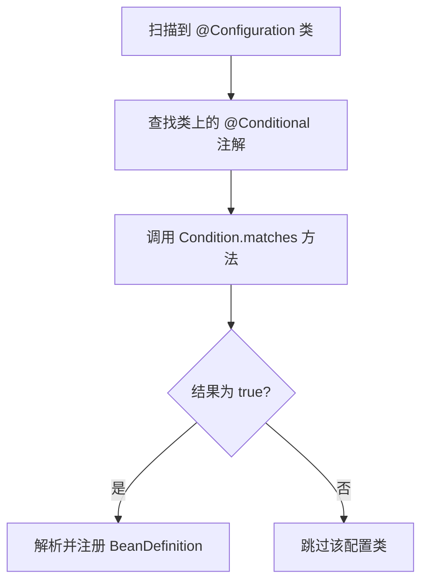

## Spring Boot 条件装配与自动配置深度内核

Spring Boot 的核心魔力在于“约定优于配置”。理解 `@Conditional` 系列注解的判断逻辑以及 `AutoConfigurationImportSelector` 的工作流程，是掌握 Spring Boot 定制化开发的基石。

---

## 一、 条件装配：@Conditional 体系

Spring 4 引入了 `@Conditional` 注解，而 Spring Boot 在此基础上构建了庞大的条件判断家族。

### 1. 常用条件注解分类

$$
\begin{array}{|l|l|}
\hline
\textbf{注解} & \textbf{生效条件} \\
\hline
\text{@ConditionalOnClass} & \text{类路径下存在指定的 Class} \\
\hline
\text{@ConditionalOnMissingBean} & \text{容器中不存在指定的 Bean} \\
\hline
\text{@ConditionalOnProperty} & \text{配置文件中存在指定的属性且符合特定值} \\
\hline
\text{@ConditionalOnWebApplication} & \text{当前环境是 Web 环境 (Servlet/Reactive)} \\
\hline
\end{array}
$$

### 2. 底层判断原理：ConditionOutcome

条件判断的核心接口是 `Condition`。Spring Boot 内部通过 `OnBeanCondition`、`OnClassCondition` 等类实现。

---

## 二、 自动配置的核心流程

自动配置的入口是 `@SpringBootApplication` 注解中的 `@EnableAutoConfiguration`。

### 1. 核心组件：AutoConfigurationImportSelector

该类实现了 `ImportSelector` 接口，负责收集并筛选出所有需要自动配置的类。

1.  **收集阶段**：读取所有 Jar 包下的 `META-INF/spring.factories`（或 Spring Boot 3+ 的 `META-INF/spring/org.springframework.boot.autoconfigure.AutoConfiguration.imports`）。
2.  **筛选阶段**：根据 `@Conditional` 注解进行过滤。例如，如果你没有引入 `spring-boot-starter-data-redis`，那么 Redis 的自动配置类就会因为 `@ConditionalOnClass(RedisOperations.class)` 失败而被过滤掉。

### 2. 自动配置的执行顺序

自动配置类通常使用 `@AutoConfigureBefore` 或 `@AutoConfigureAfter` 来控制顺序，确保基础组件（如 `DataSource`）先于高级组件（如 `JdbcTemplate`）初始化。

---

## 三、 自定义 Starter 的标准结构

理解了自动配置，我们就具备了编写 Starter 的能力。一个标准的 Starter 通常包含两部分：

1.  **`xxx-spring-boot-autoconfigure` 模块**：
    - 包含 `@Configuration` 自动配置类。
    - 包含属性映射类（`@ConfigurationProperties`）。
    - 包含 `spring.factories` 配置文件。
2.  **`xxx-spring-boot-starter` 模块**：
    - 这是一个空项目，仅负责引入 `autoconfigure` 模块和必要的第三方依赖，提供给用户“一站式”引入的体验。

---

## 四、 总结

自动配置并非黑魔法，而是：
**`spring.factories` 资源加载** + **`@Conditional` 条件筛选** + **`@Configuration` Bean 注册**。

掌握了这一内核，你就能轻松应对微服务架构中各种组件的按需加载与定制化扩展。
