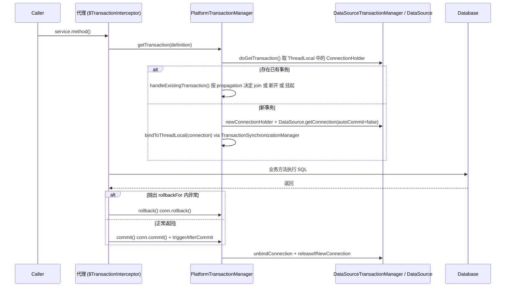

## Spring 事务传播与失效场景

Spring 声明式事务（`@Transactional`）是开发中最常用的功能之一。然而，由于其底层基于 AOP 动态代理实现，如果使用不当，极易导致事务失效或传播行为不符合预期，从而引发严重的数据一致性问题。

---

## 一、 Spring 事务传播行为（Propagation）

事务传播行为定义了当一个事务方法被另一个事务方法调用时，该如何运行。Spring 在 `TransactionDefinition` 中定义了 7 种传播行为：

| 传播行为名称 | 含义说明 | 常用场景 |
| :--- | :--- | :--- |
| **`REQUIRED`（默认）** | 如果当前存在事务，则加入该事务；如果当前没有事务，则创建一个新的事务。 | 绝大多数业务场景，如订单创建、支付等。 |
| **`REQUIRES_NEW`** | 创建一个新的事务，如果当前存在事务，则将当前事务挂起。新事务与外部事务相互独立。 | 独立记录日志、发送短信通知等不影响主业务流程的场景。 |
| **`NESTED`** | 如果当前存在事务，则在嵌套事务内执行；如果当前没有事务，则执行与 `REQUIRED` 类似的操作。 | 外部事务失败需要回滚全部，但内部子事务失败可以单独回滚，不影响外部事务。 |
| **`SUPPORTS`** | 如果当前存在事务，则加入该事务；如果当前没有事务，则以非事务方式执行。 | 查询操作，既可以单独运行，也可以在事务中运行。 |
| **`NOT_SUPPORTED`** | 以非事务方式执行，如果当前存在事务，则将当前事务挂起。 | 耗时较长的非数据库操作，如调用第三方接口，避免长时间占用数据库连接。 |
| **`MANDATORY`** | 如果当前存在事务，则加入该事务；如果当前没有事务，则抛出异常。 | 必须在已有事务中运行的子方法。 |
| **`NEVER`** | 以非事务方式执行，如果当前存在事务，则抛出异常。 | 严格禁止事务的场景。 |

### `REQUIRES_NEW` 与 `NESTED` 的核心区别

- **`REQUIRES_NEW`**：启动一个**完全独立**的新事务。新事务拥有自己的锁和连接，其提交和回滚与外部事务完全无关。
- **`NESTED`**：启动一个**嵌套事务**（基于数据库的 **Savepoint（保存点）**）。
- 如果外部事务回滚，内部事务**必须**一起回滚（因为它们共享同一个物理连接和事务）。

---

## 二、 声明式事务 `@Transactional` 失效的 12 种场景

在高级面试中，要求列举并解释 `@Transactional` 失效的场景是高频考点。以下是经过系统整理的 12 种失效场景及底层原理：

1. **自身调用（Self-Invocation）**：
   - **现象**：同一个类中，非事务方法 A 调用事务方法 B，B 的事务失效。
   - **原理**：Spring 事务是基于 AOP 代理实现的。当我们在外部调用 `service.B()` 时，调用的是代理对象，代理对象会开启事务。而方法 A 调用方法 B 是通过 `this.B()` 调用的，绕过了代理对象，因此事务不会生效。
   - **解决办法**：
     - 将方法 B 拆分到另一个 Service 类中。
     - 在类中注入自身代理对象（使用 `@Autowired` 注入自己，或使用 `AopContext.currentProxy()`）。

       ```java
       ((MyService) AopContext.currentProxy()).B(); // 需配置 @EnableAspectJAutoProxy(exposeProxy = true)
       ```

2. **方法修饰符不是 `public`**：
   - **现象**：在 `private`、`protected` 或 `default` 方法上加 `@Transactional`，事务失效。
   - **原理**：Spring 事务拦截器 `TransactionInterceptor` 在解析方法时，默认会检查方法的修饰符。如果不是 `public`，则直接忽略，不进行事务增强。

3. **异常被吞掉（`try-catch` 消化）**：
   - **现象**：方法内部抛出异常，但被 `try-catch` 捕获且没有重新抛出，事务不回滚。
   - **原理**：Spring 只有在捕获到未处理的异常时，才会触发回滚逻辑。如果异常在方法内部被捕获并消化了，Spring 认为方法执行成功，照常提交事务。

4. **抛出受检异常（Checked Exception）**：
   - **现象**：方法抛出 `IOException` 或 `SQLException`，事务不回滚。
   - **原理**：Spring 默认只在遇到 `RuntimeException`（运行时异常）和 `Error` 时才会回滚。对于受检异常（Checked Exception），默认不回滚。
   - **解决办法**：显式指定回滚异常类型：

     ```java
     @Transactional(rollbackFor = Exception.class)
     ```

5. **数据库引擎不支持事务**：
   - **现象**：MySQL 数据库表使用的是 **MyISAM** 引擎，事务失效。
   - **原理**：Spring 事务最终是依赖数据库本身的事务支持。MyISAM 引擎本身不支持事务，Spring 即使发送了 `commit` 或 `rollback` 指令，数据库也无法执行。
   - **解决办法**：将表引擎修改为 **InnoDB**。

6. **错误的事务传播行为**：
   - **现象**：配置了 `NOT_SUPPORTED` 或 `NEVER` 等不支持事务的传播行为，导致事务未按预期运行。

7. **Bean 没有被 Spring 容器管理**：
   - **现象**：类上没有加 `@Service`、`@Component` 等注解，或者没有注入到 Spring 容器中。
   - **原理**：Spring 无法为非 Spring Bean 生成 AOP 代理，自然无法进行事务管理。

8. **方法被 `final` 或 `static` 修饰**：
   - **现象**：方法加了 `final` 或 `static`，事务失效。
   - **原理**：CGLIB 动态代理是通过生成子类并重写父类方法来实现的。被 `final` 修饰的方法无法被子类重写，被 `static` 修饰的方法属于类本身，无法被代理，因此事务失效。

9. **多线程调用**：
   - **现象**：在事务方法 A 内部，启动了一个新线程去执行数据库操作，新线程中的操作不受 A 的事务控制。
   - **原理**：Spring 的事务管理器（如 `DataSourceTransactionManager`）是通过 `ThreadLocal` 将数据库连接（Connection）与当前线程绑定的。多线程下，新线程获取到的是不同的数据库连接，因此无法共享同一个事务。

10. **父子方法异常处理不当（`UnexpectedRollbackException`）**：
    - **现象**：在使用 `REQUIRED` 传播行为时，子方法抛出异常，父方法 `try-catch` 了该异常，期望父方法不回滚，但最终整个事务依然回滚，并抛出 `UnexpectedRollbackException`。
    - **原理**：由于传播行为是 `REQUIRED`，父子方法共享同一个事务。子方法抛出异常时，已将当前事务标记为 `rollback-only`。即使父方法捕获了异常，在提交事务时，Spring 发现事务已被标记为回滚，因此强制回滚整个事务。

11. **异步调用（`@Async`）**：
    - **现象**：在同一个类中，事务方法调用了异步方法，或者异步方法上加了 `@Transactional`。
    - **原理**：与多线程调用类似，`@Async` 会启动新线程执行，导致 `ThreadLocal` 中的事务上下文丢失。

12. **未配置事务管理器**：
    - **现象**：项目中没有配置 `PlatformTransactionManager`（在 Spring Boot 中通常会自动装配，但在传统 Spring 项目中需要手动配置）。

这些场景的总结是：Spring 事务的失效往往源于对 AOP 代理机制、方法修饰符、异常处理、数据库引擎和事务传播行为的误解或误用。理解这些场景的原理，有助于我们更好地设计和实现事务管理策略。

---

## 三、 事务执行链源码解析:从 AOP 拦截到 `PlatformTransactionManager`

声明式事务的核心是 `TransactionInterceptor` —— 一个 `MethodInterceptor`,由 `ProxyTransactionManagementConfiguration` 注册到所有标注 `@Transactional` 的 Bean 的 AOP 代理链上。

### 1. 调用入口:`invoke(MethodInvocation)`

```java
// org.springframework.transaction.interceptor.TransactionInterceptor#invoke
public Object invoke(MethodInvocation invocation) throws Throwable {
    Class<?> targetClass = AopProxyUtils.ultimateTargetClass(invocation.getThis());
    Method specificMethod = ClassUtils.getMostSpecificMethod(invocation.getMethod(), targetClass);

    // 1. 读取事务属性(@Transactional 注解元信息:propagation, isolation, readOnly, rollbackFor)
    final TransactionAttribute txAttr = computeTransactionAttribute(specificMethod, targetClass);
    if (txAttr == null || !TransactionAttributeProxyReturnOriented...) {
        return invocation.proceed();                 // 无事务增强直接走原方法
    }

    // 2. 取事务管理器(按 Bean 名称或类型注入)
    final TransactionManager tm = determineTransactionManager(txAttr);
    PlatformTransactionManager ptm = asPlatformTransactionManager(tm);

    // 3. 创建事务,会依据传播行为决定 join(existing) / suspend / 新开
    TransactionInfo txInfo = createTransactionIfNecessary(ptm, txAttr, methodIdentification);

    Object retVal;
    try {
        retVal = invocation.proceed();               // 调用原业务方法
    } catch (Throwable ex) {
        completeTransactionAfterThrowing(txInfo, ex); // 回滚判定
        throw ex;
    } finally {
        cleanupTransactionInfo(txInfo);              // 清除 ThreadLocal 当前事务引用
    }
    commitTransactionAfterReturning(txInfo);         // 提交
    return retVal;
}
```



### 2. `getTransaction` 与挂起栈

`AbstractPlatformTransactionManager#getTransaction` 在执行传播行为决策时,若策略为 `REQUIRES_NEW` 或 `NOT_SUPPORTED`,会调用 `suspend(transaction)`。`suspend` 把当前线程的 `ConnectionHolder`、`TransactionSynchronization` 列表从 `TransactionSynchronizationManager` 的 ThreadLocal 解绑,以 `SuspendedResourcesHolder` 形式压回事务栈,新事务使用新连接,提交后再 `resume` 恢复外层栈。这就是“挂起-恢复”的真实含义。

### 3. 回滚判定的关键:`rollbackOn`

```java
protected void completeTransactionAfterThrowing(TransactionInfo txInfo, Throwable ex) {
    if (txInfo.transactionAttribute.rollbackOn(ex)) {
        try { txInfo.getTransactionManager().rollback(txInfo.getTransactionStatus()); }
        catch (...) { /* 处理回滚本身的异常 */ }
    } else {
        commitTransactionAfterReturning(txInfo); // 异常不匹配也会提交,这一点常被忽略
    }
}
```

`RuleBasedTransactionAttribute#rollbackOn` 遍历 `@Transactional.rollbackFor` 与 `noRollbackFor` 的规则,默认实现 `DefaultTransactionAttribute.rollbackOn` 只对 `RuntimeException` 与 `Error` 返回 `true`,这是为什么抛 `IOException` 默认不回滚的源代码级原因。

---

## 四、 连接-线程绑定:ThreadLocal 与 ConnectionHolder

Spring 的事务一致性依赖“**同一线程的多个 DAO 共享同一个 JDBC Connection**”。把 Connection 绑定到当前线程的核心是抽象类 `TransactionSynchronizationManager`。

```java
public abstract class TransactionSynchronizationManager {
    private static final ThreadLocal<Map<Object, Object>> resources =
            new NamedThreadLocal<>("Transactional resources");
    private static final ThreadLocal<List<TransactionSynchronization>> synchronizations =
            new NamedThreadLocal<>("Transaction synchronizations");
    private static final ThreadLocal<String> currentTransactionName =
            new NamedThreadLocal<>("Current transaction name");
    private static final ThreadLocal<Boolean> currentTransactionReadOnly =
            new NamedThreadLocal<>("Current transaction read-only status");
    // ...
}
```

`DataSourceUtils.getConnection(DataSource)` 在被各 Repository 调用时,先查 `TransactionSynchronizationManager.getResource(ds)` 是否存在绑定的 `ConnectionHolder`;

- 若有则**复用**该连接,并标记 `isTransactionActive = true`。
- 否则向数据源申请新连接,但**标记 `org.springframework.transaction.support.TransactionSynchronization#isActualTransactionActive = false`**,即走自动提交。

> 这是 `@Transactional` 之所以失效于多线程的根本原因:子线程的 ThreadLocal 为空,新连接不会被复用,与外层事务的连接是分离的,可见性与提交/回滚完全脱钩。详见下方第十节实战部分。

---

## 五、 事务同步器:`TransactionSynchronization` 五大 Phase

Spring 通过 `TransactionSynchronization` 接口暴露出 7 个回调钩子,在提交/回滚前后被框架调用,允许业务自定义:

| 钩子方法 | 调用时机 |
| :--- | :--- |
| `suspend()` | 事务挂起时 |
| `resume()` | 事务恢复时 |
| `flush()` | 在提交刷新前(用于 ORM 会话 flush) |
| `beforeCommit(readOnly)` | commit 真正执行前 |
| `beforeCompletion()` | 任何 before 阶段、即将释放连接之前 |
| `afterCommit()` | 事务已在数据库端 commit 成功且全局提交后 |
| `afterCompletion(status)` | 包括回滚在内的最终阶段,便于清理资源 |

`@TransactionalEventListener` 是对该机制的封装,通过 `TransactionPhase`(默认 `AFTER_COMMIT`)在合适 Phase 执行监听器,从而保证“**事务成功后发 MQ/发短信**”这类协同语义能够准确执行。

```java
@TransactionalEventListener(phase = TransactionPhase.AFTER_COMMIT)
public void onOrderCreated(OrderCreatedEvent e) {
    mqProducer.send(e);   // 事务回滚则不发送,避免幻发送
}
```

> 完整流程与解耦案例见 [Spring 事件驱动机制与业务解耦](7-spring-events.md) 一文。

---

## 六、 `@Transactional` 最佳生产实践

### 1. 注解放置原则

| 放置位置 | 适用性 | 原因 |
| :--- | :--- | :--- |
| Service 实现类上 | 推荐 | AOP 代理生效,且与业务语义同位 |
| Service 方法上 | 推荐 | 方法级精细化 |
| DAO 接口/实现上 | 不推荐 | 与 Service 边界模糊且影响可测试性 |
| private / protected 方法 | 失效 | AOP 拦截器仅对 public 生效 |

### 2. 默认 `rollbackFor = RuntimeException` 是个坑

```java
@Transactional(rollbackFor = Exception.class)
public void import(File f) throws IOException, SQLException { ... }
```

只要业务方法签名声明了 Checked Exception,就应该显式指定 `rollbackFor = Exception.class`,否则一旦外部 IO 失败会触发提交而非回滚,造成“文件落库半截”。

### 3. 大事务陷阱

```java
@Transactional
public void batchInsert(List<Item> items) {
    for (Item it : items) {
        if (filter(it)) prepare();
        userDao.insert(it);                  // 每行 IO,事务持有长连接
    }
    logToRemote();                            // 远程调用持有事务
}
```

后果:

- 数据库连接长时间占用,连接池迅速耗尽。
- 锁持有时间过长,热点行升级为表锁或阻塞其他事务。
- undo/redo log 膃胀,事务表加锁影响整库。

### 4. 改造思路:`@Transactional` 仅包裹不可分割单元

```java
@Transactional(rollbackFor = Exception.class)
public void insertTx(Item it) { userDao.insert(it); }

public void batchInsert(List<Item> items) {
    List<Item> filtered = items.stream().filter(this::filter).collect(toList());
    filtered.forEach(this::insertTx);         // 每行独立小事务
    try { logToRemote(); } catch (Exception e) { log.error(..); } // 不持有事务
}
```

配合 [CompletableFuture 异步编排与底层原理](../concurrent/5-completable-future.md) 异步发送远程日志,可以做到事务窗口 < 5ms。

### 5. `readOnly = true` 与索引优化提示

```java
@Transactional(readOnly = true)
public List<User> list() { return userDao.list(); }
```

`readOnly` 行为:

- `DataSource` 下发 `SET TRANSACTION READ ONLY`(部分数据库如 Oracle 尊重;MySQL InnoDB 不强制但作为对开发者的语义约束)。
- Hibernate 等会话优化:跳过 dirty check 的快照保存。
- 配合 MyBatis 利用 ThreadLocal 标记路由到只读节点(走从库),结合 [Spring Cache 缓存抽象与声明式缓存原理](16-spring-cache.md) 的二级缓存进一步降低数据库压力。

### 6. 编程式事事务:`TransactionTemplate`

```java
// 业务逻辑部分大段无需事务,仅核心写操作必要
TransactionTemplate tx = new TransactionTemplate(tm);
tx.execute(status -> {
    deduct();   // 扣减
    charge();   // 计费
    return null;
});
sendSms();      // 不在事务
```

适合“按入参动态决定事务边界”的场景,避免对全方法包一层大事务。

---

## 七、 与 Spring Boot 启动事务管理器的自动装配

Spring Boot 通过 `TransactionAutoConfiguration` 自动装配:

1. 注册条件性的 `PlatformTransactionManager` —— 优先 `JtaTransactionManager`(`@ConditionalOnClass(name="jta")`),否则按 Bean 类型寻找数据源生成 `DataSourceTransactionManager`。
2. 注册 `TransactionInterceptor` 与 `AnnotationTransactionAttributeSource`,构成基于注解的切面 `BeanFactoryTransactionAttributeSourceAdvisor`。
3. 当 bean 上有任何 `@Transactional` 标注时,AOP 运行时使用 `ProxyFactory` 生成 JDK 动态代理或 CGLIB 子类代理包裹该 bean。

详见 [Spring Boot 启动原理与自动装配](10-springboot-core.md) 与 [Spring Boot 核心内部机制](11-springboot-internals.md),理解此处即可以把声明式事务接入 Spring Boot 自动装配全景。

---

## 八、 面试与陷阱速查

- **“为什么同类自调用 `@Transactional` 失效?”** — `this.method()` 不走代理,见失效场景 1。
- **“`REQUIRED` 下子方法吞异常,父方法为何仍回滚?”** — 子方法抛出时已把 status 标记 `rollbackOnly`,父方法 `commit` 时 `AbstractPlatformTransactionManager#processCommit` 检测到 rollbackOnly,抛 `UnexpectedRollbackException` 并回滚。
- **“`REQUIRES_NEW` 释放原连接吗?”** — 是的,挂起原事务的 `ConnectionHolder` 解绑,新事务拿新连接;提交后恢复挂起栈。注意高峰期容易耗尽连接池。
- **“能否在异常分支手动回滚?"** — 可注入 `TransactionInterceptor` 不便,推荐 `TransactionAspectSupport.currentTransactionStatus().setRollbackOnly()`,只标记不抛异常,父方法看不到异常。
- **“`@Async` 方法上加 `@Transactional` 还有事务吗?”** — 异步方法在新线程,无父事务 ThreadLocal,会**开新独立事务**;但与父线程的连接不同,无法共享。
- **“JPA/Hibernate 与 MyBatis 用同一个事务吗?”** — 是的,只要数据源同一,框架共享同一个由 `TransactionSynchronizationManager` 绑定的 Connection;`JpaTransactionManager` 兼容 `DataSourceTransactionManager` 的连接绑定协议。

---

## 九、 小结

`@Transactional` 的本质是“**AOP 代理 + ThreadLocal 连接绑定 + 传播行为状态机**”三层结构的协同:

- 入口:`TransactionInterceptor.invoke` 拦截方法,根据 `@Transactional` 元信息决定事务策略。
- 核心:`PlatformTransactionManager` 完成连接获取、自动提交关闭、绑定线程、commit/rollback 触发器。
- 协同:`TransactionSynchronizationManager` 把 Connection 与同步列表绑定到 ThreadLocal,使框架多 DAO 共享事务成为可能。
- 边界:`TransactionSynchronization` Phase 钩子暴露给业务侧,以 `@TransactionalEventListener` 形式落地“事务后置副作用”。

掌握这一切后,可以延伸阅读:

- [AOP 动态代理与链式调用](1-ioc-aop.md):代理如何包裹 Bean 方法。
- [Spring 事件驱动机制与业务解耦](7-spring-events.md):`@TransactionalEventListener` 的完整机制。
- [Juava 编程](../concurrent/5-completable-future.md):异步事务剥离与日志发送模式。
- [Spring Boot 启动原理与自动装配](10-springboot-core.md):自动装配如何挂载事务管理器这一Bean。
