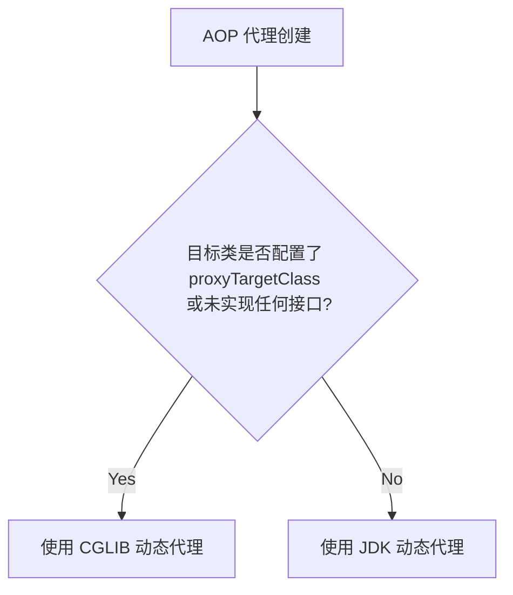
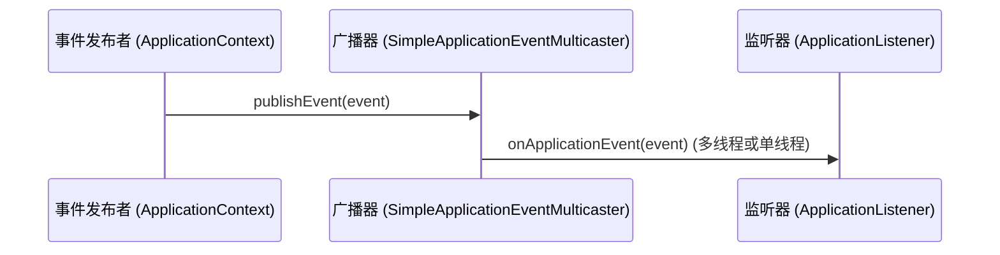

## Spring 常用设计模式源码级深度解析

Spring 框架是设计模式的集大成者。为了实现高内聚、低耦合以及极强的可扩展性，Spring 内部广泛应用了多种经典的设计模式。理解这些设计模式在 Spring 源码中的落地方式，是掌握 Spring 架构设计的核心关键。

---

## 一、 工厂模式（Factory Pattern）

工厂模式是 Spring 最核心的模式，主要用于解决对象创建与使用的解耦。

### 1. 简单工厂与工厂方法：BeanFactory

`BeanFactory` 是 Spring IoC 容器的核心接口，它定义了获取 Bean 实例的规范：

```java
public interface BeanFactory {
    Object getBean(String name) throws BeansException;
    <T> T getBean(String name, Class<T> requiredType) throws BeansException;
    // ...
}
```

- **模式应用**：`BeanFactory` 作为工厂角色，负责根据 Bean 的名称或类型产生相应的 Bean 实例。客户端（调用者）不需要关心 Bean 的具体实例化过程（如反射调用、依赖注入等），只需通过工厂获取即可。
- **核心实现类**：[DefaultListableBeanFactory](./2-beandefinition-internals.md) 是最典型的代表。

### 2. 抽象工厂模式：FactoryBean

与普通的 Bean 不同，实现了 `FactoryBean` 接口的类是一个“工厂 Bean”，它能够产生其他 Bean 实例：

```java
public interface FactoryBean<T> {
    T getObject() throws Exception;
    Class<?> getObjectType();
    default boolean isSingleton() {
        return true;
    }
}
```

- **区别与联系**：
  - **BeanFactory**：代表整个 IoC 容器，是产生和管理 Bean 的工厂。
  - **FactoryBean**：是容器中的一个普通 Bean，但其特殊之处在于，当通过 `getBean("myBean")` 获取它时，返回的不是它本身，而是它所代理产生的 `getObject()` 方法返回的对象；若想获取 FactoryBean 本身，需在名称前加 `&`，即 `getBean("&myBean")`。
- **典型应用**：集成 MyBatis 时的 `SqlSessionFactoryBean`，集成 AOP 时的 `ProxyFactoryBean`。

---

## 二、 单例模式（Singleton Pattern）

Spring 中的单例模式不同于常规 of GoF 单例（在 ClassLoader 范围内保证类只有一个实例），而是 **IoC 容器范围内的单例**。

### 1. Spring 单例的底层注册表实现

Spring 在 `DefaultSingletonBeanRegistry` 中通过一个并发 Map（一级缓存）来确保单例 Bean 的唯一性：

```java
/** 一级缓存：保存完全初始化好的单例对象 */
private final Map<String, Object> singletonObjects = new ConcurrentHashMap<>(256);
```

当向容器请求单例 Bean 时，Spring 会优先从这个 Map 中拉取，若不存在则创建并存入 Map。这种方式也被称为**单例注册表（Singleton Registry）模式**。

### 2. 单例 Bean 的线程安全问题

> [!WARNING]
> Spring 中的单例 Bean **并不是**线程安全的。

- **原因**：Spring 容器本身并不对单例 Bean 的多线程并发访问做特殊同步处理。
- **分类讨论**：
  - **无状态 Bean**：只包含业务逻辑，不包含成员变量状态（例如大多数 Service、Dao）。这类 Bean 是线程安全的，可以在并发下放心使用。
  - **有状态 Bean**：包含可写成员变量的 Bean（例如维护了用户状态的 Controller）。这类 Bean 是线程不安全的。
- **解决方案**：
  - 将有状态 Bean 的作用域设置为 `prototype`（原型模式，每次请求创建新实例）。
  - 使用线程本地变量 `ThreadLocal` 隔离每个线程的成员变量（例如 Spring 事务管理器中使用的 `TransactionSynchronizationManager`，用于绑定连接）。

---

## 三、 代理模式（Proxy Pattern）

代理模式是 Spring AOP（面向切面编程）的基石。在不修改目标类代码的前提下，Spring 通过代理对象为目标对象织入横切逻辑（如事务、日志、安全检查）。

### 1. JDK 动态代理 vs CGLIB 动态代理

Spring AOP 支持两种动态代理技术：

| 特性 | JDK 动态代理 | CGLIB 动态代理 |
| :--- | :--- | :--- |
| **实现原理** | 基于 Java 反射及接口实现，动态生成代理类 | 基于 ASM 字节码技术，生成目标类的子类 |
| **要求约束** | 目标类**必须实现接口** | 目标类及方法不能被 `final` 修饰 |
| **性能表现** | 随着 JDK 版本升级，效率极高；生成代理类速度快 | 执行效率较高，但生成代理类的字节码开销稍大 |

有关两者的动态生成选择逻辑，可在 [DefaultAopProxyFactory](./1-ioc-aop.md#1-代理的选择策略defaultaopproxyfactory) 源码中查看。



---

## 四、 模板方法模式（Template Method Pattern）

模板方法模式通过定义一个算法的骨架，允许子类在不改变算法结构的情况下重写某些特定步骤。Spring 大量使用此模式来处理模板化、重复性的资源管理流程。

### 1. AbstractApplicationContext 中的 refresh()

在容器启动刷新流程中，`AbstractApplicationContext` 定义了完整的刷新骨架：

```java
@Override
public void refresh() throws BeansException, IllegalStateException {
    synchronized (this.startupShutdownMonitor) {
        // 1. 准备环境
        prepareRefresh();
        // 2. 初始化 BeanFactory（子类实现核心步骤）
        ConfigurableListableBeanFactory beanFactory = obtainFreshBeanFactory();
        // 3. 预处理 BeanFactory
        prepareBeanFactory(beanFactory);
        try {
            // 4. 允许在子类中对 BeanFactory 进行后置处理（模板钩子方法）
            postProcessBeanFactory(beanFactory);
            // 5. 调用工厂后置处理器
            invokeBeanFactoryPostProcessors(beanFactory);
            // ... (更多详尽步骤参见 Context 刷新流程)
        }
        // ...
    }
}
```

这里 `postProcessBeanFactory` 和 `onRefresh` 就是预留给子类实现的钩子方法（Hook）。具体的刷新步骤详情请参见 [spring-context-refresh.md](./3-spring-context-refresh.md)。

### 2. 各种 Template 工具类

Spring 提供了众多的 `XxxTemplate` 类，如 `JdbcTemplate`、`RestTemplate`、`JmsTemplate` 等。
以 `JdbcTemplate` 为例：它封装了“获取连接 -> 创建 Statement -> 执行 SQL -> 释放资源”的冗长步骤，把易变的“SQL 语句执行和结果集解析”通过回调函数暴漏给用户，大大减少了模板代码的编写。

---

## 五、 观察者模式（Observer Pattern）

观察者模式又称为发布-订阅（Publish-Subscribe）模式。Spring 的事件驱动模型是观察者模式的典型实现。

### 1. 核心三大要素

1. **事件（ApplicationEvent）**：被观察的对象状态载体。继承自 `java.util.EventObject`。
2. **事件广播器（ApplicationEventMulticaster）**：负责注册监听器、广播事件的主体。
3. **事件监听器（ApplicationListener）**：观察者。实现 `ApplicationListener` 接口或标注 `@EventListener` 注解。



### 2. 源码调用链路

在 `SimpleApplicationEventMulticaster` 中，事件的广播核心代码如下：

```java
@Override
public void multicastEvent(final ApplicationEvent event, @Nullable ResolvableType eventType) {
    ResolvableType type = (eventType != null ? eventType : ResolvableType.forInstance(event));
    Executor executor = getTaskExecutor();
    for (ApplicationListener<?> listener : getApplicationListeners(event, type)) {
        if (executor != null) {
            // 如果配置了执行器，则异步广播事件
            executor.execute(() -> invokeListener(listener, event));
        } else {
            // 默认同步阻塞广播事件
            invokeListener(listener, event);
        }
    }
}
```

---

## 六、 适配器模式（Adapter Pattern）

适配器模式作为两个不兼容接口之间的桥梁，将一个类的接口转换成客户希望的另外一个接口。

### 1. Spring MVC 中的 HandlerAdapter

Spring MVC 支持多种类型的 Controller 实现（实现 `Controller` 接口的类、标注 `@RequestMapping` 的方法、实现 `HttpRequestHandler` 的类等）。
`DispatcherServlet` 为了能统一调用这些处理器，使用了 `HandlerAdapter` 适配器：

```java
public interface HandlerAdapter {
    boolean supports(Object handler);
    @Nullable
    ModelAndView handle(HttpServletRequest request, HttpServletResponse response, Object handler) throws Exception;
}
```

在请求处理时，`DispatcherServlet` 遍历所有适配器，调用 `supports` 方法，找到支持当前 Handler 的适配器，然后调用 `handle` 执行方法，返回统一的 `ModelAndView`。

### 2. Spring AOP 中的 AdvisorAdapter

在 AOP 中，各种通知（`BeforeAdvice`、`AfterReturningAdvice` 等）最终都要转换成拦截器 `MethodInterceptor`，以链式形式执行。
Spring 提供了 `AdvisorAdapter` 实现这种转换：

```java
public interface AdvisorAdapter {
    boolean supportsAdvice(Advice advice);
    MethodInterceptor getInterceptor(Advisor advisor);
}
```

通过这些适配器，Spring AOP 可以无缝将各类自定义的通知融入到责任链执行体中。

---

## 七、 责任链模式（Chain of Responsibility Pattern）

责任链模式为请求创建了一个接收者对象的链。这种模式给予请求的类型，对请求的发送者 and 接收者进行解耦。

### 1. Spring AOP 的方法调用拦截器链

正如 [ReflectiveMethodInvocation.proceed()](./1-ioc-aop.md#2-aop-链式调用与责任链模式) 中所呈现的，Spring AOP 在执行切面时，把所有匹配的拦截器组成一个链表。

每个拦截器的执行方法 `invoke` 都会接收 `MethodInvocation` 实例，并通过显式或隐式地回调 `invocation.proceed()`，把执行控制权传递给下一个拦截器，直至到达底层真正的目标方法。

### 2. Spring MVC 的拦截器链

在 Spring MVC 中，一个请求会被包装成 `HandlerExecutionChain` 实例。这个执行链包含了处理器对象（Handler）以及一组拦截器 `HandlerInterceptor` 数组。在请求执行前后，会顺序遍历执行 `preHandle`、`postHandle` 与 `afterCompletion` 钩子。

---

## 八、 策略模式（Strategy Pattern）

策略模式定义了一系列的算法，并将每一个算法封装起来，使它们可以相互替换。策略模式让算法独立于使用它的客户而变化。

### 1. Resource 资源加载策略

Spring 定义了 `Resource` 接口用于读取底层物理文件资源，屏蔽了不同底层文件协议的访问差异：

- `ClassPathResource`：从类路径下加载资源。
- `FileSystemResource`：从文件系统物理路径加载资源。
- `UrlResource`：通过 URL（如 HTTP/FTP）协议加载资源。
- `ServletContextResource`：从 Web 容器上下文加载。

而在加载时，`ResourceLoader` 会根据传入资源的路径前缀（如 `classpath:`，`file:`），采用不同的 `Resource` 策略去读取。

### 2. Bean 的实例化策略

在 `doCreateBean` 阶段，Spring 通过反射或者 CGLIB 来创建 Bean 实例。这部分逻辑被封装在 `InstantiationStrategy` 策略接口中：

- `SimpleInstantiationStrategy`：使用反射（构造器 `newInstance`）来创建实例。
- `CglibSubclassingInstantiationStrategy`：如果配置了方法注入（如 `lookup-method`），则需要使用 CGLIB 动态生成子类来实例化。

---

## 总结

在 Spring 中，设计模式无处不在。它们互为辅助，共同构建了 Spring 的坚实基座：
- **IoC 容器** 组合使用了**工厂模式**、**单例模式**、**策略模式**和**模板方法模式**；
- **AOP 组件** 深入应用了**代理模式**、**责任链模式**和**适配器模式**；
- **事件机制** 则是**观察者模式**的最佳实践。

掌握这些模式不仅是应对高级面试的重要法宝，更有助于我们在日常的企业级开发中写出高内聚、低耦合、优雅且易于扩展的代码。
